<!-- Archivo generado por generar_documento_final.py a partir de P2-documento-entrega.md y P2-complementos.md. No editar a mano. -->
# Proyecto 2 · UX/UI, movilidad y evolución del núcleo

**Universidad Mariano Gálvez de Guatemala** · Facultad de Ingeniería en Sistemas de Información · Análisis de Sistemas II (037)

**Sistema de Gestión de Microcrédito — Crédito Vecino, S. A.**

| Dato | Valor |
|---|---|
| **Grupo** | 2 |
| **Sección** | A |
| **Docente** | Ing. Ezequiel Urizar |
| **Prototipo móvil (Figma)** | [Microcréditos App](https://www.figma.com/proto/jozM3QI8ZJ6pywdCoO5OVo/Microcr%C3%A9ditos-App?node-id=0-1&t=PJlTVLC3ASu31ttw-1) |
| **Prototipo web (Figma Make)** | [Prototipo Microcréditos Web](https://www.figma.com/make/WHj2TK5IRg55X8JiaKXyvy/Prototipo-Microcr%25C3%25A9ditos-Web?code-node-id=0-6&p=f&fullscreen=1) |
| **Prototipo de cliente (Figma Make)** | [Prototipo Cliente](https://www.figma.com/make/3P7qsVBkFW6B9SShgQEBoz/Prototipo-Cliente?fullscreen=1&t=sokzjUmb0IMEfUqX-1&code-node-id=0-6) |
| **Repositorio** | [github.com/ItsRomero/Proyecto1_Analisis](https://github.com/ItsRomero/Proyecto1_Analisis) |
| **Commit de entrega del Proyecto 1** | `8737d9b` (etiqueta `entrega-p1`) |
| **Fecha de entrega** | Guatemala, 25 de septiembre de 2026 |

| Integrante | Carné | Rol |
|---|---|---|
| Christopher David Herrera Pérez | 7690-20-20773 | Implementación / Pruebas |
| Erwin Alberto Ramírez Racancoj | 7690-23-2387 | Pruebas / Trazabilidad |
| Gabriela Elízabeth Noemí Aguilar Vásquez | 7690-23-13249 | Diseño / Documentación |
| Oliver Fernando Romero Esquite | 7690-23-7366 | Coordinación / Integración |

---

# 1. Introducción

## 1.1 Qué responde este proyecto

El Proyecto 1 respondió a la pregunta *¿cómo está construido el sistema por dentro?* Definimos la arquitectura hexagonal, los componentes y un núcleo de dominio en TypeScript que calcula el dinero: plan de amortización, prelación de pagos, mora e indicadores de cartera. El Proyecto 2 trabaja sobre **el mismo sistema, el mismo repositorio y el mismo equipo** (regla de incrementalidad) y agrega dos preguntas.

**¿Cómo se usa el sistema?** Un motor de cálculo impecable produce créditos mal capturados si la asesora, de pie bajo el sol y con una mano ocupada, tiene que escribir el monto en un campo ambiguo. En una financiera, la interfaz es donde se originan la mayoría de los errores de datos. Por eso investigamos a los usuarios (E1), organizamos la información y dibujamos los wireframes (E2), construimos un prototipo navegable en Figma (E3), decidimos cómo debe funcionar la aplicación en el teléfono y sin señal (E4) y evaluamos el prototipo con las heurísticas de Nielsen y WCAG 2.2 (E5).

**¿Resiste el diseño un cambio de requisito real?** El comité de Crédito Vecino (Acta 09-2026) decidió que, desde el 1 de octubre de 2026, la mora deja de cobrarse con una tasa plana del 24 % y pasa a cobrarse **por tramos recorridos**: 18 %, 24 %, 30 % y 36 % anual según los días de atraso. Los créditos anteriores conservan la política vieja. Implementamos ese cambio en el núcleo del Proyecto 1 (E6) y medimos, con el historial de Git como evidencia, cuánto tuvimos que modificar. Ese es el informe de impacto SOLID.

## 1.2 Cómo leer este documento

Cada capítulo corresponde a un entregable del enunciado (sección 9) y sigue el orden E1 → E7. Tres convenciones se repiten en todo el documento:

- **Las cifras salen del núcleo.** Q1,004.62, Q18.14, Q50.80, 7.00 % y 21.75 % son resultados de `src/dominio` verificados por las pruebas (`npm test`), no estimaciones (regla 6.2 del enunciado).
- **Cada afirmación dice de dónde sale.** En la investigación distinguimos lo que viene del enunciado, de fuentes documentadas, del núcleo y lo que todavía es una hipótesis por validar.
- **Somos transparentes con lo que falta.** El capítulo 10 contrasta el trabajo con la lista de verificación de la sección 12.2 del enunciado.

Este documento ya incluye los complementos (casos de uso, skeletons, ADR e hipervínculos a GitHub) en el capítulo al que pertenece cada uno. La sección 8.2 presenta en una tabla ordenada **todos los commits** hechos desde la entrega del Proyecto 1, con lo que aportó cada uno.

---

# 2. E1 · Investigación de usuario

Este capítulo responde al entregable E1: personas fundamentadas, journey map del flujo principal y los momentos en que un error de interfaz se convierte en un error de dinero. Incluye el cuarto momento que el enunciado exige: el instante en que el cliente descubre que su mora subió de tramo.

## 2.1 Método y estado de la evidencia

La investigación combina tres fuentes, y cada afirmación de este documento indica de cuál proviene:

| Código | Tipo de fuente | Qué aporta | Estado |
|---|---|---|---|
| **ENU** | Enunciado P2, sección 3 (contexto de los tres perfiles) | Condiciones de trabajo del asesor, necesidades del cliente y de gerencia | Requisito del caso |
| **DOC** | Fuentes documentadas: SIB (ENIF 2024-2027), Banco Mundial (Global Findex 2025, panorama Guatemala), DataReportal *Digital 2024: Guatemala*, IICA/BID sobre conectividad rural | Contexto nacional de inclusión financiera, uso de teléfono e internet y brecha territorial | Documentado |
| **NÚC** | Núcleo de cálculo del repositorio (`src/dominio`) y sus pruebas | Cifras exactas con las que se construyen los escenarios (Q1,004.62, Q18.14, 7.00 %, etc.) | Verificado por `npm test` |
| **HIP** | Hipótesis de diseño derivadas de las anteriores | Conductas concretas que el equipo espera encontrar en campo | **Pendiente de validar** con los instrumentos de `e1-instrumentos-investigacion.md` |

Hallazgos del contexto documentado que sustentan las personas:

- **Hay muchos teléfonos, pero no tanta internet.** En enero de 2024 Guatemala tenía 20.65 millones de conexiones móviles (113.3 % de la población), pero solo el 60.3 % de la población usaba internet (DataReportal, *Digital 2024: Guatemala*). *Implicación:* el cliente casi siempre tiene un teléfono, pero no se puede suponer que tenga datos móviles. Los avisos al cliente no pueden depender solo de una app.
- **La conectividad rural es baja.** El IICA, con apoyo del BID y Microsoft, ubica a Guatemala entre los nueve países de América Latina y el Caribe con menor conectividad rural. También señala que una alta penetración de teléfonos móviles no equivale a conectividad, porque esta se concentra en zonas urbanas (Prensa Libre, 2020). *Implicación:* el asesor que visita negocios fuera de la cabecera trabajará sin señal durante parte de su ruta (ENU lo confirma: "señal intermitente o nula").
- **Digitalizar es una prioridad nacional.** La Estrategia Nacional de Inclusión Financiera 2024-2027 de la SIB prioriza el uso de canales digitales en los servicios financieros. *Implicación:* la digitalización del cobro en campo está alineada con la política pública, pero debe incluir a clientes con poca experiencia digital.

> **Límite declarado.** A la fecha de este documento el equipo **no ha aplicado todavía** las entrevistas ni la observación de campo. Los instrumentos están listos en [e1-instrumentos-investigacion.md](e1-instrumentos-investigacion.md). Las personas son **provisionales**: sus rasgos marcados como HIP deben confirmarse o corregirse antes de cerrar el prototipo de alta fidelidad (E3). No presentamos hipótesis como hallazgos de campo.

## 2.2 Personas

Las tres personas siguen la plantilla del Anexo A del enunciado. La edad no se usa como indicador de habilidad digital.

### 2.2.1 Mariela López, asesora de crédito en campo

| Campo | Contenido | Fuente |
|---|---|---|
| Rol y contexto | Asesora de Crédito Vecino. Visita entre 8 y 12 clientes al día en sus negocios o casas, origina solicitudes y cobra cuotas atrasadas. Trabaja de pie, a menudo bajo el sol, y con una mano ocupada (cartapacio, efectivo o documentos del cliente). | ENU |
| Dispositivo | Teléfono Android de gama media proporcionado por la empresa: pantalla de unas 6", poca memoria libre y batería que debe durar toda la jornada. | ENU · HIP (modelo concreto) |
| Conectividad | Intermitente o nula en parte de la ruta. Buena señal solo en la oficina y en la cabecera municipal. | ENU · DOC |
| Iluminación | Luz solar directa: los grises claros y los textos pequeños no se leen. | ENU |
| Manos libres | Opera con el pulgar de una sola mano durante la visita; teclea poco y mal cuando está de pie. | ENU |
| Alfabetización digital | Operativa: usa WhatsApp, cámara y apps bancarias. No conoce el concepto de "sincronización" ni tiene por qué conocerlo. | HIP |
| Objetivos (en sus palabras) | "Terminar la visita sin volver a pedirle nada al cliente." · "Saber que el pago quedó registrado una sola vez." · "Poder explicarle al cliente a dónde se fue su dinero." | ENU · HIP |
| Frustraciones actuales (hojas de cálculo) | Anota el pago en papel y lo transcribe al volver a la oficina, a veces al día siguiente; la fecha que queda registrada es la de la transcripción, no la del pago. Cuando la hoja compartida no abre sin internet, lleva una copia impresa que ya está desactualizada. | HIP |
| Relación con la mora | Debe explicar por qué un cliente debe más este mes. Con la política escalonada tiene que explicar tramos, no una sola tasa. | ENU |
| Cita representativa | *"Si la app me hace escribir el DPI dos veces, el cliente piensa que no sé lo que hago."* | HIP (cita a validar en entrevista) |

**Qué exige a la interfaz:** diseño mobile-first con objetivos táctiles de 48 px o más (por encima del mínimo de 24 px de WCAG 2.5.8), alto contraste y un modo de trabajo sin conexión con estado visible ("Guardado en el teléfono · pendiente de enviar"). Montos siempre con el prefijo **Q** y separador de miles, y el menor tecleo posible.

### 2.2.2 Carlos Chávez, cliente de microcrédito

| Campo | Contenido | Fuente |
|---|---|---|
| Rol y contexto | Tiene una tienda de barrio. Pidió **Q10,000 a 12 meses** para surtir inventario: es el caso de referencia del P1, con una cuota de **Q1,004.62** y la cuota 12 de **Q1,004.63**. | ENU · NÚC |
| Dispositivo | Teléfono propio con saldo prepago. A veces tiene datos y a veces no; los SMS siempre le llegan. | DOC · HIP |
| Conectividad | Variable; en su zona la señal de datos es débil dentro del local. | DOC |
| Iluminación y entorno | Atiende la tienda mientras habla con la asesora; lo interrumpen clientes. | HIP |
| Alfabetización digital | Baja a media: lee mensajes y usa WhatsApp, pero no navega por menús complejos ni entiende "TNA", "Actual/360" ni "prelación". | ENU · HIP |
| Objetivos (en sus palabras) | "Saber cuánto debo, cuándo pago y cuánto me falta." · "Que me avisen antes, no cuando ya me cobraron más." · "Tener un papel o un mensaje que diga que ya pagué." | ENU |
| Frustraciones actuales | Recibe un solo número ("debe Q1,040.99") sin saber por qué subió. Desconfía de lo que no entiende y lo percibe como una multa arbitraria, exactamente lo que el Acta 09-2026 del comité quiere evitar. | ENU (sección 7.1) · HIP |
| Relación con la mora | Sabe que atrasarse cuesta más, pero no sabe **cuánto por día** ni que al día 31 se agrega un **gasto de gestión de cobro de Q25.00**. | ENU · NÚC |
| Cita representativa | *"Si me explican, pago; si me cae de sorpresa, siento que me están robando."* | HIP |

**Qué exige a la interfaz:** lenguaje llano ("lleva 45 días de atraso", no "Mora 2"), cifras que no se puedan malinterpretar, desglose progresivo (primero el total y, al tocarlo, los tramos) y avisos **antes** de cada cambio de tramo por un canal que no dependa de tener datos (SMS).

### 2.2.3 Andrea Morales, gerente de cartera y miembro del comité

| Campo | Contenido | Fuente |
|---|---|---|
| Rol y contexto | Gerente de cartera; integra el comité de crédito. Revisa indicadores a diario y presenta el cierre mensual al comité. | ENU |
| Dispositivo | Computadora de escritorio con monitor grande en oficina; consulta rápida desde el teléfono cuando está en reunión o fuera de la oficina. | ENU · HIP (uso móvil) |
| Conectividad | Estable en oficina. | ENU |
| Alfabetización digital | Alta en hojas de cálculo; alta alfabetización financiera. | HIP |
| Objetivos (en sus palabras) | "En 30 segundos saber si la cartera se está deteriorando." · "Pasar del porcentaje a los créditos concretos." · "Confiar en que el cierre no se duplicó." | ENU · HIP |
| Frustraciones actuales | Las hojas de cálculo rotulan como "mora" tanto la cartera con cualquier atraso como la cartera en riesgo. Cuando se da de baja un crédito, el indicador de riesgo baja (7.00 % → 6.06 %) y parece una mejora aunque no se cobró nada. | ENU (sección 7.8) · NÚC |
| Relación con la mora | Decide con cartera en mora (21.75 %), cartera en riesgo (7.00 %), el desglose por tramo e incobrables del período. | ENU · NÚC |
| Cita representativa | *"No me muestre un número sin decirme qué número es."* | HIP |

**Qué exige a la interfaz:** diseño responsivo pensado para escritorio, densidad alta pero con jerarquía clara, **rótulos y definiciones distintos** para cada indicador, lo dado por incobrable junto a la cartera en riesgo, y navegación de lo general al detalle del crédito (drill-down).

## 2.3 Journey map del flujo principal: de la solicitud a la primera cuota

Escenario: Carlos solicita Q10,000 a 12 meses con Mariela y paga su primera cuota de Q1,004.62. En la variante con atraso (etapas 9b y 9c), la cuota vencida usa el capital de la cuota 2 del caso de referencia (Q725.76), igual que los oráculos M-1 a M-5 del enunciado. Escala emocional: −2 muy negativa … +2 muy positiva.

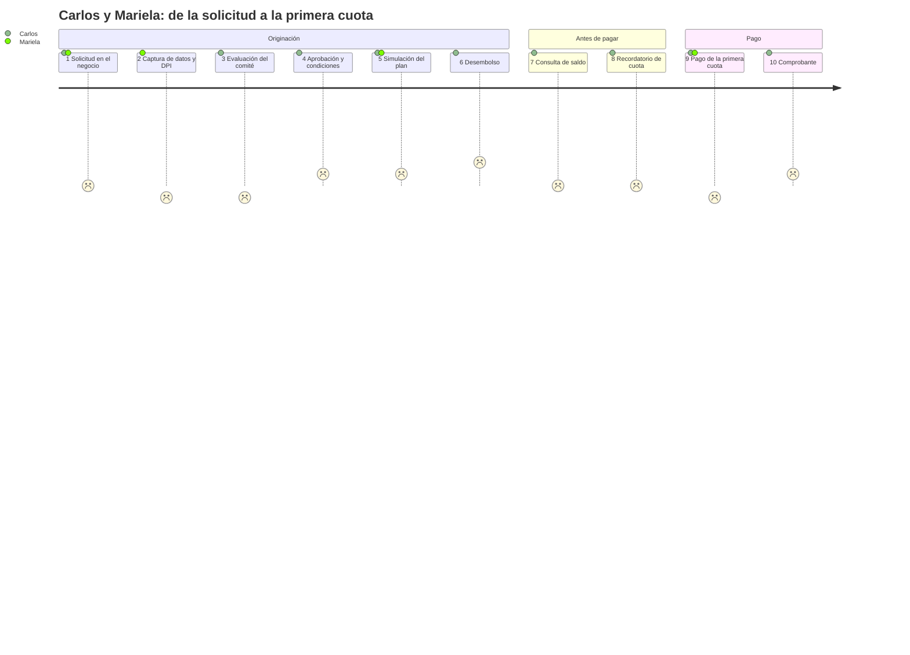

| # | Etapa | Actor | Acción | Emoción | Punto de dolor concreto | Oportunidad de diseño | Pantalla | Fuente |
|---|---|---|---|---|---|---|---|---|
| 1 | Solicitud | Carlos, Mariela | Carlos dice cuánto necesita y en cuánto tiempo | 0: expectativa y duda | Mariela escribe "10000" en un campo sin formato; un cero de más (Q100,000) o de menos (Q1,000) no se detecta porque el campo no muestra separador de miles ni los límites Q1,000–Q25,000. | Campo con prefijo Q, formato en vivo "Q10,000.00", rango visible y validación inmediata; plazo con botones de 3 a 24 meses, no teclado. | P04 Nueva solicitud | ENU · HIP |
| 2 | Captura | Mariela | Registra DPI, datos del negocio y foto | −1: prisa | La señal se cae a mitad del formulario; al reintentar, la sesión expiró y Mariela debe **recapturar el DPI y los datos del negocio** frente al cliente. | Borrador guardado en el teléfono campo por campo; la sesión no expira mientras hay un borrador; aviso "Guardado en el teléfono". Cumple WCAG 3.3.7 (no pedir de nuevo un dato ya capturado). | G01 Alta de cliente (guía) | ENU · HIP |
| 3 | Evaluación | Comité, Carlos | El comité revisa la solicitud | −1: incertidumbre | Carlos no sabe si su solicitud "está en algún lado". Mariela no puede decirle en qué estado está porque la hoja no guarda el historial. | Estado visible (Solicitado → En evaluación → Aprobado) consultable por la asesora; la bandeja del comité muestra el motivo si se rechaza. | G03 Bandeja del comité (guía) | ENU · NÚC (estados) |
| 4 | Aprobación | Carlos | Recibe la noticia | +1: alivio | Le comunican "aprobado" sin la cuota ni el costo total; Carlos acepta sin saber que pagará **Q2,055.45 de interés**. | Resumen con monto, plazo, tasa en lenguaje llano ("3 % al mes"), cuota y total a pagar antes de confirmar. | P05 Simulación → P06 Confirmar solicitud | NÚC |
| 5 | Simulación del plan | Carlos, Mariela | Revisan las 12 cuotas | +1: control | La cuota 12 dice **Q1,004.63** y Carlos cree que hay un error de un centavo. Si la pantalla la oculta o la iguala a Q1,004.62, el plan mostrado no coincide con el cobrado. | Plan con las 12 filas del núcleo y una nota junto a la cuota 12: "1 centavo más para cerrar el saldo exacto". | P09 Plan de amortización | NÚC |
| 6 | Desembolso | Encargado, Carlos | Se confirma y se entrega el dinero | +2: alegría | Un doble toque en "Desembolsar" con la señal lenta puede generar **dos desembolsos** si la operación no es idempotente. | Pantalla de revisión y confirmación explícita (WCAG 3.3.4), botón deshabilitado tras el primer toque y clave de operación única. | G02 Confirmación de desembolso (guía) | ENU · NÚC |
| 7 | Seguimiento | Carlos | Pregunta cuánto debe | 0 | La cifra que ve Mariela sin señal es de ayer y no dice de qué fecha es; Carlos recibe un saldo desactualizado. | Todo saldo muestra su fecha de corte: "Saldo al 23/09/2026". Sin conexión se rotula como "calculado con datos del 22/09". | P08 Detalle del crédito | ENU · HIP |
| 8 | Recordatorio | Carlos | Recibe aviso de su primera cuota | 0 | El aviso llega por una app que Carlos no abre sin datos, o llega **el mismo día** del vencimiento. | SMS 3 días antes y el día del vencimiento con monto y fecha; canal a validar con la encuesta (pregunta 12). | (Notificación) | DOC · HIP |
| 9 | Pago | Mariela, Carlos | Mariela recibe Q1,004.62 y lo registra | −1: tensión | Mariela registra el pago sin señal. La app no dice si se envió; Mariela lo vuelve a intentar y teme **cobrarlo dos veces**. | Estado "Pendiente de enviar · se enviará solo al tener señal", misma clave de idempotencia en cada reintento y comprobante provisional. | P11 Registrar pago · P14 Sin señal | ENU · NÚC |
| 9b | (Variante) Pago con atraso de 45 días | Mariela, Carlos | La cuota vencida suma Q1,047.76 | −2: sorpresa | Carlos esperaba pagar Q1,004.62 y le piden **Q1,047.76** sin explicación: Q25.00 de gasto + Q18.14 de mora + Q278.86 de interés + Q725.76 de capital. | Desglose en el orden de la prelación, con "¿por qué?" en cada concepto. | P10 Detalle de mora | NÚC (M-5) |
| 9c | (Variante) Cambio de tramo | Carlos | Pasa del día 30 al 31 | −2: enojo | En un día, el total de la cuota pasa de **Q1,015.51 a Q1,040.99** (+Q25.48) y Carlos se entera en la visita de cobro, cuando ya ocurrió. | Momento crítico MC-4 (§2.4.1). | P10 Detalle de mora + aviso SMS | NÚC · HIP |
| 10 | Comprobante | Carlos | Recibe comprobante | +1: confianza | Un comprobante que solo dice "Pagado Q1,004.62" no permite comprobar cuánto fue a interés (Q300.00) y cuánto a capital (Q704.62). | Comprobante con la prelación aplicada y el saldo resultante (Q9,295.38), enviado por SMS o impreso. | P13 Pago aplicado | NÚC |

Cifras de la primera cuota según el núcleo: interés Q300.00 + capital Q704.62 = Q1,004.62; el saldo pasa de Q10,000.00 a Q9,295.38.

## 2.4 Momentos críticos: error de interfaz → error de dinero

Cada momento indica la causa en la interfaz, la consecuencia monetaria con cifras del núcleo y el control de diseño que la previene.

| ID | Momento | Error de interfaz | Consecuencia en dinero | Prevención (diseño) | Recuperación |
|---|---|---|---|---|---|
| **MC-1** | Captura del monto en la solicitud | Campo numérico sin formato ni límites; se teclea "1000" en lugar de "10000" o se escribe un punto decimal como separador de miles | Un crédito de Q1,000 en vez de Q10,000 cambia **las 12 cuotas** (de Q1,004.62 a unos Q100.46) y el contrato firmado no refleja lo solicitado | Prefijo Q, formato en vivo, rango Q1,000–Q25,000 visible, resumen "Diez mil quetzales" en letras antes de confirmar | Botón "Editar" en la pantalla de revisión; nada se envía sin confirmación (WCAG 3.3.4) |
| **MC-2** | Registro de un pago sin señal | La app no muestra el estado del envío y Mariela toca "Registrar" otra vez o captura el pago de nuevo | **Doble cobro**: Q1,004.62 × 2; el cliente pierde la confianza | Cola local con **la misma Idempotency-Key** en cada reintento; estado visible Pendiente / Enviado / Confirmado; el botón se bloquea tras el primer toque (ver E4) | Si el servidor responde que la clave ya existe, se muestra el pago original y no se crea otro |
| **MC-3** | Lectura del tablero gerencial | Rotular igual "cartera en mora" (21.75 %) y "cartera en riesgo" (7.00 %), o mostrar solo uno sin decir cuál es | El comité decide sobre el número equivocado: provisiona o restringe la colocación por 21.75 % cuando el riesgo real es 7.00 %, o celebra un 6.06 % que solo bajó por la baja de C-005 | Dos tarjetas con nombre, definición y forma distintos; incobrables del período junto al riesgo (ver §3.5) | Enlace "¿Qué incluye?" en cada indicador, que abre el desglose por tramo |
| **MC-4** | **El cliente descubre que su mora subió de tramo** | Sin aviso previo: el cliente se entera después y por la persona que le cobra | +Q25.48 en un día (Q1,015.51 → Q1,040.99), percibidos como multa arbitraria; más probabilidad de disputa y de dejar de pagar | Aviso preventivo por SMS y detalle por tramos (ver §2.4.1) | La pantalla de detalle de la mora permite verificar tramo por tramo |

### 2.4.1 MC-4 en detalle: el cambio de tramo

El enunciado pregunta: *¿Se enteró antes o después? ¿Por qué canal?*

**Situación actual (con hojas de cálculo):** Carlos se entera **después** y **en persona**. La política escalonada genera el gasto de gestión de cobro precisamente al entrar en Mora 2 (día 31), que es también cuando "se activa la gestión de cobro en campo" (sección 7.2). Por eso el primer contacto de Carlos con el nuevo tramo es la visita de Mariela, que llega a cobrar un total que ya subió.

| Día de atraso de la cuota 2 (capital Q725.76) | Tramo | Mora acumulada | Gasto de cobro | Total de la cuota (gasto + mora + Q278.86 + Q725.76) |
|---|---|---|---|---|
| 15 | Mora 1 | Q5.44 | Q0.00 | Q1,010.06 |
| 28 | Mora 1 | Q10.16 | Q0.00 | Q1,014.78 |
| 30 | Mora 1 | Q10.89 | Q0.00 | Q1,015.51 |
| **31** | **Mora 2** | **Q11.37** | **Q25.00** | **Q1,040.99** |
| 45 | Mora 2 | Q18.14 | Q25.00 | Q1,047.76 |
| 60 | Mora 2 | Q25.40 | Q25.00 | Q1,055.02 |
| 61 | Mora 3 | Q26.01 | Q25.00 | Q1,055.63 |
| 91 | Vencido | Q44.27 | Q25.00 | Q1,073.89 |

Además, en los días 1 a 30 la mora crece Q0.36 por día y en los días 31 a 60 crece Q0.48 por día. Esto responde a la pregunta del objetivo de aprendizaje: *por qué su mora creció más rápido este mes que el anterior*.

**Situación propuesta: Carlos se entera antes, por dos canales.**

| Cuándo | Canal | Mensaje (lenguaje llano, a validar con clientes) | Por qué ese canal |
|---|---|---|---|
| Día 28 de atraso | **SMS** | "Crédito Vecino: su cuota 2 lleva 28 días de atraso. Si paga en los próximos 2 días debe Q1,015.51. Después se agrega un cargo de visita de cobro de Q25.00." | Llega sin datos móviles; hay más conexiones móviles que usuarios de internet (DOC) |
| Día 31 (al entrar en Mora 2) | **SMS** + visita de la asesora | "Su cuota 2 pasó a más de 30 días de atraso. Ahora debe Q1,040.99. Pida a su asesora el detalle." | Confirma el cambio; el detalle se explica en persona |
| En la visita | **Pantalla "Detalle de la mora"**, en el teléfono de la asesora | Desglose por tramos recorridos: "30 días a 18 % al año → Q10.89 · 1 día a 24 % → Q0.48 · total redondeado una vez → Q11.37" | El cliente puede verificar; la asesora no tiene que improvisar la explicación |

El sistema calcula el plazo con la fecha de vencimiento real de la cuota más 30 días, a partir de la fecha de corte que recibe como parámetro. El núcleo expone el tramo (`clasificarTramoMora`) y el desglose (`detalle.tramos`), así que la interfaz no recalcula nada: solo presenta. El umbral de "3 días antes" y la redacción son hipótesis que se validan con las preguntas 9 y 10 de la guía de cliente y con las preguntas 11 y 12 de la encuesta.

## 2.5 Oportunidades priorizadas y trazabilidad hacia E2–E4

| ID | Oportunidad | Perfil | Prioridad | Dónde se resuelve |
|---|---|---|---|---|
| OP-1 | Borrador local y cola de pagos idempotente | Asesora | Alta | §5.4 · G01 Alta de cliente, P11 Registrar pago y P14 Sin señal |
| OP-2 | Revisión de monto, plazo y cuota antes de confirmar | Asesora, cliente | Alta | E2 · P04 Nueva solicitud, P05 Simulación, P06 Confirmar y G02 Desembolso |
| OP-3 | Mora explicada por tramos y avisada antes | Cliente | Alta | E2 · P10 Detalle de mora; aviso por SMS (MC-4) |
| OP-4 | Indicadores de mora y de riesgo claramente diferenciados | Gerencia | Alta | §3.5 · G04 Tablero gerencial |
| OP-5 | Objetivos táctiles grandes y alto contraste | Asesora | Media-alta | §5.3 · sistema responsivo |
| OP-6 | Comprobante con la prelación aplicada | Cliente | Media-alta | E2 · P13 Pago aplicado |

## 2.6 Plan de validación pendiente

1. Aplicar al menos una entrevista por perfil (guías en `e1-instrumentos-investigacion.md`) y una observación de una tarea de captura o cobro al aire libre.
2. Actualizar la columna "Fuente" de cada rasgo marcado HIP a **Validado**, **Corregido** o **Descartado**, con el código anónimo del participante.
3. Probar la comprensión de la pantalla "Detalle de la mora" (caso M-3) con al menos tres personas sin formación financiera.

## 2.7 Referencias

- Banco Mundial (2025). *The Global Findex Database 2025: Connectivity and Financial Inclusion in the Digital Economy*. https://www.worldbank.org/en/publication/globalfindex
- Banco Mundial (2025). *Guatemala 2024 Global Findex Microdata*. https://doi.org/10.48529/ad4w-j084
- Grupo Banco Mundial (2026). *Guatemala: panorama general*. https://www.bancomundial.org/ext/es/country/guatemala
- DataReportal (2024). *Digital 2024: Guatemala*. https://datareportal.com/reports/digital-2024-guatemala
- Prensa Libre (2020). *Guatemala, entre los nueve países con baja conectividad rural*, con datos de IICA, BID y Microsoft. https://www.prensalibre.com/economia/guatemala-entre-los-nueve-paises-con-baja-conectividad-rural-y-las-claves-para-ampliar-la-cobertura/
- Superintendencia de Bancos de Guatemala (2024). *Estrategia Nacional de Inclusión Financiera 2024-2027*. https://www.sib.gob.gt/estrategia-nacional-de-inclusion-financiera-guatemala-2024-2027/
- Universidad Mariano Gálvez de Guatemala (2026). *Enunciado del Proyecto 2*, secciones 3, 7 y 9.

---

# 3. E2 · Arquitectura de información y wireframes

Con las personas definidas, organizamos la aplicación. Este capítulo presenta el mapa de navegación, la tabla de correspondencia pantalla ↔ caso de uso que exige la sección 6.1 y los wireframes de baja fidelidad (skeleton y anotado). Todas las pantallas usan los **mismos nombres y códigos que el prototipo de Figma** (P01–P14), y las que faltan construir tienen su guía (G01–G07); los skeletons de todas las pantallas están en el Anexo A y los wireframes anotados, en `docs/proyecto2/wireframes/anotado/`. Al final se justifica la jerarquía del tablero gerencial y cómo se distinguen la cartera en mora y la cartera en riesgo.

## 3.1 Principios que ordenan la información

Cada principio sale de un hallazgo de [E1](e1-investigacion-usuario.md):

1. **Una aplicación, tres puertas de entrada.** Después de *Iniciar sesión* (P01), cada rol ve su propio inicio: la asesora ve **Mis Clientes** (P02), el comité su **Bandeja** (G03) y la gerencia el **Tablero** (G04). No hay una "pantalla para todos" (enunciado, sección 3).
2. **Cada pantalla invoca un puerto primario del P1.** La interfaz no calcula cifras: presenta lo que devuelve el núcleo (sección 6.2). Por eso cada wireframe indica de qué función sale cada número.
3. **El estado de envío siempre está a la vista** en el móvil: la pantalla *Sin señal* (P14) muestra el pago en cola y *Mi perfil* (P03) el estado de sincronización (heurística 1 de Nielsen, OP-1).
4. **Toda cifra muestra su fecha de corte.** El tramo depende de la fecha, y la fecha de corte es un parámetro (puerto `Reloj`), no "hoy".
5. **La ayuda está en el mismo lugar en todas las pantallas** (WCAG 3.2.6). En el prototipo solo aparece en el inicio de sesión; es un hallazgo del E5 (H-11).

### 3.1.1 Una sola fuente para el diseño: el prototipo de Figma

Para que la documentación y el prototipo **no se desfasen**, todas las pantallas se nombran igual que en el [prototipo de Figma](https://www.figma.com/proto/jozM3QI8ZJ6pywdCoO5OVo/Microcr%C3%A9ditos-App?node-id=0-1&t=PJlTVLC3ASu31ttw-1) y se identifican con un código:

- **P01–P14:** pantallas que **ya existen en Figma**. Sus wireframes reproducen la misma disposición, los mismos componentes y el mismo orden de los bloques.
- **G01–G07:** pantallas que el enunciado exige y que **todavía no existen en Figma**. Sus wireframes son la **guía para construirlas** con el mismo lenguaje visual (encabezado oscuro, tarjetas blancas, botón principal abajo).

Cuando una cifra del prototipo no coincide con el núcleo, el wireframe muestra la cifra correcta y lo marca con **"CORREGIR EN FIGMA"**. La lista completa de correcciones está en el E3 y el E5.

## 3.2 Mapa de navegación

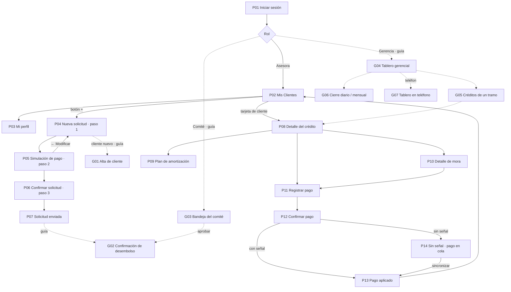

Las flechas continuas existen en el prototipo; las punteadas son las que faltan construir. Versión en imagen, con carriles por perfil: [wireframes/mapa-navegacion.svg](wireframes/mapa-navegacion.svg).

Los tres flujos navegables que exige el E3 recorren este mapa así:

| Flujo E3 | Recorrido | Estado en Figma |
|---|---|---|
| 1. Originación | P02 (+) → P04 Nueva solicitud → P05 Simulación → P06 Confirmar → P07 Enviada → **G02 Desembolso** | Existe hasta P07; falta G02 |
| 2. Cobro en campo | P02 buscar → P08 saldo y tramo → P10 desglose de la mora → P11 registrar pago → P12 confirmar → P13 comprobante (o P14 sin señal) | Completo |
| 3. Consulta gerencial | **G04 Tablero** → tramo de la cartera en riesgo → **G05 créditos de ese tramo** → P08 | Falta construir G04 y G05 |

## 3.3 Tabla de correspondencia pantalla ↔ caso de uso

### 3.3.1 Tabla obligatoria de la sección 6.1

| Puerto primario del enunciado (6.1) | Puerto definido en el P1 (`FASE-06`, sección 8) | Caso de uso P1 | Pantalla P2 | Código |
|---|---|---|---|---|
| RegistrarCliente | `RegistrarCliente` | CU-01 Registrar cliente | Alta de cliente | G01 (guía) |
| SolicitarCredito | `SolicitarCredito` | CU-02 Solicitar crédito | Nueva solicitud → Simulación de pago → Confirmar solicitud → Solicitud enviada | P04, P05, P06, P07 · web: pasos 1 a 3 |
| EvaluarSolicitud | `EvaluarCredito` + `DecidirSolicitud` | CU-03 Evaluar, CU-04 Aprobar, CU-05 Rechazar | Bandeja del comité | G03 (guía) |
| DesembolsarCredito | `DesembolsarCredito` | CU-06 Desembolsar crédito | Confirmación de desembolso | G02 (guía) |
| RegistrarPago | `RegistrarPago` | CU-07 Registrar pago | Registrar pago → Confirmar pago → Pago aplicado / Sin señal | P11, P12, P13, P14 · web: Registrar pago → Confirmar pago → Comprobante |
| ConsultarCarteraEnRiesgo | `ConsultarCarteraEnRiesgo` | CU-14 Consultar cartera en riesgo | Dashboard, créditos de un tramo y Cartera (web); tablero en teléfono | W01, W02 (web) · G04, G05, G07 (guías) |
| GenerarCierre | `GenerarCierre` | CU-12 Cierre diario, CU-13 Cierre mensual | Cierre diario (web); cierre mensual | Cierre diario (web) · G06 (guía) |

> **Nota de coherencia.** En el P1 el puerto que el enunciado llama `EvaluarSolicitud` quedó dividido en dos puertos: `EvaluarCredito` (el analista registra la evaluación) y `DecidirSolicitud` (el comité aprueba o rechaza). La Bandeja del comité usa ambos. No se cambia el nombre de los puertos del P1, para respetar la regla de incrementalidad.

### 3.3.2 Pantallas de apoyo: también corresponden a un caso de uso

La penalización de la sección 10 aplica a pantallas **sin** caso de uso. Por eso se trazan también las pantallas que no aparecen en la tabla 6.1:

| Pantalla (Figma) | Código | Puerto P1 | Caso de uso | Función del núcleo que provee las cifras |
|---|---|---|---|---|
| Mis Clientes (con búsqueda) | P02 | `ConsultarCredito` (cartera de la asesora) | CU-15 | `consultarMora` (días y tramo por cuota) |
| Detalle del crédito | P08 | `ConsultarCredito` + `CalcularMora` | CU-15, CU-08 | `consultarMora`, `clasificarTramoMora` |
| Plan de amortización | P09 | `ConsultarCredito` | CU-15 | `plan-amortizacion.ts` |
| Detalle de mora | P10 | `CalcularMora` | CU-08 | `CalculadoraMora.calcular` → `detalle.tramos` |
| Vista del cliente: inicio, detalle y plan | C01, C02, C03 | `ConsultarCredito` | CU-15 | `consultarMora`, `plan-amortizacion.ts` |
| Vista del cliente: atraso y aviso | C04, C05 | `CalcularMora` | CU-08 | `CalculadoraMora.calcular` → `detalle.tramos`, `generarGastoGestion` |
| Ayuda del cliente | C06 | — | — (soporte, WCAG 3.2.6) | — |
| Clientes: lista y ficha (web) | W03 | `ConsultarCredito` | CU-15 | `consultarMora`, `plan-amortizacion.ts` |
| Iniciar sesión | P01 | — (autenticación, fuera de alcance del P2) | — | — |
| Mi perfil | P03 | — | — | — |

**Iniciar sesión (P01) y Mi perfil (P03)** no corresponden a un caso de uso del P1: son pantallas de soporte de sesión. P01 es necesaria para entrar a la aplicación; P03 muestra el estado de sincronización que exige la estrategia sin conexión del E4. El equipo debe decidir si se justifican así ante el catedrático o si P03 se retira del prototipo (la sección 10 resta 0.5 puntos por pantalla sin caso de uso).

Ningún caso de uso principal queda sin pantalla. `ReestructurarCredito` (CU-10), `DeclararIncobrable` (CU-11), `AnularCredito` (CU-17) y `AdministrarPolitica` (CU-16) son operaciones administrativas que el enunciado no exige prototipar. En el Proyecto Final se accederán desde el detalle del crédito en la vista de gerencia (G05 → P08). CU-18 Cancelar crédito no tiene pantalla propia porque ocurre como resultado de un pago que deja el saldo en Q0.00 (CP-04.1).

### 3.3.3 Diagrama de casos de uso

El diagrama muestra los actores, los casos de uso del P1 que tienen pantalla en el P2 y la pantalla que los implementa. Complementa la tabla 6.1 de la sección 3.3.1 y el diagrama completo del P1 ([`01-casos-de-uso.puml`](https://github.com/ItsRomero/Proyecto1_Analisis/blob/main/docs/diagramas/uml/01-casos-de-uso.puml)).

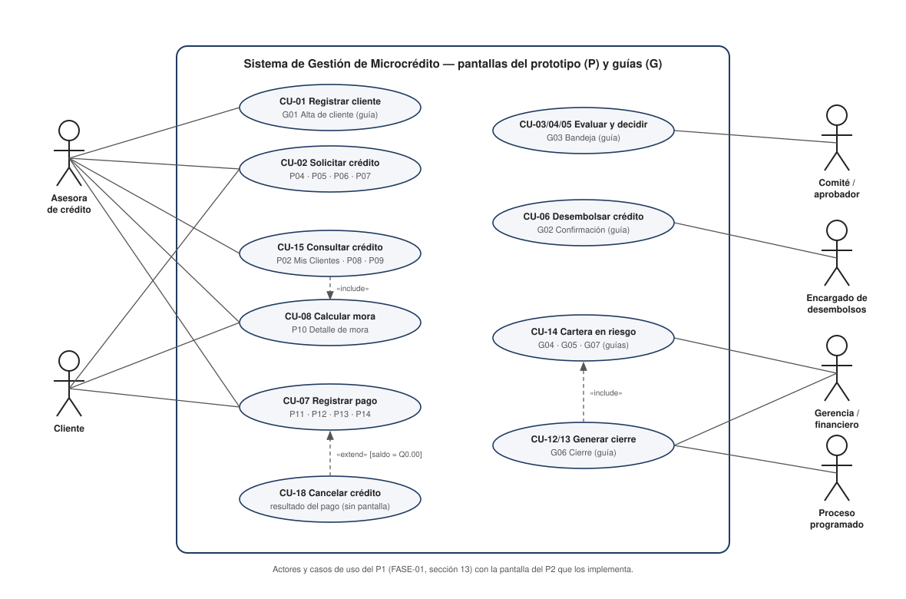

### 3.3.4 Los 18 casos de uso del P1 y su pantalla

| CU | Caso de uso | Actor principal | Puerto primario (P1) | Pantalla en el P2 (anotado · skeleton) |
|---|---|---|---|---|
| CU-01 | Registrar cliente | Asesora | `RegistrarCliente` | G01 Alta de cliente (guía) |
| CU-02 | Solicitar crédito | Asesora / cliente | `SolicitarCredito` | P04 → P05 → P06 → P07 |
| CU-03 | Evaluar crédito | Analista / comité | `EvaluarCredito` | G03 Bandeja del comité (guía) |
| CU-04 | Aprobar solicitud | Comité | `DecidirSolicitud` | G03 (guía) |
| CU-05 | Rechazar solicitud | Comité | `DecidirSolicitud` | G03 (guía) |
| CU-06 | Desembolsar crédito | Encargado de desembolsos | `DesembolsarCredito` | G02 Confirmación de desembolso (guía) |
| CU-07 | Registrar pago | Asesora / cajero | `RegistrarPago` | P11 → P12 → P13 / P14 |
| CU-08 | Calcular mora | Gestor de cartera / proceso | `CalcularMora` | P10 Detalle de mora (y P08) |
| CU-09 | Regularizar crédito | Gestor de cobros | `RegistrarPago` (extend) | Resultado del pago; sin pantalla propia |
| CU-10 | Reestructurar crédito | Aprobador autorizado | `ReestructurarCredito` | Fuera del alcance de E3 (Proyecto Final) |
| CU-11 | Declarar incobrable | Encargado autorizado | `DeclararIncobrable` | Fuera del alcance de E3; su efecto se ve en G04 |
| CU-12 | Generar cierre diario | Financiero / proceso | `GenerarCierre` | G06 Cierre (guía) |
| CU-13 | Generar cierre mensual | Financiero / proceso | `GenerarCierre` | G06 Cierre (guía) |
| CU-14 | Consultar cartera en riesgo | Gerencia / riesgo | `ConsultarCarteraEnRiesgo` | G04, G05, G07 (guías) |
| CU-15 | Consultar crédito e historial | Asesora / auditor / gestor | `ConsultarCredito` | P02 Mis Clientes, P08, P09 |
| CU-16 | Administrar política | Administrador de políticas | `AdministrarPolitica` | Fuera del alcance de E3 |
| CU-17 | Anular crédito aprobado | Aprobador / proceso | `DecidirSolicitud` | Fuera del alcance de E3 |
| CU-18 | Cancelar crédito | Sistema (resultado del pago) | `RegistrarPago` (extend) | Sin pantalla: ocurre al dejar el saldo en Q0.00 |

Ningún caso de uso **principal** queda sin pantalla (sección 6.1 del enunciado). Los que no tienen pantalla son administrativos (CU-10, CU-11, CU-16 y CU-17, previstos para el Proyecto Final) o son el resultado automático de un pago (CU-09 y CU-18). La fuente de la tabla es [`FASE-01-analisis-dominio-requisitos.md`](https://github.com/ItsRomero/Proyecto1_Analisis/blob/main/docs/analisis/FASE-01-analisis-dominio-requisitos.md), sección 13.

## 3.4 Wireframes de baja fidelidad

Cada pantalla se dibuja en **dos niveles** a partir de **una sola descripción** (script `wireframes/generar_wireframes_figma.py`), así ambos niveles y el prototipo no pueden quedar distintos:

| Nivel | Qué muestra | Carpeta |
|---|---|---|
| **Skeleton** | Solo bloques grises que indican dónde va cada elemento, sin textos ni cifras | [`wireframes/skeleton/`](wireframes/skeleton) |
| **Wireframe anotado** | Los mismos bloques con textos, cifras del núcleo y notas numeradas que justifican cada decisión | [`wireframes/anotado/`](wireframes/anotado) |
| **Alta fidelidad** | Color, tipografía, componentes y navegación | [Prototipo de Figma](https://www.figma.com/proto/jozM3QI8ZJ6pywdCoO5OVo/Microcr%C3%A9ditos-App?node-id=0-1&t=PJlTVLC3ASu31ttw-1) |

### 3.4.1 Pantallas del prototipo (P01–P14, móvil)

| Código | Pantalla en Figma | Decisión principal | Figura |
|---|---|---|---|
| P01 | Iniciar sesión | Contraseña con opción de mostrarla; ayuda visible ("Llama al soporte técnico") | Anexo A · P01 |
| P02 | Mis Clientes | Búsqueda por nombre o municipio; orden por prioridad; etiqueta de tramo y días; botón + | Anexo A · P02 |
| P03 | Mi perfil | Estado operativo y de sincronización de la asesora | Anexo A · P03 |
| P04 | Nueva solicitud (paso 1) | Cliente de una lista; monto con − / + y montos rápidos; plazo con botones; cuota estimada | Anexo A · P04 |
| P05 | Simulación de pago (paso 2) | Las 12 cuotas del núcleo para Q5,000 a 12 meses | Anexo A · P05 |
| P06 | Confirmar solicitud (paso 3) | Aviso "Revise antes de enviar" y resumen completo (WCAG 3.3.4) | Anexo A · P06 |
| P07 | Solicitud enviada | Número de referencia y próximos pasos | Anexo A · P07 |
| P08 | Detalle del crédito | Estado y tramo en lenguaje llano; lo exigible hoy; accesos a plan y mora | Anexo A · P08 |
| P09 | Plan de amortización | Caso de referencia Q10,000; cuota 12 de Q1,004.63 resaltada **y explicada** | Anexo A · P09 |
| P10 | Detalle de mora | Caso M-3: una tarjeta por tramo recorrido, tasas anuales y nota de redondeo (Q50.80) | Anexo A · P10 |
| P11 | Registrar pago | Monto con separador de miles; prelación visible antes de confirmar | Anexo A · P11 |
| P12 | Confirmar pago | "Confirme antes de aplicar"; fecha fijada al confirmar; salida "Modificar monto" | Anexo A · P12 |
| P13 | Pago aplicado | Comprobante con la distribución y el saldo restante | Anexo A · P13 |
| P14 | Sin señal | Pago en cola con folio fijo (clave de idempotencia) y sincronización | Anexo A · P14 |

### 3.4.2 Guías para las pantallas que faltan en Figma (G01–G07)

| Código | Pantalla | Formato | Caso de uso | Figura |
|---|---|---|---|---|
| G01 | Alta de cliente | Móvil | CU-01 | Anexo A · G01 |
| G02 | Confirmación de desembolso | Móvil | CU-06 | Anexo A · G02 |
| G03 | Bandeja del comité | Escritorio | CU-03/04/05 | Anexo A · G03 |
| G04 | Tablero gerencial | Escritorio | CU-14 | Anexo A · G04 |
| G05 | Créditos de un tramo | Escritorio | CU-14 | Anexo A · G05 |
| G06 | Cierre diario / mensual | Escritorio | CU-12/13 | Anexo A · G06 |
| G07 | Tablero en teléfono | Móvil | CU-14 | Anexo A · G07 |

### 3.4.3 Qué va en cada bloque

| Código | Pantalla | Qué indica cada bloque | Caso de uso |
|---|---|---|---|
| P01 | Iniciar sesión | Encabezado con marca; tarjeta con usuario y contraseña; botón Ingresar; enlace de soporte | — |
| P02 | Mis Clientes | Encabezado con búsqueda y avatar; selector Prioridad / Nombre A–Z; tarjetas de cliente (iniciales, nombre, municipio, saldo, etiqueta de tramo, días); botón + | CU-15 |
| P03 | Mi perfil | Tarjeta de la asesora; estado operativo y de sincronización; resumen de cartera; cuenta y sesión | — (soporte) |
| P04 | Nueva solicitud · paso 1 | Lista de clientes; monto con − / + y montos rápidos; plazo en botones; cuota mensual estimada; botón Ver plan | CU-02 |
| P05 | Simulación de pago · paso 2 | Resumen (capital, cuota, interés total); tabla de 12 cuotas con la última resaltada; Modificar / Confirmar | CU-02 |
| P06 | Confirmar solicitud · paso 3 | Aviso "Revise antes de enviar"; datos de la solicitud en cuadrícula; Enviar solicitud; Cancelar | CU-02 |
| P07 | Solicitud enviada | Encabezado de éxito; número de referencia; ¿Qué sigue?; Volver al inicio | CU-02 |
| P08 | Detalle del crédito | Encabezado con nombre; ubicación y teléfono; estado y tramo; resumen del crédito; Registrar pago; Plan de pago / Detalle mora | CU-15 · CU-08 |
| P09 | Plan de amortización | Resumen (capital, interés, total); tabla de 12 cuotas con la 12 resaltada; explicación del ajuste | CU-15 |
| P10 | Detalle de mora | Resumen (días, capital en mora, mora total); una tarjeta por tramo recorrido; cálculo con nota de redondeo; Registrar pago ahora | CU-08 |
| P11 | Registrar pago | Monto recibido con atajos; prelación de aplicación con barras; Revisar y confirmar | CU-07 |
| P12 | Confirmar pago | Aviso "Confirme antes de aplicar"; monto y fecha; distribución; demo sin señal; Aplicar pago; Modificar monto | CU-07 |
| P13 | Pago aplicado | Encabezado de éxito con monto; número de comprobante; cliente; distribución y saldo; WhatsApp / Imprimir | CU-07 |
| P14 | Sin señal | Encabezado sin señal; aviso; pago en cola con folio fijo; estado de sincronización; Sincronizar ahora | CU-07 |
| G01 | Alta de cliente (guía) | Foto del DPI; datos del cliente; estado del borrador; continuar a la solicitud | CU-01 |
| G02 | Confirmación de desembolso (guía) | Aviso; condiciones con política de mora; aceptación; Desembolsar; Volver y corregir | CU-06 |
| G03 | Bandeja del comité (guía) | Lista de solicitudes; datos, evaluación y plan; motivo; Aprobar / Rechazar | CU-03/04/05 |
| G04 | Tablero gerencial (guía) | Contexto; 1 riesgo · 2 incobrables · 3 mora; 4 riesgo por tramo; actividad del período; panel del asistente | CU-14 |
| G05 | Créditos de un tramo (guía) | Ruta de navegación; resumen del tramo; tabla de créditos | CU-14 |
| G06 | Cierre diario / mensual (guía) | Estado congelado e identificador; cifras del cierre; ejecutar con confirmación | CU-12/13 |
| G07 | Tablero en teléfono (guía) | Mismas tarjetas apiladas; riesgo por tramo en lista | CU-14 |

Convenciones del skeleton: las barras grises son textos, los círculos son avatares o íconos, los bloques más oscuros son los elementos principales (la cifra principal, la opción elegida o el botón primario) y las etiquetas pequeñas nombran la región.

### 3.4.4 La pantalla difícil: Detalle de mora (P10)

El enunciado advierte que mostrar solo "Mora: Q50.80" no permite verificar nada, y que mostrar la fórmula completa no se entiende. El prototipo ya resuelve bien la **forma**: una tarjeta por tramo recorrido, con el rango de días y los días en ese tramo. Lo que falta es que las **cifras** sean las del núcleo:

| Qué muestra el wireframe | Qué oculta | Por qué |
|---|---|---|
| Resumen arriba: 100 días · capital en mora Q725.76 · mora total Q50.80 | El saldo total del crédito | La mora se calcula sobre el capital de la cuota vencida, no sobre el saldo total |
| Una tarjeta por tramo con el rango de días ("Días 31–60 · 30 días en este tramo") | Solo el nombre "Mora 2" | El cliente entiende días, no nombres de tramo (heurística 2 de Nielsen) |
| Tasa **anual** del tramo ("24 % al año") y mora por día (Q0.48) | La tasa diaria 0.000666667 | Una tasa diaria no significa nada para el cliente |
| Importe por tramo a 2 decimales con asterisco | Los importes con 4 decimales | Legibilidad |
| Tarjeta "Cómo se calculó" con los 4 decimales y la **nota de redondeo** | — | Sumar las filas redondeadas da **Q50.81**; el total oficial es **Q50.80** porque se redondea una sola vez (sección 7.3) |

Los importes por tramo salen de `detalle.tramos[].importeSinRedondear` y el total de `interesMoratorio`. La interfaz solo formatea: nunca suma ni redondea por su cuenta.

### 3.4.5 Panel gerencial web (W01–W03)

El prototipo web de Figma Make agrega las pantallas de escritorio del panel gerencial. Sus skeletons y wireframes anotados se midieron del prototipo a 1440 px (script `wireframes/generar_wireframes_web.py`); los skeletons están en el Anexo A.

| Código | Pestaña del panel | Pantalla | Casos de uso |
|---|---|---|---|
| **W01** | Dashboard | Tablero gerencial | CU-14 Consultar cartera en riesgo · CU-12 Generar cierre diario (botón «Cierre diario») |
| **W02** | Cartera | Cartera de créditos | CU-14 · CU-15 Consultar crédito · CU-02 Solicitar crédito («+ Nuevo crédito») |
| **W03** | Clientes | Lista y ficha del cliente | CU-15 · CU-07 Registrar pago · CU-01 Registrar cliente («Editar cliente») |

**Relación con las guías del E2.** El Dashboard (W01) es la versión en Figma del tablero que la guía **G04** describía, y la Cartera filtrada por tramo (W02, desde «Ver →» del Dashboard) cumple el papel de la guía **G05**. Las guías se conservan como referencia de la jerarquía propuesta; las diferencias están en la sección 3.4.5.5.

#### 3.4.5.1 W01 · Dashboard (tablero gerencial)

| Bloque | Contenido | Por qué está ahí |
|---|---|---|
| Barra del panel | Logo, pestañas Dashboard · Cartera · Clientes · Cobros · Reportes, botón «Cierre diario», «← Inicio» y usuario | La navegación es la misma en todo el panel; el cierre es la acción de mayor impacto y va separado |
| Encabezado | «Tablero gerencial», período y selector de mes (Jul · Ago · Sep) | Todas las cifras son de un corte, no de «hoy» (puerto `Reloj`) |
| Indicadores | Cartera total · Desembolsos · Recuperaciones · Cartera en riesgo · Incobrable del período | Lectura en cinco segundos del estado del mes |
| Cartera por tramo | Barra apilada al 100 % y lista con monto, % y «Ver →» | Muestra dónde está el riesgo y lleva a los créditos de cada tramo |
| Desembolsos y recuperaciones | Barras de 6 meses, totales del mes, eficiencia de cobro y créditos nuevos | Tendencia: ¿se recupera al ritmo que se presta? |
| Cartera en riesgo | 23.4 % grande y desglose por tramo | Es el indicador que exige el enunciado; se separa del resto |
| Asistente | Espacio reservado | Sección 6.3 del enunciado |

#### 3.4.5.2 W02 · Cartera de créditos

| Bloque | Contenido | Por qué está ahí |
|---|---|---|
| Encabezado | «Cartera de créditos», período y número de créditos; botón «+ Nuevo crédito» | Contexto del listado y acción de originar |
| Totales por estado | Total cartera · Al día · En mora · Vencido / Incobrable, con número de créditos y monto | Resume la tabla antes de leerla |
| Filtros y búsqueda | Filtro segmentado por estado; búsqueda por cliente o código | Encontrar un crédito sin recorrer la lista |
| Tabla | Cliente y código, capital, **saldo**, cuota, plazo, cuotas pagadas, días de atraso y estado | El saldo va en negrita porque es lo que se cobra; se puede ordenar por cliente y por días |
| Estado | Pastilla con punto y el nombre del tramo | El estado no depende solo del color (WCAG 1.4.1) |
| Fila de totales | Número de créditos, capital total y saldo total | Cuadra con los totales de arriba |

#### 3.4.5.3 W03 · Clientes (lista y ficha)

| Bloque | Contenido | Por qué está ahí |
|---|---|---|
| Lista (izquierda) | Contador, búsqueda por nombre, DPI o código, filtros por tramo y filas con iniciales, nombre, código · zona, tramo y saldo | Patrón lista-detalle: se cambia de cliente sin perder el contexto |
| Encabezado de la ficha | Avatar, nombre, código · zona y estado en lenguaje llano («Más de un mes de atraso») | El estado se entiende sin conocer los tramos (decisión del E1/E2) |
| Datos del cliente | DPI, teléfono y zona | Contacto para la gestión de cobro |
| Resumen | Deuda total, créditos activos y estado general | Lo que la gerencia necesita saber del cliente |
| Créditos del cliente | Tabla con código, capital, saldo, cuota, plazo, estado y «Ver»; botón «+ Nuevo crédito» | Historial y acceso al detalle de cada crédito |
| Acciones | «Registrar pago» (principal), «Editar cliente» e «Historial de pagos» | Una sola acción principal por pantalla |

#### 3.4.5.4 Cifras verificadas

| Pantalla | Cifra | Comprobación |
|---|---|---|
| W01 | Tramos 74.2 + 8.3 + 6.1 + 5.8 + 3.2 + 2.4 | Suman 100 % |
| W01 | Cartera en riesgo 23.4 % · Q573,300.00 | 8.3 + 6.1 + 5.8 + 3.2 = 23.4 %; 23.4 % × Q2,450,000 = Q573,300 |
| W01 | Eficiencia de cobro 65.6 % | Q318,000 / Q485,000 = 65.57 % |
| W02 | Totales por estado | 5 + 7 + 3 = 15 créditos; Q50,150.00 + Q41,020.54 + Q14,250.00 = Q105,420.54 |
| W02 · W03 | María García: Q10,000 a 12 meses, 5 de 12 cuotas | Cuota Q1,004.62 y saldo Q6,259.07: coinciden con el núcleo |

#### 3.4.5.5 Ajustes pendientes

| # | Tipo | Pantalla | Qué ajustar |
|---|---|---|---|
| 1 | CORREGIR EN FIGMA | W02 | Pedro Alvarado (Q12,000 a 12 meses) muestra una cuota de Q1,004.62, que es la del crédito de Q10,000. Al 3 % mensual serían Q1,205.55 |
| 2 | CORREGIR EN FIGMA | W02 | Andrés Lima (Q5,000 a 12 meses) muestra Q485.50; el caso de referencia del núcleo da Q502.31. Si los créditos usan otra tasa, la tabla debe mostrarla; si no, las cuotas deben salir del núcleo (sección 6.2 del enunciado) |
| 3 | CORREGIR EN FIGMA | W01 · W02 | El período y el pie dicen 2024; el proyecto trabaja con septiembre de 2026 |
| 4 | DECIDIR | W01 | La guía G04 ponía la cartera en riesgo como primer indicador; el prototipo pone primero la cartera total. Elegir una y actualizar la sección 3.5 o el prototipo |
| 5 | DECIDIR | W02 · W03 | Cartera filtra por «En mora / Vencidos / Incobrables» y Clientes por tramos («1–30 días», «31–60 días»…). Usar los mismos nombres en ambas pestañas |
| 6 | Aclarar | W01 | «Incobrable del período» (Q18,500, lo castigado en el mes) y «Incobrable» en la cartera por tramo (Q58,800, saldo acumulado) son cosas distintas; conviene decirlo en la etiqueta |
| 7 | Sugerencia | W03 | Enmascarar el DPI (2456 ••••• 0101) y mostrarlo completo solo al pedirlo |
| 8 | Aclarar | W01 · W02 | El Dashboard muestra 847 créditos (Q2,450,000) y la Cartera 15 (Q105,420.54). Si la Cartera es una muestra, indicarlo; si no, deben coincidir |

### 3.4.6 Vista del cliente (C01–C06)

El prototipo de cliente de Figma Make ([Prototipo Cliente](https://www.figma.com/make/3P7qsVBkFW6B9SShgQEBoz/Prototipo-Cliente?fullscreen=1&t=sokzjUmb0IMEfUqX-1&code-node-id=0-6)) muestra lo que ve la persona que tiene el crédito. No muestra el nombre del cliente: la aplicación se dirige al **usuario** de la sesión («Mi crédito», «Tu avance», «Tu situación hoy»). Sus skeletons se midieron del prototipo a 390 px (script `wireframes/generar_skeletons_cliente.py`) y están en el Anexo A.

| Código | Pantalla | Qué va en cada bloque | Caso de uso |
|---|---|---|---|
| **C01** | Inicio · Mi crédito | Encabezado con ayuda «?»; aviso de atraso; deuda actual con barra de avance; próxima cuota con etiqueta de estado; 12 casillas de cuotas; botones «Ver detalle de mi crédito» y «Entender mi atraso»; barra inferior Inicio · Mi crédito · Ayuda | CU-15 · CU-08 |
| **C02** | Mi crédito en detalle | Cuatro datos del crédito (capital original, capital pendiente, cuotas pagadas, tasa); tarjeta del atraso actual; historial de pagos con una fila por cuota; «Ver plan completo de cuotas» | CU-15 |
| **C03** | Plan de cuotas | Resumen (capital, cuotas, tasa); tabla de 12 filas con fecha, cuota y saldo; las cuotas pagadas, vencidas y futuras se distinguen por el ícono | CU-15 |
| **C04** | Entendiendo tu atraso | Situación de hoy en lenguaje llano; línea de tiempo por etapa (al día, 1–30, 31–60 días, siguiente etapa); resumen de lo que se debe; «Ver el aviso que recibiste» | CU-08 |
| **C05** | Aviso de cambio de etapa | Fecha del aviso; qué cambió (antes / ahora); cuánto cambió el cargo por día; próxima advertencia; «Entendido» y «Tengo dudas — ir a Ayuda» | CU-08 (momento crítico MC-4) |
| **C06** | Ayuda | Preguntas frecuentes desplegables y teléfono de atención | Soporte (WCAG 3.2.6) |

#### 3.4.6.1 Qué resuelve

 Explica la mora al cliente sin tecnicismos, cumple el aviso preventivo que propuso el E1 para el momento crítico MC-4 (el cliente se entera antes del cambio de tramo, no después) y pone la ayuda en el mismo lugar de todas las pantallas. El plan de cuotas (C03) coincide con el núcleo, incluida la cuota 12 de Q1,004.63.

#### 3.4.6.2 Cifras a corregir

 (al 12 de septiembre de 2026: 42 días de atraso de la cuota 5 y 11 de la cuota 6)

| Pantalla | Prototipo | Valor correcto |
|---|---|---|
| C01 · C02 · Deuda y capital pendiente | Q6,259.07 con 4 de 12 cuotas pagadas | Con 4 cuotas pagadas el capital pendiente es **Q7,052.13** (pagado Q2,947.87); Q6,259.07 corresponde a 5 cuotas pagadas |
| C04 · Cargos por atraso | ~Q188 en la etapa 1, ~Q125 en la etapa 2, total Q313.00 | Mora de la cuota 5 (capital Q793.06): **Q18.24**; de la cuota 6 (capital Q816.85): **Q4.49**; gasto de cobro de la cuota 5: **Q25.00**. Cargos: **Q47.73** |
| C04 · Total a pagar hoy | Q2,322.24 | **Q2,056.97** = Q2,009.24 de cuotas vencidas + Q47.73 |
| C04 · Etapas | «61–120 días» como una sola etapa | Dos etapas: 61–90 días (30 % anual) y 91–120 días (36 % anual) |
| C05 · Cargo por día | ~Q6.27 → ~Q10.44 (+Q4.17 al día) | Cuota 5: **Q0.40 → Q0.53 al día (+Q0.13)**; además, al pasar el día 30 se cobra **una sola vez Q25.00** de gasto de gestión |
| C06 · «¿Cómo se calcula…?» | «Se multiplica el saldo pendiente por una tasa diaria» | «Se multiplica el **capital de cada cuota vencida** por la tasa anual de su etapa ÷ 360, por cada día; al pasar el día 30 se suma un gasto de Q25.00 por cuota» |
| C02 · C03 · Fechas | «01/Apr/2026» | «01/abr/2026» (meses en español) |

## 3.5 Jerarquía del tablero gerencial (G04)

### 3.5.1 Qué se ve primero y por qué

El tablero se lee en forma de Z, de izquierda a derecha y de arriba abajo. El orden sigue las preguntas que Andrea trae al comité (§2.2.3):

| Orden | Zona | Contenido (cifras del núcleo) | Pregunta que responde | Por qué en ese lugar |
|---|---|---|---|---|
| 0 | Línea de contexto | Fecha de corte, "cierre congelado ✓" y política por fecha de otorgamiento | ¿De cuándo son estos números? ¿Son definitivos? | Un indicador sin fecha no sirve para decidir; con la mora escalonada, el tramo depende de la fecha |
| 1 | Tarjeta principal, arriba a la izquierda | **Cartera en riesgo 7.00 %** (Q56,000 de Q800,000) | ¿Cuánto de la cartera está en deterioro real? | Es el indicador sobre el que decide el comité (provisiones, restricciones de colocación) |
| 2 | Junto al riesgo | **Dado por incobrable en el período** (C-007) | ¿El riesgo bajó porque cobramos o porque dimos de baja? | El enunciado exige mostrarlo junto al riesgo: declarar incobrable a C-005 bajaría el indicador de 7.00 % a 6.06 % sin cobrar nada |
| 3 | Tercera tarjeta | **Cartera en mora 21.75 %** (Q174,000) | ¿Cuántos clientes tienen algún atraso? | Es una alerta temprana útil, pero no es la base de la decisión de riesgo; por eso va después |
| 4 | Bloque central | Riesgo por tramo: 3.00 + 2.25 + 1.00 + 0.75 = **7.00 %** | ¿Dónde está concentrado el riesgo? | Explica la tarjeta 1 y es la entrada al detalle (flujo 3 de E3) |
| 5 | Parte inferior | Desembolsos y recuperaciones del período | ¿Cómo se movió la cartera en el período? | Contexto de actividad; se consulta después de entender el riesgo |
| — | Panel derecho plegable | Asistente conversacional (Proyecto Final) | "¿Por qué subió la mora de…?" | Ver §3.5.3 |

### 3.5.2 Cómo se distinguen la cartera en mora y la cartera en riesgo

Confundir estos dos indicadores es un hallazgo de severidad 4 y una penalización de −0.5 puntos (sección 10). El diseño los separa con **cinco señales independientes**, para que ninguna dependa solo del color (WCAG 1.4.1):

| Señal | Cartera en RIESGO | Cartera en MORA |
|---|---|---|
| Rótulo | "Cartera en **RIESGO**" | "Cartera en **MORA**" (la palabra distinta, en mayúsculas) |
| Definición visible bajo la cifra | "Más de 30 días + reestructurados" | "Cualquier atraso ≥ 1 día" |
| Símbolo | ▲ | ● |
| Borde de la tarjeta | Grueso y continuo (indicador principal) | Discontinuo |
| Posición | Primera, junto a incobrables | Tercera, separada por la tarjeta de incobrables |
| Color en alta fidelidad (E3) | Color de alerta del sistema de diseño | Neutro / informativo |

Además, el bloque de tramos explica expresamente por qué Mora 1 no forma parte del riesgo ("Q124,000 con atraso ≤ 30 días se ven en *Cartera en mora*"). Así, un lector que sume los tramos no busca el 21.75 % en ese bloque.

Origen de las cifras: `calcularCarteraPorTramo` devuelve `carteraActiva`, `tramosEnRiesgo[]`, `totalEnRiesgo`, `carteraEnMora` e `incobrablesDelPeriodo`. Los porcentajes llegan ya conciliados para que sumen exactamente el total (invariante 7 de la sección 7.9). El tablero no recalcula nada (CP-04.3). El enunciado no da el saldo de C-007; el tablero lo toma de `incobrablesDelPeriodo` del cierre, por eso la guía G04 no muestra un monto inventado.

> **Observación para el equipo.** En `tests/cartera-por-tramo.test.ts` los créditos se llaman C-001, C-002… con las cifras de la sección 7.8, pero los identificadores no coinciden con los del enunciado (C-003 con 45 días, C-004 con 75 días, etc.). Los montos y porcentajes sí coinciden. El prototipo usa los identificadores del enunciado; conviene alinear el fixture para que la defensa no se preste a confusión.

### 3.5.3 El lugar del asistente (sección 6.3)

El chat del Proyecto Final ocupa una **columna derecha plegable** (G04) y, en el teléfono, un acceso desde el tablero móvil (G07). Justificación:

- **No tapa las cifras**: las tarjetas y el desglose quedan a la izquierda, en el recorrido natural de lectura.
- **Convive con el tablero**: la gerencia puede preguntar "¿por qué C-004 está en Mora 3?" mientras ve el tramo. El asistente responde con la misma fuente que el tablero (el núcleo) y cita de dónde sale cada cifra.
- **Plegable**: si no se usa, el tablero recupera ancho sin reorganizarse.

## 3.6 Qué se validará en E3 y E5

- Prueba de lectura del tablero (cinco segundos): ¿qué porcentaje reporta el participante como "riesgo"?
- Prueba de comprensión de P10 con tres personas sin formación financiera: ¿pueden explicar por qué la mora de los días 91–100 es de Q7.26 si son solo 10 días?
- Tiempo para registrar un pago con una mano, de pie (P11 → P12): objetivo de menos de 30 segundos y 4 toques desde P08.

*Uso de IA declarado (sección 15):* los SVG de baja fidelidad se generaron con apoyo de un asistente de IA a partir de las decisiones del equipo, mediante el script editable `wireframes/generar_wireframes_figma.py`, tomando como referencia las pantallas del prototipo de Figma. Las decisiones de jerarquía y su justificación son del equipo y deben revisarse antes de la entrega.

---

# 4. E3 · Prototipo navegable en Figma

Este capítulo presenta los tres prototipos navegables (asesor, panel gerencial y cliente), cómo recorrer los tres flujos obligatorios, qué resuelven bien y qué cifras todavía no coinciden con el núcleo.

## 4.1 Enlaces y acceso

El equipo construyó tres prototipos en Figma. Los tres abren sin iniciar sesión (sección 13 del enunciado) y se recorren haciendo clic; no son imágenes sueltas.

| Prototipo | Enlace | Qué contiene |
|---|---|---|
| **Móvil · asesora de crédito** (*Microcréditos App*) | [Abrir el prototipo móvil](https://www.figma.com/proto/jozM3QI8ZJ6pywdCoO5OVo/Microcr%C3%A9ditos-App?node-id=0-1&t=PJlTVLC3ASu31ttw-1) | Pantallas P01–P14: cartera de la asesora, detalle del crédito, plan, mora, registro de pago, pago sin señal y solicitud de crédito |
| **Web · flujos y panel gerencial** (*Prototipo Microcréditos Web*, Figma Make) | [Abrir el prototipo web](https://www.figma.com/make/WHj2TK5IRg55X8JiaKXyvy/Prototipo-Microcr%25C3%25A9ditos-Web?code-node-id=0-6&p=f&fullscreen=1) | Inicio con tres flujos: *Solicitar crédito* y *Registrar pago* en vista móvil de 375 px, y el *Panel gerencial* de escritorio (Dashboard, Cartera, Clientes y Cierre diario) |
| **Cliente · vista del usuario** (*Prototipo Cliente*, Figma Make) | [Abrir el prototipo de cliente](https://www.figma.com/make/3P7qsVBkFW6B9SShgQEBoz/Prototipo-Cliente?fullscreen=1&t=sokzjUmb0IMEfUqX-1&code-node-id=0-6) | Pantallas C01–C06 que ve el usuario del crédito: inicio, detalle, plan de cuotas, explicación del atraso, aviso de cambio de etapa y ayuda. No muestra el nombre del cliente, se dirige al usuario |

## 4.2 Cómo recorrerlos

**Prototipo móvil**

| Paso | Qué hacer | Qué se ve |
|---|---|---|
| 1 | *Ingresar* en **P01 Iniciar sesión** | **P02 Mis Clientes**: cartera ordenada por prioridad, con la etiqueta de tramo y los días de atraso |
| 2 | Tocar la tarjeta de *Pedro Xol Cux* | **P08 Detalle del crédito** → *Plan de pago* (**P09**) → *Detalle mora* (**P10**) |
| 3 | *Registrar pago* → monto → *Revisar y confirmar* → *Aplicar pago* | **P11** → **P12 Confirmar pago** con la prelación → **P13 Pago aplicado** |
| 4 | Variante: en *Confirmar pago*, *Simular pago sin señal (demo)* | **P14 Sin señal**: pago en cola, estado y *Sincronizar ahora* |
| 5 | En *Mis Clientes*, botón **+** | **P04 Nueva solicitud** → **P05 Simulación** → **P06 Confirmar** → **P07 Solicitud enviada** |

**Prototipo web**

| Flujo | Recorrido | Pantallas |
|---|---|---|
| Flujo 1 · Solicitar crédito | *Solicitar crédito* → *Ver plan de amortización* → *Continuar con solicitud* → marcar la aceptación → *Confirmar y enviar solicitud* | Monto y plazo (paso 1 de 3) → Simulación (paso 2 de 3) → Confirmar solicitud (paso 3 de 3) → ¡Solicitud enviada! |
| Flujo 2 · Registrar pago | *Registrar pago* → *María García López* → *Ver detalle de mora* / *Ver tabla* → *Registrar pago* → *Cuota regular* → *Ver desglose del pago* → *Aplicar pago ahora* | Buscar cliente → Crédito → Detalle de mora · Plan de amortización → Registrar pago → Confirmar pago (prelación) → Comprobante |
| Flujo 3 · Panel gerencial | *Panel gerencial* → *Dashboard* → *Ver →* en un tramo → *Ver crédito*; pestañas *Cartera*, *Clientes* y *Cierre diario* | W01 Dashboard → créditos del tramo → crédito; W02 Cartera; W03 Clientes; Cierre diario |

**Prototipo de cliente**

| Recorrido | Pantallas |
|---|---|
| Inicio → *Ver detalle de mi crédito* → *Ver plan completo de cuotas* | C01 → C02 → C03 |
| Inicio → *Entender mi atraso* → *Ver el aviso que recibiste* → *Tengo dudas — ir a Ayuda* | C01 → C04 → C05 → C06 |

## 4.3 Lo que los prototipos resuelven bien

Recorrimos los tres prototipos completos el 23 de septiembre de 2026.

- **Captura del monto difícil de equivocar:** botones − y +, montos rápidos y el rango permitido siempre visible (móvil); control deslizante con límites Q1,000–Q25,000 (web). Responde al momento crítico MC-1.
- **El plazo se elige con botones** (3 a 24 meses), sin teclado.
- **Revisión antes de confirmar (WCAG 3.3.4).** La solicitud web tiene tres pasos y exige marcar «He leído y acepto…» antes de enviar, con el aviso «Esta acción no se puede deshacer». El pago muestra el desglose y «Una vez aplicado, este pago no puede revertirse» antes de *Aplicar pago ahora*.
- **La prelación se ve antes de aplicar el pago**, en el orden gastos → mora → interés corriente → capital.
- **El plan de amortización usa el caso de referencia:** Q10,000 al 3 % mensual, cuota Q1,004.62, interés total Q2,055.45 y total Q12,055.45. El plan web ya incluye la nota «La última cuota es Q1,004.63, con ajuste de Q0.01».
- **Existe el tablero gerencial (W01)** con cartera por tramo, cartera en riesgo 23.4 % y espacio para el asistente, y el **desglose por tramo** lleva a los créditos de ese tramo (flujo 3).
- **Existe el cierre diario** con verificación previa, congelamiento de cifras y protección contra duplicados («ya cerrado»), coherente con la idempotencia del núcleo.
- **Flujo sin señal** con el pago en cola y sincronización manual (móvil, P14).
- **La vista del cliente explica la mora sin tecnicismos** y avisa antes del cambio de etapa (C04 y C05), lo que responde al momento crítico MC-4 del E1. Su plan de cuotas (C03) coincide con el núcleo, incluida la cuota 12 de Q1,004.63, y la ayuda «?» está en el mismo lugar de todas sus pantallas.

## 4.4 Correspondencia con las pantallas y los flujos obligatorios

| Requisito del E3 | Perfil / formato | Estado | Dónde | Pendiente |
|---|---|---|---|---|
| Solicitud de crédito con simulación del plan | Asesor · móvil | ✅ | P04 → P07 · web pasos 1 a 3 | — |
| Detalle del crédito | Cliente/Asesor · móvil | ✅ | P08 · web *Crédito* · cliente C01–C02 | Mostrar lo exigible hoy cuando hay mora (tabla siguiente) |
| Registro de pago con desglose de la prelación | Asesor · móvil | ⚠️ | P11 → P13 · web *Confirmar pago* | Corregir los montos del desglose |
| Plan de amortización con la cuota 12 explicada | Cliente/Asesor · móvil | ⚠️ | P09 · web *Plan de amortización* · cliente C03 (correcto) | La nota ya está en la web; falta corregir la fila 12 y el centavo desde la cuota 8 |
| Detalle de la mora con el caso M-3 | Cliente/Asesor · móvil | ❌ | P10 · web *Detalle de mora* · cliente C04 | Los tres calculan sobre el saldo o con tasas equivocadas |
| Tablero gerencial | Gerencia · escritorio | ✅ | W01 (web) | Ajustes de la sección 3.4.5 |
| Cierre diario / mensual | Gerencia · escritorio | ⚠️ | Web *Cierre diario* | Falta el cierre mensual (CU-13) |
| Confirmación de desembolso | Encargado · móvil | ❌ | — | Construir a partir de la guía G02 |
| Flujo 1: solicitud → simulación → confirmación → desembolso | — | ⚠️ | Termina en «Solicitud enviada» | Agregar el desembolso después de la aprobación |
| Flujo 2: buscar → saldo y tramo → mora → pago → comprobante | — | ✅ | P02 → P13 · web flujo 2 | Corregir cifras |
| Flujo 3: tablero → riesgo por tramo → créditos del tramo | — | ✅ | Web flujo 3 | — |
| *P03 Mi perfil* | Asesor | ✅ | P03 | Se justifica como pantalla de soporte de sesión y sincronización (sección 3.3.2), sin caso de uso de negocio propio |

## 4.5 Cifras que deben coincidir con el núcleo (sección 6.2)

El enunciado resta 0.5 puntos por cifras inventadas y otros 0.5 por aplicar mal la política de mora. Estas son las diferencias encontradas en los prototipos del asesor y del panel, con el valor correcto que debe mostrarse.

**Detalle de la mora (P10 y web)**

| Elemento | Prototipo | Valor correcto |
|---|---|---|
| Tasas | Móvil: 0.5 %, 1 %, 1.5 % y 2 % mensual · Web: 2 %, 3 %, 4 % y 5 % mensual | **18 %, 24 %, 30 % y 36 % anual**, base Actual/360 |
| Base del cálculo | Saldo total: Q6,240.50 (móvil) · Q6,259.07 (web) | **Capital en mora** de la cuota vencida: Q725.76 en el caso M-3 |
| Caso M-3 (100 días) | Q228.81 (móvil) · Q667.65 (web) | **Q50.80** = 10.8864 + 14.5152 + 18.1440 + 7.2576 = 50.8032, redondeado una sola vez (no Q50.81) |
| Tramo de 91 a 100 días | Web: «Vencido · 5 % mensual» | **Mora 4 · 36 % anual** (el crédito es incobrable después de 120 días) |
| Total exigible (M-5, 45 días) | «Total a pagar hoy Q6,469.31» (móvil) | **Q1,047.76** = Q25.00 + Q18.14 + Q278.86 + Q725.76 |
| Días de atraso | Web: el crédito dice 45 días y su detalle de mora, 100 | Abrir el detalle desde un crédito con 100 días, o mostrar los 45 días del mismo crédito |

**Registro de pago y crédito (web)** · María García, cuota 6 vencida hace 45 días (capital Q816.85, interés Q187.77)

| Elemento | Prototipo | Valor correcto (misma fórmula que M-2 y M-5) |
|---|---|---|
| Gastos de cobro | Q125.00 (web) · Q150.00 (móvil) | **Q25.00** por cuota vencida, generado una sola vez al día 31 |
| Interés moratorio | Q219.07 | **Q20.42** = Q816.85 × (18 % × 30 + 24 % × 15) / 360 |
| Monto rápido «Cuota + mora» | Q1,500.00 | **Q1,050.04** = Q25.00 + Q20.42 + Q187.77 + Q816.85 |
| «Mora acum.» en los créditos del tramo | Q281.66 | **Q20.42** |
| «Próxima cuota» en el crédito en mora | Q1,004.62 | Mostrar lo **exigible hoy: Q1,050.04** |

**Plan de amortización (web)**

| Elemento | Prototipo | Valor correcto |
|---|---|---|
| Saldo después de la cuota 8 | Q3,734.27 | **Q3,734.28** (el centavo se arrastra a las cuotas 9, 10 y 11) |
| Saldos después de las cuotas 9, 10 y 11 | Q2,841.68 · Q1,922.31 · Q975.36 | **Q2,841.69 · Q1,922.32 · Q975.37** |
| Fila de la cuota 12 (plan y simulación) | Q1,004.62, capital Q975.36 | **Q1,004.63**, capital **Q975.37**, como dice la nota |

**Coherencia entre pantallas**

| Pantalla | Diferencia | Corrección |
|---|---|---|
| Solicitud enviada (móvil) | El cliente cambia de *Carlos Martínez Ixcot* a *Juan Pablo Pérez Xol* | Mantener el cliente elegido en el paso 1 |
| Sin señal (móvil) | El folio cambia de *PAG-251250* a *PAG-309097* al sincronizar | El folio es la **clave de idempotencia**: debe ser el mismo en todos los reintentos |
| Registrar pago y Cartera (web) | Ana Lucía Morales figura «Al día» en un lugar y «31–60 d» en otro; Pedro Alvarado tiene códigos distintos (CRD-2024-0388 y 0488); José Domingo tiene 22 días en Cartera y 38 en el tramo | Usar un solo conjunto de datos de ejemplo |
| Cartera (web) | Pedro Alvarado (Q12,000 a 12 meses) con cuota Q1,004.62; Andrés Lima (Q5,000 a 12 meses) con Q485.50 | Q1,205.55 y Q502.31 al 3 % mensual |
| Todas (web) | Fechas de 2024 | Septiembre de 2026 |

Las cifras a corregir del prototipo de cliente están en la sección 3.4.6. Las instrucciones para aplicar todas las correcciones en Figma Make, listas para copiar, están en el Anexo B.

---

# 5. E4 · Decisión de arquitectura móvil/web y diseño responsivo

Este capítulo decide cómo se construye la aplicación: nativa, híbrida o PWA. La decisión se argumenta contra el contexto real de cada perfil. Explica también cómo se transforma el tablero entre el teléfono y el escritorio, y qué pasa cuando la asesora registra un pago sin señal. Esa última decisión solo funciona gracias a dos piezas del Proyecto 1: la clave de idempotencia y el puerto `Reloj`.

**Alcance.** En el P2 no se implementan frontend, service worker, API ni almacenamiento del dispositivo (sección 5 del enunciado). Esta es una decisión de arquitectura que el Proyecto Final implementará con React + Vite + Tailwind (sección 14). Las restricciones de contexto provienen de [E1](e1-investigacion-usuario.md).

## 5.1 Restricciones que decide la arquitectura

| Restricción | Perfil | Fuente | Qué exige |
|---|---|---|---|
| Señal intermitente o nula durante parte de la ruta | Asesora | Enunciado, sección 3; IICA/BID (conectividad rural) | Trabajar sin conexión: consultar la cartera de la ruta, capturar solicitudes y registrar pagos |
| Teléfono Android de gama media, poca memoria | Asesora | Enunciado, sección 3 | App ligera, sin descargas grandes para actualizar |
| Uso con una mano, de pie y bajo el sol | Asesora | Enunciado, sección 3 | Objetivos táctiles grandes, alto contraste, poco tecleo (depende del diseño, no de la tecnología) |
| Escritorio con pantalla grande y conexión estable | Gerencia | Enunciado, sección 3 | Alta densidad de información; acceso por navegador sin instalar nada |
| Consulta ocasional desde el teléfono | Gerencia | E1 (hipótesis) | El mismo tablero, adaptado |
| El cliente puede no tener datos móviles | Cliente | DataReportal 2024 (60.3 % usa internet) | Los avisos al cliente van por SMS, no por la app (MC-4) |
| El Proyecto Final debe implementarse en 4 semanas con React y Tailwind | Equipo | Enunciado, secciones 2.1 y 14 | Un solo código web |

## 5.2 Decisión: una PWA única, mobile-first

### 5.2.1 Alternativas evaluadas

| Criterio | Nativa (Kotlin / Swift) | Híbrida (React + Capacitor) | **PWA (React + service worker)** |
|---|---|---|---|
| Trabajo sin conexión | Completo | Completo (web + plugins nativos) | Suficiente: service worker para la app y los datos en caché; IndexedDB para la cola de pagos y los borradores |
| Cola de envío en segundo plano | Completa | Completa | Background Sync en Chrome para Android; en otros navegadores, reenvío al volver la señal o al abrir la app, más un botón manual |
| Teléfono de gama media | Mejor rendimiento, pero instalador pesado | Contenedor nativo + web | Se instala desde el navegador, ocupa poco, sin tienda de aplicaciones |
| Escritorio para gerencia | No aplica: exige otro producto | Requiere además la versión web | **El mismo código** en el navegador de escritorio |
| Actualizaciones (por ejemplo, un cambio de política) | Publicar en la tienda y esperar a que los asesores actualicen | Publicar en la tienda para cambios nativos | Inmediatas al volver a cargar la app |
| Cámara para la foto del DPI (G01) | Sí | Sí | Sí: `<input type="file" accept="image/*" capture>` o `getUserMedia` |
| Coherencia con el Proyecto Final (React + Vite + Tailwind en 4 semanas) | Rompe el stack: dos lenguajes más | Compatible, pero agrega compilación, firma y pruebas por plataforma | **Idéntico stack** |
| Costo de mantenimiento | 2 o 3 bases de código | 1 base de código + contenedores | **1 base de código** |

### 5.2.2 Decisión y justificación

**Se adopta una PWA única, instalable, mobile-first, para los tres perfiles.** El rol que inicia sesión determina la pantalla de inicio: Ruta del día, Bandeja del comité o Tablero.

- **Para la asesora:** su necesidad crítica es trabajar sin señal, y eso lo resuelven el service worker (app y datos en caché) y una cola persistente en IndexedDB. La operación clave no es "tener señal", sino **no perder ni duplicar un pago cuando no la hay**, y eso depende del diseño de la cola y de la API (§5.4), no de que la app sea nativa. En un Android de gama media, una PWA se instala desde Chrome sin pasar por la tienda y se actualiza sola.
- **Para la gerencia:** trabaja en escritorio con buena conexión. Una PWA es simplemente la web; no se construye un segundo producto.
- **Para el proyecto:** el Proyecto Final exige React + Vite + Tailwind. Una PWA es ese mismo stack, sin compilar ni firmar por plataforma.

### 5.2.3 Riesgos aceptados y cómo se mitigan

| Riesgo de la PWA | Mitigación |
|---|---|
| El navegador puede borrar el almacenamiento de un sitio | Solicitar `navigator.storage.persist()` al instalar. La cola se vacía en cuanto hay señal. Aviso visible si quedan pendientes al final del día (P03 Mi perfil y P14). Nunca se borra un comando sin confirmación del servidor |
| Background Sync no existe en todos los navegadores | No se promete sincronización automática universal. Reenvío al recibir el evento `online`, al abrir la app y con el botón "Enviar ahora" en Pendientes. La flota de asesoras usa Android con Chrome (supuesto a confirmar con TI) |
| iOS limita las PWA | La gerencia en iPhone solo consulta: no necesita cola ni sincronización |

**Condición de revisión.** Si la validación de campo muestra que Android borra la cola con frecuencia o que la cámara no alcanza para leer el DPI, se migra la app de la asesora a **Capacitor**. Esto conserva el mismo código React y agrega almacenamiento nativo: la decisión es reversible sin reescribir.

## 5.3 Estrategia responsiva mobile-first

Se diseña primero para 360 px (el teléfono de la asesora) y se **agrega** información a medida que crece la pantalla. Puntos de quiebre de Tailwind:

| Ancho | Clase | Uso principal |
|---|---|---|
| < 640 px | base | Asesora en campo; gerencia consultando en reunión |
| ≥ 768 px | `md` | Tableta en oficina de agencia |
| ≥ 1024 px | `lg` | Escritorio de gerencia |
| ≥ 1280 px | `xl` | Escritorio con el panel del asistente abierto |

### 5.3.1 Cómo se transforma el tablero gerencial

| Elemento | Teléfono (G07) | Escritorio (G04) |
|---|---|---|
| Línea de contexto (fecha de corte, cierre congelado) | En el encabezado: "Tablero · corte 30/09" | Línea completa con estado del cierre y política |
| Riesgo → incobrables → mora | Tres tarjetas **apiladas en ese mismo orden**, con los mismos rótulos, símbolos (▲ ✕ ●) y bordes | Tres tarjetas en fila |
| Desglose por tramo | Lista de 4 filas con porcentaje; al tocar una fila se abre el detalle | Tabla con créditos, saldo en Q, barra proporcional y % |
| Detalle de un tramo (G05) | Tarjetas por crédito | Tabla de 8 columnas |
| Desembolsos y recuperaciones | Dos cifras del período, sin gráfico | Series mensuales |
| Asistente (Proyecto Final) | Botón flotante que abre el chat a pantalla completa | Columna derecha plegable |
| Cierre (G06) | Solo consulta | Consulta y ejecución, con confirmación |

**Qué se sacrifica en la pantalla pequeña, y por qué es aceptable:**

1. **Las series temporales y las barras.** Una gráfica de 12 meses en 360 px no se lee. En el teléfono se contesta "¿cómo estamos hoy?"; las tendencias se ven en escritorio.
2. **Los montos en quetzales dentro del desglose por tramo.** Se muestra solo el porcentaje para que cada fila quepa en una línea; el monto aparece al tocar la fila.
3. **La exportación a CSV.** Es una tarea de escritorio.
4. **Ejecutar el cierre.** Es una operación financiera irreversible (WCAG 3.3.4). Se reserva al escritorio para evitar toques accidentales.

**Lo que no se sacrifica nunca:** la distinción entre cartera en mora y cartera en riesgo, la cifra de incobrables junto al riesgo y la fecha de corte. Quitarlas en el teléfono reintroduciría el error MC-3.

### 5.3.2 Reglas del sistema responsivo

- Los objetivos táctiles miden al menos 48 × 48 px en todos los anchos; WCAG 2.5.8 exige 24 px como mínimo.
- Ninguna acción requiere arrastrar (WCAG 2.5.7). Las listas se desplazan, y el orden se cambia con botones.
- El texto base es de 16 px y se puede ampliar al 200 % sin perder contenido (WCAG 1.4.4). Las tablas pasan a tarjetas antes de necesitar desplazamiento horizontal.
- Contraste mínimo de 4.5:1 (WCAG 1.4.3). La paleta de alta fidelidad (E3) se probará también a plena luz del día.

## 5.4 Estrategia ante pérdida de conexión

### 5.4.1 Qué funciona sin señal

| Operación | Sin señal | Cómo |
|---|---|---|
| Ver la ruta y el detalle de los créditos de la ruta | Sí, con la fecha de los datos visible | Copia descargada al iniciar la jornada |
| Ver el detalle de la mora | Sí, rotulado "calculado con datos del 22/09" | Última respuesta de `consultarMora` en caché. **No se recalcula en el teléfono** |
| Capturar alta de cliente y solicitud | Sí | Borrador en IndexedDB, guardado campo por campo |
| Registrar un pago | Sí, **queda pendiente** | Cola de comandos (§5.4.2) |
| Desembolsar | **No** | Mueve dinero de la institución; requiere confirmación en línea |
| Tablero y cierres | No (gerencia trabaja en línea) | — |

### 5.4.2 Registrar un pago sin señal: la clave de idempotencia

Cuando Mariela toca "Aplicar pago" en P12 (Confirmar pago) sin señal, ocurre lo siguiente, en este orden:

1. **Se crea el comando** `RegistrarPago` con `creditoId`, `importe` como cadena (`"1047.76"`), `moneda`, `fechaPago` y `usuarioProceso`.
2. **Se genera la `Idempotency-Key` una sola vez** (un UUID) y se guarda junto al comando en IndexedDB **antes** de mostrar "Pendiente". Sin ese registro, un cierre de la app podría perder el pago.
3. La pantalla muestra **Pendiente** en la pantalla Sin señal (P14). Nunca muestra "Pagado" sin una respuesta del sistema.
4. Al volver la señal, la cola envía `POST /creditos/{creditoId}/pagos` con **la misma clave y el mismo contenido**, en orden por crédito.
5. El contrato OpenAPI del P1 responde:
   - **201**: pago nuevo registrado → estado **Confirmado**.
   - **200** con `Idempotency-Replayed: true`: el pago ya había llegado (por ejemplo, el primer envío sí llegó y se perdió la respuesta) → **Confirmado**, sin un segundo efecto.
   - **409**: la clave ya existe con un contenido distinto → estado **Conflicto**, visible para la asesora y para su supervisor. **Nunca se genera una clave nueva automáticamente**, porque eso sí podría duplicar el pago.
6. Un timeout **no borra el comando**: se reintenta con la misma clave.

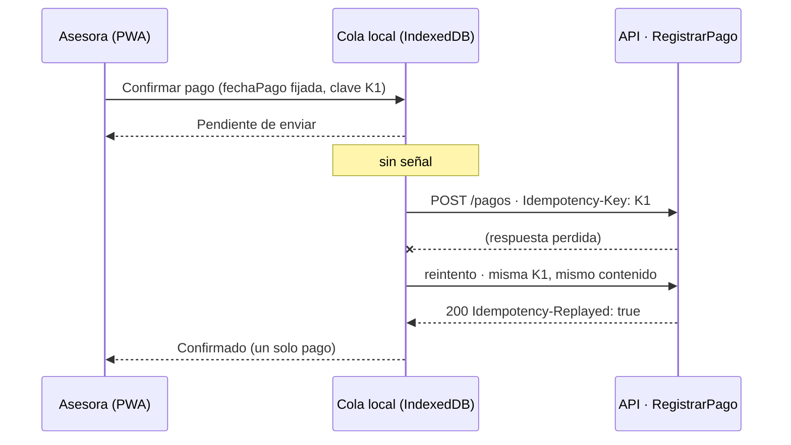

Así se previene MC-2 (doble cobro de Q1,047.76). El núcleo ya lo sostiene: `pago-idempotente.ts` y sus pruebas del P1 verifican que una repetición no cambia saldos ni movimientos.

**Ajuste necesario al contrato del P1.** El OpenAPI sugiere un tiempo de vida (TTL) de **24 horas** para la clave. Una asesora que pasa más de un día sin señal enviaría su pago cuando la clave ya expiró, y el reintento se procesaría como un pago nuevo. **El TTL debe ser mayor que la ventana máxima de trabajo sin conexión** (se propone 30 días), o la clave debe conservarse junto con el pago de forma permanente. Este cambio se registra para el Proyecto Final; no cambia el núcleo.

### 5.4.3 ¿Con qué fecha se calcula? El puerto Reloj

Caso: la cuota 2 de Carlos tiene **30 días** de atraso. Mariela recibe el pago hoy sin señal y el teléfono lo sincroniza **mañana**, cuando la cuota ya tendría 31 días.

| Si se calcula con… | Días | Mora | Gasto de cobro | Total de la cuota |
|---|---|---|---|---|
| **`fechaPago` = día en que Carlos pagó** (correcto) | 30 | Q10.89 | Q0.00 | **Q1,015.51** |
| Fecha de sincronización (incorrecto) | 31 | Q11.37 | Q25.00 | Q1,040.99 |

Si se usara la fecha de sincronización, Carlos pagaría **Q25.48 de más** por una demora que no es suya. La respuesta está en el P1: la fecha de corte es un parámetro y no "hoy".

- En el teléfono, el **adaptador del puerto `Reloj`** fija la `fechaPago` **en el momento de confirmar** y la guarda en el comando. Los reintentos envían esa misma fecha.
- En el núcleo, `RegistrarPago` recibe `fechaPago` y `consultarMora` recibe `fechaCorte` como parámetros. **El núcleo nunca lee la fecha del sistema**: la validación final lo comprobó con `rg 'new Date\(\)' src`, que no encuentra coincidencias ([e6-04](e6-04-validacion-final.md)).
- La política aplicable (plana o escalonada) no depende de ninguna de esas fechas, sino de la **fecha de otorgamiento** (`resolverPolitica`).

**Salvaguarda contra un reloj del teléfono mal configurado.** Al recibir el comando, el servidor compara `fechaPago` con la fecha de recepción y con la última sincronización del dispositivo. Una `fechaPago` futura o anterior a la última sincronización exitosa se acepta, pero queda **marcada para revisión** del supervisor en lugar de aplicarse en silencio. Esta regla corresponde a la capa de aplicación del Proyecto Final, no al núcleo.

### 5.4.4 Lo que se ve en pantalla

| Estado del comando | Texto en P12 / P14 | Estado en Mi perfil (P03) |
|---|---|---|
| Guardado sin señal | "Pendiente de enviar · se enviará solo al tener señal" | "Sin señal · 2 pendientes" |
| Enviando | "Enviando…" | "Enviando…" |
| Confirmado (201 o 200 replay) | "Confirmado · comprobante definitivo" y opción de enviar SMS al cliente | "En línea" |
| Conflicto (409) | "Este pago no coincide con uno ya registrado. No se cobró de nuevo. Revíselo con su supervisor." | "1 pago requiere revisión" |

## 5.5 Dos decisiones del Proyecto 1 que hacen viable el trabajo sin conexión

| Decisión de experiencia | Decisión de arquitectura del P1 que la sostiene | Qué pasaría sin ella |
|---|---|---|
| Registrar pagos sin señal y reintentar al reconectar | **Clave de idempotencia** en `RegistrarPago` (`Idempotency-Key`, respuestas 201 / 200 replay / 409) | Cada reintento podría ser un pago duplicado |
| Mostrar y cobrar la mora correcta aunque se sincronice otro día | **Puerto `Reloj`**: fecha de corte y `fechaPago` como parámetros, nunca "hoy" | El tramo y el gasto de Q25.00 dependerían del momento en que el teléfono recuperó la señal |

## 5.6 ADR-005 · PWA con trabajo sin conexión (E4)

Registra formalmente la decisión del E4 para que el Proyecto Final la implemente.

### 5.6.1 Estado y fecha

Propuesta por el equipo para el Proyecto Final. Fecha de registro: 2026-09-23. Se implementará en React + Vite + Tailwind durante el Proyecto Final. En el Proyecto 2 no se programa la interfaz (enunciado, sección 2.1).

### 5.6.2 Contexto

El sistema tiene tres perfiles con contextos muy distintos (enunciado, sección 3; E1):

- **Asesora de crédito:** trabaja en campo, de pie, con una mano ocupada, con un Android de gama media y con señal intermitente o nula. Registra pagos y solicitudes durante las visitas.
- **Cliente:** tiene teléfono, pero no siempre datos móviles (en 2024, el 60.3 % de la población de Guatemala usaba internet, frente a 113.3 % de conexiones móviles).
- **Gerencia y comité:** trabajan en escritorio con conexión estable y consultan ocasionalmente desde el teléfono.

El Proyecto Final debe construirse en cuatro semanas con React y Tailwind. Dos decisiones del Proyecto 1 ya condicionan el trabajo sin conexión: la **clave de idempotencia** de `RegistrarPago` y el **puerto `Reloj`**, por el que la fecha de corte es un parámetro y nunca "hoy".

### 5.6.3 Decisión

Construir **una sola aplicación web progresiva (PWA), instalable y diseñada primero para el teléfono**, para los tres perfiles. El rol con que se inicia sesión define la pantalla inicial: Ruta del día, Bandeja del comité o Tablero.

1. **Sin conexión:** un *service worker* guarda la aplicación y los datos de la ruta. Los borradores y la cola de pagos se guardan en IndexedDB. Se solicita almacenamiento persistente con `navigator.storage.persist()`.
2. **Cola de pagos idempotente:** la `Idempotency-Key` se genera una sola vez al confirmar el pago y se guarda con él antes de mostrar "Pendiente de enviar". Cada reintento envía la misma clave y el mismo contenido. Las respuestas del contrato del P1 se interpretan así: 201 es un pago nuevo; 200 con `Idempotency-Replayed` es un reintento ya aplicado; 409 es un conflicto que se muestra para revisión. Un timeout nunca borra el comando.
3. **Fecha del pago:** el adaptador del puerto `Reloj` en el teléfono fija la `fechaPago` al confirmar, y los reintentos la conservan. El núcleo recibe la fecha como parámetro y no lee el reloj del sistema.
4. **Sincronización:** Background Sync donde exista (Chrome en Android); además, reenvío al recuperar la señal, al abrir la aplicación y con un botón manual. No se promete sincronización automática universal.
5. **Operaciones que requieren conexión:** desembolsar y ejecutar cierres no se permiten sin señal.

### 5.6.4 Alternativas

- **Aplicación nativa (Kotlin/Swift):** descartada. Exige dos lenguajes y dos bases de código más la web de gerencia, publicar en tiendas y esperar a que los asesores actualicen. Además no cabe en las cuatro semanas del Proyecto Final.
- **Aplicación híbrida (React + Capacitor):** viable, pero agrega compilación, firma y pruebas por plataforma sin resolver un problema que la PWA no resuelva hoy. Se conserva como **plan de contingencia**.
- **Web sin capacidad offline:** descartada, porque la asesora perdería capturas y pagos al quedarse sin señal (momentos críticos MC-1 y MC-2 del E1).

### 5.6.5 Consecuencias y trade-offs

- Un solo código para los tres perfiles, coherente con el stack del Proyecto Final; las actualizaciones llegan sin pasar por una tienda.
- El navegador puede desalojar el almacenamiento. Se mitiga con almacenamiento persistente, vaciando la cola en cuanto hay señal y avisando si quedan pendientes al final del día.
- En iOS las PWA tienen limitaciones; se aceptan porque la gerencia solo consulta desde el iPhone.
- **Ajuste requerido al contrato del P1:** el OpenAPI sugiere un TTL de 24 horas para la `Idempotency-Key`. Debe ampliarse por encima de la ventana máxima sin conexión (se propone 30 días); si no, un reintento después de un día sin señal se procesaría como pago nuevo.
- **Condición de revisión:** si la validación de campo muestra que Android desaloja la cola con frecuencia, o que la cámara del navegador no basta para leer el DPI, la aplicación de la asesora migra a Capacitor sin reescribir el código React.

### 5.6.6 Evidencia

`docs/proyecto2/e4-decision-movil-web.md`, `docs/proyecto2/e1-investigacion-usuario.md` (momentos críticos MC-2 y MC-4), `docs/api/openapi.yaml` (operación `registrarPago`, cabecera `Idempotency-Key`), `src/dominio/pago-idempotente.ts` y `src/aplicacion/consultar-mora.ts`.

## 5.7 Referencias

- MDN Web Docs. *Offline and background operation* (PWA). https://developer.mozilla.org/en-US/docs/Web/Progressive_web_apps/Guides/Offline_and_background_operation
- MDN Web Docs. *What is a progressive web app?* https://developer.mozilla.org/en-US/docs/Web/Progressive_web_apps/Guides/What_is_a_progressive_web_app
- MDN Web Docs. *StorageManager.persist()*. https://developer.mozilla.org/en-US/docs/Web/API/StorageManager/persist
- Capacitor. *Documentación oficial*. https://capacitorjs.com/docs
- W3C (2023). *Web Content Accessibility Guidelines (WCAG) 2.2*. https://www.w3.org/TR/WCAG22/
- Repositorio: `docs/api/openapi.yaml` (operación `registrarPago`), `src/dominio/pago-idempotente.ts`, `src/aplicacion/consultar-mora.ts`.

---

# 6. E5 · Evaluación heurística y de accesibilidad

## 6.1 Método y estado

El enunciado pide que **los cuatro integrantes evalúen por separado** y después consoliden, porque varios evaluadores independientes encuentran más problemas que uno solo. Este capítulo reúne dos insumos y deja preparado el tercero:

| Insumo | Estado | Contenido |
|---|---|---|
| Evaluación preliminar del prototipo móvil | Hecha (23/09) | 14 hallazgos de un evaluador, con apoyo de IA declarado en el capítulo 9 (H-01 a H-14) |
| Revisión de los prototipos web y de cliente con medición | Hecha (23/09) | 11 hallazgos nuevos (H-15 a H-25). El contraste de cada texto se calculó con la fórmula de WCAG sobre sus colores reales y se midió el tamaño de cada control interactivo en 13 pantallas |
| Evaluación independiente de los cuatro integrantes, cinco correcciones con antes/después y design review | **Pendiente del equipo** | Formularios en el Anexo C. Los resultados no se inventan: se registran cuando cada integrante haga su evaluación |

Escala de severidad (Anexo C del enunciado): 0 no es problema · 1 cosmético · 2 menor · 3 mayor · 4 catastrófico.

## 6.2 Hallazgos heurísticos (Nielsen)

| # | Prototipo · pantalla | Hallazgo y evidencia | Heurística | Sev. | Corrección propuesta |
|---|---|---|---|---|---|
| H-01 | Móvil · Detalle de mora | Tasas mensuales de 0.5 %–2 % sobre el saldo total | 2 · Correspondencia con el mundo real | **4** | Caso M-3 con tasas anuales sobre el capital en mora (sección 4.5) |
| H-02 | Móvil · Detalle de mora | «Total a pagar hoy Q6,469.31» suma el saldo completo; el cliente cree que debe eso hoy | 5 · Prevención de errores | **4** | Mostrar lo exigible de la cuota vencida (M-5: Q1,047.76) |
| H-03 | Móvil · Detalle de mora | Un crédito incobrable (132 días) sigue mostrando recargos, con datos de otro cliente | 4 · Consistencia y estándares | 3 | Congelar la mora al día 120 |
| H-04 | Móvil · Sin señal | El folio cambia de PAG-251250 a PAG-309097 al sincronizar | 1 · Visibilidad del estado | 3 | Mismo folio (clave de idempotencia) en cada reintento |
| H-05 | Móvil · Sin señal | «Si lo registra otra vez se duplicará» deja a la asesora evitar el doble cobro | 5 · Prevención de errores | 3 | Que el sistema lo impida y lo diga |
| H-06 | Móvil · Registrar pago | El monto se ve como «Q 10000», sin separador de miles | 5 · Prevención de errores | 3 | Formato en vivo «Q 10,000.00» |
| H-07 | Móvil · Registrar pago | Gastos de gestión de Q150.00 | 2 · Correspondencia | 3 | Q25.00 por cuota vencida |
| H-08 | Móvil · Solicitud enviada | El cliente cambia de Carlos Martínez a Juan Pablo Pérez | 4 · Consistencia | 3 | Mantener el cliente seleccionado |
| H-09 | Móvil · Plan de amortización | La cuota 12 está resaltada pero sin explicación | 10 · Ayuda y documentación | 2 | Nota del centavo de ajuste (ya resuelto en el prototipo web) |
| H-10 | Móvil · Mis Clientes | «Mora 1/2/3» no significa nada para el cliente | 2 · Correspondencia | 2 | «Más de 30 días de atraso» |
| H-11 | Asesor y panel · todas | La ayuda solo aparece en el inicio de sesión del móvil y el prototipo web no tiene ayuda (el de cliente sí la tiene, ver C06) | 10 · Ayuda / WCAG 3.2.6 | 2 | Ícono «?» en el mismo lugar de cada encabezado |
| H-12 | Móvil · Registrar pago | Los atajos «1 / 2 / 3 cuotas» no llenan el monto | 7 · Flexibilidad y eficiencia | 2 | Conectar cada atajo con su monto |
| H-13 | Móvil · Pago aplicado | El comprobante no muestra el saldo restante (el web sí: «Nuevo saldo») | 1 · Visibilidad del estado | 2 | Agregar el saldo restante |
| H-14 | Móvil · Detalle de mora y pago | Textos secundarios pequeños y en gris claro | 8 · Diseño estético / WCAG 1.4.3 | 2 | 14 px y contraste ≥ 4.5:1 |
| H-15 | Web · Detalle de mora | Tasas de 2 %, 3 %, 4 % y 5 % mensual sobre el saldo de Q6,259.07; total Q667.65 para 100 días | 2 · Correspondencia | **4** | M-3: 18/24/30/36 % anual sobre Q725.76 = Q50.80 |
| H-16 | Web · Confirmar pago | Gastos Q125.00 y mora Q219.07 en la prelación; el monto rápido «Cuota + mora» es Q1,500.00 | 5 · Prevención de errores | **4** | Q25.00 y Q20.42; «Cuota + mora» = Q1,050.04 (sección 4.5) |
| H-17 | Web · Crédito → Detalle de mora | El crédito dice 45 días de atraso y su detalle de mora, 100 días | 4 · Consistencia | 3 | Los mismos días en ambas pantallas |
| H-18 | Web · Plan y simulación | La fila 12 dice Q1,004.62 mientras la nota dice Q1,004.63; el saldo pierde un centavo desde la cuota 8 | 4 · Consistencia | 2 | Q3,734.28 … Q975.37 y cuota 12 de Q1,004.63 |
| H-19 | Web · todas | El texto secundario #90A1B9 sobre blanco tiene contraste 2.63:1 (29 textos en el Dashboard, 47 en Clientes) | 8 · Diseño estético / WCAG 1.4.3 | 3 | Usar #475569 o más oscuro (≥ 4.5:1) |
| H-20 | Web · Confirmar solicitud | El texto dice «autoriza el desembolso», pero el flujo termina en «Solicitud enviada · En revisión» | 2 · Correspondencia | 3 | Separar la solicitud (va al comité) del desembolso (después de aprobar) |
| H-21 | Web · Pago y Cartera | Ana Lucía Morales aparece «Al día» y «31–60 d»; Pedro Alvarado tiene dos códigos de crédito | 4 · Consistencia | 3 | Un solo conjunto de datos de ejemplo |
| H-22 | Web · Dashboard | «Ver →» en #CAD5E2 sobre blanco (1.49:1): la entrada al flujo 3 casi no se ve | 6 · Reconocer antes que recordar | 2 | Enlace visible («Ver créditos →») con contraste ≥ 4.5:1 |
| H-23 | Cliente · Inicio y detalle | «4 de 12 cuotas pagadas» con una deuda de Q6,259.07, que es el saldo después de 5 cuotas | 4 · Consistencia | 3 | Q7,052.13 con 4 cuotas pagadas (sección 3.4.6) |
| H-24 | Cliente · Entender mi atraso y Ayuda | Los cargos se calculan sobre el saldo pendiente (~Q313 y total Q2,322.24) y la ayuda lo explica así | 2 · Correspondencia | **4** | Capital de cada cuota vencida y tasa anual de su etapa: cargos Q47.73 y total Q2,056.97 |
| H-25 | Cliente · Aviso | El cargo por día pasa de ~Q6.27 a ~Q10.44; no menciona el gasto de Q25.00 del día 31 | 5 · Prevención de errores | 3 | Q0.40 → Q0.53 al día y el gasto único de Q25.00 |

## 6.3 Auditoría WCAG 2.2 (criterios A/AA nuevos + 3.3.4)

Resultados sobre el **prototipo web**, medidos el 23/09 en 13 pantallas: Inicio, solicitud (3 pasos), buscar cliente, crédito, detalle de mora, registrar pago, confirmar pago, Dashboard, Cartera y Clientes.

| Criterio | Nivel | Resultado | Evidencia |
|---|---|---|---|
| 2.4.11 Focus Not Obscured (Minimum) | AA | ✅ Cumple | Ninguna pantalla tiene elementos fijos o pegajosos (`position: fixed/sticky`) que puedan tapar el foco |
| 2.5.7 Dragging Movements | AA | ✅ Cumple | El único control que admite arrastre es el deslizador del monto, y también responde a un clic en la barra; el plazo usa botones |
| 2.5.8 Target Size (Minimum) | AA | ✅ Cumple | El control más pequeño mide 28 px (chips de Clientes); en móvil, 44 px. Recomendación: llevar a 48 × 48 px lo que se usa en campo (E4) |
| 3.2.6 Consistent Help | A | ⚠️ Parcial | ✅ Cliente: el botón «?» está en el mismo lugar del encabezado de todas las pantallas y lleva a Ayuda (C06). ❌ Panel y flujos web del asesor: no hay ayuda (H-11) |
| 3.3.7 Redundant Entry | A | ✅ Cumple | El cliente se elige de una lista en el pago; la solicitud no vuelve a pedir datos ya capturados |
| 3.3.8 Accessible Authentication (Minimum) | AA | ✅ Cumple en el móvil | P01 usa usuario y contraseña con opción de mostrarla y sin pruebas cognitivas; el prototipo web no tiene inicio de sesión |
| 3.3.4 Error Prevention (Legal, Financial) | AA | ⚠️ Parcial | ✅ Solicitud: revisión en el paso 3 y casilla de aceptación. ✅ Pago: desglose y aviso antes de aplicar. ❌ Desembolso: la pantalla no existe todavía |
| 1.4.3 Contrast (Minimum), heredado | AA | ❌ No cumple | Tabla siguiente |

**Detalle del contraste (1.4.3).** Mínimo 4.5:1 para texto normal y 3:1 para texto grande (≥ 24 px, o ≥ 18.66 px en negrita).

| Color de texto sobre fondo | Contraste | Dónde aparece | Corrección |
|---|---|---|---|
| #90A1B9 sobre #FFFFFF | 2.63:1 | Etiquetas de indicadores, códigos de crédito, subtítulos (todas las pantallas) | #475569 (7.6:1) |
| #90A1B9 sobre #F8FAFC / #F1F5F9 | 2.51:1 · 2.40:1 | «Paso 1 de 3», «Período: septiembre 2024», encabezados de tabla | #475569 |
| #CAD5E2 sobre #FFFFFF | 1.49:1 | «Ver →» del Dashboard | #334155 |
| #F97316 sobre #FFFFFF | 2.80:1 (texto grande) | «23.4%» de cartera en riesgo | #C2410C (5.2:1) |
| #16A34A sobre #FFFFFF | 3.30:1 | «65.6%» y montos en verde | #15803D (5.0:1) |
| Blanco sobre #EAB308 / #F97316 | 1.92:1 · 2.80:1 | Etiquetas «30d» del recorrido de la mora | Texto #1E293B sobre esos colores |

El botón «Confirmar y enviar solicitud» deshabilitado (2.08:1) queda exento: WCAG no exige contraste en controles inactivos.

## 6.4 Correcciones y design review

Las cinco correcciones recomendadas, por su impacto en el dinero y en la calificación, son **H-01/H-15, H-02/H-16, H-04, H-18 y H-19**. El Anexo C trae la tabla antes/después para registrarlas con sus capturas, el formulario de evaluación individual y el acta del design review de la Sesión 9 (qué se aceptó, qué se rechazó y por qué).

---

# 7. E6 · Evolución del núcleo e informe de impacto SOLID

## 7.1 Qué se implementó

Implementamos en el mismo repositorio del Proyecto 1 los cuatro cambios de la sección 7 del enunciado:

| Cambio | Qué pide el enunciado | Qué hicimos | Dónde está |
|---|---|---|---|
| **CP-01** · Política escalonada | Cada día de atraso se cobra a la tasa del tramo al que pertenece (18/24/30/36 %), base Actual/360, **un solo redondeo al final** y tope en el capital en mora | Puerto `PoliticaMora` con implementación escalonada; tasas en configuración versionada, fuera del motor | `src/dominio/politica-mora/` |
| **CP-02** · Gasto de gestión de cobro | Q25.00 por cuota vencida al llegar al día 31, una sola vez, aunque el cierre se repita | `generarGastoGestion`, idempotente por crédito, cuota y concepto | `gasto-gestion-cobro.ts` |
| **CP-03** · Coexistencia de políticas (sección 7.6 del enunciado) | Los créditos otorgados antes del 1/10/2026 conservan la política plana del 24 % | `resolverPolitica` elige según la fecha de otorgamiento: CV-2026-0100 paga Q21.77 y CV-2026-0410 paga Q18.14 a 45 días | `catalogo-politicas.ts` |
| **CP-04.1** · `en_mora → cancelado` | Un pago que deja el saldo exacto en cero cancela el crédito en mora | Transición nueva en el State `EstadoEnMora` | `credito-estado.ts` |
| **CP-04.2** · Suspensión del devengo | Después del día 90 el interés corriente va a "interés en suspenso" y no al ingreso | `DevengoInteres`: entre el día 90 y el 100 el ingreso no sube y el suspenso sí | `devengo-interes.ts` |
| **CP-04.3** · Cartera en riesgo por tramo | El núcleo expone el desglose para que el tablero no recalcule | `calcularCarteraPorTramo`: 3.00 + 2.25 + 1.00 + 0.75 = 7.00 % | `cartera-por-tramo.ts` |

Los casos de referencia del enunciado salen exactos de las pruebas: M-1 Q5.44, M-2 Q18.14, M-3 Q50.80, M-4 Q65.32, M-5 Q1,047.76, coexistencia Q21.77 frente a Q18.14, y la prueba original del P1 de Q7.26 sigue pasando. El detalle de fórmulas y la selección de políticas están en `docs/proyecto2/e6-02-evolucion-nucleo.md`; las entradas, salidas y criterios de cada prueba, en `e6-03-pruebas-mora-escalonada.md`.

## 7.2 Informe de impacto SOLID (Anexo D)

Este es el informe que exige la sección 8. También está en el repositorio como `docs/informe-impacto-solid.md`, tal como pide el E7.

Este informe sigue la plantilla del **Anexo D** del enunciado. Mide cuánto hubo que modificar el núcleo del Proyecto 1 para absorber los cambios CP-01 a CP-04 de la sección 7 y responde, con evidencia del repositorio, a las preguntas de la sección 8.2. Todas las cifras de esta sección se pueden reproducir con los comandos incluidos.

### 7.2.1 Punto de partida

| Hito | Referencia | Cómo reproducirlo |
|---|---|---|
| Entrega del Proyecto 1 | Etiqueta **`entrega-p1`** → commit `8737d9b782772a5cff9acb07de8d719f4f4e3a16` (26/08/2026) | `git show --stat entrega-p1` |
| Núcleo evolucionado (fases 1–4) | Commit `0d6c1a9` | Los commits posteriores solo agregan contratos, documentación y scripts; no cambian `src/dominio` |
| Entrega del Proyecto 2 | Etiqueta **`entrega-p2`**, que se crea sobre el commit final de la entrega | `git tag entrega-p2 && git push origin entrega-p1 entrega-p2` |

La historia no se reescribió: los cambios del P2 están en commits separados por fase (ver la sección 8.2) y se integraron a `main` con el PR #1.

**Unidad de medida.** Líneas físicas que Git suma o elimina, incluidos comentarios y líneas vacías. No mide esfuerzo, complejidad ni cobertura.

### 7.2.2 Métricas del cambio (sección 8.1)

```text
$ git diff --stat entrega-p1 0d6c1a9 -- src/dominio
 src/dominio/calculadora-mora.ts                    | 51 ++++++-----
 src/dominio/cartera-por-tramo.ts                   | 99 ++++++++++++++++++++++
 src/dominio/clasificacion-tramo.ts                 | 13 +++
 src/dominio/credito-estado.ts                      | 14 ++-
 src/dominio/devengo-interes.ts                     | 57 +++++++++++++
 src/dominio/gasto-gestion-cobro.ts                 | 45 ++++++++++
 src/dominio/politica-mora/catalogo-politicas.ts    | 10 +++
 .../politica-mora/configuracion-politica.ts        | 22 +++++
 src/dominio/politica-mora/politica-escalonada.ts   | 17 ++++
 src/dominio/politica-mora/politica-mora.ts         | 38 +++++++++
 src/dominio/politica-mora/politica-plana.ts        | 18 ++++
 src/dominio/politica-mora/politica-retroactiva.ts  | 18 ++++
 12 files changed, 381 insertions(+), 21 deletions(-)
```

| Métrica (8.1) | Resultado | Lectura |
|---|---|---|
| Archivos del núcleo **creados** | **10** | Neutro o bueno: la funcionalidad nueva vive en archivos nuevos |
| Archivos del núcleo **modificados** (de los 7 que existían en el P1) | **2**: `calculadora-mora.ts` (+32/−19) y `credito-estado.ts` (+12/−2) | Dentro del objetivo razonable (≤ 2). Los otros 5 (`dinero`, `plan-amortizacion`, `cartera`, `pago-idempotente`, `prelacion-pago`) no se tocaron |
| **¿Se modificó el motor de cálculo de mora?** | **Sí.** `calculadora-mora.ts` cambió en +32/−19 (13 líneas netas) | El P1 **no** cumplía abierto/cerrado para la mora; ver §7.2.4.1 |
| Pruebas del P1 que dejaron de pasar | **0** | Los 10 archivos de prueba del P1 (206 pruebas) pasan sobre el núcleo evolucionado |
| Pruebas del P1 que hubo que reescribir | **0** | `git diff entrega-p1 -- tests` solo muestra archivos **añadidos** (A); ningún archivo del P1 aparece como modificado (M) |
| Líneas netas añadidas a `src/dominio` | **+360** (381 añadidas, 21 eliminadas) | Por encima del rango orientativo de 60–120 líneas; el desglose explica por qué |

**Desglose de las 360 líneas netas.** El rango de 60–120 líneas del enunciado se refiere al cambio de política. Nuestro diff incluye además CP-02 y CP-04:

| Cambio | Archivos | Líneas netas |
|---|---|---:|
| CP-01 / CP-03 · Política escalonada y coexistencia | `politica-mora/*` (5 archivos), `clasificacion-tramo.ts`, adaptación de `calculadora-mora.ts` | 123 + 13 + 13 = **149** |
| … de las cuales solo son doble de prueba o configuración | `politica-retroactiva.ts` (18), `configuracion-politica.ts` (22) | (40) |
| CP-02 · Gasto de gestión de cobro | `gasto-gestion-cobro.ts` | **45** |
| CP-04.1 · `en_mora → cancelado` | `credito-estado.ts` | **10** |
| CP-04.2 · Suspensión del devengo | `devengo-interes.ts` | **57** |
| CP-04.3 · Cartera en riesgo por tramo | `cartera-por-tramo.ts` | **99** |
| **Total** | 12 archivos | **360** |

Sin contar la configuración ni el doble de prueba, la política escalonada ocupó **109 líneas netas**, dentro del rango orientativo. El resto corresponde a correcciones que el enunciado exige y que no son parte de la política de mora.

Fuera de `src/dominio` se añadieron `aplicacion/consultar-mora.ts` (+27) y `contratos/presentadores-p2.ts` (+32), y se modificó `contratos/esquemas.ts` (+33/−0). Con esos archivos, todo `src/` suma 473 líneas añadidas y 21 eliminadas.

### 7.2.3 Los cinco principios (sección 8.2)

| Principio | Pregunta del enunciado | Respuesta con evidencia | Veredicto |
|---|---|---|---|
| **S** · Responsabilidad única | ¿Quién decide el tramo y quién decide cuánto cuesta? ¿Es la misma clase? | **Son piezas distintas.** El tramo lo decide `clasificarTramoMora` en `clasificacion-tramo.ts` (Specification: días → tramo). El costo lo decide cada `PoliticaMora` (`politica-escalonada.ts`, `politica-plana.ts`). Se prueban por separado: `INV-10` en `invariantes.test.ts` y los casos M-1 a M-4 en `politica-mora.test.ts`. En el P1, `clasificarTramoMora` y el enum `TramoMora` vivían **dentro** de `calculadora-mora.ts`; el diff los retira del motor y los reexporta | Se cumple **después** del cambio; en el P1 estaban juntos |
| **O** · Abierto/cerrado | ¿Se pudo agregar la política escalonada sin abrir el motor? | **No en el primer cambio.** `calculadora-mora.ts` cambió en +32/−19: el P1 recibía la **tasa** como parámetro de un método estático (`calcularInteresMoratorio(capital, tasa, dias)`), no una política. Hubo que abrir un punto de extensión (`constructor(private readonly politica: PoliticaMora)`). **A partir de ahora sí se cumple**: `contrato-politica.test.ts` inyecta una tercera política (`PoliticaRetroactiva`) sin tocar el motor | **Parcial**: el P1 no lo cumplía; el P2 lo establece |
| **L** · Sustitución de Liskov | ¿Se pueden intercambiar plana, escalonada y retroactiva sin romper los invariantes del motor? | **Sí.** `contrato-politica.test.ts` ejecuta la misma batería (`describe.each`) contra las tres: mismas entradas, resultado determinista e inmutable, no negativo, misma moneda y tope ≤ capital. Se prueban 3 políticas × 2 monedas × 4 capitales × 12 atrasos (0, 1, 30, 31, 60, 61, 90, 91, 120, 121, 150, 100000) = **288 combinaciones**. El motor además rechaza una estrategia que viole el contrato ("el motor rechaza una estrategia que incumple moneda, finitud, signo o tope") | **Se cumple** |
| **I** · Segregación de interfaces | ¿El puerto de política expone solo lo que el motor necesita? | **Sí.** `PoliticaMora` tiene 2 miembros: `readonly id` y `calcular(capital, dias): CalculoPolitica` (`politica-mora.ts`, 4 líneas de interfaz). Ninguna implementación lanza "no soportado"; ninguna persiste, lee el reloj ni cambia el estado del crédito | **Se cumple** |
| **D** · Inversión de dependencias | ¿El motor depende de la abstracción o de una implementación concreta? | **De la abstracción.** `calculadora-mora.ts` importa `PoliticaMora` **solo como tipo** (`import type`) y no nombra `PoliticaPlana` ni `PoliticaEscalonada`. Quien construye la política es `resolverPolitica` (`catalogo-politicas.ts`), y la composición ocurre en la capa de aplicación (`consultar-mora.ts`) | **Se cumple**, con una dependencia residual (ver §7.2.4.3) |

#### GRASP

| Principio | Pregunta del enunciado | Evidencia |
|---|---|---|
| Experto en información | ¿Quién conoce los días de atraso? Esa pieza debe calcular el tramo | `DiasAtraso` (núcleo) alimenta a `clasificarTramoMora`; `CalculadoraMora.calcularPorCuota` devuelve `tramo` junto al importe. **Ni el tablero ni el caso de uso calculan el tramo**: la interfaz lo recibe (ver §3.3.2) |
| Polimorfismo | ¿La política se elige por despacho polimórfico o con un `switch`? | El motor usa despacho polimórfico (`this.politica.calcular(...)`). La **selección** de la política sí es un condicional por fecha en un único punto (`resolverPolitica`: `fechaOtorgamiento < vigencia ? plana : escalonada`). Crecerá con cada versión nueva (§7.2.4.4) |
| Bajo acoplamiento / alta cohesión | Medido con `git diff --stat` | 10 archivos nuevos frente a 2 modificados; cada archivo nuevo tiene una sola responsabilidad y su propio archivo de pruebas |

### 7.2.4 Puntos de fricción: qué se abrió que no debía abrirse

#### 7.2.4.1 `calculadora-mora.ts` (el motor): +32 / −19

**Causa.** En el P1 la mora era `CalculadoraMora.calcularInteresMoratorio(capitalVencido, tasa, dias)`: un método estático que recibía una **tasa**, no una **política**. La tasa plana era, en la práctica, un parámetro primitivo. El tramo y su clasificación también vivían en el mismo archivo.

**Rediseño aplicado** (commit `ec2a436`):

```diff
+import type { PoliticaMora, CalculoPolitica } from "./politica-mora/politica-mora.js";
+export { TramoMora, clasificarTramoMora } from "./clasificacion-tramo.js";
 export class CalculadoraMora {
+  public constructor(private readonly politica: PoliticaMora) { Object.freeze(this); }
+  public calcular(capital: Dinero, dias: DiasAtraso) { … this.politica.calcular(capital, dias) … }
```

- Se extrajo `TramoMora` / `clasificarTramoMora` a `clasificacion-tramo.ts` y se reexporta, para que el código del P1 que los importaba siga compilando.
- Se agregó la instancia con la política inyectada. La **fachada estática del P1 se conservó intacta** para no romper las 206 pruebas.
- `debeDevengarInteresCorriente` pasó de `dias.valor <= 90` a leer `REGLAS_COBRO.diasHastaReconocimientoCorriente`.

**Qué se haría distinto en el P1:** inyectar desde el principio una `PoliticaMora`, aunque solo existiera la plana. Así, este cambio habría sido de 0 líneas en el motor.

#### 7.2.4.2 `credito-estado.ts`: +12 / −2

**Causa.** CP-04.1 es un defecto del enunciado del P1: la tabla de transiciones no incluía `EN_MORA → CANCELADO`. Con el patrón State, una transición nueva **obliga** a modificar la clase del estado de origen (`EstadoEnMora` añade `cancelar`). Esto es propio del patrón, no un problema de acoplamiento.

**Rediseño:** override de `cancelar` en `EstadoEnMora` con la guarda "saldo = 0.00 exacto y sin cuotas vencidas pendientes", y el método `Credito.liquidarConPago(e, saldoTotal: Dinero, cuotasVencidasPendientes)`. Además, la suspensión del devengo usa la misma regla de `debeDevengarInteresCorriente` en lugar de repetir el número 90.

#### 7.2.4.3 Dependencias residuales (no requirieron abrir archivos, pero existen)

- `PoliticaEscalonada` lee sus tasas de `configuracion-politica.ts` con un `import`, no por constructor. **Para cambiar el 30 % de Mora 3 se edita `configuracion-politica.ts`, no `calculadora-mora.ts`**: se cumple la regla de la sección 7.2 ("sin tocar el motor"). Sin embargo, sigue siendo un cambio de código que requiere volver a compilar. En el Proyecto Final, la configuración debería llegar desde el repositorio de políticas versionadas (puerto `AdministrarPolitica`).
- Las políticas importan el tipo `DiasAtraso` de `calculadora-mora.ts`, y la plana reutiliza el validador de tasa de ese archivo. Es un acoplamiento de tipos heredado del P1 que podría extraerse a `dias-atraso.ts`.

#### 7.2.4.4 Deuda aceptada

1. **Fachada estática P1**: conserva la fórmula plana sin tope ni congelación a 120 días. Las entradas del P2 usan `consultarMora` o el motor inyectado.
2. **Catálogo con un condicional**: dos versiones cerradas en código. Una tercera política exigirá tocar `resolverPolitica` (aunque no el motor).
3. **Clasificación ≠ baja contable**: pasados los 120 días la mora se congela automáticamente, pero la baja (`INCOBRABLE`) requiere autorización y evidencia, como en el P1.
4. **Gasto y devengo son funciones puras**: el llamador conserva el resultado. La persistencia atómica y la concurrencia corresponden al Proyecto Final.
5. **Porcentajes conciliados por restos mayores**: una fila puede diferir una centésima de su redondeo aislado para que la suma sea exactamente 7.00 % (invariante 7).
6. **Duplicación menor** del conjunto de estados activos entre `cartera.ts` (P1) y `cartera-por-tramo.ts`, retenida para no modificar un sexto archivo del P1.

### 7.2.5 Resultado de las pruebas

Última ejecución registrada: `npm run verify` (`tsc --noEmit` + `vitest run`) con **263 pruebas aprobadas en 18 archivos** y código de salida 0. La validación desde instalación limpia (`npm ci`) está en [e6-04-validacion-final.md](e6-04-validacion-final.md).

| Prueba obligatoria de E6 | Archivo y caso | Resultado |
|---|---|---|
| M-1 Q5.44 · M-2 Q18.14 · M-3 Q50.80 · M-4 Q65.32 | `politica-mora.test.ts` · "M-1 a M-4 y congelación: día %s = %s" (incluye 121 y 150 días = Q65.32) | Pasa |
| M-5 Q1,047.76 (y Q1,010.06 a 15 días) | `gasto-gestion-cobro.test.ts` · "M-5 y pago sin gasto al corte" | Pasa |
| Coexistencia: Q21.77 plana y Q18.14 escalonada a 45 días | `politica-mora.test.ts` · "conserva la plana de 45 días"; `regresion-p1.test.ts` | Pasa |
| Suite del P1 intacta (Q7.26, tabla de 12 filas) | 10 archivos del P1 sin modificar; `regresion-p1.test.ts` · "invariante 5 … mantienen 7.26" | 206 de 206 pasan |
| Contrato contra las tres políticas (Liskov) | `contrato-politica.test.ts` · "Contrato LSP: $id" | Pasa para plana, escalonada y retroactiva |
| Los ocho invariantes de la sección 7.9 | 1, 2 y 4: `politica-mora.test.ts`; 3: `contrato-politica.test.ts`; 5 y 8: `regresion-p1.test.ts`; 6: `gasto-gestion-cobro.test.ts`; 7: `cartera-por-tramo.test.ts` | Pasa |
| CP-04.1 `en_mora → cancelado`; SOLICITADO no puede pagar | `credito-cancelacion-p2.test.ts` | Pasa |
| CP-04.2 día 90 frente a 100: el ingreso no sube y el suspenso sí | `devengo-interes.test.ts` · "día 90 reconoce; días 91 y 100 acumulan suspenso sin aumentar ingreso" | Pasa |
| CP-04.3 3.00 + 2.25 + 1.00 + 0.75 = 7.00 % | `cartera-por-tramo.test.ts` · "cumple oráculo: 7.00% en riesgo y 21.75% en mora" | Pasa |
| Redondeo por tramo prohibido (Q50.80 y no Q50.81) | `politica-mora.test.ts` · "desglosa sin redondear cada tramo" | Pasa |

Durante la evolución hubo **dos fallos de compilación** en pruebas **nuevas**: la inferencia literal del parámetro de `PoliticaPlana` quedó restringida a `"0.24"`, y un enum de estado se ensanchó en una entrada nueva. Se corrigieron con una anotación `string` y un discriminante literal, sin tocar las expectativas del P1. No se observaron fallos de pruebas del P1.

Restricciones de E6 verificadas: `"strict": true` en `tsconfig.json`; `rg '\bany\b' src` sin coincidencias; `rg 'new Date\(\)' src` sin coincidencias (el núcleo no lee el reloj); dependencias de producción: `date-fns`, `decimal.js` y `zod`, sin `express` ni `pg`.

**Comandos para reproducir**

```bash
npm install && npm test                                  # suite completa
npm run test:mora            # también: test:coexistencia, test:cp04, test:invariantes
git diff --stat entrega-p1 0d6c1a9 -- src/dominio        # métricas de §7.2.2
git diff --name-status entrega-p1 -- tests               # solo "A": ninguna prueba P1 modificada
git show ec2a436 -- src/dominio/calculadora-mora.ts      # apertura del motor (§7.2.4.1)
git show 5752b55 -- src/dominio/credito-estado.ts        # transición nueva (§7.2.4.2)
```

### 7.2.6 Conclusión

**Grado real de cumplimiento de SOLID en el diseño del P1:** parcial. El P1 aplicó bien **S** e **I** en los módulos de dinero, amortización, prelación e idempotencia: ninguno de esos cinco archivos cambió. También aplicó **State** en el ciclo de vida del crédito. Pero **no cumplía O ni D para la mora**: la tasa llegaba como parámetro primitivo a un método estático, y la clasificación del tramo compartía archivo con el cálculo. Por eso el motor tuvo que abrirse una vez (+32/−19).

**Después del P2**, el motor depende de una abstracción inyectada, tres políticas cumplen el mismo contrato y una política nueva ya **no** requiere modificar `calculadora-mora.ts`. La prueba de ello es `PoliticaRetroactiva`, que se agregó sin tocarlo. La medición respalda que el cambio fue localizado: 2 de 7 archivos modificados, 0 pruebas del P1 reescritas y 0 regresiones.

**Qué haríamos distinto hoy:**

1. Declarar el puerto `PoliticaMora` desde el P1, aunque tuviera una sola implementación.
2. Separar desde el inicio la Specification del tramo y el cálculo.
3. Cargar la configuración de tasas desde un repositorio de políticas versionadas en lugar de un módulo TypeScript.
4. Resolver la política con un registro de versiones por vigencia (una tabla ordenada por fecha) en lugar de un condicional, para que una tercera versión no toque `catalogo-politicas.ts`.

## 7.3 ADR-004 · Políticas moratorias coexistentes (E6)

Es el ADR que pide el E6 («`adr/ADR-00X.md` → decisión sobre la política escalonada»).

### 7.3.1 Estado y fecha

Aceptada para el núcleo del encargo P2. Fecha de registro: 2026-09-21. Vigencia financiera de POL-2026-10: 2026-10-01. No se afirma aprobación humana del equipo.

### 7.3.2 Contexto

P1 recibía una tasa directamente en métodos estáticos. P2 exige acumulación por tramos, preservación de contratos anteriores, tope de capital, desglose, congelación y sustitución comprobable. Cambiar globalmente la tasa rompería el resultado histórico Q7.26.

### 7.3.3 Decisión

Introducir Strategy con `PoliticaMora.calcular`, resultado sin redondear, moneda y detalle inmutable. La instancia de `CalculadoraMora` recibe la abstracción y materializa el importe una vez al final de cada cuota. El catálogo construye plana o escalonada según otorgamiento explícito; nunca según reloj de ejecución. `consultarMora` compone catálogo, motor y corte de baja cuando existe.

La configuración institucional queda versionada e inmutable con fuente documental, motivo y vigencia. La política anterior aplica 24% y la nueva 18/24/30/36% en intervalos de 30 días. Los días >120 no incrementan ni eliminan el acumulado. Actual/360 y Decimal a 40 cifras se conservan; solo el total de cuota pasa a `Dinero`, con `ROUND_HALF_UP` a dos decimales.

Se mantiene la fachada estática P1. La retroactiva se marca como doble no productivo y queda fuera del catálogo. Su comparación con escalonada solo se prueba en 1–120. El contrato común verifica propiedades estructurales y límites, no igualdad de resultados financieros.

### 7.3.4 Alternativas

- Sustituir la tasa P1 globalmente: descartado porque alteraría contratos previos.
- Condicionales de fecha y tramo dentro del motor: descartado por acoplar selección, cálculo y representación.
- Redondear cada tramo: descartado, produce Q50.81 en lugar de Q50.80 al día 100.
- Aplicar retroactivamente la tasa actual: descartado como política productiva; se conserva como doble para LSP.
- Reescribir el núcleo: descartado por alcance incremental y coste de regresión.

### 7.3.5 Consecuencias y trade-offs

Añadir una estrategia no exige modificar el motor, pero seleccionar una nueva versión sí exige evolucionar el catálogo y la configuración. El catálogo fija reglas en código, no ofrece edición ni persistencia institucional. La vigencia original P1 no fue suministrada y se representa como `null`, evitando inventarla.

La interfaz expone cadenas de precisión interna; un consumidor no debe redondear y volver a sumar los tramos. La fachada histórica permanece fuera de las nuevas garantías de tope/congelación; se documenta su uso limitado y se recomienda la entrada de aplicación P2. Las reglas comunes se verifican en la salida del motor.

State mantiene la declaración contable con evidencia y autorización; la clasificación por días y la congelación financiera no mutan el estado. Los llamadores deben aportar saldos, cortes y fechas contractuales coherentes y conservar los resultados puros de devengo y gasto. Persistencia atómica y reconstrucción histórica siguen pendientes.

### 7.3.6 Evidencia

`tests/politica-mora.test.ts`, `tests/contrato-politica.test.ts`, `tests/regresion-p1.test.ts`, [evolución](../proyecto2/e6-02-evolucion-nucleo.md), [informe SOLID](../informe-impacto-solid.md) y secuencia `docs/diagramas/uml/08-secuencia-politica-mora.puml`.

---

# 8. E7 · Repositorio e historial de cambios

## 8.1 Cómo se organizó el repositorio

La documentación del Proyecto 2 vive en `docs/proyecto2/`, con un prefijo por entregable para que su propósito sea evidente:

| Prefijo | Entregable | Archivos |
|---|---|---|
| `e1-` | Investigación de usuario | [`e1-investigacion-usuario.md`](https://github.com/ItsRomero/Proyecto1_Analisis/blob/main/docs/proyecto2/e1-investigacion-usuario.md) ¹, [`e1-instrumentos-investigacion.md`](https://github.com/ItsRomero/Proyecto1_Analisis/blob/main/docs/proyecto2/e1-instrumentos-investigacion.md) ¹ |
| `e2-` | Arquitectura de información | [`e2-arquitectura-informacion.md`](https://github.com/ItsRomero/Proyecto1_Analisis/blob/main/docs/proyecto2/e2-arquitectura-informacion.md) ¹, carpeta [`wireframes/`](https://github.com/ItsRomero/Proyecto1_Analisis/tree/main/docs/proyecto2/wireframes) ¹ ([`anotado/`](https://github.com/ItsRomero/Proyecto1_Analisis/tree/main/docs/proyecto2/wireframes/anotado) ¹ y [`skeleton/`](https://github.com/ItsRomero/Proyecto1_Analisis/tree/main/docs/proyecto2/wireframes/skeleton) ¹ P01–P14 y G01–G07, [`mapa-navegacion.svg`](https://github.com/ItsRomero/Proyecto1_Analisis/blob/main/docs/proyecto2/wireframes/mapa-navegacion.svg) ¹ y [`casos-de-uso-p2.svg`](https://github.com/ItsRomero/Proyecto1_Analisis/blob/main/docs/proyecto2/wireframes/casos-de-uso-p2.svg) ¹) |
| `e4-` | Decisión móvil/web | [`e4-decision-movil-web.md`](https://github.com/ItsRomero/Proyecto1_Analisis/blob/main/docs/proyecto2/e4-decision-movil-web.md) ¹ |
| `e6-` | Evolución del núcleo | [`e6-01-auditoria-inicial.md`](https://github.com/ItsRomero/Proyecto1_Analisis/blob/main/docs/proyecto2/e6-01-auditoria-inicial.md) ¹, [`e6-02-evolucion-nucleo.md`](https://github.com/ItsRomero/Proyecto1_Analisis/blob/main/docs/proyecto2/e6-02-evolucion-nucleo.md) ¹, [`e6-03-pruebas-mora-escalonada.md`](https://github.com/ItsRomero/Proyecto1_Analisis/blob/main/docs/proyecto2/e6-03-pruebas-mora-escalonada.md) ¹, [`e6-04-validacion-final.md`](https://github.com/ItsRomero/Proyecto1_Analisis/blob/main/docs/proyecto2/e6-04-validacion-final.md) ¹ |
| — | Informe SOLID y ADR | [`informe-impacto-solid.md`](https://github.com/ItsRomero/Proyecto1_Analisis/blob/main/docs/informe-impacto-solid.md), [`ADR-004-politica-mora-escalonada.md`](https://github.com/ItsRomero/Proyecto1_Analisis/blob/main/docs/adr/ADR-004-politica-mora-escalonada.md), [`ADR-005-pwa-trabajo-sin-conexion.md`](https://github.com/ItsRomero/Proyecto1_Analisis/blob/main/docs/adr/ADR-005-pwa-trabajo-sin-conexion.md) ¹ |
| — | Índice e historial | [`README.md`](https://github.com/ItsRomero/Proyecto1_Analisis/blob/main/docs/proyecto2/README.md) ¹, [`historial-cambios.md`](https://github.com/ItsRomero/Proyecto1_Analisis/blob/main/docs/proyecto2/historial-cambios.md) ¹, [`P2-documento-entrega.md`](https://github.com/ItsRomero/Proyecto1_Analisis/blob/main/docs/proyecto2/P2-documento-entrega.md) ¹ |
| — | Núcleo y pruebas | [`src/dominio/`](https://github.com/ItsRomero/Proyecto1_Analisis/tree/main/src/dominio), [`tests/`](https://github.com/ItsRomero/Proyecto1_Analisis/tree/main/tests) |

> ¹ Los enlaces marcados con **¹** apuntan a archivos que se agregaron en la rama `docs/proyecto2-ux`. Esa rama se publica e integra a `main` con los mismos hashes, así que los enlaces apuntan a `main`.

El núcleo sigue en `src/dominio/` y las pruebas en `tests/`. Todo se verifica con `npm install && npm test`, sin base de datos, sin servidor y sin interfaz.

## 8.2 Historial de commits

El enunciado exige que el historial permita comparar la entrega del P1 con la del P2, y advierte que alterar ese historial es falta de integridad académica. No reescribimos nada. Esta tabla presenta **todos los commits** desde `entrega-p1`, en orden cronológico, con lo que aportó cada uno. Los datos salen de:

```bash
git log --reverse --format='%h %ad %an %s' --date=short entrega-p1..HEAD
git show --stat <hash>
```

### 8.2.1 Tabla de commits

| # | Fecha | Commit | Autor (Git) | Tipo | Entregable | Qué se hizo | Archivos principales (GitHub) | Cambio |
|---|---|---|---|---|---|---|---|---|
| — | 26/08 | [`8737d9b`](https://github.com/ItsRomero/Proyecto1_Analisis/commit/8737d9b782772a5cff9acb07de8d719f4f4e3a16) | — | Base | P1 | **Entrega del Proyecto 1** (etiqueta `entrega-p1`). Punto de comparación de todas las métricas | [`src/dominio/`](https://github.com/ItsRomero/Proyecto1_Analisis/tree/8737d9b782772a5cff9acb07de8d719f4f4e3a16/src/dominio) | — |
| 0 | 21/09 | [`71a5179`](https://github.com/ItsRomero/Proyecto1_Analisis/commit/71a5179e4a4c092c0fd8c460d11e1546938d6b5b) | Christopher Herrera | Auditoría | E6 | Auditoría inicial y línea base: 7 archivos de dominio y 206 pruebas pasando; se crea la etiqueta `entrega-p1` | [`00-auditoria-inicial.md`](https://github.com/ItsRomero/Proyecto1_Analisis/blob/71a5179e4a4c092c0fd8c460d11e1546938d6b5b/docs/proyecto2/00-auditoria-inicial.md) | 1 arch. · +70 |
| 1 | 21/09 | [`ec2a436`](https://github.com/ItsRomero/Proyecto1_Analisis/commit/ec2a43636fe208d0dd24f13b81c473582163ba14) | Christopher Herrera | Funcionalidad | E6 · CP-01 | Puerto `PoliticaMora`, políticas plana, escalonada y retroactiva, catálogo por fecha de otorgamiento, configuración versionada y Specification de tramo. Se abre el motor para inyectar la política | [`calculadora-mora.ts`](https://github.com/ItsRomero/Proyecto1_Analisis/blob/ec2a43636fe208d0dd24f13b81c473582163ba14/src/dominio/calculadora-mora.ts) · [`clasificacion-tramo.ts`](https://github.com/ItsRomero/Proyecto1_Analisis/blob/ec2a43636fe208d0dd24f13b81c473582163ba14/src/dominio/clasificacion-tramo.ts) · [`catalogo-politicas.ts`](https://github.com/ItsRomero/Proyecto1_Analisis/blob/ec2a43636fe208d0dd24f13b81c473582163ba14/src/dominio/politica-mora/catalogo-politicas.ts) · [`configuracion-politica.ts`](https://github.com/ItsRomero/Proyecto1_Analisis/blob/ec2a43636fe208d0dd24f13b81c473582163ba14/src/dominio/politica-mora/configuracion-politica.ts) · [`politica-escalonada.ts`](https://github.com/ItsRomero/Proyecto1_Analisis/blob/ec2a43636fe208d0dd24f13b81c473582163ba14/src/dominio/politica-mora/politica-escalonada.ts) · y 5 más | 10 arch. · +223 / −21 |
| 2 | 21/09 | [`d3b30f5`](https://github.com/ItsRomero/Proyecto1_Analisis/commit/d3b30f50c075fcb7fc6490622960c39762e65a41) | Christopher Herrera | Funcionalidad | E6 · CP-02 | Gasto de gestión de cobro de Q25.00 al día 31, idempotente por cuota | [`gasto-gestion-cobro.ts`](https://github.com/ItsRomero/Proyecto1_Analisis/blob/d3b30f50c075fcb7fc6490622960c39762e65a41/src/dominio/gasto-gestion-cobro.ts) · [`gasto-gestion-cobro.test.ts`](https://github.com/ItsRomero/Proyecto1_Analisis/blob/d3b30f50c075fcb7fc6490622960c39762e65a41/tests/gasto-gestion-cobro.test.ts) | 2 arch. · +105 |
| 3 | 21/09 | [`5752b55`](https://github.com/ItsRomero/Proyecto1_Analisis/commit/5752b55090a67328cc1860584e9d6fc8f81d6b93) | Christopher Herrera | Funcionalidad | E6 · CP-04 | Transición `en_mora → cancelado`, suspensión del devengo y cartera en riesgo por tramo; diagramas de estado actualizados | [`cartera-por-tramo.ts`](https://github.com/ItsRomero/Proyecto1_Analisis/blob/5752b55090a67328cc1860584e9d6fc8f81d6b93/src/dominio/cartera-por-tramo.ts) · [`credito-estado.ts`](https://github.com/ItsRomero/Proyecto1_Analisis/blob/5752b55090a67328cc1860584e9d6fc8f81d6b93/src/dominio/credito-estado.ts) · [`devengo-interes.ts`](https://github.com/ItsRomero/Proyecto1_Analisis/blob/5752b55090a67328cc1860584e9d6fc8f81d6b93/src/dominio/devengo-interes.ts) · [`cartera-por-tramo.test.ts`](https://github.com/ItsRomero/Proyecto1_Analisis/blob/5752b55090a67328cc1860584e9d6fc8f81d6b93/tests/cartera-por-tramo.test.ts) · [`credito-cancelacion-p2.test.ts`](https://github.com/ItsRomero/Proyecto1_Analisis/blob/5752b55090a67328cc1860584e9d6fc8f81d6b93/tests/credito-cancelacion-p2.test.ts) · y 5 más | 10 arch. · +343 / −2 |
| 4 | 21/09 | [`0d6c1a9`](https://github.com/ItsRomero/Proyecto1_Analisis/commit/0d6c1a93584449b673d0f475891efdda03fb61b7) | ERAMR18 | Pruebas | E6 · CP-03 | Contrato común contra las tres políticas (Liskov), regresión integrada y caso de uso `consultarMora`. **Corte del núcleo medido en el informe SOLID** | [`consultar-mora.ts`](https://github.com/ItsRomero/Proyecto1_Analisis/blob/0d6c1a93584449b673d0f475891efdda03fb61b7/src/aplicacion/consultar-mora.ts) · [`contrato-politica.test.ts`](https://github.com/ItsRomero/Proyecto1_Analisis/blob/0d6c1a93584449b673d0f475891efdda03fb61b7/tests/contrato-politica.test.ts) · [`regresion-p1.test.ts`](https://github.com/ItsRomero/Proyecto1_Analisis/blob/0d6c1a93584449b673d0f475891efdda03fb61b7/tests/regresion-p1.test.ts) | 3 arch. · +121 |
| 5 | 21/09 | [`958e70f`](https://github.com/ItsRomero/Proyecto1_Analisis/commit/958e70fd6a7ee02fd6a86e4f754178fa9c353536) | ERAMR18 | Documentación | E6 | ADR-004, primer informe SOLID, UML (Strategy de mora, secuencias), contratos Zod/OpenAPI y documento móvil inicial | [`esquemas.ts`](https://github.com/ItsRomero/Proyecto1_Analisis/blob/958e70fd6a7ee02fd6a86e4f754178fa9c353536/src/contratos/esquemas.ts) · [`presentadores-p2.ts`](https://github.com/ItsRomero/Proyecto1_Analisis/blob/958e70fd6a7ee02fd6a86e4f754178fa9c353536/src/contratos/presentadores-p2.ts) · [`contratos-p2.test.ts`](https://github.com/ItsRomero/Proyecto1_Analisis/blob/958e70fd6a7ee02fd6a86e4f754178fa9c353536/tests/contratos-p2.test.ts) · [`README.md`](https://github.com/ItsRomero/Proyecto1_Analisis/blob/958e70fd6a7ee02fd6a86e4f754178fa9c353536/README.md) · [`ADR-004-politica-mora-escalonada.md`](https://github.com/ItsRomero/Proyecto1_Analisis/blob/958e70fd6a7ee02fd6a86e4f754178fa9c353536/docs/adr/ADR-004-politica-mora-escalonada.md) · y 11 más | 16 arch. · +753 / −97 |
| 6 | 21/09 | [`8112e57`](https://github.com/ItsRomero/Proyecto1_Analisis/commit/8112e5742c4c77a4dba63a4981b04a465189c885) | ERAMR18 | Validación | E6 | Validación desde instalación limpia: 263 pruebas en 18 archivos y revisión de tipos sin errores | [`informe-impacto-solid.md`](https://github.com/ItsRomero/Proyecto1_Analisis/blob/8112e5742c4c77a4dba63a4981b04a465189c885/docs/informe-impacto-solid.md) · [`03-validacion-final.md`](https://github.com/ItsRomero/Proyecto1_Analisis/blob/8112e5742c4c77a4dba63a4981b04a465189c885/docs/proyecto2/03-validacion-final.md) | 2 arch. · +100 / −1 |
| 7 | 22/09 | [`5e73d12`](https://github.com/ItsRomero/Proyecto1_Analisis/commit/5e73d12d595709dc164345b824bf017c8475b3a2) | Christopher Herrera | Herramientas | E6 | Seis comandos de prueba por tema (`test:mora`, `test:cp04`, `test:invariantes`…) para verificar partes específicas en la defensa | [`package.json`](https://github.com/ItsRomero/Proyecto1_Analisis/blob/5e73d12d595709dc164345b824bf017c8475b3a2/package.json) | 1 arch. · +6 |
| 8 | 22/09 | [`9e06c37`](https://github.com/ItsRomero/Proyecto1_Analisis/commit/9e06c378158d2b402bb76ecd57080434b041c0de) | Elízabeth | Documentación | E6 | Documento de pruebas de la mora escalonada (entradas, salidas y criterios) e informe de verificación SOLID | [`04-pruebas-unitarias-mora-escalonada`](https://github.com/ItsRomero/Proyecto1_Analisis/blob/9e06c378158d2b402bb76ecd57080434b041c0de/docs/proyecto2/04-pruebas-unitarias-mora-escalonada) · [`verificacion-solid-informe-impacto.md`](https://github.com/ItsRomero/Proyecto1_Analisis/blob/9e06c378158d2b402bb76ecd57080434b041c0de/docs/verificacion-solid-informe-impacto.md) | 2 arch. · +1043 |
| 9 | 22/09 | [`8e421a6`](https://github.com/ItsRomero/Proyecto1_Analisis/commit/8e421a6855b6be41a39f19fdfacdbed4432ca2fc) | Elízabeth | Integración | — | Sincronización de la rama local con la remota | [`package.json`](https://github.com/ItsRomero/Proyecto1_Analisis/blob/8e421a6855b6be41a39f19fdfacdbed4432ca2fc/package.json) | 1 arch. · +6 |
| 10 | 22/09 | [`183dc71`](https://github.com/ItsRomero/Proyecto1_Analisis/commit/183dc71fb578583edb445ef127629431e4ddcc9b) | Oliver Romero | Integración | E6 · E7 | **Pull Request #1**: integra toda la evolución del núcleo en `main` | [`consultar-mora.ts`](https://github.com/ItsRomero/Proyecto1_Analisis/blob/183dc71fb578583edb445ef127629431e4ddcc9b/src/aplicacion/consultar-mora.ts) · [`esquemas.ts`](https://github.com/ItsRomero/Proyecto1_Analisis/blob/183dc71fb578583edb445ef127629431e4ddcc9b/src/contratos/esquemas.ts) · [`presentadores-p2.ts`](https://github.com/ItsRomero/Proyecto1_Analisis/blob/183dc71fb578583edb445ef127629431e4ddcc9b/src/contratos/presentadores-p2.ts) · [`calculadora-mora.ts`](https://github.com/ItsRomero/Proyecto1_Analisis/blob/183dc71fb578583edb445ef127629431e4ddcc9b/src/dominio/calculadora-mora.ts) · [`cartera-por-tramo.ts`](https://github.com/ItsRomero/Proyecto1_Analisis/blob/183dc71fb578583edb445ef127629431e4ddcc9b/src/dominio/cartera-por-tramo.ts) · y 37 más | 42 arch. · +2751 / −108 |
| 11 | 22/09 | [`13aa167`](https://github.com/ItsRomero/Proyecto1_Analisis/commit/13aa16701063f80144bb166f8148cf4a6877dcee) | Erwin | Documentación | E7 | README: tabla de comandos de prueba por tema | [`README.md`](https://github.com/ItsRomero/Proyecto1_Analisis/blob/13aa16701063f80144bb166f8148cf4a6877dcee/README.md) | 1 arch. · +20 / −1 |
| 12 | 23/09 | [`16f983f`](https://github.com/ItsRomero/Proyecto1_Analisis/commit/16f983fadc4eaf7519e0badda2c918c49b1bb33e) ¹ | Oliver Romero · IA declarada | Documentación | E1 · E2 · E4 · E6 | Investigación de usuario, arquitectura de información, 15 wireframes, decisión PWA; informe SOLID reorganizado según el Anexo D; documentos renombrados por entregable | [`README.md`](https://github.com/ItsRomero/Proyecto1_Analisis/blob/main/README.md) · [`ADR-004-politica-mora-escalonada.md`](https://github.com/ItsRomero/Proyecto1_Analisis/blob/main/docs/adr/ADR-004-politica-mora-escalonada.md) · [`informe-impacto-solid.md`](https://github.com/ItsRomero/Proyecto1_Analisis/blob/main/docs/informe-impacto-solid.md) · [`README.md`](https://github.com/ItsRomero/Proyecto1_Analisis/blob/main/docs/proyecto2/README.md) · [`e1-instrumentos-investigacion.md`](https://github.com/ItsRomero/Proyecto1_Analisis/blob/main/docs/proyecto2/e1-instrumentos-investigacion.md) · y 9 más | 32 arch. · +2413 / −232 |
| 13 | 23/09 | [`4ba9e55`](https://github.com/ItsRomero/Proyecto1_Analisis/commit/4ba9e55a81f525903a01f7e2544efc54209303f1) ¹ | Oliver Romero · IA declarada | Documentación | E7 | Historial de cambios y documento técnico consolidado | [`README.md`](https://github.com/ItsRomero/Proyecto1_Analisis/blob/main/docs/proyecto2/README.md) · [`documentacion-completa.md`](https://github.com/ItsRomero/Proyecto1_Analisis/blob/main/docs/proyecto2/documentacion-completa.md) · [`generar_documentacion_completa.py`](https://github.com/ItsRomero/Proyecto1_Analisis/blob/main/docs/proyecto2/generar_documentacion_completa.py) · [`historial-cambios.md`](https://github.com/ItsRomero/Proyecto1_Analisis/blob/main/docs/proyecto2/historial-cambios.md) | 4 arch. · +2658 |
| 14 | 23/09 | [`00709f9`](https://github.com/ItsRomero/Proyecto1_Analisis/commit/00709f92af94a6fec67baf024229d0b57f1232ff) ¹ | Oliver Romero · IA declarada | Documentación | E3 · E5 · E7 | Enlace de Figma en el README y el índice, revisión del prototipo y evaluación preliminar E5 | [`README.md`](https://github.com/ItsRomero/Proyecto1_Analisis/blob/main/README.md) · [`P2-documento-entrega.md`](https://github.com/ItsRomero/Proyecto1_Analisis/blob/main/docs/proyecto2/P2-documento-entrega.md) · [`README.md`](https://github.com/ItsRomero/Proyecto1_Analisis/blob/main/docs/proyecto2/README.md) · [`documentacion-completa.md`](https://github.com/ItsRomero/Proyecto1_Analisis/blob/main/docs/proyecto2/documentacion-completa.md) · [`e6-04-validacion-final.md`](https://github.com/ItsRomero/Proyecto1_Analisis/blob/main/docs/proyecto2/e6-04-validacion-final.md) · y 1 más | 6 arch. · +511 / −12 |
| 15 | 23/09 | [`8486b6e`](https://github.com/ItsRomero/Proyecto1_Analisis/commit/8486b6eb86655349a66c74232989dffa805ecc1c) ¹ | Oliver Romero · IA declarada | Documentación | E1–E7 | Documento de entrega unificado, generado a partir de los documentos del repositorio | [`P2-documento-entrega.md`](https://github.com/ItsRomero/Proyecto1_Analisis/blob/main/docs/proyecto2/P2-documento-entrega.md) · [`README.md`](https://github.com/ItsRomero/Proyecto1_Analisis/blob/main/docs/proyecto2/README.md) · [`documentacion-completa.md`](https://github.com/ItsRomero/Proyecto1_Analisis/blob/main/docs/proyecto2/documentacion-completa.md) · [`e2-arquitectura-informacion.md`](https://github.com/ItsRomero/Proyecto1_Analisis/blob/main/docs/proyecto2/e2-arquitectura-informacion.md) · [`e4-decision-movil-web.md`](https://github.com/ItsRomero/Proyecto1_Analisis/blob/main/docs/proyecto2/e4-decision-movil-web.md) · y 3 más | 8 arch. · +1381 / −340 |
| 16 | 23/09 | [`53689ef`](https://github.com/ItsRomero/Proyecto1_Analisis/commit/53689efdba8cc41cde67100b4a19b00de7721130) ¹ | Oliver Romero · IA declarada | Documentación | E2 · E6 | Primeros skeletons, diagrama de casos de uso y ADR-005 (PWA) | [`ADR-005-pwa-trabajo-sin-conexion.md`](https://github.com/ItsRomero/Proyecto1_Analisis/blob/main/docs/adr/ADR-005-pwa-trabajo-sin-conexion.md) · [`generar_casos_uso.py`](https://github.com/ItsRomero/Proyecto1_Analisis/blob/main/docs/proyecto2/wireframes/generar_casos_uso.py) · [`generar_skeletons.py`](https://github.com/ItsRomero/Proyecto1_Analisis/blob/main/docs/proyecto2/wireframes/generar_skeletons.py) | 19 arch. · +1252 |
| 17 | 23/09 | [`cdc92c4`](https://github.com/ItsRomero/Proyecto1_Analisis/commit/cdc92c43f89bdc4886ec9865a271d856357ceb8f) ¹ | Oliver Romero · IA declarada | Documentación | E2 · E6 · E7 | Documento de complementos con enlaces a GitHub | [`P2-complementos.md`](https://github.com/ItsRomero/Proyecto1_Analisis/blob/main/docs/proyecto2/P2-complementos.md) · [`generar_complementos.py`](https://github.com/ItsRomero/Proyecto1_Analisis/blob/main/docs/proyecto2/generar_complementos.py) | 2 arch. · +492 |
| 18 | 23/09 | [`2e6e9c6`](https://github.com/ItsRomero/Proyecto1_Analisis/commit/2e6e9c6e82b32fb0a9bf5ae8d359783df53c9b39) ¹ | Oliver Romero · IA declarada | Documentación | E2 · E3 | Alineación con Figma: wireframes P01–P14 y guías G01–G07; mapa, casos de uso y documentos con los mismos códigos | [`P2-complementos.md`](https://github.com/ItsRomero/Proyecto1_Analisis/blob/main/docs/proyecto2/P2-complementos.md) · [`P2-documento-entrega.md`](https://github.com/ItsRomero/Proyecto1_Analisis/blob/main/docs/proyecto2/P2-documento-entrega.md) · [`README.md`](https://github.com/ItsRomero/Proyecto1_Analisis/blob/main/docs/proyecto2/README.md) · [`documentacion-completa.md`](https://github.com/ItsRomero/Proyecto1_Analisis/blob/main/docs/proyecto2/documentacion-completa.md) · [`e1-investigacion-usuario.md`](https://github.com/ItsRomero/Proyecto1_Analisis/blob/main/docs/proyecto2/e1-investigacion-usuario.md) · y 9 más | 90 arch. · +4386 / −2960 |
| 19 | 23/09 | [`d1b2166`](https://github.com/ItsRomero/Proyecto1_Analisis/commit/d1b21669c1dcd764c42b84e791653475fbf8cd48) ¹ | Oliver Romero · IA declarada | Documentación | E7 | Regeneración de los complementos con el historial actualizado | [`P2-complementos.md`](https://github.com/ItsRomero/Proyecto1_Analisis/blob/main/docs/proyecto2/P2-complementos.md) · [`generar_complementos.py`](https://github.com/ItsRomero/Proyecto1_Analisis/blob/main/docs/proyecto2/generar_complementos.py) | 2 arch. · +2 / −2 |
| 20 | 23/09 | [`321eb61`](https://github.com/ItsRomero/Proyecto1_Analisis/commit/321eb610f9b4d11cd7bfe8fdad335b94d2beff0b) ¹ | Oliver Romero · IA declarada | Documentación | E2 | Galería de wireframes en orden P01–P14 → G01–G07 con los títulos de Figma | [`README.md`](https://github.com/ItsRomero/Proyecto1_Analisis/blob/main/README.md) · [`P2-complementos.md`](https://github.com/ItsRomero/Proyecto1_Analisis/blob/main/docs/proyecto2/P2-complementos.md) · [`P2-documento-entrega.md`](https://github.com/ItsRomero/Proyecto1_Analisis/blob/main/docs/proyecto2/P2-documento-entrega.md) · [`generar_documento_entrega.cpython-311.pyc`](https://github.com/ItsRomero/Proyecto1_Analisis/blob/main/docs/proyecto2/__pycache__/generar_documento_entrega.cpython-311.pyc) · [`fuente-documento-entrega.md`](https://github.com/ItsRomero/Proyecto1_Analisis/blob/main/docs/proyecto2/fuente-documento-entrega.md) · y 2 más | 7 arch. · +69 / −51 |
| 21 | 23/09 | [`7be9254`](https://github.com/ItsRomero/Proyecto1_Analisis/commit/7be92541147c597dd0ecfa5129143948e8275dee) ¹ | Oliver Romero · IA declarada | Documentación | E1–E7 | Documento final: entrega y complementos unidos en el orden de los entregables | [`P2-complementos.md`](https://github.com/ItsRomero/Proyecto1_Analisis/blob/main/docs/proyecto2/P2-complementos.md) · [`P2-documento-final.md`](https://github.com/ItsRomero/Proyecto1_Analisis/blob/main/docs/proyecto2/P2-documento-final.md) · [`README.md`](https://github.com/ItsRomero/Proyecto1_Analisis/blob/main/docs/proyecto2/README.md) · [`generar_complementos.py`](https://github.com/ItsRomero/Proyecto1_Analisis/blob/main/docs/proyecto2/generar_complementos.py) · [`generar_documento_final.py`](https://github.com/ItsRomero/Proyecto1_Analisis/blob/main/docs/proyecto2/generar_documento_final.py) | 5 arch. · +1440 / −1 |
| 22 | 23/09 | [`e788d59`](https://github.com/ItsRomero/Proyecto1_Analisis/commit/e788d59afdafb754b13545fcbb71f0d4570cb48f) ¹ | Oliver Romero · IA declarada | Documentación | E2 | Skeletons y wireframes del panel gerencial web: W01 Dashboard, W02 Cartera y W03 Clientes | [`P2-panel-gerencial-web.md`](https://github.com/ItsRomero/Proyecto1_Analisis/blob/main/docs/proyecto2/P2-panel-gerencial-web.md) · [`README.md`](https://github.com/ItsRomero/Proyecto1_Analisis/blob/main/docs/proyecto2/README.md) · [`generar_wireframes_web.py`](https://github.com/ItsRomero/Proyecto1_Analisis/blob/main/docs/proyecto2/wireframes/generar_wireframes_web.py) | 9 arch. · +1559 |
| 23 | 23/09 | [`bfdb3bc`](https://github.com/ItsRomero/Proyecto1_Analisis/commit/bfdb3bcb771300084c3df2ff96d0027226cf58a5) ¹ | Oliver Romero · IA declarada |  |  | docs(p2): correcciones de la revisión: E3 y E5 con los dos prototipos, portada, índice y reparto | [`P2-complementos.md`](https://github.com/ItsRomero/Proyecto1_Analisis/blob/main/docs/proyecto2/P2-complementos.md) · [`P2-documento-entrega.md`](https://github.com/ItsRomero/Proyecto1_Analisis/blob/main/docs/proyecto2/P2-documento-entrega.md) · [`P2-documento-final.md`](https://github.com/ItsRomero/Proyecto1_Analisis/blob/main/docs/proyecto2/P2-documento-final.md) · [`README.md`](https://github.com/ItsRomero/Proyecto1_Analisis/blob/main/docs/proyecto2/README.md) · [`generar_documento_entrega.cpython-311.pyc`](https://github.com/ItsRomero/Proyecto1_Analisis/blob/main/docs/proyecto2/__pycache__/generar_documento_entrega.cpython-311.pyc) · y 11 más | 16 arch. · +1120 / −424 |
| 24 | 23/09 | *(este documento)* | Oliver Romero · IA declarada | Documentación | E1–E7 | **Documento final:** une la entrega, los complementos y el panel gerencial web; E3 y E5 actualizados con los dos prototipos, portada e índice | `P2-documento-final.md`, `generar_documento_final.py` | — |

> ¹ Commit de la rama `docs/proyecto2-ux`, publicado con el mismo hash e integrado a `main`; sus archivos se enlazan en `main`.

**Comparación completa entre entregas:** [https://github.com/ItsRomero/Proyecto1_Analisis/compare/8737d9b...main](https://github.com/ItsRomero/Proyecto1_Analisis/compare/8737d9b...main) muestra en GitHub todos los cambios desde el Proyecto 1.

**Totales desde `entrega-p1`:** el núcleo `src/dominio` suma 12 archivos (10 nuevos y 2 modificados), +381 / −21 líneas. Las pruebas pasan de 206 a 263 sin modificar ningún archivo de prueba del P1.

### 8.2.2 Las fases del trabajo

| Fase | Fechas | Commits | Resultado |
|---|---|---|---|
| Auditoría | 21/09 | 0 | Línea base del P1 verificada y etiquetada |
| Evolución del núcleo | 21/09 | 1 – 4 | CP-01 a CP-04 implementados, de 206 a 260 pruebas |
| Contratos y documentación técnica | 21/09 | 5 – 6 | ADR, UML, OpenAPI, informe SOLID y validación limpia (263 pruebas) |
| Herramientas e integración | 22/09 | 7 – 11 | Comandos de prueba, documento de pruebas, PR #1 y README |
| Experiencia de usuario y entrega | 23/09 | 12 – 24 | E1, E2, E4, wireframes, revisión E3/E5, historial y documento de entrega |

## 8.3 Qué faltaba documentar y cómo se resolvió

| Problema encontrado en la revisión | Solución |
|---|---|
| Tres documentos afirmaban que "el enunciado no define CP-03". Sí lo define: es la sección 7.6, *Coexistencia de políticas* | Corregido en `e6-02`, `e6-04` y en la matriz de trazabilidad |
| La validación decía "sin push, PR ni merge", pero después hubo un PR | Actualizada con el PR #1 (`183dc71`) |
| El documento de pruebas no tenía extensión `.md` y GitHub lo mostraba como texto plano | Renombrado a `e6-03-pruebas-mora-escalonada.md` |
| Había dos informes SOLID con datos distintos (13 frente a 12 atrasos probados) | Fusionados en uno, con la cifra correcta: 12 atrasos y 288 combinaciones |
| Los comandos de prueba (commit 7) y los merges (9 y 10) no estaban en ningún documento | Registrados en la tabla de §8.2.1 y en `historial-cambios.md` |
| E1, E2 y E4 casi no existían, y el documento móvil no tomaba una decisión | Escritos de nuevo (capítulos 2, 3 y 5) |

## 8.4 Registros de decisiones de arquitectura (ADR)

Un ADR registra una decisión de arquitectura con su contexto, las alternativas descartadas y sus consecuencias. El proyecto tiene cinco; los dos del Proyecto 2 están completos en las secciones 5.6 (ADR-005) y 7.3 (ADR-004).

| ADR | Decisión | Proyecto | Estado | Archivo |
|---|---|---|---|---|
| ADR-001 | Arquitectura hexagonal con monolito modular | P1 | Aceptada | [`ADR-001-arquitectura.md`](https://github.com/ItsRomero/Proyecto1_Analisis/blob/main/docs/adr/ADR-001-arquitectura.md) |
| ADR-002 | Representación del dinero (`Dinero`, decimal exacto, redondeo) | P1 | Aceptada | [`ADR-002-dinero.md`](https://github.com/ItsRomero/Proyecto1_Analisis/blob/main/docs/adr/ADR-002-dinero.md) |
| ADR-003 | Plan de amortización francés con ajuste final | P1 | Aceptada | [`ADR-003-amortizacion.md`](https://github.com/ItsRomero/Proyecto1_Analisis/blob/main/docs/adr/ADR-003-amortizacion.md) |
| **ADR-004** | **Políticas moratorias coexistentes por fecha de otorgamiento** | P2 · E6 | Aceptada | [`ADR-004-politica-mora-escalonada.md`](https://github.com/ItsRomero/Proyecto1_Analisis/blob/main/docs/adr/ADR-004-politica-mora-escalonada.md) |
| **ADR-005** | **PWA con trabajo sin conexión, idempotencia y puerto Reloj** | P2 · E4 | Propuesta | [`ADR-005-pwa-trabajo-sin-conexion.md`](https://github.com/ItsRomero/Proyecto1_Analisis/blob/main/docs/adr/ADR-005-pwa-trabajo-sin-conexion.md) ¹ |

---

# 9. Reparto del trabajo y declaración de uso de IA

## 9.1 Reparto del trabajo (sección 12.1)

La tabla combina los roles del equipo con la evidencia del historial de Git. Los commits firmados como *ERAMR18* y *Erwin* son de Erwin Ramírez, y los firmados como *Elízabeth*, de Gabriela Aguilar.

| Integrante | Rol | Responsabilidad principal | Evidencia verificable | Entregables |
|---|---|---|---|---|
| Christopher David Herrera Pérez | Implementación / Pruebas | Auditoría inicial, políticas de mora (CP-01), gasto de cobro (CP-02), CP-04 y comandos de prueba por tema | Commits 0, 1, 2, 3 y 7 | E6 |
| Erwin Alberto Ramírez Racancoj | Pruebas / Trazabilidad | Contrato común de las políticas (LSP), regresión del P1, ADR-004, UML, contratos Zod/OpenAPI, validación limpia y README | Commits 4, 5, 6 y 11 | E6, E7 |
| Gabriela Elízabeth Noemí Aguilar Vásquez | Diseño / Documentación | Prototipos de Figma (asesor, panel web y cliente), documento de pruebas de la mora escalonada e informe de verificación SOLID | Prototipos enlazados en el capítulo 4; commits 8 y 9 | E3, E5, E6 |
| Oliver Fernando Romero Esquite | Coordinación / Integración | Pull Request #1, investigación de usuario, arquitectura de información y wireframes, decisión móvil/web, informe SOLID según el Anexo D y documento de entrega | Commits 10 y 12 en adelante | E1, E2, E4, E7 |

## 9.2 Declaración de uso de herramientas de IA (sección 15)

| Herramienta | Uso |
|---|---|
| **OpenAI Codex** | Apoyo en la evolución del núcleo (CP-01 a CP-04), en las pruebas y en la documentación técnica de E6 |
| **Claude (Anthropic)** | Apoyo en la redacción de E1, E2 y E4; generación de los wireframes de baja fidelidad con scripts editables (`wireframes/generar_wireframes_figma.py` y `generar_wireframes_web.py`); reorganización del informe SOLID según el Anexo D; historial de cambios; revisión de los prototipos, medición de contraste y tamaño de controles (capítulos 4 y 6) y redacción de este documento |

Las decisiones de diseño y su justificación son del equipo, y cualquiera de los cuatro integrantes debe poder explicarlas en la defensa. Las personas del E1 se apoyan en fuentes documentadas: los rasgos marcados como hipótesis no provienen de entrevistas. Los hallazgos del capítulo 6 son preliminares; la evaluación independiente de cada integrante se registra con los formularios del Anexo C.

---

# 10. Lista de verificación de entrega (sección 12.2)

Estado al 23 de septiembre de 2026. ✅ completo · ⚠️ existe con un ajuste pendiente · ❌ pendiente.

| # | Requisito | Estado | Evidencia o pendiente |
|---|---|---|---|
| 1 | Personas fundamentadas y journey map con puntos de dolor concretos, incluido el cambio de tramo | ✅ | Capítulo 2; los rasgos no validados están marcados como hipótesis |
| 2 | Tabla pantalla ↔ caso de uso completa y coherente con los puertos del P1 | ✅ | Sección 3.3, con las pantallas del prototipo web |
| 3 | Siete pantallas obligatorias y tres flujos navegables | ⚠️ | Sección 4.4: existen el tablero, el cierre diario y los tres flujos; falta la confirmación de desembolso |
| 4 | Plan de amortización con la cuota 12 de Q1,004.63 explicada | ⚠️ | La nota está en el prototipo web; falta corregir la fila 12 (Anexo B) |
| 5 | Detalle de la mora con el caso M-3 | ❌ | Los prototipos calculan la mora sobre el saldo o con tasas equivocadas; corrección exacta en el Anexo B |
| 6 | Tablero que distingue mora y riesgo con desglose por tramo | ✅ | W01 en el prototipo web; jerarquía en las secciones 3.4.5 y 3.5 |
| 7 | Decisión móvil/web con pérdida de conexión, idempotencia y puerto Reloj | ✅ | Capítulo 5 y ADR-005 |
| 8 | ≥ 8 hallazgos con severidad y ≥ 5 correcciones con antes/después | ⚠️ | 25 hallazgos con evidencia (sección 6.2); faltan las cuatro evaluaciones individuales y las correcciones (Anexo C) |
| 9 | Auditoría de los seis criterios nuevos de WCAG 2.2 y del 3.3.4 | ✅ | Sección 6.3, con mediciones en el prototipo web |
| 10 | Design review: qué se aceptó y qué se rechazó | ❌ | Acta en el Anexo C, a llenar en la Sesión 9 |
| 11 | `npm install && npm test` en limpio, con M-1 a M-5, coexistencia y suite del P1 | ✅ | 263 pruebas en 18 archivos |
| 12 | Informe SOLID con métricas respaldadas por el diff | ✅ | Sección 7.2 |
| 13 | Commit del P1 etiquetado o con su hash en el informe | ✅ | `8737d9b`, etiqueta `entrega-p1` |
| 14 | Enlaces de Figma y del repositorio abren sin pedir permisos | ✅ | Portada y capítulo 4 |
| 15 | Tabla de reparto del trabajo | ✅ | Sección 9.1 |

---

# Anexo A · Skeletons de baja fidelidad

Skeleton de cada pantalla: solo bloques que indican dónde va cada elemento, sin textos ni cifras. Primero van las 14 pantallas del prototipo del asesor (P01–P14), después las 7 guías (G01–G07), las tres pantallas de escritorio del panel gerencial web (W01–W03) y las seis pantallas de la vista del cliente (C01–C06). El contenido de cada bloque está en las secciones 3.4.3, 3.4.5 y 3.4.6; los wireframes anotados están en el repositorio (`docs/proyecto2/wireframes/anotado/`).


 

 

 

 

 

 

 

 


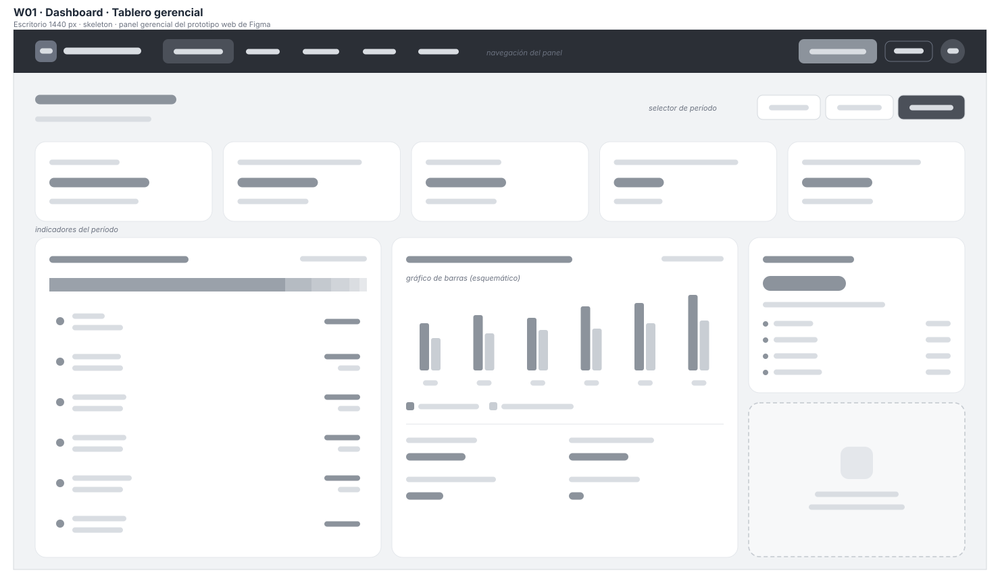

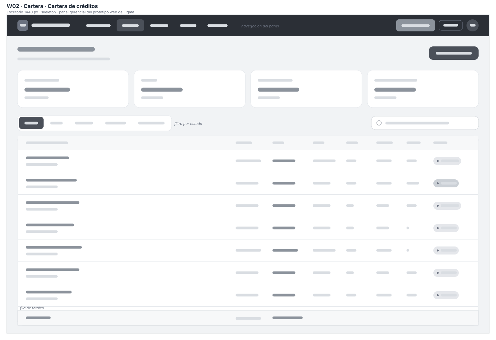

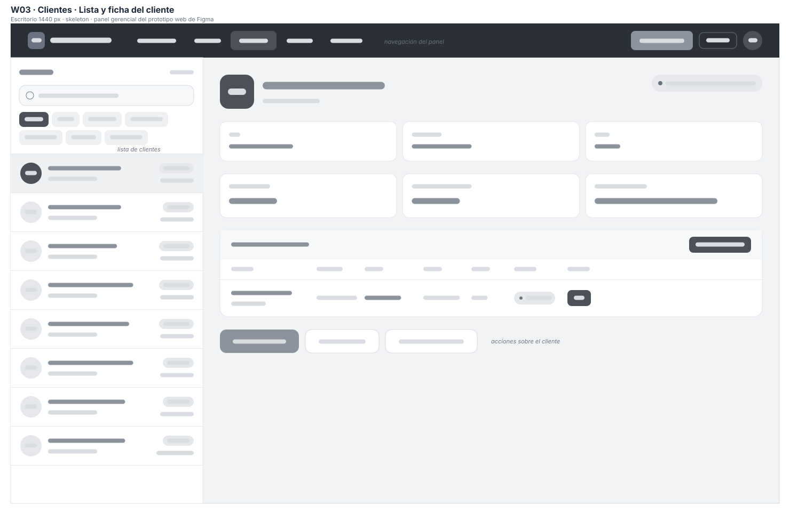

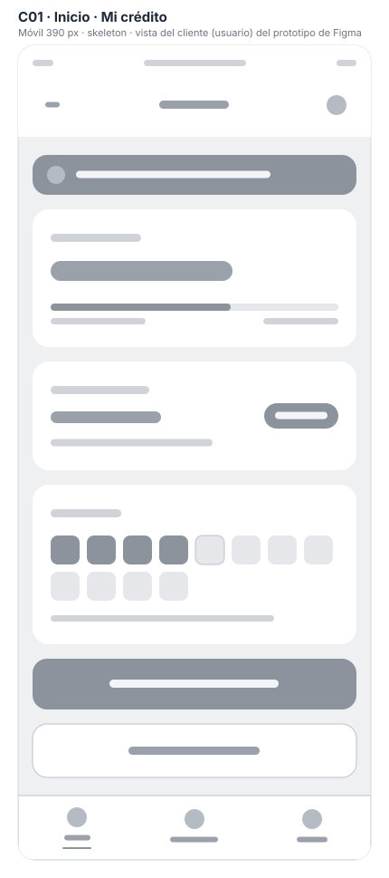 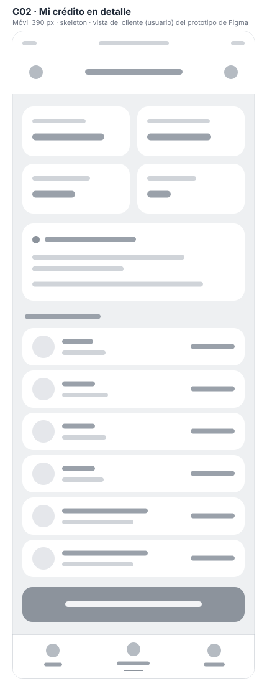

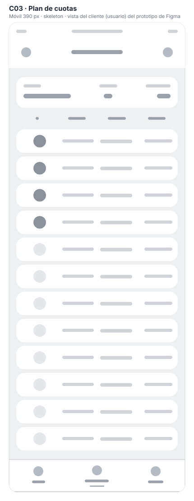 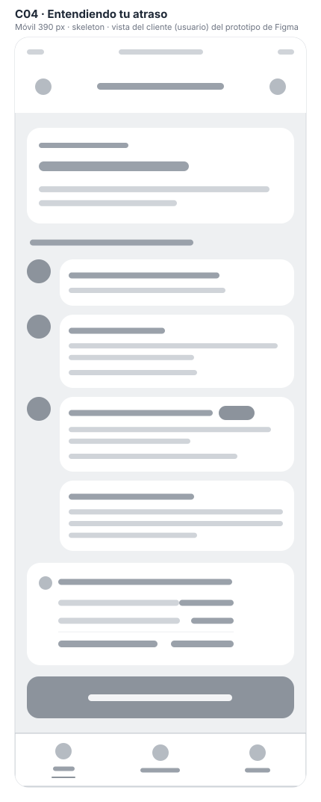

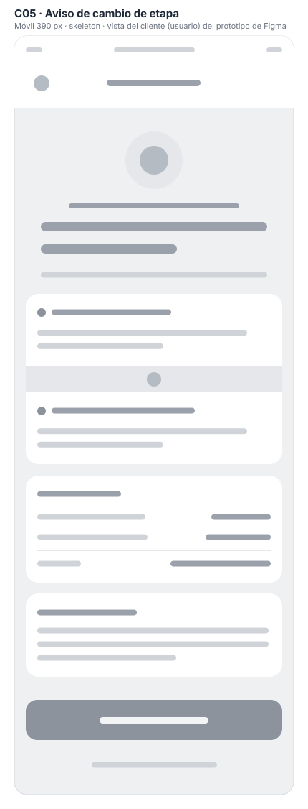 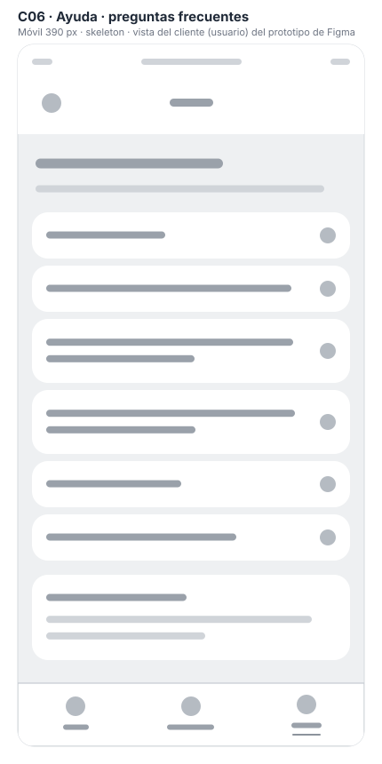

---

# Anexo B · Instrucciones de corrección para los prototipos de Figma

## B.1 Cómo usar este anexo

Los prototipos web y de cliente se hicieron con Figma Make, que acepta instrucciones escritas. Los textos de las dos secciones siguientes se pueden pegar tal cual en el chat de Figma Make de cada prototipo. Las correcciones del prototipo móvil se hacen a mano en Figma, con la tabla de la última sección. Todas las cifras salen del núcleo (sección 4.5).

## B.2 Instrucción para Figma Make (prototipo web)

```text
Corrige el prototipo con estas reglas y cifras exactas. No cambies el diseño visual salvo donde se indica.

1. Detalle de mora (caso M-3, 100 días de atraso):
   - La mora se calcula sobre el CAPITAL EN MORA de la cuota vencida (Q725.76), no sobre el saldo.
   - Tasas ANUALES por tramo, base Actual/360: Mora 1 (1–30 días) 18 %, Mora 2 (31–60) 24 %,
     Mora 3 (61–90) 30 %, Mora 4 (91–120) 36 %. Elimina el tramo "Vencido 5 % mensual".
   - Montos por tramo: Q10.89, Q14.52, Q18.14 y Q7.26 (10 días). Total: Q50.80.
   - Agrega la nota: "Cada tramo se muestra redondeado; el total se redondea una sola vez: Q50.80, no Q50.81."
   - Abre esta pantalla desde un crédito con 100 días de atraso (no desde el de 45 días).

2. Crédito de María García López (CRD-2024-0892), cuota 6 vencida hace 45 días:
   - "Exigible hoy" = Q1,050.04 (gasto Q25.00 + mora Q20.42 + interés Q187.77 + capital Q816.85).
   - En Registrar pago, el monto rápido "Cuota + mora" = Q1,050.04.
   - En Confirmar pago, la prelación es: Gastos de cobro Q25.00 · Interés moratorio Q20.42 ·
     Interés corriente Q187.77 · Abono a capital Q816.85. Total Q1,050.04.
   - En los créditos del tramo 31–60, "Mora acum." de María = Q20.42.
   - El gasto de cobro es siempre Q25.00 por cuota vencida y se genera una sola vez al llegar al día 31.

3. Plan de amortización y simulación (Q10,000, 3 % mensual, 12 meses):
   - Saldos después de las cuotas 8 a 11: Q3,734.28, Q2,841.69, Q1,922.32 y Q975.37.
   - Fila 12: cuota Q1,004.63, interés Q29.26, capital Q975.37, saldo Q0.00. Resalta la fila y conserva la nota del ajuste.

4. Solicitud de crédito:
   - En Confirmar solicitud cambia "autoriza el desembolso" por "envía la solicitud al comité".
   - Agrega después de la aprobación una pantalla "Confirmar desembolso" con: monto, plazo, cuota, tasa,
     total a pagar y la política de mora vigente (18/24/30/36 % anual); casilla de aceptación;
     botones "Desembolsar" y "Volver y corregir"; aviso de que la acción no se puede deshacer.

5. Datos de ejemplo coherentes en todas las pantallas:
   - Ana Lucía Morales: 31–60 días en todas las pantallas.
   - Pedro Alvarado Castro: un solo código, CRD-2024-0488; su cuota (Q12,000, 12 meses, 3 %) es Q1,205.55.
   - Andrés Lima Castillo (Q5,000, 12 meses, 3 %): cuota Q502.31.
   - José Domingo Pérez: los mismos días de atraso en Cartera y en los créditos del tramo.
   - Todas las fechas en septiembre de 2026.

6. Accesibilidad (WCAG 1.4.3 y 3.2.6):
   - Texto secundario #475569 en lugar de #90A1B9; "Ver →" en #334155; "23.4%" en #C2410C; verdes en #15803D.
   - Texto de las etiquetas "30d" del recorrido de la mora en #1E293B.
   - Un botón "?" de ayuda en el mismo lugar del encabezado de todas las pantallas.

7. Panel gerencial: agrega "Cierre mensual" junto a "Cierre diario", con el mismo flujo de verificación y congelamiento.
```

## B.3 Instrucción para Figma Make (prototipo de cliente)

```text
Corrige estas cifras sin cambiar el diseño. Fecha de referencia: 12 de septiembre de 2026 (42 días de atraso de la cuota 5
y 11 días de la cuota 6). El usuario tiene 4 de 12 cuotas pagadas.

1. Inicio y "Mi crédito en detalle": deuda y capital pendiente Q7,052.13; pagado Q2,947.87 de Q10,000.00.
2. "Entendiendo tu atraso":
   - Etapas: 1–30 días (18 % anual), 31–60 días (24 %), 61–90 días (30 %), 91–120 días (36 %).
   - Cargo de la cuota 5 (capital Q793.06): Q18.24. Cargo de la cuota 6 (capital Q816.85): Q4.49.
   - Gasto de gestión de cobro de la cuota 5 (pasó el día 30): Q25.00, una sola vez.
   - Cuotas atrasadas Q2,009.24 · Cargos por atraso Q47.73 · Total a pagar hoy Q2,056.97.
3. "Aviso importante": el cargo por día de la cuota 5 pasa de Q0.40 a Q0.53 (+Q0.13 al día) y al pasar
   el día 30 se cobró una sola vez un gasto de Q25.00.
4. Ayuda, "¿Cómo se calcula lo que debo de más por atraso?": "Se multiplica el capital de cada cuota
   vencida por la tasa anual de su etapa dividida entre 360, por cada día de atraso. Al pasar el día 30
   se suma un gasto de Q25.00 por cuota."
5. Fechas con meses en español: 01/abr/2026, 01/may/2026, etc.
```

## B.4 Correcciones del prototipo móvil (a mano en Figma)

| Pantalla | Corrección |
|---|---|
| P10 Detalle de mora | Igual que el punto 1 de la instrucción: tasas anuales, base Q725.76, total Q50.80 con la nota de redondeo |
| P10 · «Total a pagar hoy» | Cambiar Q6,469.31 por lo exigible de la cuota: Q1,047.76 (M-5) |
| P11 Registrar pago | Gastos de gestión Q25.00 (no Q150.00); formato «Q 10,000.00» mientras se escribe; atajos 1/2/3 cuotas conectados a su monto |
| P07 Solicitud enviada | Mantener el cliente elegido en el paso 1 (Carlos Martínez Ixcot) |
| P14 Sin señal | El folio PAG-251250 no cambia al sincronizar |
| P13 Pago aplicado | Agregar el saldo de capital restante |
| P09 Plan de amortización | Nota: «1 centavo más para que el saldo cierre exacto en Q0.00» |

---

# Anexo C · Formularios de la evaluación E5

## C.1 Protocolo de la evaluación individual

1. Cada integrante recorre **solo** los tres prototipos (sección 4.2), sin ver los hallazgos de los demás ni los del capítulo 6.
2. Registra cada problema en su formulario con la pantalla, la heurística, la severidad (0–4) y una **captura** como evidencia.
3. El equipo consolida: los hallazgos repetidos se unen y se anota quién los encontró; la severidad final es el promedio redondeado.
4. Se eligen al menos cinco hallazgos, se corrigen en Figma y se documenta el antes y el después.
5. Los resultados se llevan al design review de la Sesión 9 y se registra la decisión sobre cada comentario.

## C.2 Formulario de evaluación individual

Uno por integrante: Christopher Herrera · Erwin Ramírez · Gabriela Aguilar · Oliver Romero.

| Evaluador | Fecha | Prototipo y pantalla | Hallazgo | Heurística (1–10) | Severidad (0–4) | Captura (archivo) |
|---|---|---|---|---|---|---|
| | | | | | | |
| | | | | | | |
| | | | | | | |
| | | | | | | |

## C.3 Consolidado del equipo

| # | Hallazgo consolidado | Encontrado por | Severidad (promedio) | ¿Se corrige? |
|---|---|---|---|---|
| | | | | |
| | | | | |

## C.4 Correcciones con antes y después

| # | Hallazgo | Antes (captura) | Después (captura) | Qué se cambió | Responsable |
|---|---|---|---|---|---|
| 1 | H-01 / H-15 · Mora con tasas y base equivocadas | | | | |
| 2 | H-02 / H-16 · Total exigible y prelación | | | | |
| 3 | H-04 · Folio que cambia sin señal | | | | |
| 4 | H-18 · Cuota 12 y centavo del plan | | | | |
| 5 | H-19 · Contraste del texto secundario | | | | |

## C.5 Acta del design review (Sesión 9)

| Fecha | Participantes | Revisores |
|---|---|---|
| | | |

| # | Comentario recibido | Decisión (aceptado / rechazado) | Argumento | Cambio aplicado |
|---|---|---|---|---|
| | | | | |
| | | | | |
