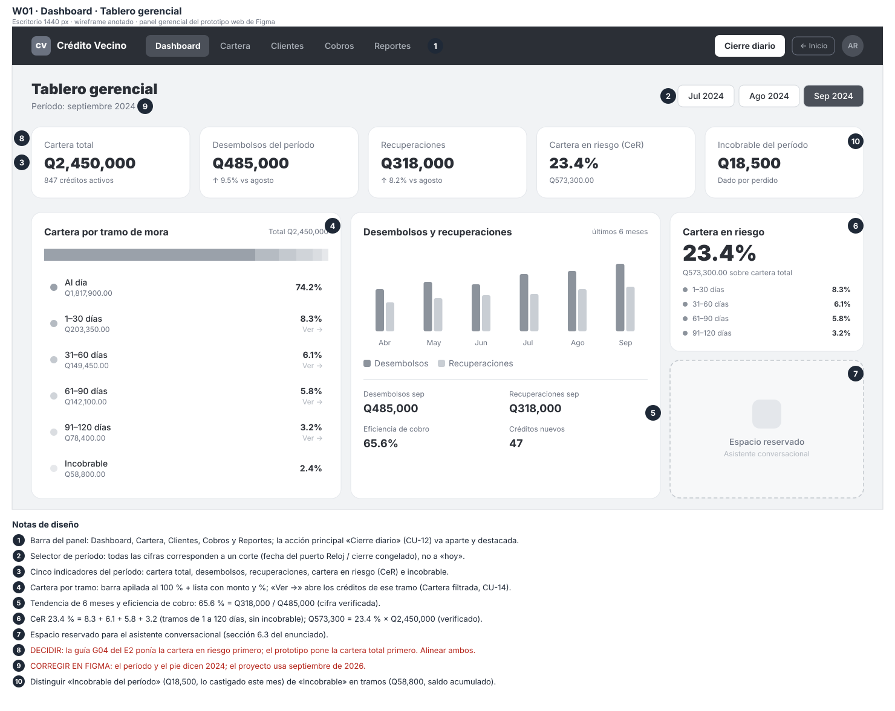
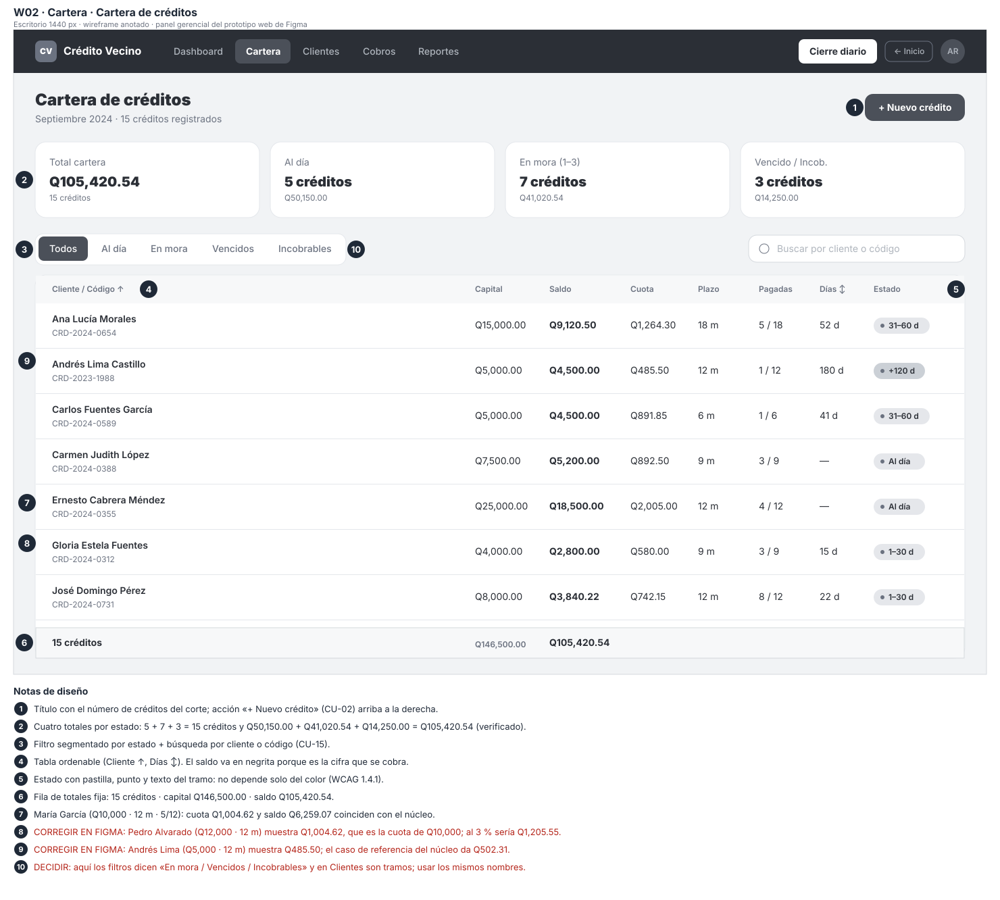
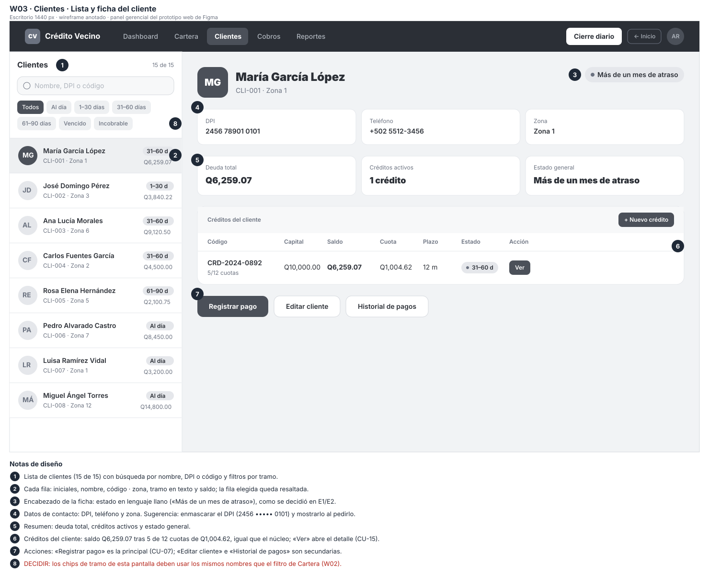

# Proyecto 2 · Panel gerencial web: skeletons y wireframes

Crédito Vecino, S. A. · Análisis de Sistemas II (037) · Complemento del E2 (arquitectura de información y wireframes)

**Prototipo web en Figma:** [Prototipo Microcréditos Web](https://www.figma.com/make/WHj2TK5IRg55X8JiaKXyvy/Prototipo-Microcr%25C3%25A9ditos-Web?code-node-id=0-6&p=f&fullscreen=1) → «Panel gerencial»

---

## 1. Qué agrega este documento

El documento final cubre las 14 pantallas móviles del prototipo de Figma (P01–P14) y las guías G01–G07. Faltaban las pantallas de **escritorio** del prototipo web: el panel gerencial con sus pestañas **Dashboard**, **Cartera** y **Clientes**. Este documento las agrega con el mismo método:

- **Skeleton:** solo bloques grises que indican dónde va cada elemento.
- **Wireframe anotado:** los mismos bloques con textos, cifras y notas numeradas que justifican cada decisión o señalan lo que hay que corregir.

Las posiciones y medidas se tomaron del prototipo web a **1440 px de ancho**, así que el skeleton, el wireframe y Figma tienen la misma disposición. Ambos niveles salen de una sola descripción (script `wireframes/generar_wireframes_web.py`).

| Código | Pestaña del panel | Pantalla | Casos de uso |
|---|---|---|---|
| **W01** | Dashboard | Tablero gerencial | CU-14 Consultar cartera en riesgo · CU-12 Generar cierre diario (botón «Cierre diario») |
| **W02** | Cartera | Cartera de créditos | CU-14 · CU-15 Consultar crédito · CU-02 Solicitar crédito («+ Nuevo crédito») |
| **W03** | Clientes | Lista y ficha del cliente | CU-15 · CU-07 Registrar pago · CU-01 Registrar cliente («Editar cliente») |

**Dónde va en el documento final:** en el capítulo 3 (E2), como una nueva sección **3.4.5 Panel gerencial web (W01–W03)**, después de las guías G01–G07. En la tabla 6.1 (sección 3.3.1) se agregan las tres filas de la tabla anterior.

**Relación con las guías del E2.** El Dashboard (W01) es la versión en Figma del tablero que la guía **G04** describía, y la Cartera filtrada por tramo (W02, desde «Ver →» del Dashboard) cumple el papel de la guía **G05**. Las guías se conservan como referencia de la jerarquía propuesta; las diferencias están en la sección 5.

---

## 2. W01 · Dashboard (tablero gerencial)

### 2.1 Skeleton

### 2.2 Wireframe anotado

### 2.3 Qué va en cada bloque

| Bloque | Contenido | Por qué está ahí |
|---|---|---|
| Barra del panel | Logo, pestañas Dashboard · Cartera · Clientes · Cobros · Reportes, botón «Cierre diario», «← Inicio» y usuario | La navegación es la misma en todo el panel; el cierre es la acción de mayor impacto y va separado |
| Encabezado | «Tablero gerencial», período y selector de mes (Jul · Ago · Sep) | Todas las cifras son de un corte, no de «hoy» (puerto `Reloj`) |
| Indicadores | Cartera total · Desembolsos · Recuperaciones · Cartera en riesgo · Incobrable del período | Lectura en cinco segundos del estado del mes |
| Cartera por tramo | Barra apilada al 100 % y lista con monto, % y «Ver →» | Muestra dónde está el riesgo y lleva a los créditos de cada tramo |
| Desembolsos y recuperaciones | Barras de 6 meses, totales del mes, eficiencia de cobro y créditos nuevos | Tendencia: ¿se recupera al ritmo que se presta? |
| Cartera en riesgo | 23.4 % grande y desglose por tramo | Es el indicador que exige el enunciado; se separa del resto |
| Asistente | Espacio reservado | Sección 6.3 del enunciado |

---

## 3. W02 · Cartera de créditos

### 3.1 Skeleton

### 3.2 Wireframe anotado

### 3.3 Qué va en cada bloque

| Bloque | Contenido | Por qué está ahí |
|---|---|---|
| Encabezado | «Cartera de créditos», período y número de créditos; botón «+ Nuevo crédito» | Contexto del listado y acción de originar |
| Totales por estado | Total cartera · Al día · En mora · Vencido / Incobrable, con número de créditos y monto | Resume la tabla antes de leerla |
| Filtros y búsqueda | Filtro segmentado por estado; búsqueda por cliente o código | Encontrar un crédito sin recorrer la lista |
| Tabla | Cliente y código, capital, **saldo**, cuota, plazo, cuotas pagadas, días de atraso y estado | El saldo va en negrita porque es lo que se cobra; se puede ordenar por cliente y por días |
| Estado | Pastilla con punto y el nombre del tramo | El estado no depende solo del color (WCAG 1.4.1) |
| Fila de totales | Número de créditos, capital total y saldo total | Cuadra con los totales de arriba |

---

## 4. W03 · Clientes (lista y ficha)

### 4.1 Skeleton

### 4.2 Wireframe anotado

### 4.3 Qué va en cada bloque

| Bloque | Contenido | Por qué está ahí |
|---|---|---|
| Lista (izquierda) | Contador, búsqueda por nombre, DPI o código, filtros por tramo y filas con iniciales, nombre, código · zona, tramo y saldo | Patrón lista-detalle: se cambia de cliente sin perder el contexto |
| Encabezado de la ficha | Avatar, nombre, código · zona y estado en lenguaje llano («Más de un mes de atraso») | El estado se entiende sin conocer los tramos (decisión del E1/E2) |
| Datos del cliente | DPI, teléfono y zona | Contacto para la gestión de cobro |
| Resumen | Deuda total, créditos activos y estado general | Lo que la gerencia necesita saber del cliente |
| Créditos del cliente | Tabla con código, capital, saldo, cuota, plazo, estado y «Ver»; botón «+ Nuevo crédito» | Historial y acceso al detalle de cada crédito |
| Acciones | «Registrar pago» (principal), «Editar cliente» e «Historial de pagos» | Una sola acción principal por pantalla |

---

## 5. Revisión de las cifras y ajustes pendientes

Las cifras se revisaron contra el núcleo y contra las otras pantallas. Los puntos marcados **CORREGIR EN FIGMA** o **DECIDIR** también aparecen en rojo en los wireframes anotados.

### 5.1 Cifras verificadas

| Pantalla | Cifra | Comprobación |
|---|---|---|
| W01 | Tramos 74.2 + 8.3 + 6.1 + 5.8 + 3.2 + 2.4 | Suman 100 % |
| W01 | Cartera en riesgo 23.4 % · Q573,300.00 | 8.3 + 6.1 + 5.8 + 3.2 = 23.4 %; 23.4 % × Q2,450,000 = Q573,300 |
| W01 | Eficiencia de cobro 65.6 % | Q318,000 / Q485,000 = 65.57 % |
| W02 | Totales por estado | 5 + 7 + 3 = 15 créditos; Q50,150.00 + Q41,020.54 + Q14,250.00 = Q105,420.54 |
| W02 · W03 | María García: Q10,000 a 12 meses, 5 de 12 cuotas | Cuota Q1,004.62 y saldo Q6,259.07: coinciden con el núcleo |

### 5.2 Ajustes pendientes

| # | Tipo | Pantalla | Qué ajustar |
|---|---|---|---|
| 1 | CORREGIR EN FIGMA | W02 | Pedro Alvarado (Q12,000 a 12 meses) muestra una cuota de Q1,004.62, que es la del crédito de Q10,000. Al 3 % mensual serían Q1,205.55 |
| 2 | CORREGIR EN FIGMA | W02 | Andrés Lima (Q5,000 a 12 meses) muestra Q485.50; el caso de referencia del núcleo da Q502.31. Si los créditos usan otra tasa, la tabla debe mostrarla; si no, las cuotas deben salir del núcleo (sección 6.2 del enunciado) |
| 3 | CORREGIR EN FIGMA | W01 · W02 | El período y el pie dicen 2024; el proyecto trabaja con septiembre de 2026 |
| 4 | DECIDIR | W01 | La guía G04 ponía la cartera en riesgo como primer indicador; el prototipo pone primero la cartera total. Elegir una y actualizar la sección 3.5 o el prototipo |
| 5 | DECIDIR | W02 · W03 | Cartera filtra por «En mora / Vencidos / Incobrables» y Clientes por tramos («1–30 días», «31–60 días»…). Usar los mismos nombres en ambas pestañas |
| 6 | Aclarar | W01 | «Incobrable del período» (Q18,500, lo castigado en el mes) y «Incobrable» en la cartera por tramo (Q58,800, saldo acumulado) son cosas distintas; conviene decirlo en la etiqueta |
| 7 | Sugerencia | W03 | Enmascarar el DPI (2456 ••••• 0101) y mostrarlo completo solo al pedirlo |
| 8 | Aclarar | W01 · W02 | El Dashboard muestra 847 créditos (Q2,450,000) y la Cartera 15 (Q105,420.54). Si la Cartera es una muestra, indicarlo; si no, deben coincidir |

---

## 6. Archivos

| Archivo | Contenido |
|---|---|
| `docs/proyecto2/wireframes/skeleton/W01-dashboard.svg`, `W02-cartera.svg`, `W03-clientes.svg` | Skeletons |
| `docs/proyecto2/wireframes/anotado/W01-dashboard.svg`, `W02-cartera.svg`, `W03-clientes.svg` | Wireframes anotados |
| `docs/proyecto2/wireframes/generar_wireframes_web.py` | Script que dibuja los dos niveles desde una sola descripción |

*Uso de IA declarado (sección 15):* las medidas se tomaron del prototipo web de Figma y los SVG se generaron con apoyo de un asistente de IA. La revisión de las cifras y las decisiones marcadas como DECIDIR son del equipo.
