# Proyecto 2 · Documentación completa

Sistema de Gestión de Microcrédito — Crédito Vecino, S. A. · Análisis de Sistemas II (037) · Universidad Mariano Gálvez de Guatemala.

Integrantes: Christopher David Herrera Pérez · Erwin Alberto Ramírez Racancoj · Gabriela Elízabeth Noemí Aguilar Vásquez · Oliver Fernando Romero Esquite.

Repositorio: https://github.com/ItsRomero/Proyecto1_Analisis

> Este archivo **se genera** uniendo los documentos individuales del repositorio, en el orden del índice. Si se corrige algo, se corrige en el documento de origen (indicado al inicio de cada parte) y se vuelve a generar este archivo.

## Índice

1. [Historial de commits y cambios](#parte-1)
2. [E1 · Investigación de usuario](#parte-2)
3. [E2 · Arquitectura de información y wireframes](#parte-3)
4. [E4 · Decisión móvil/web](#parte-4)
5. [E6 · Informe de impacto SOLID](#parte-5)
6. [E6 · ADR-004](#parte-6)
7. [E6 · Auditoría inicial](#parte-7)
8. [E6 · Evolución del núcleo](#parte-8)
9. [E6 · Validación final](#parte-9)
10. [Anexo A · Pruebas de mora escalonada](#parte-10)
11. [Anexo B · Instrumentos de investigación](#parte-11)


---

<a id="parte-1"></a>

# Parte 1 · Historial de commits y cambios

*Documento de origen: `docs/proyecto2/historial-cambios.md`*

## Historial de cambios del Proyecto 2

Este documento recorre **todos los commits** hechos después de la entrega del Proyecto 1 y, para cada uno, indica **qué agregó** y **si ya estaba documentado en algún `.md`**. Al final resume qué documentación faltaba y cómo se completó.

- **Base P1:** `8737d9b` (etiqueta `entrega-p1`, 26/08/2026).
- **Estado actual:** rama `docs/proyecto2-ux`, cuatro commits por encima de `main` (`13aa167`).
- **Total desde el P1:** 62 archivos, +4,951 / −108 líneas. De ellas, el último commit de documentación aporta 32 archivos, +2,413 / −232.

> **Sobre los hashes.** Los hashes de los commits 0 a 11 ya están en GitHub y son definitivos. Los commits 12 a 15 existen solo en la rama `docs/proyecto2-ux`; si se aplican con `git am`, Git les asigna un hash nuevo. En ese caso, búsquelos por su mensaje (`git log --oneline -3`).

Comandos para reproducir cualquier fila:

```bash
git log --reverse --format='%h %ad %an %s' --date=short entrega-p1..HEAD
git show --stat <hash>
git show --name-status --format= <hash>
```

### 1. Commits, uno por uno

La columna **"¿Documentado antes en .md?"** indica si el trabajo del commit aparecía en algún `.md` del repositorio **antes** del commit de documentación `16f983f`. Estados posibles:
- **Sí**: ya estaba documentado.
- **Parcial**: se mencionaba, pero con errores o incompleto.
- **No**: no aparecía en ningún `.md`.

| # | Commit | Fecha | Autor (según Git) | Mensaje | Qué agregó o cambió | ¿Documentado antes en .md? |
|---|---|---|---|---|---|---|
| 0 | `71a5179` | 2026-09-21 | Christopher Herrera | docs(p2): registrar auditoria y linea base verificada | **+** `docs/proyecto2/00-auditoria-inicial.md` (70 líneas): línea base P1, 7 archivos de dominio originales, 206 pruebas, creación de `entrega-p1` | **Sí**: es el propio documento (fase 0 en `03-validacion-final.md`) |
| 1 | `ec2a436` | 2026-09-21 | Christopher Herrera | feat(p2): introducir politicas de mora versionadas e inyectables | **+** `politica-mora/` (puerto `PoliticaMora`, plana, escalonada, retroactiva, catálogo y configuración), **+** `clasificacion-tramo.ts`, **+** `tests/politica-mora.test.ts`; **modifica** `calculadora-mora.ts` (+32/−19) | **Sí**: en `01-evolucion-nucleo.md` y en el informe SOLID (agregados en `958e70f`) |
| 2 | `d3b30f5` | 2026-09-21 | Christopher Herrera | feat(p2): generar gasto de cobro idempotente por cuota | **+** `gasto-gestion-cobro.ts` (CP-02, Q25.00 al día 31, una sola vez) y su prueba | **Sí**: en `01-evolucion-nucleo.md` |
| 3 | `5752b55` | 2026-09-21 | Christopher Herrera | feat(p2): corregir liquidacion devengo y cartera por tramo | **+** `devengo-interes.ts` (CP-04.2), **+** `cartera-por-tramo.ts` (CP-04.3), 3 pruebas nuevas; **modifica** `credito-estado.ts` (CP-04.1, `EN_MORA → CANCELADO`), 2 diagramas de estado, `FASE-20` y la matriz de trazabilidad | **Sí** |
| 4 | `0d6c1a9` | 2026-09-21 | ERAMR18 | test(p2): verificar contratos de politicas y regresion integrada | **+** `aplicacion/consultar-mora.ts`, **+** `contrato-politica.test.ts` (Liskov, 3 políticas), **+** `regresion-p1.test.ts`. Es el **corte del núcleo** medido en el informe SOLID | **Sí** |
| 5 | `958e70f` | 2026-09-21 | ERAMR18 | docs(p2): alinear contratos UML ADR y evidencia SOLID | **+** ADR-004, **+** `informe-impacto-solid.md`, **+** `01-evolucion-nucleo.md`, **+** `02-arquitectura-movil-offline.md`, 3 diagramas `.puml` nuevos y 3 modificados, contratos Zod/OpenAPI (`esquemas.ts`, `presentadores-p2.ts`, `openapi.yaml`), README | **Parcial**: el informe SOLID no seguía el Anexo D; `02-arquitectura` no tomaba una decisión y declaraba no tener investigación; `01-evolucion` afirmaba que CP-03 no existía en el enunciado |
| 6 | `8112e57` | 2026-09-21 | ERAMR18 | docs(p2): registrar validacion final desde instalacion limpia | **+** `03-validacion-final.md` (263 pruebas, 18 archivos, typecheck, límites); ajuste del informe SOLID | **Parcial**: repetía el error de CP-03 y decía "sin push, PR ni merge", que dejó de ser cierto con `183dc71` |
| 7 | `5e73d12` | 2026-09-22 | Christopher Herrera | feat: se generan comandos de test | **modifica** `package.json`: 6 scripts nuevos (`test:mora`, `test:idempotencia`, `test:coexistencia`, `test:cp04`, `test:cartera`, `test:invariantes`) | **No** en su momento; lo documentó después `13aa167` en el README |
| 8 | `9e06c37` | 2026-09-22 | Elízabeth | Actualización de pruebas | **+** `docs/proyecto2/04-pruebas-unitarias-mora-escalonada` (922 líneas, **sin extensión `.md`**, por lo que GitHub no lo mostraba con formato); **+** `docs/verificacion-solid-informe-impacto.md` (121 líneas, duplicaba y corregía parte del informe SOLID) | **Parcial**: el contenido existía, pero sin extensión y en un segundo informe SOLID paralelo |
| 9 | `8e421a6` | 2026-09-22 | Elízabeth | Merge branch 'feat/proyecto-2-evolucion-nucleo' … | Merge de la rama remota con la local; solo integra `package.json` (6 líneas del commit 7) | **No**: ningún `.md` mencionaba el merge |
| 10 | `183dc71` | 2026-09-22 | Oliver Romero | Merge pull request #1 … | Integra toda la rama P2 en `main`: 42 archivos, +2,751 / −108 | **No**: `03-validacion-final.md` seguía diciendo "sin PR ni merge" |
| 11 | `13aa167` | 2026-09-22 | Erwin | Actualizacion del README | **modifica** `README.md`: sección "Comandos de pruebas por tema" (tabla de los 6 scripts con pruebas/archivos) y enlace a la documentación de pruebas | **Sí**: documenta el commit 7 |
| 12 | `16f983f` | 2026-09-23 | Oliver Romero (con apoyo de IA, declarado) | docs(p2): documentar E1, E2 y E4 y consolidar el informe SOLID | Ver la sección 2 | Es el commit que completa la documentación |
| 13 | `4ba9e55` | 2026-09-23 | Oliver Romero (con apoyo de IA, declarado) | docs(p2): agregar historial de cambios y documento consolidado | **+** `historial-cambios.md` (este archivo), **+** `documentacion-completa.md` | — |
| 14 | `00709f9` | 2026-09-23 | Oliver Romero (con apoyo de IA, declarado) | docs(p2): documento de entrega con enlace de Figma y revisión del prototipo | **+** `P2-documento-entrega.md`: lista de verificación contra el enunciado, historia del repositorio narrada, revisión del prototipo de Figma y evaluación E5 preliminar; enlace de Figma en el README y en el índice | — |
| 15 | *(este commit)* | 2026-09-23 | Oliver Romero (con apoyo de IA, declarado) | docs(p2): unificar el documento de entrega | `P2-documento-entrega.md` pasa a generarse desde `fuente-documento-entrega.md` e incluye completos E1, E2, E4 y el informe SOLID, más E3, E5, la tabla de commits, el reparto y la lista de verificación | — |

**Registro por fases.** `e6-04-validacion-final.md` registra las fases 0 a 6 (commits 0 a 6). Los commits 7 a 15 solo quedan registrados en esta tabla.

### 2. Qué agregó el commit de documentación `16f983f`

#### 2.1 Documentación nueva (no existía en ningún `.md`)

| Entregable | Archivo nuevo | Qué contiene que antes no estaba |
|---|---|---|
| E1 | `e1-investigacion-usuario.md` | 3 personas con la plantilla del Anexo A y la fuente de cada rasgo (enunciado, fuentes documentadas, núcleo o hipótesis). Journey map de 10 etapas + 2 variantes con puntos de dolor concretos y cifras del núcleo. **4 momentos críticos** (MC-1 a MC-4). El cuarto es el **cambio de tramo**: tabla día 15 → 91 (Q1,015.51 → Q1,040.99 al pasar al día 31) y respuesta a "¿antes o después? ¿por qué canal?" |
| E1 | `e1-instrumentos-investigacion.md` | Guías de entrevista (asesor, cliente, gerencia), encuesta de 20 preguntas, observación contextual y plan de análisis. Existían solo en `.docx` |
| E2 | `e2-arquitectura-informacion.md` | Mapa de navegación (Mermaid + SVG). **Tabla 6.1 completa**, con la nota `EvaluarSolicitud` = `EvaluarCredito` + `DecidirSolicitud`. Trazabilidad de las pantallas de apoyo. Justificación de la jerarquía del tablero. Cinco señales visuales que separan cartera en mora de cartera en riesgo. Lugar reservado para el asistente (6.3) |
| E2 | `wireframes/W01…W15.svg`, `mapa-navegacion.svg`, `generar_wireframes.py` | 15 wireframes de baja fidelidad con anotaciones y cifras del núcleo. Por ejemplo, W08 muestra el caso M-3 con la nota de redondeo Q50.80 frente a Q50.81 |
| E4 | `e4-decision-movil-web.md` (reemplaza a `02-arquitectura-movil-offline.md`) | **Decisión firme: PWA única.** Comparación entre nativa, híbrida y PWA; riesgos y condición de revisión (Capacitor). Transformación del tablero entre teléfono y escritorio, y qué se sacrifica. Flujo sin conexión con `Idempotency-Key` (201 / 200 replay / 409). Ejemplo del puerto Reloj: pagar el día 30 y sincronizar el 31 no cobra los Q25. Hallazgo: el TTL de 24 h del OpenAPI es insuficiente |
| Índice | `docs/proyecto2/README.md` | Índice por entregable (E1 a E6) |
| IA | `README.md` §18 | Declaración de uso de IA del Proyecto 2 (sección 15 del enunciado) |

#### 2.2 Documentación que se corrigió o reorganizó

| Archivo | Antes | Después |
|---|---|---|
| `docs/informe-impacto-solid.md` | Texto libre; no seguía el Anexo D; datos repartidos en 2 informes | Estructura del **Anexo D** en 6 secciones. Tabla de las **6 métricas** de 8.1 con el `git diff --stat`. Desglose de las 360 líneas netas (la política ocupa 109). Una fila por principio respondiendo la pregunta de 8.2. GRASP. Fricciones con causa y rediseño. Pruebas obligatorias de E6, una por una. Conclusión y "qué haríamos distinto" |
| `docs/verificacion-solid-informe-impacto.md` | Segundo informe SOLID paralelo | **Eliminado**; su contenido (métricas de `src/`, corrección de 13 a 12 atrasos, 288 combinaciones) pasó al informe principal |
| `00…04` de `docs/proyecto2/` | Numeración sin relación con los entregables; `04-…` sin extensión `.md` | Renombrados `e6-01` a `e6-04` (y `.md` agregado); todos los enlaces del repo actualizados |
| `e6-02-evolucion-nucleo.md`, `e6-04-validacion-final.md`, `matriz-trazabilidad.md` | "El enunciado no define CP-03" | **Corregido**: CP-03 es la sección 7.6, "Coexistencia de políticas" (Q21.77 plana frente a Q18.14 escalonada) |
| `e6-04-validacion-final.md` | "Commits locales, sin push, PR ni merge"; pendientes E1/E2/E4 sin actualizar | Refleja el PR #1 (`183dc71`) y la necesidad de publicar `entrega-p1`; pendientes actualizados |
| `README.md` | Enlaces a los nombres viejos | Enlaces a E1, E2, E4, E6 y al índice |

### 3. Lo que sigue sin estar en el repositorio

| Pendiente | Entregable | Responsable |
|---|---|---|
| Entrevistas u observación reales; actualizar los rasgos marcados HIP | E1 | Equipo |
| Prototipo navegable en Figma y su enlace público | E3 | Equipo |
| 8 hallazgos Nielsen, auditoría WCAG 2.2, 5 correcciones con antes/después, design review | E5 | Equipo |
| Portada, carnés, tabla de reparto de trabajo (12.1) y PDF `P2_UXUI_NoDeGrupo.pdf` | E7 | Equipo |
| Publicar las etiquetas: `git push origin entrega-p1` y crear `entrega-p2` | E6 | Quien tenga permisos en el repo |
| Volver a ejecutar `npm run verify` sobre el commit de entrega | E6 | Equipo (no se pudo en la sesión que redactó estos documentos) |
| Alinear los IDs del fixture de `cartera-por-tramo.test.ts` (C-001…) con los del enunciado (C-003…) | E6 | Opcional |
| Ampliar el TTL de la `Idempotency-Key` más allá de 24 h | Proyecto Final | Opcional, anotado en E4 |


---

<a id="parte-2"></a>

# Parte 2 · E1 · Investigación de usuario

*Documento de origen: `docs/proyecto2/e1-investigacion-usuario.md`*

## E1 · Investigación de usuario

Proyecto 2 · Crédito Vecino, S. A. · Análisis de Sistemas II (037)

Este documento responde al entregable E1 del enunciado (sección 9): personas, journey map del flujo principal y momentos críticos donde un error de interfaz produce un error de dinero, incluido el momento en que el cliente descubre que su mora subió de tramo.

### 1. Método y estado de la evidencia

La investigación combina tres fuentes, y cada afirmación de este documento indica de cuál proviene:

| Código | Tipo de fuente | Qué aporta | Estado |
|---|---|---|---|
| **ENU** | Enunciado P2, sección 3 (contexto de los tres perfiles) | Condiciones de trabajo del asesor, necesidades del cliente y de gerencia | Requisito del caso |
| **DOC** | Fuentes documentadas: SIB (ENIF 2024-2027), Banco Mundial (Global Findex 2025, panorama Guatemala), DataReportal *Digital 2024: Guatemala*, IICA/BID sobre conectividad rural | Contexto nacional de inclusión financiera, uso de teléfono e internet y brecha territorial | Documentado |
| **NÚC** | Núcleo de cálculo del repositorio (`src/dominio`) y sus pruebas | Cifras exactas con las que se construyen los escenarios (Q1,004.62, Q18.14, 7.00 %, etc.) | Verificado por `npm test` |
| **HIP** | Hipótesis de diseño derivadas de las anteriores | Conductas concretas que el equipo espera encontrar en campo | **Pendiente de validar** con los instrumentos de `e1-instrumentos-investigacion.md` |

Hallazgos del contexto documentado que sustentan las personas:

- **Hay muchos teléfonos, pero no tanta internet.** En enero de 2024 Guatemala tenía 20.65 millones de conexiones móviles (113.3 % de la población), pero solo el 60.3 % de la población usaba internet (DataReportal, *Digital 2024: Guatemala*). *Implicación:* el cliente casi siempre tiene un teléfono, pero no se puede suponer que tenga datos móviles. Los avisos al cliente no pueden depender solo de una app.
- **La conectividad rural es baja.** El IICA, con apoyo del BID y Microsoft, ubica a Guatemala entre los nueve países de América Latina y el Caribe con menor conectividad rural. También señala que una alta penetración de teléfonos móviles no equivale a conectividad, porque esta se concentra en zonas urbanas (Prensa Libre, 2020). *Implicación:* el asesor que visita negocios fuera de la cabecera trabajará sin señal durante parte de su ruta (ENU lo confirma: "señal intermitente o nula").
- **Digitalizar es una prioridad nacional.** La Estrategia Nacional de Inclusión Financiera 2024-2027 de la SIB prioriza el uso de canales digitales en los servicios financieros. *Implicación:* la digitalización del cobro en campo está alineada con la política pública, pero debe incluir a clientes con poca experiencia digital.

> **Límite declarado.** A la fecha de este documento el equipo **no ha aplicado todavía** las entrevistas ni la observación de campo. Los instrumentos están listos en [e1-instrumentos-investigacion.md](e1-instrumentos-investigacion.md). Las personas son **provisionales**: sus rasgos marcados como HIP deben confirmarse o corregirse antes de cerrar el prototipo de alta fidelidad (E3). No presentamos hipótesis como hallazgos de campo.

### 2. Personas

Las tres personas siguen la plantilla del Anexo A del enunciado. La edad no se usa como indicador de habilidad digital.

#### 2.1 Mariela López, asesora de crédito en campo

| Campo | Contenido | Fuente |
|---|---|---|
| Rol y contexto | Asesora de Crédito Vecino. Visita entre 8 y 12 clientes al día en sus negocios o casas, origina solicitudes y cobra cuotas atrasadas. Trabaja de pie, a menudo bajo el sol, y con una mano ocupada (cartapacio, efectivo o documentos del cliente). | ENU |
| Dispositivo | Teléfono Android de gama media proporcionado por la empresa: pantalla de unas 6", poca memoria libre y batería que debe durar toda la jornada. | ENU · HIP (modelo concreto) |
| Conectividad | Intermitente o nula en parte de la ruta. Buena señal solo en la oficina y en la cabecera municipal. | ENU · DOC |
| Iluminación | Luz solar directa: los grises claros y los textos pequeños no se leen. | ENU |
| Manos libres | Opera con el pulgar de una sola mano durante la visita; teclea poco y mal cuando está de pie. | ENU |
| Alfabetización digital | Operativa: usa WhatsApp, cámara y apps bancarias. No conoce el concepto de "sincronización" ni tiene por qué conocerlo. | HIP |
| Objetivos (en sus palabras) | "Terminar la visita sin volver a pedirle nada al cliente." · "Saber que el pago quedó registrado una sola vez." · "Poder explicarle al cliente a dónde se fue su dinero." | ENU · HIP |
| Frustraciones actuales (hojas de cálculo) | Anota el pago en papel y lo transcribe al volver a la oficina, a veces al día siguiente; la fecha que queda registrada es la de la transcripción, no la del pago. Cuando la hoja compartida no abre sin internet, lleva una copia impresa que ya está desactualizada. | HIP |
| Relación con la mora | Debe explicar por qué un cliente debe más este mes. Con la política escalonada tiene que explicar tramos, no una sola tasa. | ENU |
| Cita representativa | *"Si la app me hace escribir el DPI dos veces, el cliente piensa que no sé lo que hago."* | HIP (cita a validar en entrevista) |

**Qué exige a la interfaz:** diseño mobile-first con objetivos táctiles de 48 px o más (por encima del mínimo de 24 px de WCAG 2.5.8), alto contraste y un modo de trabajo sin conexión con estado visible ("Guardado en el teléfono · pendiente de enviar"). Montos siempre con el prefijo **Q** y separador de miles, y el menor tecleo posible.

#### 2.2 Carlos Chávez, cliente de microcrédito

| Campo | Contenido | Fuente |
|---|---|---|
| Rol y contexto | Tiene una tienda de barrio. Pidió **Q10,000 a 12 meses** para surtir inventario: es el caso de referencia del P1, con una cuota de **Q1,004.62** y la cuota 12 de **Q1,004.63**. | ENU · NÚC |
| Dispositivo | Teléfono propio con saldo prepago. A veces tiene datos y a veces no; los SMS siempre le llegan. | DOC · HIP |
| Conectividad | Variable; en su zona la señal de datos es débil dentro del local. | DOC |
| Iluminación y entorno | Atiende la tienda mientras habla con la asesora; lo interrumpen clientes. | HIP |
| Alfabetización digital | Baja a media: lee mensajes y usa WhatsApp, pero no navega por menús complejos ni entiende "TNA", "Actual/360" ni "prelación". | ENU · HIP |
| Objetivos (en sus palabras) | "Saber cuánto debo, cuándo pago y cuánto me falta." · "Que me avisen antes, no cuando ya me cobraron más." · "Tener un papel o un mensaje que diga que ya pagué." | ENU |
| Frustraciones actuales | Recibe un solo número ("debe Q1,040.99") sin saber por qué subió. Desconfía de lo que no entiende y lo percibe como una multa arbitraria, exactamente lo que el Acta 09-2026 del comité quiere evitar. | ENU (sección 7.1) · HIP |
| Relación con la mora | Sabe que atrasarse cuesta más, pero no sabe **cuánto por día** ni que al día 31 se agrega un **gasto de gestión de cobro de Q25.00**. | ENU · NÚC |
| Cita representativa | *"Si me explican, pago; si me cae de sorpresa, siento que me están robando."* | HIP |

**Qué exige a la interfaz:** lenguaje llano ("lleva 45 días de atraso", no "Mora 2"), cifras que no se puedan malinterpretar, desglose progresivo (primero el total y, al tocarlo, los tramos) y avisos **antes** de cada cambio de tramo por un canal que no dependa de tener datos (SMS).

#### 2.3 Andrea Morales, gerente de cartera y miembro del comité

| Campo | Contenido | Fuente |
|---|---|---|
| Rol y contexto | Gerente de cartera; integra el comité de crédito. Revisa indicadores a diario y presenta el cierre mensual al comité. | ENU |
| Dispositivo | Computadora de escritorio con monitor grande en oficina; consulta rápida desde el teléfono cuando está en reunión o fuera de la oficina. | ENU · HIP (uso móvil) |
| Conectividad | Estable en oficina. | ENU |
| Alfabetización digital | Alta en hojas de cálculo; alta alfabetización financiera. | HIP |
| Objetivos (en sus palabras) | "En 30 segundos saber si la cartera se está deteriorando." · "Pasar del porcentaje a los créditos concretos." · "Confiar en que el cierre no se duplicó." | ENU · HIP |
| Frustraciones actuales | Las hojas de cálculo rotulan como "mora" tanto la cartera con cualquier atraso como la cartera en riesgo. Cuando se da de baja un crédito, el indicador de riesgo baja (7.00 % → 6.06 %) y parece una mejora aunque no se cobró nada. | ENU (sección 7.8) · NÚC |
| Relación con la mora | Decide con cartera en mora (21.75 %), cartera en riesgo (7.00 %), el desglose por tramo e incobrables del período. | ENU · NÚC |
| Cita representativa | *"No me muestre un número sin decirme qué número es."* | HIP |

**Qué exige a la interfaz:** diseño responsivo pensado para escritorio, densidad alta pero con jerarquía clara, **rótulos y definiciones distintos** para cada indicador, lo dado por incobrable junto a la cartera en riesgo, y navegación de lo general al detalle del crédito (drill-down).

### 3. Journey map del flujo principal: de la solicitud a la primera cuota

Escenario: Carlos solicita Q10,000 a 12 meses con Mariela y paga su primera cuota de Q1,004.62. En la variante con atraso (etapas 9b y 9c), la cuota vencida usa el capital de la cuota 2 del caso de referencia (Q725.76), igual que los oráculos M-1 a M-5 del enunciado. Escala emocional: −2 muy negativa … +2 muy positiva.

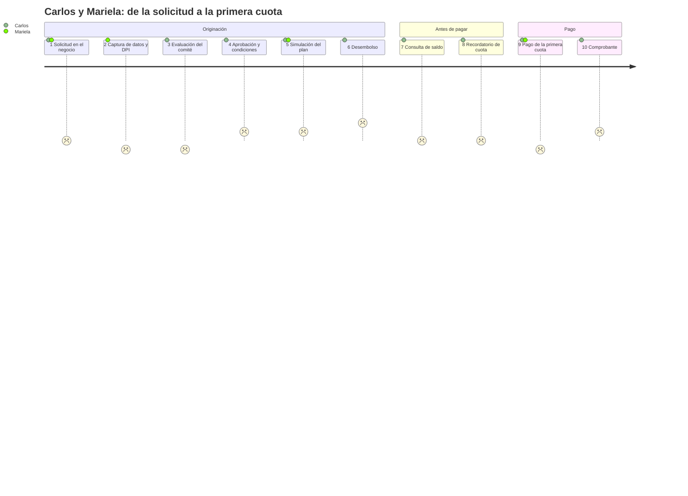

| # | Etapa | Actor | Acción | Emoción | Punto de dolor concreto | Oportunidad de diseño | Pantalla | Fuente |
|---|---|---|---|---|---|---|---|---|
| 1 | Solicitud | Carlos, Mariela | Carlos dice cuánto necesita y en cuánto tiempo | 0: expectativa y duda | Mariela escribe "10000" en un campo sin formato; un cero de más (Q100,000) o de menos (Q1,000) no se detecta porque el campo no muestra separador de miles ni los límites Q1,000–Q25,000. | Campo con prefijo Q, formato en vivo "Q10,000.00", rango visible y validación inmediata; plazo con botones de 3 a 24 meses, no teclado. | Solicitud de crédito | ENU · HIP |
| 2 | Captura | Mariela | Registra DPI, datos del negocio y foto | −1: prisa | La señal se cae a mitad del formulario; al reintentar, la sesión expiró y Mariela debe **recapturar el DPI y los datos del negocio** frente al cliente. | Borrador guardado en el teléfono campo por campo; la sesión no expira mientras hay un borrador; aviso "Guardado en el teléfono". Cumple WCAG 3.3.7 (no pedir de nuevo un dato ya capturado). | Alta de cliente | ENU · HIP |
| 3 | Evaluación | Comité, Carlos | El comité revisa la solicitud | −1: incertidumbre | Carlos no sabe si su solicitud "está en algún lado". Mariela no puede decirle en qué estado está porque la hoja no guarda el historial. | Estado visible (Solicitado → En evaluación → Aprobado) consultable por la asesora; la bandeja del comité muestra el motivo si se rechaza. | Bandeja del comité | ENU · NÚC (estados) |
| 4 | Aprobación | Carlos | Recibe la noticia | +1: alivio | Le comunican "aprobado" sin la cuota ni el costo total; Carlos acepta sin saber que pagará **Q2,055.45 de interés**. | Resumen con monto, plazo, tasa en lenguaje llano ("3 % al mes"), cuota y total a pagar antes de confirmar. | Solicitud → simulación | NÚC |
| 5 | Simulación del plan | Carlos, Mariela | Revisan las 12 cuotas | +1: control | La cuota 12 dice **Q1,004.63** y Carlos cree que hay un error de un centavo. Si la pantalla la oculta o la iguala a Q1,004.62, el plan mostrado no coincide con el cobrado. | Plan con las 12 filas del núcleo y una nota junto a la cuota 12: "1 centavo más para cerrar el saldo exacto". | Plan de amortización | NÚC |
| 6 | Desembolso | Encargado, Carlos | Se confirma y se entrega el dinero | +2: alegría | Un doble toque en "Desembolsar" con la señal lenta puede generar **dos desembolsos** si la operación no es idempotente. | Pantalla de revisión y confirmación explícita (WCAG 3.3.4), botón deshabilitado tras el primer toque y clave de operación única. | Confirmación de desembolso | ENU · NÚC |
| 7 | Seguimiento | Carlos | Pregunta cuánto debe | 0 | La cifra que ve Mariela sin señal es de ayer y no dice de qué fecha es; Carlos recibe un saldo desactualizado. | Todo saldo muestra su fecha de corte: "Saldo al 23/09/2026". Sin conexión se rotula como "calculado con datos del 22/09". | Detalle del crédito | ENU · HIP |
| 8 | Recordatorio | Carlos | Recibe aviso de su primera cuota | 0 | El aviso llega por una app que Carlos no abre sin datos, o llega **el mismo día** del vencimiento. | SMS 3 días antes y el día del vencimiento con monto y fecha; canal a validar con la encuesta (pregunta 12). | (Notificación) | DOC · HIP |
| 9 | Pago | Mariela, Carlos | Mariela recibe Q1,004.62 y lo registra | −1: tensión | Mariela registra el pago sin señal. La app no dice si se envió; Mariela lo vuelve a intentar y teme **cobrarlo dos veces**. | Estado "Pendiente de enviar · se enviará solo al tener señal", misma clave de idempotencia en cada reintento y comprobante provisional. | Registro de pago en campo | ENU · NÚC |
| 9b | (Variante) Pago con atraso de 45 días | Mariela, Carlos | La cuota vencida suma Q1,047.76 | −2: sorpresa | Carlos esperaba pagar Q1,004.62 y le piden **Q1,047.76** sin explicación: Q25.00 de gasto + Q18.14 de mora + Q278.86 de interés + Q725.76 de capital. | Desglose en el orden de la prelación, con "¿por qué?" en cada concepto. | Detalle de la mora | NÚC (M-5) |
| 9c | (Variante) Cambio de tramo | Carlos | Pasa del día 30 al 31 | −2: enojo | En un día, el total de la cuota pasa de **Q1,015.51 a Q1,040.99** (+Q25.48) y Carlos se entera en la visita de cobro, cuando ya ocurrió. | Momento crítico MC-4 (sección 4). | Detalle de la mora + aviso | NÚC · HIP |
| 10 | Comprobante | Carlos | Recibe comprobante | +1: confianza | Un comprobante que solo dice "Pagado Q1,004.62" no permite comprobar cuánto fue a interés (Q300.00) y cuánto a capital (Q704.62). | Comprobante con la prelación aplicada y el saldo resultante (Q9,295.38), enviado por SMS o impreso. | Registro de pago → comprobante | NÚC |

Cifras de la primera cuota según el núcleo: interés Q300.00 + capital Q704.62 = Q1,004.62; el saldo pasa de Q10,000.00 a Q9,295.38.

### 4. Momentos críticos: error de interfaz → error de dinero

Cada momento indica la causa en la interfaz, la consecuencia monetaria con cifras del núcleo y el control de diseño que la previene.

| ID | Momento | Error de interfaz | Consecuencia en dinero | Prevención (diseño) | Recuperación |
|---|---|---|---|---|---|
| **MC-1** | Captura del monto en la solicitud | Campo numérico sin formato ni límites; se teclea "1000" en lugar de "10000" o se escribe un punto decimal como separador de miles | Un crédito de Q1,000 en vez de Q10,000 cambia **las 12 cuotas** (de Q1,004.62 a unos Q100.46) y el contrato firmado no refleja lo solicitado | Prefijo Q, formato en vivo, rango Q1,000–Q25,000 visible, resumen "Diez mil quetzales" en letras antes de confirmar | Botón "Editar" en la pantalla de revisión; nada se envía sin confirmación (WCAG 3.3.4) |
| **MC-2** | Registro de un pago sin señal | La app no muestra el estado del envío y Mariela toca "Registrar" otra vez o captura el pago de nuevo | **Doble cobro**: Q1,004.62 × 2; el cliente pierde la confianza | Cola local con **la misma Idempotency-Key** en cada reintento; estado visible Pendiente / Enviado / Confirmado; el botón se bloquea tras el primer toque (ver E4) | Si el servidor responde que la clave ya existe, se muestra el pago original y no se crea otro |
| **MC-3** | Lectura del tablero gerencial | Rotular igual "cartera en mora" (21.75 %) y "cartera en riesgo" (7.00 %), o mostrar solo uno sin decir cuál es | El comité decide sobre el número equivocado: provisiona o restringe la colocación por 21.75 % cuando el riesgo real es 7.00 %, o celebra un 6.06 % que solo bajó por la baja de C-005 | Dos tarjetas con nombre, definición y forma distintos; incobrables del período junto al riesgo (ver E2, sección 5) | Enlace "¿Qué incluye?" en cada indicador, que abre el desglose por tramo |
| **MC-4** | **El cliente descubre que su mora subió de tramo** | Sin aviso previo: el cliente se entera después y por la persona que le cobra | +Q25.48 en un día (Q1,015.51 → Q1,040.99), percibidos como multa arbitraria; más probabilidad de disputa y de dejar de pagar | Aviso preventivo por SMS y detalle por tramos (ver 4.1) | La pantalla de detalle de la mora permite verificar tramo por tramo |

#### 4.1 MC-4 en detalle: el cambio de tramo

El enunciado pregunta: *¿Se enteró antes o después? ¿Por qué canal?*

**Situación actual (con hojas de cálculo):** Carlos se entera **después** y **en persona**. La política escalonada genera el gasto de gestión de cobro precisamente al entrar en Mora 2 (día 31), que es también cuando "se activa la gestión de cobro en campo" (sección 7.2). Por eso el primer contacto de Carlos con el nuevo tramo es la visita de Mariela, que llega a cobrar un total que ya subió.

| Día de atraso de la cuota 2 (capital Q725.76) | Tramo | Mora acumulada | Gasto de cobro | Total de la cuota (gasto + mora + Q278.86 + Q725.76) |
|---|---|---|---|---|
| 15 | Mora 1 | Q5.44 | Q0.00 | Q1,010.06 |
| 28 | Mora 1 | Q10.16 | Q0.00 | Q1,014.78 |
| 30 | Mora 1 | Q10.89 | Q0.00 | Q1,015.51 |
| **31** | **Mora 2** | **Q11.37** | **Q25.00** | **Q1,040.99** |
| 45 | Mora 2 | Q18.14 | Q25.00 | Q1,047.76 |
| 60 | Mora 2 | Q25.40 | Q25.00 | Q1,055.02 |
| 61 | Mora 3 | Q26.01 | Q25.00 | Q1,055.63 |
| 91 | Vencido | Q44.27 | Q25.00 | Q1,073.89 |

Además, en los días 1 a 30 la mora crece Q0.36 por día y en los días 31 a 60 crece Q0.48 por día. Esto responde a la pregunta del objetivo de aprendizaje: *por qué su mora creció más rápido este mes que el anterior*.

**Situación propuesta: Carlos se entera antes, por dos canales.**

| Cuándo | Canal | Mensaje (lenguaje llano, a validar con clientes) | Por qué ese canal |
|---|---|---|---|
| Día 28 de atraso | **SMS** | "Crédito Vecino: su cuota 2 lleva 28 días de atraso. Si paga en los próximos 2 días debe Q1,015.51. Después se agrega un cargo de visita de cobro de Q25.00." | Llega sin datos móviles; hay más conexiones móviles que usuarios de internet (DOC) |
| Día 31 (al entrar en Mora 2) | **SMS** + visita de la asesora | "Su cuota 2 pasó a más de 30 días de atraso. Ahora debe Q1,040.99. Pida a su asesora el detalle." | Confirma el cambio; el detalle se explica en persona |
| En la visita | **Pantalla "Detalle de la mora"**, en el teléfono de la asesora | Desglose por tramos recorridos: "30 días a 18 % al año → Q10.89 · 1 día a 24 % → Q0.48 · total redondeado una vez → Q11.37" | El cliente puede verificar; la asesora no tiene que improvisar la explicación |

El sistema calcula el plazo con la fecha de vencimiento real de la cuota más 30 días, a partir de la fecha de corte que recibe como parámetro. El núcleo expone el tramo (`clasificarTramoMora`) y el desglose (`detalle.tramos`), así que la interfaz no recalcula nada: solo presenta. El umbral de "3 días antes" y la redacción son hipótesis que se validan con las preguntas 9 y 10 de la guía de cliente y con las preguntas 11 y 12 de la encuesta.

### 5. Oportunidades priorizadas y trazabilidad hacia E2–E4

| ID | Oportunidad | Perfil | Prioridad | Dónde se resuelve |
|---|---|---|---|---|
| OP-1 | Borrador local y cola de pagos idempotente | Asesora | Alta | E4 §4 · pantallas Alta de cliente y Registro de pago |
| OP-2 | Revisión de monto, plazo y cuota antes de confirmar | Asesora, cliente | Alta | E2 · Solicitud, Simulación y Confirmación de desembolso |
| OP-3 | Mora explicada por tramos y avisada antes | Cliente | Alta | E2 · Detalle de la mora; aviso por SMS (MC-4) |
| OP-4 | Indicadores de mora y de riesgo claramente diferenciados | Gerencia | Alta | E2 §5 · Tablero gerencial |
| OP-5 | Objetivos táctiles grandes y alto contraste | Asesora | Media-alta | E4 §3 · sistema responsivo |
| OP-6 | Comprobante con la prelación aplicada | Cliente | Media-alta | E2 · Comprobante |

### 6. Plan de validación pendiente

1. Aplicar al menos una entrevista por perfil (guías en `e1-instrumentos-investigacion.md`) y una observación de una tarea de captura o cobro al aire libre.
2. Actualizar la columna "Fuente" de cada rasgo marcado HIP a **Validado**, **Corregido** o **Descartado**, con el código anónimo del participante.
3. Probar la comprensión de la pantalla "Detalle de la mora" (caso M-3) con al menos tres personas sin formación financiera.

### Referencias

- Banco Mundial (2025). *The Global Findex Database 2025: Connectivity and Financial Inclusion in the Digital Economy*. https://www.worldbank.org/en/publication/globalfindex
- Banco Mundial (2025). *Guatemala 2024 Global Findex Microdata*. https://doi.org/10.48529/ad4w-j084
- Grupo Banco Mundial (2026). *Guatemala: panorama general*. https://www.bancomundial.org/ext/es/country/guatemala
- DataReportal (2024). *Digital 2024: Guatemala*. https://datareportal.com/reports/digital-2024-guatemala
- Prensa Libre (2020). *Guatemala, entre los nueve países con baja conectividad rural*, con datos de IICA, BID y Microsoft. https://www.prensalibre.com/economia/guatemala-entre-los-nueve-paises-con-baja-conectividad-rural-y-las-claves-para-ampliar-la-cobertura/
- Superintendencia de Bancos de Guatemala (2024). *Estrategia Nacional de Inclusión Financiera 2024-2027*. https://www.sib.gob.gt/estrategia-nacional-de-inclusion-financiera-guatemala-2024-2027/
- Universidad Mariano Gálvez de Guatemala (2026). *Enunciado del Proyecto 2*, secciones 3, 7 y 9.


---

<a id="parte-3"></a>

# Parte 3 · E2 · Arquitectura de información y wireframes

*Documento de origen: `docs/proyecto2/e2-arquitectura-informacion.md`*

## E2 · Arquitectura de información y wireframes

Proyecto 2 · Crédito Vecino, S. A. · Análisis de Sistemas II (037)

Este documento responde al entregable E2: mapa de navegación, tabla de correspondencia pantalla ↔ caso de uso (sección 6.1 del enunciado), wireframes de baja fidelidad y justificación de la jerarquía del tablero gerencial (sección 7.8).

### 1. Principios que ordenan la información

Cada principio sale de un hallazgo de [E1](e1-investigacion-usuario.md):

1. **Una aplicación, tres puertas de entrada.** Al iniciar sesión, cada rol ve su propio inicio: la asesora ve su **Ruta del día**, la gerencia el **Tablero** y el comité su **Bandeja**. No hay una "pantalla para todos" (enunciado, sección 3).
2. **Cada pantalla invoca un puerto primario del P1.** La interfaz no calcula cifras: presenta lo que devuelve el núcleo (sección 6.2). Por eso cada wireframe indica de qué función sale cada número.
3. **El estado de envío siempre está a la vista** en el móvil: En línea, Sin señal · N pendientes o Enviando (heurística 1 de Nielsen, OP-1).
4. **Toda cifra muestra su fecha de corte.** El tramo depende de la fecha, y la fecha de corte es un parámetro (puerto `Reloj`), no "hoy".
5. **La ayuda (?) está en el mismo lugar en todas las pantallas** (WCAG 3.2.6).

### 2. Mapa de navegación

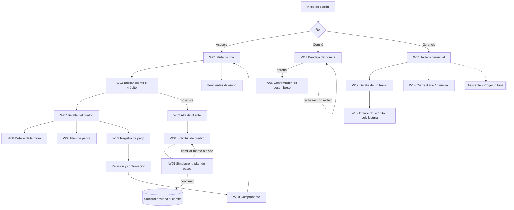

Versión en imagen, con carriles por perfil: [wireframes/mapa-navegacion.svg](wireframes/mapa-navegacion.svg).

Los tres flujos navegables que exige E3 recorren este mapa así:

| Flujo E3 | Recorrido en el mapa |
|---|---|
| 1. Originación | W04 Solicitud → W05 Simulación → W13 Decisión del comité → W06 Confirmación de desembolso |
| 2. Cobro en campo | W02 Buscar → W07 Saldo y tramo → W08 Desglose de la mora → W09 Registrar pago → W10 Comprobante |
| 3. Consulta gerencial | W11 Tablero → tramo de la cartera en riesgo → W12 Créditos de ese tramo |

### 3. Tabla de correspondencia pantalla ↔ caso de uso

#### 3.1 Tabla obligatoria de la sección 6.1

| Puerto primario del enunciado (6.1) | Puerto definido en el P1 (`FASE-06`, sección 8) | Caso de uso P1 | Pantalla P2 | Wireframe |
|---|---|---|---|---|
| RegistrarCliente | `RegistrarCliente` | CU-01 Registrar cliente | Alta de cliente | W03 |
| SolicitarCredito | `SolicitarCredito` | CU-02 Solicitar crédito | Solicitud de crédito (+ simulación del plan) | W04, W05 |
| EvaluarSolicitud | `EvaluarCredito` + `DecidirSolicitud` | CU-03 Evaluar, CU-04 Aprobar, CU-05 Rechazar | Bandeja del comité | W13 |
| DesembolsarCredito | `DesembolsarCredito` | CU-06 Desembolsar crédito | Confirmación de desembolso | W06 |
| RegistrarPago | `RegistrarPago` | CU-07 Registrar pago | Registro de pago en campo (+ comprobante) | W09, W10 |
| ConsultarCarteraEnRiesgo | `ConsultarCarteraEnRiesgo` | CU-14 Consultar cartera en riesgo | Tablero gerencial (+ detalle de tramo) | W11, W12, W15 |
| GenerarCierre | `GenerarCierre` | CU-12 Cierre diario, CU-13 Cierre mensual | Cierre diario / mensual | W14 |

> **Nota de coherencia.** En el P1 el puerto que el enunciado llama `EvaluarSolicitud` quedó dividido en dos puertos: `EvaluarCredito` (el analista registra la evaluación) y `DecidirSolicitud` (el comité aprueba o rechaza). La Bandeja del comité usa ambos. No se cambia el nombre de los puertos del P1, para respetar la regla de incrementalidad.

#### 3.2 Pantallas de apoyo: también corresponden a un caso de uso

La penalización de la sección 10 aplica a pantallas **sin** caso de uso. Por eso se trazan también las pantallas que no aparecen en la tabla 6.1:

| Pantalla | Puerto P1 | Caso de uso | Wireframe | Función del núcleo que provee las cifras |
|---|---|---|---|---|
| Ruta del día | `ConsultarCredito` (lista filtrada por asesora) | CU-15 | W01 | `consultarMora` (días y tramo por cuota) |
| Buscar cliente o crédito | `ConsultarCredito` | CU-15 | W02 | — |
| Detalle del crédito | `ConsultarCredito` + `CalcularMora` | CU-15, CU-08 | W07 | `consultarMora`, `clasificarTramoMora` |
| Plan de amortización | `SolicitarCredito` (simulación) / `ConsultarCredito` | CU-02, CU-15 | W05 | `plan-amortizacion.ts` |
| Detalle de la mora | `CalcularMora` | CU-08 | W08 | `CalculadoraMora.calcular` → `detalle.tramos` |
| Comprobante | `RegistrarPago` (resultado) | CU-07 | W10 | `prelacion-pago.ts`, `gasto-gestion-cobro.ts` |
| Tablero en teléfono | `ConsultarCarteraEnRiesgo` | CU-14 | W15 | `calcularCarteraPorTramo` |

Ningún caso de uso principal queda sin pantalla. `ReestructurarCredito` (CU-10), `DeclararIncobrable` (CU-11), `AnularCredito` (CU-17) y `AdministrarPolitica` (CU-16) son operaciones administrativas que el enunciado no exige prototipar. Se accederán desde el detalle del crédito en la vista de gerencia (W12 → W07) en el Proyecto Final. CU-18 Cancelar crédito no tiene pantalla propia porque ocurre como resultado de un pago que deja el saldo en Q0.00 (CP-04.1).

### 4. Wireframes de baja fidelidad

Los wireframes están en [`wireframes/`](wireframes) en formato SVG, en escala de grises, y cada uno lleva anotaciones numeradas que explican las decisiones. Son evidencia del proceso: preceden al prototipo de alta fidelidad en Figma (E3), donde se aplicarán color, tipografía y componentes. Todas las cifras son las del caso de referencia y las de los oráculos del núcleo.

#### 4.1 Asesora y cliente (móvil, 360 × 720)

| # | Pantalla | Decisión principal | Archivo |
|---|---|---|---|
| W01 | Ruta del día | Aviso de conexión fijo arriba; cada tarjeta de cliente completa es el objetivo táctil | 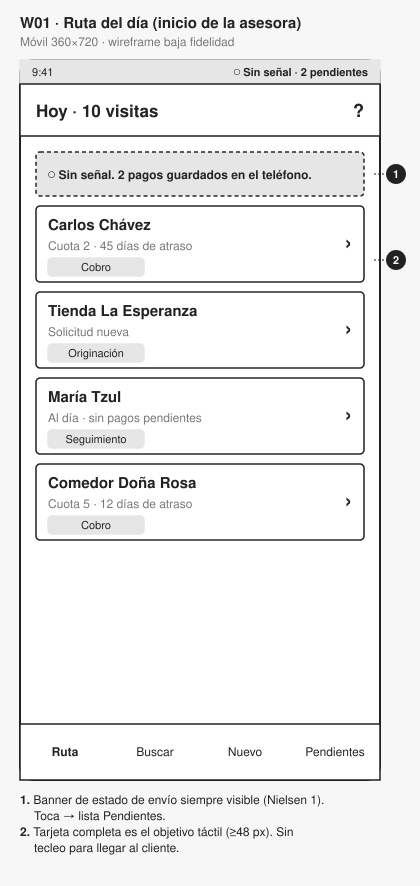 |
| W02 | Buscar | Búsqueda por nombre parcial, DPI o número de crédito; funciona sin señal sobre la cartera de la ruta | 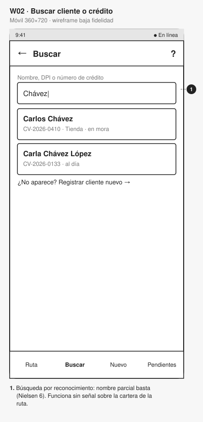 |
| W03 | Alta de cliente | Foto del DPI para autocompletar; borrador guardado en el teléfono por campo | 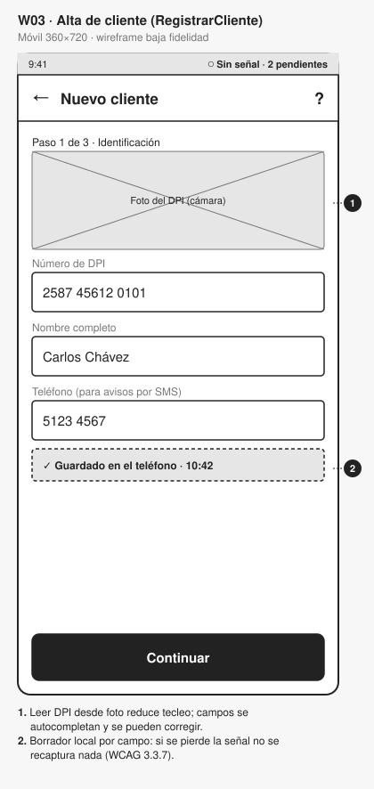 |
| W04 | Solicitud | Monto con prefijo Q, formato en vivo, rango y monto en letras; plazo con botones | 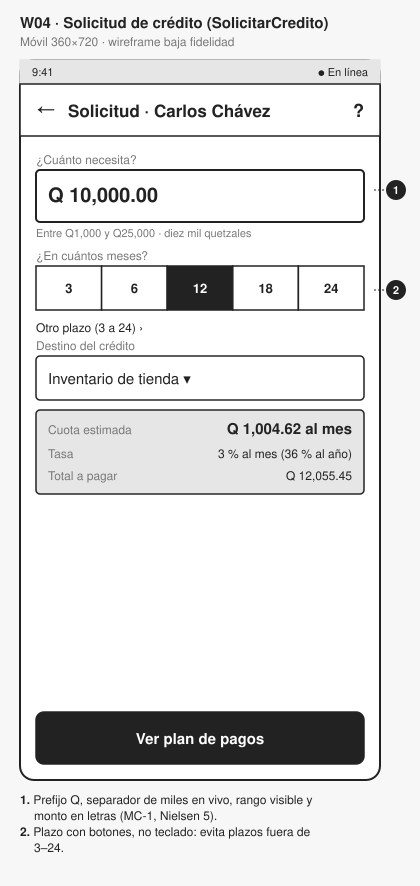 |
| W05 | Plan de pagos | Las 12 cuotas del núcleo; la cuota 12 de Q1,004.63 resaltada y explicada | 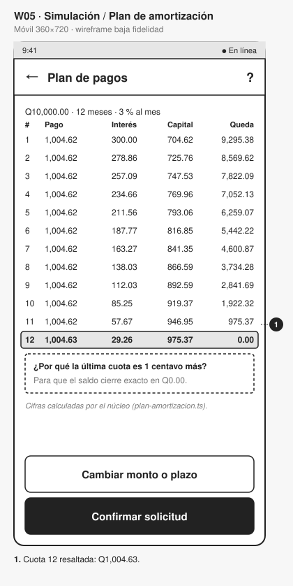 |
| W06 | Confirmación de desembolso | Resumen completo + casilla "el cliente revisó" + salida "Volver y corregir" | 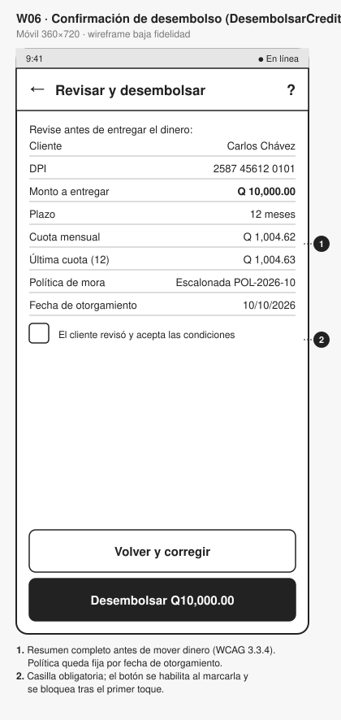 |
| W07 | Detalle del crédito | Lo que debe hoy va primero; tramo en lenguaje llano; aviso del siguiente tramo | 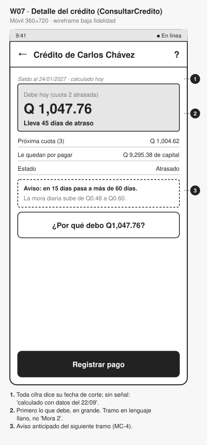 |
| W08 | Detalle de la mora | Caso M-3: una fila por tramo recorrido y un total redondeado una sola vez | 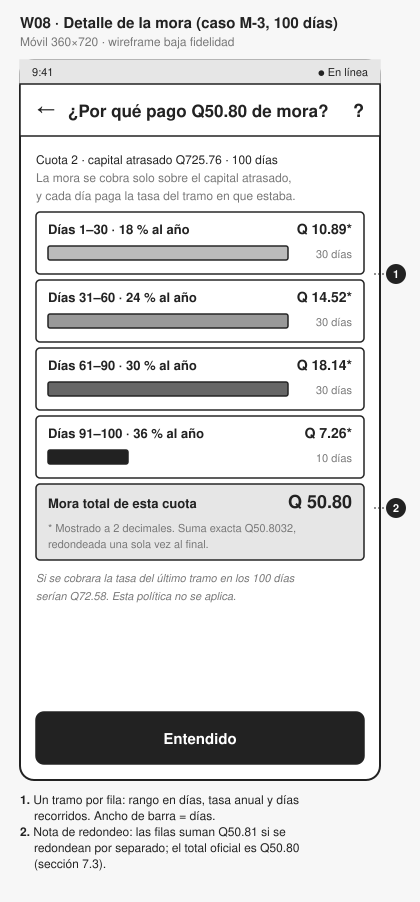 |
| W09 | Registro de pago | Prelación visible **antes** de confirmar; aviso sin conexión | 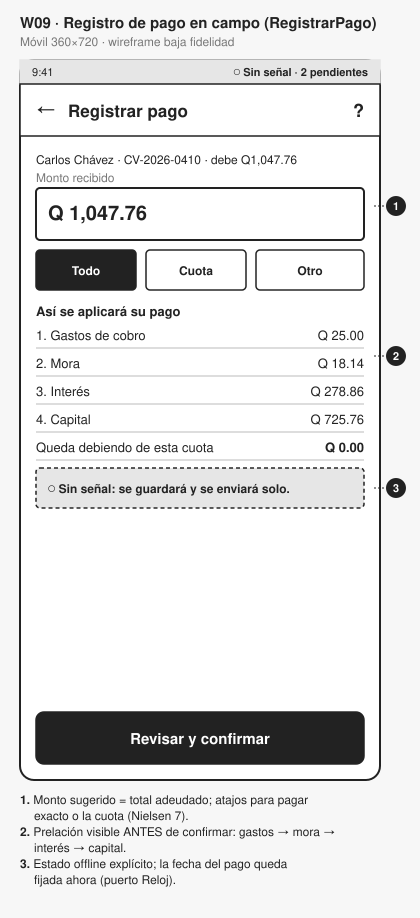 |
| W10 | Comprobante | Estados Pendiente / Enviado / Confirmado; clave de operación visible | 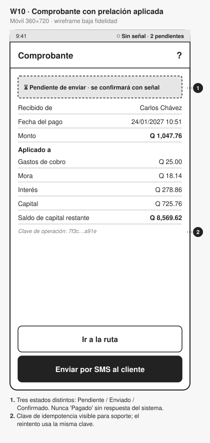 |

#### 4.2 Gerencia y comité (escritorio, 1280 × 760)

| # | Pantalla | Archivo |
|---|---|---|
| W11 | Tablero gerencial | 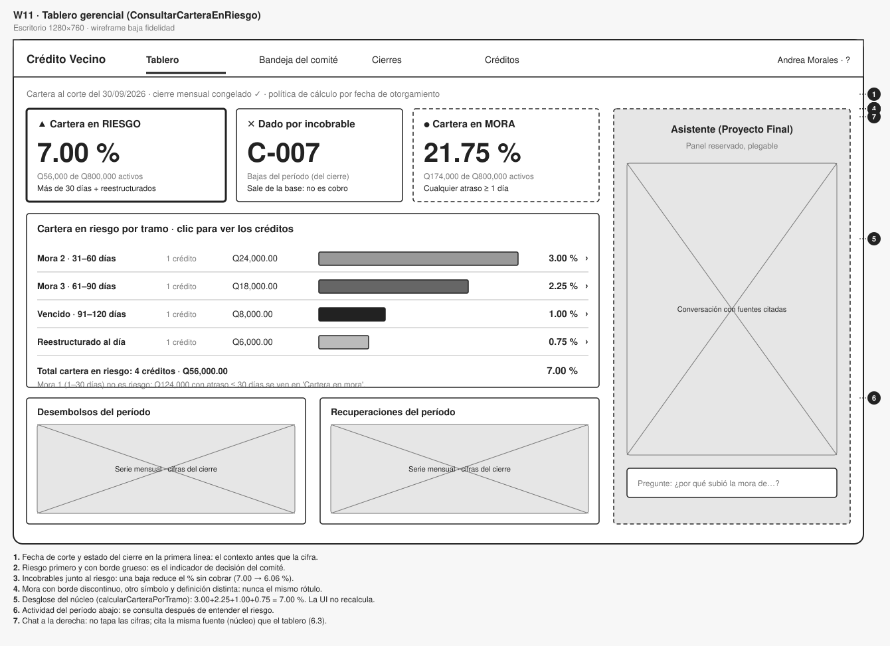 |
| W12 | Detalle de un tramo | 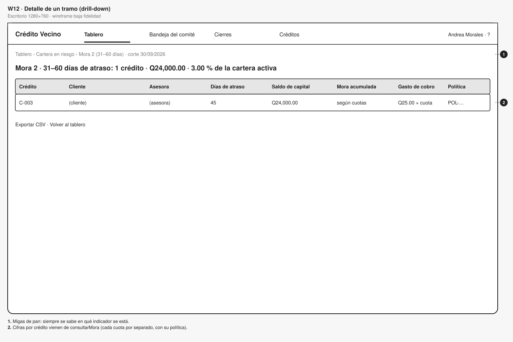 |
| W13 | Bandeja del comité | 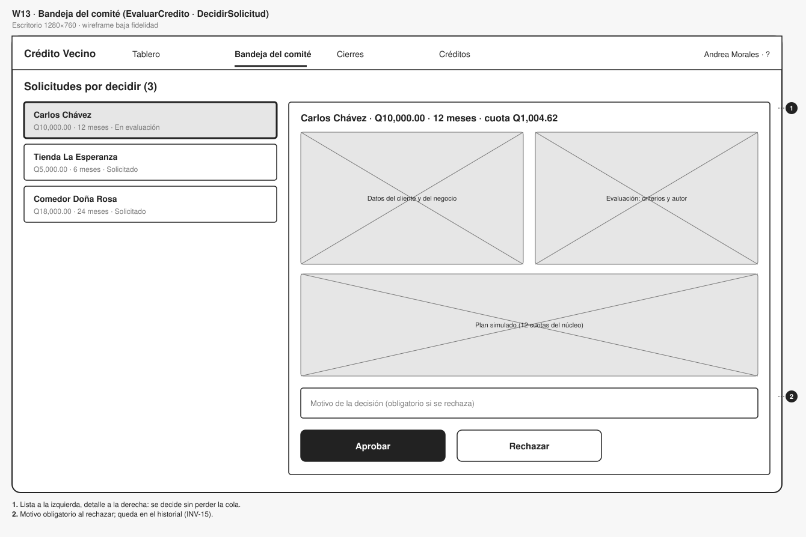 |
| W14 | Cierre diario / mensual | 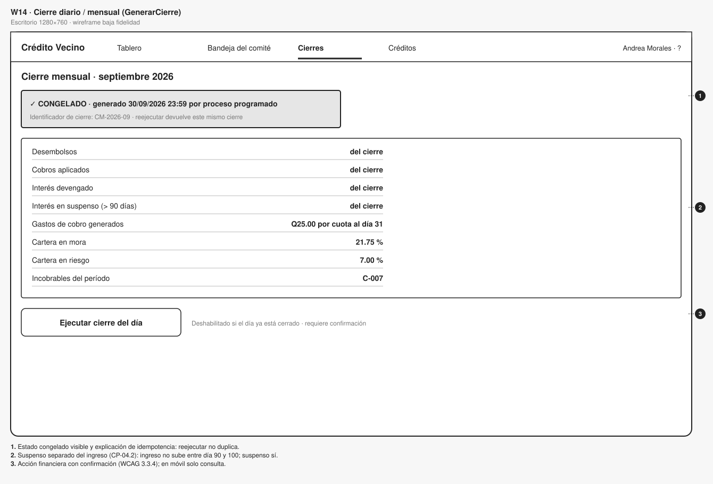 |
| W15 | Tablero en teléfono (ver E4) | 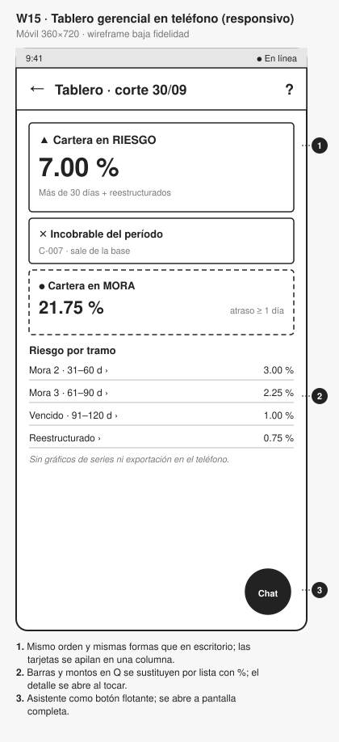 |

#### 4.3 La pantalla difícil: Detalle de la mora (W08)

El enunciado advierte que mostrar solo "Mora: Q50.80" no permite verificar nada, y que mostrar la fórmula completa no se entiende. El punto intermedio elegido:

| Qué muestra | Qué oculta | Por qué |
|---|---|---|
| Rango de días de cada tramo ("Días 31–60") | La palabra "Mora 2" | El cliente entiende días, no nombres de tramo (heurística 2 de Nielsen) |
| Tasa **anual** ("24 % al año") | La tasa diaria 0.000666667 | Una tasa diaria no significa nada para Carlos |
| Días recorridos en cada tramo y una barra proporcional | La fórmula Σ capital × tasa × días / 360 | La barra muestra que el último tramo tiene solo 10 días |
| Importe por tramo a 2 decimales con asterisco | Los importes con 4 decimales (Q10.8864…) | Legibilidad |
| **Nota de redondeo**: "Suma exacta Q50.8032, redondeada una sola vez al final" | — | Si se redondea cada fila por separado, la suma da **Q50.81**, no Q50.80. Sin la nota, el cliente que suma las filas ve un error de un centavo. La nota hace visible la regla 7.3 en lugar de esconderla |
| Contraste con la política retroactiva (Q72.58), "no se cobra así" | — | Da confianza: muestra que la regla favorece al cliente |

Los importes por tramo salen de `detalle.tramos[].importeSinRedondear` y el total de `interesMoratorio`. La interfaz solo formatea: nunca suma ni redondea por su cuenta.

### 5. Jerarquía del tablero gerencial (W11)

#### 5.1 Qué se ve primero y por qué

El tablero se lee en forma de Z, de izquierda a derecha y de arriba abajo. El orden sigue las preguntas que Andrea trae al comité (E1, §2.3):

| Orden | Zona | Contenido (cifras del núcleo) | Pregunta que responde | Por qué en ese lugar |
|---|---|---|---|---|
| 0 | Línea de contexto | Fecha de corte, "cierre congelado ✓" y política por fecha de otorgamiento | ¿De cuándo son estos números? ¿Son definitivos? | Un indicador sin fecha no sirve para decidir; con la mora escalonada, el tramo depende de la fecha |
| 1 | Tarjeta principal, arriba a la izquierda | **Cartera en riesgo 7.00 %** (Q56,000 de Q800,000) | ¿Cuánto de la cartera está en deterioro real? | Es el indicador sobre el que decide el comité (provisiones, restricciones de colocación) |
| 2 | Junto al riesgo | **Dado por incobrable en el período** (C-007) | ¿El riesgo bajó porque cobramos o porque dimos de baja? | El enunciado exige mostrarlo junto al riesgo: declarar incobrable a C-005 bajaría el indicador de 7.00 % a 6.06 % sin cobrar nada |
| 3 | Tercera tarjeta | **Cartera en mora 21.75 %** (Q174,000) | ¿Cuántos clientes tienen algún atraso? | Es una alerta temprana útil, pero no es la base de la decisión de riesgo; por eso va después |
| 4 | Bloque central | Riesgo por tramo: 3.00 + 2.25 + 1.00 + 0.75 = **7.00 %** | ¿Dónde está concentrado el riesgo? | Explica la tarjeta 1 y es la entrada al detalle (flujo 3 de E3) |
| 5 | Parte inferior | Desembolsos y recuperaciones del período | ¿Cómo se movió la cartera en el período? | Contexto de actividad; se consulta después de entender el riesgo |
| — | Panel derecho plegable | Asistente conversacional (Proyecto Final) | "¿Por qué subió la mora de…?" | Ver §5.3 |

#### 5.2 Cómo se distinguen la cartera en mora y la cartera en riesgo

Confundir estos dos indicadores es un hallazgo de severidad 4 y una penalización de −0.5 puntos (sección 10). El diseño los separa con **cinco señales independientes**, para que ninguna dependa solo del color (WCAG 1.4.1):

| Señal | Cartera en RIESGO | Cartera en MORA |
|---|---|---|
| Rótulo | "Cartera en **RIESGO**" | "Cartera en **MORA**" (la palabra distinta, en mayúsculas) |
| Definición visible bajo la cifra | "Más de 30 días + reestructurados" | "Cualquier atraso ≥ 1 día" |
| Símbolo | ▲ | ● |
| Borde de la tarjeta | Grueso y continuo (indicador principal) | Discontinuo |
| Posición | Primera, junto a incobrables | Tercera, separada por la tarjeta de incobrables |
| Color en alta fidelidad (E3) | Color de alerta del sistema de diseño | Neutro / informativo |

Además, el bloque de tramos explica expresamente por qué Mora 1 no forma parte del riesgo ("Q124,000 con atraso ≤ 30 días se ven en *Cartera en mora*"). Así, un lector que sume los tramos no busca el 21.75 % en ese bloque.

Origen de las cifras: `calcularCarteraPorTramo` devuelve `carteraActiva`, `tramosEnRiesgo[]`, `totalEnRiesgo`, `carteraEnMora` e `incobrablesDelPeriodo`. Los porcentajes llegan ya conciliados para que sumen exactamente el total (invariante 7 de la sección 7.9). El tablero no recalcula nada (CP-04.3). El enunciado no da el saldo de C-007; el tablero lo toma de `incobrablesDelPeriodo` del cierre, por eso el wireframe no muestra un monto inventado.

> **Observación para el equipo.** En `tests/cartera-por-tramo.test.ts` los créditos se llaman C-001, C-002… con las cifras de la sección 7.8, pero los identificadores no coinciden con los del enunciado (C-003 con 45 días, C-004 con 75 días, etc.). Los montos y porcentajes sí coinciden. El prototipo usa los identificadores del enunciado; conviene alinear el fixture para que la defensa no se preste a confusión.

#### 5.3 El lugar del asistente (sección 6.3)

El chat del Proyecto Final ocupa una **columna derecha plegable** (W11) y, en el teléfono, un botón flotante que abre el chat a pantalla completa (W15). Justificación:

- **No tapa las cifras**: las tarjetas y el desglose quedan a la izquierda, en el recorrido natural de lectura.
- **Convive con el tablero**: la gerencia puede preguntar "¿por qué C-004 está en Mora 3?" mientras ve el tramo. El asistente responde con la misma fuente que el tablero (el núcleo) y cita de dónde sale cada cifra.
- **Plegable**: si no se usa, el tablero recupera ancho sin reorganizarse.

### 6. Qué se validará en E3 y E5

- Prueba de lectura del tablero (cinco segundos): ¿qué porcentaje reporta el participante como "riesgo"?
- Prueba de comprensión de W08 con tres personas sin formación financiera: ¿pueden explicar por qué la mora de los días 91–100 es de Q7.26 si son solo 10 días?
- Tiempo para registrar un pago con una mano, de pie (W09): objetivo de menos de 30 segundos y 4 toques desde W07.

*Uso de IA declarado (sección 15):* los SVG de baja fidelidad se generaron con apoyo de un asistente de IA a partir de las decisiones del equipo, mediante el script `wireframes/generar_wireframes.py`, que es editable. Las decisiones de jerarquía y su justificación son del equipo y deben revisarse antes de la entrega.


---

<a id="parte-4"></a>

# Parte 4 · E4 · Decisión móvil/web

*Documento de origen: `docs/proyecto2/e4-decision-movil-web.md`*

## E4 · Decisión de arquitectura móvil/web y diseño responsivo

Proyecto 2 · Crédito Vecino, S. A. · Análisis de Sistemas II (037)

Este documento responde al entregable E4: elección entre app nativa, híbrida o PWA, estrategia responsiva mobile-first y estrategia ante pérdida de conexión, conectada con la clave de idempotencia y el puerto `Reloj` del Proyecto 1.

**Alcance.** En el P2 no se implementan frontend, service worker, API ni almacenamiento del dispositivo (sección 5 del enunciado). Esta es una decisión de arquitectura que el Proyecto Final implementará con React + Vite + Tailwind (sección 14). Las restricciones de contexto provienen de [E1](e1-investigacion-usuario.md).

### 1. Restricciones que decide la arquitectura

| Restricción | Perfil | Fuente | Qué exige |
|---|---|---|---|
| Señal intermitente o nula durante parte de la ruta | Asesora | Enunciado, sección 3; IICA/BID (conectividad rural) | Trabajar sin conexión: consultar la cartera de la ruta, capturar solicitudes y registrar pagos |
| Teléfono Android de gama media, poca memoria | Asesora | Enunciado, sección 3 | App ligera, sin descargas grandes para actualizar |
| Uso con una mano, de pie y bajo el sol | Asesora | Enunciado, sección 3 | Objetivos táctiles grandes, alto contraste, poco tecleo (depende del diseño, no de la tecnología) |
| Escritorio con pantalla grande y conexión estable | Gerencia | Enunciado, sección 3 | Alta densidad de información; acceso por navegador sin instalar nada |
| Consulta ocasional desde el teléfono | Gerencia | E1 (hipótesis) | El mismo tablero, adaptado |
| El cliente puede no tener datos móviles | Cliente | DataReportal 2024 (60.3 % usa internet) | Los avisos al cliente van por SMS, no por la app (MC-4) |
| El Proyecto Final debe implementarse en 4 semanas con React y Tailwind | Equipo | Enunciado, secciones 2.1 y 14 | Un solo código web |

### 2. Decisión: una PWA única, mobile-first

#### 2.1 Alternativas evaluadas

| Criterio | Nativa (Kotlin / Swift) | Híbrida (React + Capacitor) | **PWA (React + service worker)** |
|---|---|---|---|
| Trabajo sin conexión | Completo | Completo (web + plugins nativos) | Suficiente: service worker para la app y los datos en caché; IndexedDB para la cola de pagos y los borradores |
| Cola de envío en segundo plano | Completa | Completa | Background Sync en Chrome para Android; en otros navegadores, reenvío al volver la señal o al abrir la app, más un botón manual |
| Teléfono de gama media | Mejor rendimiento, pero instalador pesado | Contenedor nativo + web | Se instala desde el navegador, ocupa poco, sin tienda de aplicaciones |
| Escritorio para gerencia | No aplica: exige otro producto | Requiere además la versión web | **El mismo código** en el navegador de escritorio |
| Actualizaciones (por ejemplo, un cambio de política) | Publicar en la tienda y esperar a que los asesores actualicen | Publicar en la tienda para cambios nativos | Inmediatas al volver a cargar la app |
| Cámara para la foto del DPI (W03) | Sí | Sí | Sí: `<input type="file" accept="image/*" capture>` o `getUserMedia` |
| Coherencia con el Proyecto Final (React + Vite + Tailwind en 4 semanas) | Rompe el stack: dos lenguajes más | Compatible, pero agrega compilación, firma y pruebas por plataforma | **Idéntico stack** |
| Costo de mantenimiento | 2 o 3 bases de código | 1 base de código + contenedores | **1 base de código** |

#### 2.2 Decisión y justificación

**Se adopta una PWA única, instalable, mobile-first, para los tres perfiles.** El rol que inicia sesión determina la pantalla de inicio: Ruta del día, Bandeja del comité o Tablero.

- **Para la asesora:** su necesidad crítica es trabajar sin señal, y eso lo resuelven el service worker (app y datos en caché) y una cola persistente en IndexedDB. La operación clave no es "tener señal", sino **no perder ni duplicar un pago cuando no la hay**, y eso depende del diseño de la cola y de la API (sección 4), no de que la app sea nativa. En un Android de gama media, una PWA se instala desde Chrome sin pasar por la tienda y se actualiza sola.
- **Para la gerencia:** trabaja en escritorio con buena conexión. Una PWA es simplemente la web; no se construye un segundo producto.
- **Para el proyecto:** el Proyecto Final exige React + Vite + Tailwind. Una PWA es ese mismo stack, sin compilar ni firmar por plataforma.

#### 2.3 Riesgos aceptados y cómo se mitigan

| Riesgo de la PWA | Mitigación |
|---|---|
| El navegador puede borrar el almacenamiento de un sitio | Solicitar `navigator.storage.persist()` al instalar. La cola se vacía en cuanto hay señal. Aviso visible si quedan pendientes al final del día (W01). Nunca se borra un comando sin confirmación del servidor |
| Background Sync no existe en todos los navegadores | No se promete sincronización automática universal. Reenvío al recibir el evento `online`, al abrir la app y con el botón "Enviar ahora" en Pendientes. La flota de asesoras usa Android con Chrome (supuesto a confirmar con TI) |
| iOS limita las PWA | La gerencia en iPhone solo consulta: no necesita cola ni sincronización |

**Condición de revisión.** Si la validación de campo muestra que Android borra la cola con frecuencia o que la cámara no alcanza para leer el DPI, se migra la app de la asesora a **Capacitor**. Esto conserva el mismo código React y agrega almacenamiento nativo: la decisión es reversible sin reescribir.

### 3. Estrategia responsiva mobile-first

Se diseña primero para 360 px (el teléfono de la asesora) y se **agrega** información a medida que crece la pantalla. Puntos de quiebre de Tailwind:

| Ancho | Clase | Uso principal |
|---|---|---|
| < 640 px | base | Asesora en campo; gerencia consultando en reunión |
| ≥ 768 px | `md` | Tableta en oficina de agencia |
| ≥ 1024 px | `lg` | Escritorio de gerencia |
| ≥ 1280 px | `xl` | Escritorio con el panel del asistente abierto |

#### 3.1 Cómo se transforma el tablero gerencial

| Elemento | Teléfono (W15) | Escritorio (W11) |
|---|---|---|
| Línea de contexto (fecha de corte, cierre congelado) | En el encabezado: "Tablero · corte 30/09" | Línea completa con estado del cierre y política |
| Riesgo → incobrables → mora | Tres tarjetas **apiladas en ese mismo orden**, con los mismos rótulos, símbolos (▲ ✕ ●) y bordes | Tres tarjetas en fila |
| Desglose por tramo | Lista de 4 filas con porcentaje; al tocar una fila se abre el detalle | Tabla con créditos, saldo en Q, barra proporcional y % |
| Detalle de un tramo (W12) | Tarjetas por crédito | Tabla de 8 columnas |
| Desembolsos y recuperaciones | Dos cifras del período, sin gráfico | Series mensuales |
| Asistente (Proyecto Final) | Botón flotante que abre el chat a pantalla completa | Columna derecha plegable |
| Cierre (W14) | Solo consulta | Consulta y ejecución, con confirmación |

**Qué se sacrifica en la pantalla pequeña, y por qué es aceptable:**

1. **Las series temporales y las barras.** Una gráfica de 12 meses en 360 px no se lee. En el teléfono se contesta "¿cómo estamos hoy?"; las tendencias se ven en escritorio.
2. **Los montos en quetzales dentro del desglose por tramo.** Se muestra solo el porcentaje para que cada fila quepa en una línea; el monto aparece al tocar la fila.
3. **La exportación a CSV.** Es una tarea de escritorio.
4. **Ejecutar el cierre.** Es una operación financiera irreversible (WCAG 3.3.4). Se reserva al escritorio para evitar toques accidentales.

**Lo que no se sacrifica nunca:** la distinción entre cartera en mora y cartera en riesgo, la cifra de incobrables junto al riesgo y la fecha de corte. Quitarlas en el teléfono reintroduciría el error MC-3.

#### 3.2 Reglas del sistema responsivo

- Los objetivos táctiles miden al menos 48 × 48 px en todos los anchos; WCAG 2.5.8 exige 24 px como mínimo.
- Ninguna acción requiere arrastrar (WCAG 2.5.7). Las listas se desplazan, y el orden se cambia con botones.
- El texto base es de 16 px y se puede ampliar al 200 % sin perder contenido (WCAG 1.4.4). Las tablas pasan a tarjetas antes de necesitar desplazamiento horizontal.
- Contraste mínimo de 4.5:1 (WCAG 1.4.3). La paleta de alta fidelidad (E3) se probará también a plena luz del día.

### 4. Estrategia ante pérdida de conexión

#### 4.1 Qué funciona sin señal

| Operación | Sin señal | Cómo |
|---|---|---|
| Ver la ruta y el detalle de los créditos de la ruta | Sí, con la fecha de los datos visible | Copia descargada al iniciar la jornada |
| Ver el detalle de la mora | Sí, rotulado "calculado con datos del 22/09" | Última respuesta de `consultarMora` en caché. **No se recalcula en el teléfono** |
| Capturar alta de cliente y solicitud | Sí | Borrador en IndexedDB, guardado campo por campo |
| Registrar un pago | Sí, **queda pendiente** | Cola de comandos (§4.2) |
| Desembolsar | **No** | Mueve dinero de la institución; requiere confirmación en línea |
| Tablero y cierres | No (gerencia trabaja en línea) | — |

#### 4.2 Registrar un pago sin señal: la clave de idempotencia

Cuando Mariela toca "Confirmar" en W09 sin señal, ocurre lo siguiente, en este orden:

1. **Se crea el comando** `RegistrarPago` con `creditoId`, `importe` como cadena (`"1047.76"`), `moneda`, `fechaPago` y `usuarioProceso`.
2. **Se genera la `Idempotency-Key` una sola vez** (un UUID) y se guarda junto al comando en IndexedDB **antes** de mostrar "Pendiente". Sin ese registro, un cierre de la app podría perder el pago.
3. La pantalla muestra **Pendiente de enviar** (W10). Nunca muestra "Pagado" sin una respuesta del sistema.
4. Al volver la señal, la cola envía `POST /creditos/{creditoId}/pagos` con **la misma clave y el mismo contenido**, en orden por crédito.
5. El contrato OpenAPI del P1 responde:
   - **201**: pago nuevo registrado → estado **Confirmado**.
   - **200** con `Idempotency-Replayed: true`: el pago ya había llegado (por ejemplo, el primer envío sí llegó y se perdió la respuesta) → **Confirmado**, sin un segundo efecto.
   - **409**: la clave ya existe con un contenido distinto → estado **Conflicto**, visible para la asesora y para su supervisor. **Nunca se genera una clave nueva automáticamente**, porque eso sí podría duplicar el pago.
6. Un timeout **no borra el comando**: se reintenta con la misma clave.

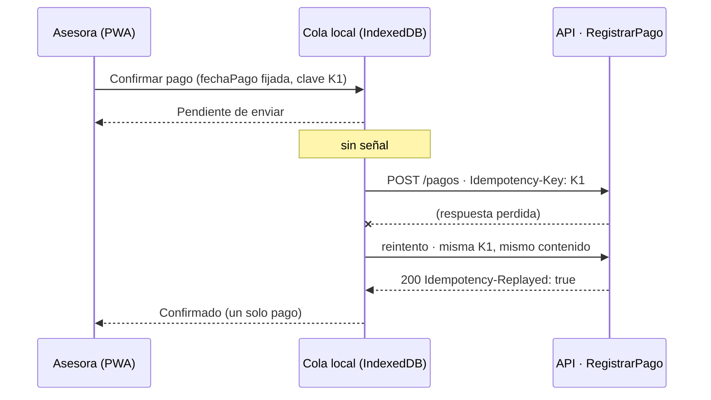

Así se previene MC-2 (doble cobro de Q1,047.76). El núcleo ya lo sostiene: `pago-idempotente.ts` y sus pruebas del P1 verifican que una repetición no cambia saldos ni movimientos.

**Ajuste necesario al contrato del P1.** El OpenAPI sugiere un tiempo de vida (TTL) de **24 horas** para la clave. Una asesora que pasa más de un día sin señal enviaría su pago cuando la clave ya expiró, y el reintento se procesaría como un pago nuevo. **El TTL debe ser mayor que la ventana máxima de trabajo sin conexión** (se propone 30 días), o la clave debe conservarse junto con el pago de forma permanente. Este cambio se registra para el Proyecto Final; no cambia el núcleo.

#### 4.3 ¿Con qué fecha se calcula? El puerto Reloj

Caso: la cuota 2 de Carlos tiene **30 días** de atraso. Mariela recibe el pago hoy sin señal y el teléfono lo sincroniza **mañana**, cuando la cuota ya tendría 31 días.

| Si se calcula con… | Días | Mora | Gasto de cobro | Total de la cuota |
|---|---|---|---|---|
| **`fechaPago` = día en que Carlos pagó** (correcto) | 30 | Q10.89 | Q0.00 | **Q1,015.51** |
| Fecha de sincronización (incorrecto) | 31 | Q11.37 | Q25.00 | Q1,040.99 |

Si se usara la fecha de sincronización, Carlos pagaría **Q25.48 de más** por una demora que no es suya. La respuesta está en el P1: la fecha de corte es un parámetro y no "hoy".

- En el teléfono, el **adaptador del puerto `Reloj`** fija la `fechaPago` **en el momento de confirmar** y la guarda en el comando. Los reintentos envían esa misma fecha.
- En el núcleo, `RegistrarPago` recibe `fechaPago` y `consultarMora` recibe `fechaCorte` como parámetros. **El núcleo nunca lee la fecha del sistema**: la validación final lo comprobó con `rg 'new Date\(\)' src`, que no encuentra coincidencias ([e6-04](e6-04-validacion-final.md)).
- La política aplicable (plana o escalonada) no depende de ninguna de esas fechas, sino de la **fecha de otorgamiento** (`resolverPolitica`).

**Salvaguarda contra un reloj del teléfono mal configurado.** Al recibir el comando, el servidor compara `fechaPago` con la fecha de recepción y con la última sincronización del dispositivo. Una `fechaPago` futura o anterior a la última sincronización exitosa se acepta, pero queda **marcada para revisión** del supervisor en lugar de aplicarse en silencio. Esta regla corresponde a la capa de aplicación del Proyecto Final, no al núcleo.

#### 4.4 Lo que se ve en pantalla

| Estado del comando | Texto en W09 / W10 | Barra de estado (W01) |
|---|---|---|
| Guardado sin señal | "Pendiente de enviar · se enviará solo al tener señal" | "Sin señal · 2 pendientes" |
| Enviando | "Enviando…" | "Enviando…" |
| Confirmado (201 o 200 replay) | "Confirmado · comprobante definitivo" y opción de enviar SMS al cliente | "En línea" |
| Conflicto (409) | "Este pago no coincide con uno ya registrado. No se cobró de nuevo. Revíselo con su supervisor." | "1 pago requiere revisión" |

### 5. Dos decisiones del Proyecto 1 que hacen viable el trabajo sin conexión

| Decisión de experiencia | Decisión de arquitectura del P1 que la sostiene | Qué pasaría sin ella |
|---|---|---|
| Registrar pagos sin señal y reintentar al reconectar | **Clave de idempotencia** en `RegistrarPago` (`Idempotency-Key`, respuestas 201 / 200 replay / 409) | Cada reintento podría ser un pago duplicado |
| Mostrar y cobrar la mora correcta aunque se sincronice otro día | **Puerto `Reloj`**: fecha de corte y `fechaPago` como parámetros, nunca "hoy" | El tramo y el gasto de Q25.00 dependerían del momento en que el teléfono recuperó la señal |

### Referencias

- MDN Web Docs. *Offline and background operation* (PWA). https://developer.mozilla.org/en-US/docs/Web/Progressive_web_apps/Guides/Offline_and_background_operation
- MDN Web Docs. *What is a progressive web app?* https://developer.mozilla.org/en-US/docs/Web/Progressive_web_apps/Guides/What_is_a_progressive_web_app
- MDN Web Docs. *StorageManager.persist()*. https://developer.mozilla.org/en-US/docs/Web/API/StorageManager/persist
- Capacitor. *Documentación oficial*. https://capacitorjs.com/docs
- W3C (2023). *Web Content Accessibility Guidelines (WCAG) 2.2*. https://www.w3.org/TR/WCAG22/
- Repositorio: `docs/api/openapi.yaml` (operación `registrarPago`), `src/dominio/pago-idempotente.ts`, `src/aplicacion/consultar-mora.ts`.


---

<a id="parte-5"></a>

# Parte 5 · E6 · Informe de impacto SOLID

*Documento de origen: `docs/informe-impacto-solid.md`*

## Informe de impacto SOLID · Proyecto 2 (E6)

Crédito Vecino, S. A. · Análisis de Sistemas II (037)

Este informe sigue la plantilla del **Anexo D** del enunciado. Mide cuánto hubo que modificar el núcleo del Proyecto 1 para absorber los cambios CP-01 a CP-04 de la sección 7 y responde, con evidencia del repositorio, a las preguntas de la sección 8.2. Todas las cifras de esta sección se pueden reproducir con los comandos incluidos.

> Este documento sustituye al antiguo `docs/verificacion-solid-informe-impacto.md`, que duplicaba parte de este informe; su contenido quedó integrado aquí.

### 1. Punto de partida

| Hito | Referencia | Cómo reproducirlo |
|---|---|---|
| Entrega del Proyecto 1 | Etiqueta **`entrega-p1`** → commit `8737d9b782772a5cff9acb07de8d719f4f4e3a16` (26/08/2026) | `git show --stat entrega-p1` |
| Núcleo evolucionado (fases 1–4) | Commit `0d6c1a9` | Los commits posteriores solo agregan contratos, documentación y scripts; no cambian `src/dominio` |
| Entrega del Proyecto 2 | Etiqueta **`entrega-p2`**, que se crea sobre el commit final de la entrega | `git tag entrega-p2 && git push origin entrega-p1 entrega-p2` |

La historia no se reescribió: los cambios del P2 están en commits separados por fase (sección 4.2) y se integraron a `main` con el PR #1.

**Unidad de medida.** Líneas físicas que Git suma o elimina, incluidos comentarios y líneas vacías. No mide esfuerzo, complejidad ni cobertura.

### 2. Métricas del cambio (sección 8.1)

```text
$ git diff --stat entrega-p1 0d6c1a9 -- src/dominio
 src/dominio/calculadora-mora.ts                    | 51 ++++++-----
 src/dominio/cartera-por-tramo.ts                   | 99 ++++++++++++++++++++++
 src/dominio/clasificacion-tramo.ts                 | 13 +++
 src/dominio/credito-estado.ts                      | 14 ++-
 src/dominio/devengo-interes.ts                     | 57 +++++++++++++
 src/dominio/gasto-gestion-cobro.ts                 | 45 ++++++++++
 src/dominio/politica-mora/catalogo-politicas.ts    | 10 +++
 .../politica-mora/configuracion-politica.ts        | 22 +++++
 src/dominio/politica-mora/politica-escalonada.ts   | 17 ++++
 src/dominio/politica-mora/politica-mora.ts         | 38 +++++++++
 src/dominio/politica-mora/politica-plana.ts        | 18 ++++
 src/dominio/politica-mora/politica-retroactiva.ts  | 18 ++++
 12 files changed, 381 insertions(+), 21 deletions(-)
```

| Métrica (8.1) | Resultado | Lectura |
|---|---|---|
| Archivos del núcleo **creados** | **10** | Neutro o bueno: la funcionalidad nueva vive en archivos nuevos |
| Archivos del núcleo **modificados** (de los 7 que existían en el P1) | **2**: `calculadora-mora.ts` (+32/−19) y `credito-estado.ts` (+12/−2) | Dentro del objetivo razonable (≤ 2). Los otros 5 (`dinero`, `plan-amortizacion`, `cartera`, `pago-idempotente`, `prelacion-pago`) no se tocaron |
| **¿Se modificó el motor de cálculo de mora?** | **Sí.** `calculadora-mora.ts` cambió en +32/−19 (13 líneas netas) | El P1 **no** cumplía abierto/cerrado para la mora; ver §4.1 |
| Pruebas del P1 que dejaron de pasar | **0** | Los 10 archivos de prueba del P1 (206 pruebas) pasan sobre el núcleo evolucionado |
| Pruebas del P1 que hubo que reescribir | **0** | `git diff entrega-p1 -- tests` solo muestra archivos **añadidos** (A); ningún archivo del P1 aparece como modificado (M) |
| Líneas netas añadidas a `src/dominio` | **+360** (381 añadidas, 21 eliminadas) | Por encima del rango orientativo de 60–120 líneas; el desglose explica por qué |

**Desglose de las 360 líneas netas.** El rango de 60–120 líneas del enunciado se refiere al cambio de política. Nuestro diff incluye además CP-02 y CP-04:

| Cambio | Archivos | Líneas netas |
|---|---|---:|
| CP-01 / CP-03 · Política escalonada y coexistencia | `politica-mora/*` (5 archivos), `clasificacion-tramo.ts`, adaptación de `calculadora-mora.ts` | 123 + 13 + 13 = **149** |
| … de las cuales solo son doble de prueba o configuración | `politica-retroactiva.ts` (18), `configuracion-politica.ts` (22) | (40) |
| CP-02 · Gasto de gestión de cobro | `gasto-gestion-cobro.ts` | **45** |
| CP-04.1 · `en_mora → cancelado` | `credito-estado.ts` | **10** |
| CP-04.2 · Suspensión del devengo | `devengo-interes.ts` | **57** |
| CP-04.3 · Cartera en riesgo por tramo | `cartera-por-tramo.ts` | **99** |
| **Total** | 12 archivos | **360** |

Sin contar la configuración ni el doble de prueba, la política escalonada ocupó **109 líneas netas**, dentro del rango orientativo. El resto corresponde a correcciones que el enunciado exige y que no son parte de la política de mora.

Fuera de `src/dominio` se añadieron `aplicacion/consultar-mora.ts` (+27) y `contratos/presentadores-p2.ts` (+32), y se modificó `contratos/esquemas.ts` (+33/−0). Con esos archivos, todo `src/` suma 473 líneas añadidas y 21 eliminadas.

### 3. Los cinco principios (sección 8.2)

| Principio | Pregunta del enunciado | Respuesta con evidencia | Veredicto |
|---|---|---|---|
| **S** · Responsabilidad única | ¿Quién decide el tramo y quién decide cuánto cuesta? ¿Es la misma clase? | **Son piezas distintas.** El tramo lo decide `clasificarTramoMora` en `clasificacion-tramo.ts` (Specification: días → tramo). El costo lo decide cada `PoliticaMora` (`politica-escalonada.ts`, `politica-plana.ts`). Se prueban por separado: `INV-10` en `invariantes.test.ts` y los casos M-1 a M-4 en `politica-mora.test.ts`. En el P1, `clasificarTramoMora` y el enum `TramoMora` vivían **dentro** de `calculadora-mora.ts`; el diff los retira del motor y los reexporta | Se cumple **después** del cambio; en el P1 estaban juntos |
| **O** · Abierto/cerrado | ¿Se pudo agregar la política escalonada sin abrir el motor? | **No en el primer cambio.** `calculadora-mora.ts` cambió en +32/−19: el P1 recibía la **tasa** como parámetro de un método estático (`calcularInteresMoratorio(capital, tasa, dias)`), no una política. Hubo que abrir un punto de extensión (`constructor(private readonly politica: PoliticaMora)`). **A partir de ahora sí se cumple**: `contrato-politica.test.ts` inyecta una tercera política (`PoliticaRetroactiva`) sin tocar el motor | **Parcial**: el P1 no lo cumplía; el P2 lo establece |
| **L** · Sustitución de Liskov | ¿Se pueden intercambiar plana, escalonada y retroactiva sin romper los invariantes del motor? | **Sí.** `contrato-politica.test.ts` ejecuta la misma batería (`describe.each`) contra las tres: mismas entradas, resultado determinista e inmutable, no negativo, misma moneda y tope ≤ capital. Se prueban 3 políticas × 2 monedas × 4 capitales × 12 atrasos (0, 1, 30, 31, 60, 61, 90, 91, 120, 121, 150, 100000) = **288 combinaciones**. El motor además rechaza una estrategia que viole el contrato ("el motor rechaza una estrategia que incumple moneda, finitud, signo o tope") | **Se cumple** |
| **I** · Segregación de interfaces | ¿El puerto de política expone solo lo que el motor necesita? | **Sí.** `PoliticaMora` tiene 2 miembros: `readonly id` y `calcular(capital, dias): CalculoPolitica` (`politica-mora.ts`, 4 líneas de interfaz). Ninguna implementación lanza "no soportado"; ninguna persiste, lee el reloj ni cambia el estado del crédito | **Se cumple** |
| **D** · Inversión de dependencias | ¿El motor depende de la abstracción o de una implementación concreta? | **De la abstracción.** `calculadora-mora.ts` importa `PoliticaMora` **solo como tipo** (`import type`) y no nombra `PoliticaPlana` ni `PoliticaEscalonada`. Quien construye la política es `resolverPolitica` (`catalogo-politicas.ts`), y la composición ocurre en la capa de aplicación (`consultar-mora.ts`) | **Se cumple**, con una dependencia residual (ver §4.3) |

#### GRASP

| Principio | Pregunta del enunciado | Evidencia |
|---|---|---|
| Experto en información | ¿Quién conoce los días de atraso? Esa pieza debe calcular el tramo | `DiasAtraso` (núcleo) alimenta a `clasificarTramoMora`; `CalculadoraMora.calcularPorCuota` devuelve `tramo` junto al importe. **Ni el tablero ni el caso de uso calculan el tramo**: la interfaz lo recibe (ver E2 §3.2) |
| Polimorfismo | ¿La política se elige por despacho polimórfico o con un `switch`? | El motor usa despacho polimórfico (`this.politica.calcular(...)`). La **selección** de la política sí es un condicional por fecha en un único punto (`resolverPolitica`: `fechaOtorgamiento < vigencia ? plana : escalonada`). Crecerá con cada versión nueva (§4.4) |
| Bajo acoplamiento / alta cohesión | Medido con `git diff --stat` | 10 archivos nuevos frente a 2 modificados; cada archivo nuevo tiene una sola responsabilidad y su propio archivo de pruebas |

### 4. Puntos de fricción: qué se abrió que no debía abrirse

#### 4.1 `calculadora-mora.ts` (el motor): +32 / −19

**Causa.** En el P1 la mora era `CalculadoraMora.calcularInteresMoratorio(capitalVencido, tasa, dias)`: un método estático que recibía una **tasa**, no una **política**. La tasa plana era, en la práctica, un parámetro primitivo. El tramo y su clasificación también vivían en el mismo archivo.

**Rediseño aplicado** (commit `ec2a436`):

```diff
+import type { PoliticaMora, CalculoPolitica } from "./politica-mora/politica-mora.js";
+export { TramoMora, clasificarTramoMora } from "./clasificacion-tramo.js";
 export class CalculadoraMora {
+  public constructor(private readonly politica: PoliticaMora) { Object.freeze(this); }
+  public calcular(capital: Dinero, dias: DiasAtraso) { … this.politica.calcular(capital, dias) … }
```

- Se extrajo `TramoMora` / `clasificarTramoMora` a `clasificacion-tramo.ts` y se reexporta, para que el código del P1 que los importaba siga compilando.
- Se agregó la instancia con la política inyectada. La **fachada estática del P1 se conservó intacta** para no romper las 206 pruebas.
- `debeDevengarInteresCorriente` pasó de `dias.valor <= 90` a leer `REGLAS_COBRO.diasHastaReconocimientoCorriente`.

**Qué se haría distinto en el P1:** inyectar desde el principio una `PoliticaMora`, aunque solo existiera la plana. Así, este cambio habría sido de 0 líneas en el motor.

#### 4.2 `credito-estado.ts`: +12 / −2

**Causa.** CP-04.1 es un defecto del enunciado del P1: la tabla de transiciones no incluía `EN_MORA → CANCELADO`. Con el patrón State, una transición nueva **obliga** a modificar la clase del estado de origen (`EstadoEnMora` añade `cancelar`). Esto es propio del patrón, no un problema de acoplamiento.

**Rediseño:** override de `cancelar` en `EstadoEnMora` con la guarda "saldo = 0.00 exacto y sin cuotas vencidas pendientes", y el método `Credito.liquidarConPago(e, saldoTotal: Dinero, cuotasVencidasPendientes)`. Además, la suspensión del devengo usa la misma regla de `debeDevengarInteresCorriente` en lugar de repetir el número 90.

#### 4.3 Dependencias residuales (no requirieron abrir archivos, pero existen)

- `PoliticaEscalonada` lee sus tasas de `configuracion-politica.ts` con un `import`, no por constructor. **Para cambiar el 30 % de Mora 3 se edita `configuracion-politica.ts`, no `calculadora-mora.ts`**: se cumple la regla de la sección 7.2 ("sin tocar el motor"). Sin embargo, sigue siendo un cambio de código que requiere volver a compilar. En el Proyecto Final, la configuración debería llegar desde el repositorio de políticas versionadas (puerto `AdministrarPolitica`).
- Las políticas importan el tipo `DiasAtraso` de `calculadora-mora.ts`, y la plana reutiliza el validador de tasa de ese archivo. Es un acoplamiento de tipos heredado del P1 que podría extraerse a `dias-atraso.ts`.

#### 4.4 Deuda aceptada

1. **Fachada estática P1**: conserva la fórmula plana sin tope ni congelación a 120 días. Las entradas del P2 usan `consultarMora` o el motor inyectado.
2. **Catálogo con un condicional**: dos versiones cerradas en código. Una tercera política exigirá tocar `resolverPolitica` (aunque no el motor).
3. **Clasificación ≠ baja contable**: pasados los 120 días la mora se congela automáticamente, pero la baja (`INCOBRABLE`) requiere autorización y evidencia, como en el P1.
4. **Gasto y devengo son funciones puras**: el llamador conserva el resultado. La persistencia atómica y la concurrencia corresponden al Proyecto Final.
5. **Porcentajes conciliados por restos mayores**: una fila puede diferir una centésima de su redondeo aislado para que la suma sea exactamente 7.00 % (invariante 7).
6. **Duplicación menor** del conjunto de estados activos entre `cartera.ts` (P1) y `cartera-por-tramo.ts`, retenida para no modificar un sexto archivo del P1.

### 5. Resultado de las pruebas

Última ejecución registrada: `npm run verify` (`tsc --noEmit` + `vitest run`) con **263 pruebas aprobadas en 18 archivos** y código de salida 0. La validación desde instalación limpia (`npm ci`) está en [e6-04-validacion-final.md](e6-04-validacion-final.md).

| Prueba obligatoria de E6 | Archivo y caso | Resultado |
|---|---|---|
| M-1 Q5.44 · M-2 Q18.14 · M-3 Q50.80 · M-4 Q65.32 | `politica-mora.test.ts` · "M-1 a M-4 y congelación: día %s = %s" (incluye 121 y 150 días = Q65.32) | Pasa |
| M-5 Q1,047.76 (y Q1,010.06 a 15 días) | `gasto-gestion-cobro.test.ts` · "M-5 y pago sin gasto al corte" | Pasa |
| Coexistencia: Q21.77 plana y Q18.14 escalonada a 45 días | `politica-mora.test.ts` · "conserva la plana de 45 días"; `regresion-p1.test.ts` | Pasa |
| Suite del P1 intacta (Q7.26, tabla de 12 filas) | 10 archivos del P1 sin modificar; `regresion-p1.test.ts` · "invariante 5 … mantienen 7.26" | 206 de 206 pasan |
| Contrato contra las tres políticas (Liskov) | `contrato-politica.test.ts` · "Contrato LSP: $id" | Pasa para plana, escalonada y retroactiva |
| Los ocho invariantes de la sección 7.9 | 1, 2 y 4: `politica-mora.test.ts`; 3: `contrato-politica.test.ts`; 5 y 8: `regresion-p1.test.ts`; 6: `gasto-gestion-cobro.test.ts`; 7: `cartera-por-tramo.test.ts` | Pasa |
| CP-04.1 `en_mora → cancelado`; SOLICITADO no puede pagar | `credito-cancelacion-p2.test.ts` | Pasa |
| CP-04.2 día 90 frente a 100: el ingreso no sube y el suspenso sí | `devengo-interes.test.ts` · "día 90 reconoce; días 91 y 100 acumulan suspenso sin aumentar ingreso" | Pasa |
| CP-04.3 3.00 + 2.25 + 1.00 + 0.75 = 7.00 % | `cartera-por-tramo.test.ts` · "cumple oráculo: 7.00% en riesgo y 21.75% en mora" | Pasa |
| Redondeo por tramo prohibido (Q50.80 y no Q50.81) | `politica-mora.test.ts` · "desglosa sin redondear cada tramo" | Pasa |

Durante la evolución hubo **dos fallos de compilación** en pruebas **nuevas**: la inferencia literal del parámetro de `PoliticaPlana` quedó restringida a `"0.24"`, y un enum de estado se ensanchó en una entrada nueva. Se corrigieron con una anotación `string` y un discriminante literal, sin tocar las expectativas del P1. No se observaron fallos de pruebas del P1.

Restricciones de E6 verificadas: `"strict": true` en `tsconfig.json`; `rg '\bany\b' src` sin coincidencias; `rg 'new Date\(\)' src` sin coincidencias (el núcleo no lee el reloj); dependencias de producción: `date-fns`, `decimal.js` y `zod`, sin `express` ni `pg`.

**Comandos para reproducir**

```bash
npm install && npm test                                  # suite completa
npm run test:mora            # también: test:coexistencia, test:cp04, test:invariantes
git diff --stat entrega-p1 0d6c1a9 -- src/dominio        # métricas de §2
git diff --name-status entrega-p1 -- tests               # solo "A": ninguna prueba P1 modificada
git show ec2a436 -- src/dominio/calculadora-mora.ts      # apertura del motor (§4.1)
git show 5752b55 -- src/dominio/credito-estado.ts        # transición nueva (§4.2)
```

### 6. Conclusión

**Grado real de cumplimiento de SOLID en el diseño del P1:** parcial. El P1 aplicó bien **S** e **I** en los módulos de dinero, amortización, prelación e idempotencia: ninguno de esos cinco archivos cambió. También aplicó **State** en el ciclo de vida del crédito. Pero **no cumplía O ni D para la mora**: la tasa llegaba como parámetro primitivo a un método estático, y la clasificación del tramo compartía archivo con el cálculo. Por eso el motor tuvo que abrirse una vez (+32/−19).

**Después del P2**, el motor depende de una abstracción inyectada, tres políticas cumplen el mismo contrato y una política nueva ya **no** requiere modificar `calculadora-mora.ts`. La prueba de ello es `PoliticaRetroactiva`, que se agregó sin tocarlo. La medición respalda que el cambio fue localizado: 2 de 7 archivos modificados, 0 pruebas del P1 reescritas y 0 regresiones.

**Qué haríamos distinto hoy:**

1. Declarar el puerto `PoliticaMora` desde el P1, aunque tuviera una sola implementación.
2. Separar desde el inicio la Specification del tramo y el cálculo.
3. Cargar la configuración de tasas desde un repositorio de políticas versionadas en lugar de un módulo TypeScript.
4. Resolver la política con un registro de versiones por vigencia (una tabla ordenada por fecha) en lugar de un condicional, para que una tercera versión no toque `catalogo-politicas.ts`.


---

<a id="parte-6"></a>

# Parte 6 · E6 · ADR-004

*Documento de origen: `docs/adr/ADR-004-politica-mora-escalonada.md`*

## ADR-004: políticas moratorias coexistentes por otorgamiento

### Estado y fecha

Aceptada para el núcleo del encargo P2. Fecha de registro: 2026-09-21. Vigencia financiera de POL-2026-10: 2026-10-01. No se afirma aprobación humana del equipo.

### Contexto

P1 recibía una tasa directamente en métodos estáticos. P2 exige acumulación por tramos, preservación de contratos anteriores, tope de capital, desglose, congelación y sustitución comprobable. Cambiar globalmente la tasa rompería el resultado histórico Q7.26.

### Decisión

Introducir Strategy con `PoliticaMora.calcular`, resultado sin redondear, moneda y detalle inmutable. La instancia de `CalculadoraMora` recibe la abstracción y materializa el importe una vez al final de cada cuota. El catálogo construye plana o escalonada según otorgamiento explícito; nunca según reloj de ejecución. `consultarMora` compone catálogo, motor y corte de baja cuando existe.

La configuración institucional queda versionada e inmutable con fuente documental, motivo y vigencia. La política anterior aplica 24% y la nueva 18/24/30/36% en intervalos de 30 días. Los días >120 no incrementan ni eliminan el acumulado. Actual/360 y Decimal a 40 cifras se conservan; solo el total de cuota pasa a `Dinero`, con `ROUND_HALF_UP` a dos decimales.

Se mantiene la fachada estática P1. La retroactiva se marca como doble no productivo y queda fuera del catálogo. Su comparación con escalonada solo se prueba en 1–120. El contrato común verifica propiedades estructurales y límites, no igualdad de resultados financieros.

### Alternativas

- Sustituir la tasa P1 globalmente: descartado porque alteraría contratos previos.
- Condicionales de fecha y tramo dentro del motor: descartado por acoplar selección, cálculo y representación.
- Redondear cada tramo: descartado, produce Q50.81 en lugar de Q50.80 al día 100.
- Aplicar retroactivamente la tasa actual: descartado como política productiva; se conserva como doble para LSP.
- Reescribir el núcleo: descartado por alcance incremental y coste de regresión.

### Consecuencias y trade-offs

Añadir una estrategia no exige modificar el motor, pero seleccionar una nueva versión sí exige evolucionar el catálogo y la configuración. El catálogo fija reglas en código, no ofrece edición ni persistencia institucional. La vigencia original P1 no fue suministrada y se representa como `null`, evitando inventarla.

La interfaz expone cadenas de precisión interna; un consumidor no debe redondear y volver a sumar los tramos. La fachada histórica permanece fuera de las nuevas garantías de tope/congelación; se documenta su uso limitado y se recomienda la entrada de aplicación P2. Las reglas comunes se verifican en la salida del motor.

State mantiene la declaración contable con evidencia y autorización; la clasificación por días y la congelación financiera no mutan el estado. Los llamadores deben aportar saldos, cortes y fechas contractuales coherentes y conservar los resultados puros de devengo y gasto. Persistencia atómica y reconstrucción histórica siguen pendientes.

### Evidencia

`tests/politica-mora.test.ts`, `tests/contrato-politica.test.ts`, `tests/regresion-p1.test.ts`, [evolución](e6-02-evolucion-nucleo.md), [informe SOLID](../informe-impacto-solid.md) y secuencia `docs/diagramas/uml/08-secuencia-politica-mora.puml`.


---

<a id="parte-7"></a>

# Parte 7 · E6 · Auditoría inicial

*Documento de origen: `docs/proyecto2/e6-01-auditoria-inicial.md`*

## Proyecto 2 — Fase 0: auditoría inicial

Fecha de auditoría: 2026-09-21. Esta fecha documenta la ejecución; no es una fecha financiera implícita.

### Línea base Git

- Origen local verificado: `git@github.com:ItsRomero/Proyecto1_Analisis.git`.
- `main`, `origin/main` y el HEAD inicial local: `8737d9b782772a5cff9acb07de8d719f4f4e3a16`.
- `origin/HEAD` apunta a `origin/main`. No se realizó fetch: se verifica la copia local, no la actualidad del remoto.
- La etiqueta `entrega-p1` no existía; se creó sobre ese commit, sin mover etiquetas ni reescribir historia.
- Rama creada: `feat/proyecto-2-evolucion-nucleo`.
- El único archivo inicialmente sin seguimiento era `Prompt_Proyecto_2_Evolucion_Repositorio (1).md`; se conserva fuera de los commits de implementación.
- No se usa como base el antiguo repositorio `cherreragt/proyecto_analisis2`. La identidad Git local configurada no determina el origen del repositorio.

### Inspección y resultados iniciales

Se inspeccionaron README, package.json, tsconfig.json, los archivos de dominio, el caso de uso de pagos, los esquemas Zod, pruebas de mora/cartera/State, ADR, matriz de trazabilidad y diagramas de clases y State. Se inventariaron `src/`, `tests/` y `docs/`.

Los siete archivos originales de `src/dominio/` son:

1. `calculadora-mora.ts`
2. `cartera.ts`
3. `credito-estado.ts`
4. `dinero.ts`
5. `pago-idempotente.ts`
6. `plan-amortizacion.ts`
7. `prelacion-pago.ts`

Entorno observado: Node.js v22.13.0, npm 10.9.2, Vitest 4.1.11 instalado desde el lockfile. TypeScript conserva `strict: true` y comprobaciones adicionales estrictas. Dependencias productivas: date-fns, decimal.js y zod; no hay servidor, base de datos ni UI.

| Comando | Resultado |
|---|---|
| `npm ci` | PowerShell bloqueó el envoltorio `npm.ps1`; se utilizó `npm.cmd`. |
| `npm.cmd ci` | Primer intento afectado por cadena de certificados no reconocida por Node; no completó instalación. |
| `npm.cmd ci --cache .npm-cache --fetch-retries=0` | Correcto: 51 paquetes instalados, 52 auditados, 0 vulnerabilidades reportadas. |
| `npm.cmd test` | Correcto: 10 archivos, 206 pruebas aprobadas. |
| `npm.cmd run typecheck --if-present` | Correcto: `tsc --noEmit`, salida 0. |

Para la instalación exitosa se exportaron certificados públicos del almacén de raíces de confianza de Windows a un archivo temporal y se indicó su ruta mediante `NODE_EXTRA_CA_CERTS` en el proceso. Se mantuvo la verificación TLS. La caché local `.npm-cache/` ya está excluida por `.gitignore`; evita escribir en la caché global restringida. No se cambiaron configuraciones permanentes del equipo ni dependencias.

### Impacto previsto y compatibilidad

- `CalculadoraMora` recibe `TasaNominalAnualMoratoria` directamente. La introducción de Strategy requiere una extensión explícita y una fachada compatible; no se puede declarar que el motor quedó intacto antes de evaluar el diff.
- `Dinero` redondea al construirse: los resultados parciales de los tramos deben permanecer en decimal hasta materializar el total monetario de la cuota.
- `CalculadoraCarteraRiesgo` incluye en riesgo atrasos mayores de 30 días o créditos reestructurados. Los créditos declarados INCOBRABLE salen de activa; superar 120 días no equivale por sí solo a declarar ese estado.
- El ejemplo P1 de cartera usa una fotografía agregada distinta del desglose P2. La extensión debe conservar sus resultados y distinguir contribución al riesgo de saldo de todos los créditos en mora.
- El State recibe booleanos para la cancelación; P2 requiere una entrada monetaria comprobable y preservar la fachada pública existente.
- El booleano de devengo no cuantifica interés suspendido. Se necesita un modelo separado con cortes explícitos y tratamiento de repetición.
- La prelación ya establece gastos → moratorio → corriente → capital; no debe reordenarse.
- La idempotencia de pagos existente no cubre gastos por crédito/cuota/concepto.
- Zod expone detalle de mora y respuesta de cartera. Cualquier extensión deberá mantener coherencia con OpenAPI y con las pruebas originales de contrato.
- La matriz y algunos diagramas combinan diseño conceptual y estado histórico P1: la documentación P2 debe distinguir implementación real y propuestas futuras.

### Contradicción inicial y resolución

El invariante 2 pide que la mora escalonada sea menor o igual a la retroactiva del tramo actual sin delimitar días. La política retroactiva debe aplicar la tasa actual a todos los días y el tramo posterior a 120 tiene tasa 0 %. Por tanto, al día 121:

- escalonada acumulada: Q65.32 (conserva lo acumulado a 120 días);
- retroactiva literal: Q0.00;
- `65.32 <= 0.00` es falso.

Se consultó al usuario si la comparación debe limitarse a los días 0–120, verificando por separado la congelación de la escalonada desde el día 121, o si desea redefinir la retroactiva. No se ha supuesto una respuesta ni alterado el dominio para ocultar la contradicción.

La sección «Forma de trabajo» del encargo indica: «Detente ante una contradicción que cambie materialmente el dominio o requiera inventar información». La ejecución inicial se detuvo sin modificar código ni pruebas. El usuario aportó después `Prompt_Proyecto_2_Evolucion_Repositorio (2).md` y ordenó continuar: limita expresamente la comparación a 1–120 y exige conservar Q65.32 desde el día 121. Se reanudan las fases con esa versión; la base Git y las 206 pruebas originales siguen siendo las mismas.

### Pendiente fuera del repositorio

No se realizaron entrevistas, observación, investigación humana, personas o journey maps; wireframes, mockups, prototipo o enlaces Figma; capturas de antes/después; pantallas React/Tailwind; evaluación independiente de cuatro integrantes; hallazgos Nielsen sobre prototipos; auditoría visual WCAG; design review de sesión 9; atribuciones de integrantes sin evidencia; ni el PDF `P2_UXUI_NoDeGrupo.pdf`. Requieren trabajo humano, Figma o datos reales del equipo.

Backend, API ejecutable, base de datos, autenticación, despliegue, chat, RAG y MCP permanecen fuera del alcance técnico de este encargo.


---

<a id="parte-8"></a>

# Parte 8 · E6 · Evolución del núcleo

*Documento de origen: `docs/proyecto2/e6-02-evolucion-nucleo.md`*

## Proyecto 2: evolución del núcleo

### Alcance y correspondencia

Se conserva el núcleo TypeScript estricto del monolito modular hexagonal, `Dinero`, la prelación y las 206 pruebas P1. No se implementan servidor, persistencia ni UI. La base está en [auditoría](e6-01-auditoria-inicial.md) y los resultados en [validación](e6-04-validacion-final.md).

| Requisito | Implementación y evidencia |
|---|---|
| CP-01 | `PoliticaMora`, plana/escalonada, catálogo por otorgamiento; `politica-mora.test.ts` |
| CP-02 | `generarGastoGestion` e `incorporarGastoGestion`; `gasto-gestion-cobro.test.ts` |
| CP-03 | Coexistencia y sustitución verificadas en `contrato-politica.test.ts` y `regresion-p1.test.ts` |
| CP-04.1 | `Credito.liquidarConPago`, `EstadoEnMora.cancelar`; `credito-cancelacion-p2.test.ts` |
| CP-04.2 | `DevengoInteres`; `devengo-interes.test.ts` |
| CP-04.3 | `calcularCarteraPorTramo`; `cartera-por-tramo.test.ts` |

CP-03 corresponde a la sección 7.6 del enunciado, «Coexistencia de políticas»: los créditos otorgados antes del 1 de octubre de 2026 conservan la política plana del 24 % (CV-2026-0100 → Q21.77 a 45 días) y los otorgados desde esa fecha usan la escalonada (CV-2026-0410 → Q18.14), en el mismo cierre y sin cambiar el motor.

### Selección, fórmula y redondeo

`consultarMora` recibe crédito, estado, fecha de otorgamiento, fecha de corte y cuotas con capital y vencimiento. Selecciona una política mediante `resolverPolitica` y la inyecta en `CalculadoraMora`. La calculadora no importa implementaciones concretas.

- Otorgamiento anterior a 2026-10-01: `POL-2024-01`, plana 24%, Actual/360.
- Otorgamiento desde esa fecha: `POL-2026-10`, escalonada.
- La fecha de ejecución no interviene. El código P1 de `FechaCivil` usa `new Date(0)` para validar fechas recibidas, no para leer el reloj actual.

La configuración inmutable está en `src/dominio/politica-mora/configuracion-politica.ts`: identificador, vigencia, autor documental, motivo, base, tasas y límites. `autor` identifica la fuente del encargo, no una aprobación humana. La fecha inicial de la política histórica no fue proporcionada: su vigencia se registra como `null`, y el catálogo la aplica a todo otorgamiento anterior a la fecha de cambio.

| Tramo | Días | TNA |
|---|---|---|
| MORA_1 | 1–30 | 18% |
| MORA_2 | 31–60 | 24% |
| MORA_3 | 61–90 | 30% |
| VENCIDO | 91–120 | 36% |
| INCOBRABLE, clasificación por días | >120 | 0% de devengo adicional |

Para cada cuota, `diasTramo = max(0, min(atraso, hasta) - desde + 1)` y `mora = min(capital, suma(capital × TNA × diasTramo / 360))`. La única base es capital vencido; no se reciben intereses como base. Las sumas permanecen en Decimal de 40 cifras y se materializa **un solo Dinero al final** de la cuota, con dos decimales y `ROUND_HALF_UP`. El detalle expone las cadenas decimales sin redondear; no son importes ya contabilizados. Si un tope opera, la suma bruta del detalle puede superar el total limitado.

Con capital Q725.76:

| Caso | Días | Moratorio | Total exigible con Q278.86 de corriente |
|---|---:|---:|---:|
| M-1 | 15 | Q5.44 | Q1,010.06, sin gasto |
| M-2 | 45 | Q18.14 | Q1,047.76, incluido gasto |
| M-3 | 100 | Q50.80 | — |
| M-4 | 120 | Q65.32 | — |
| Congelación | 121 y 150 | Q65.32 | — |
| M-5, cuota 2 | 45 | Q18.14 | Q25.00 + Q18.14 + Q278.86 + Q725.76 = Q1,047.76 |
| Plana histórica | 15 / 45 | Q7.26 / Q21.77 | — |

En el día 100 los tramos producen `10.8864 + 14.5152 + 18.144 + 7.2576 = 50.8032`, que redondea a Q50.80. Redondear cada tramo daría Q50.81 y está expresamente descartado.

La política retroactiva es un doble **no productivo**: entre 1–120 aplica la tasa actual a todos los días. Para admitir las mismas entradas que las demás estrategias, congela su propio resultado del día 120 después de ese límite (Q87.09 en el ejemplo). Esa extensión del doble no es una regla de negocio. Nunca se compara escalonada ≤ retroactiva fuera de 1–120 y el catálogo no importa ni selecciona el doble.

### Compatibilidad y baja incobrable

`calculadora-mora.ts` sí cambió: incorporó la instancia inyectable y reexporta la clasificación extraída. Los métodos estáticos P1 conservan firma y fórmula originales. Esa fachada de tasa libre no aplica las reglas nuevas de tope, selección ni congelación; los consumidores P2 deben usar `consultarMora` o el motor inyectado. No se presenta la fachada como un cierre P2.

Se distingue la clasificación `TramoMora.INCOBRABLE` (>120 días) del estado contable `EstadoCredito.INCOBRABLE`. La escalonada congela automáticamente el cálculo al llegar a 120, incluso antes de una declaración. Se mantiene la transición State P1, que requiere atraso >120, autorización y evidencia para dar la baja y excluir el crédito de cartera activa. Así se conserva el comportamiento contractual probado en P1; la consulta financiera no modifica créditos ni autoriza bajas. Un activo pendiente de declaración permanece en la contribución VENCIDO del riesgo, aunque tenga más de 120 días.

Para un crédito ya declarado incobrable, `consultarMora` exige `fechaDeclaracionIncobrable`, limita a esa fecha el corte de devengo y mantiene visible el corte solicitado. Esto congela también la política plana sin modificar lo acumulado antes de la baja. El llamador proporciona una fotografía de capital congruente con ese corte: reconstruir saldos históricos tras pagos es responsabilidad de una persistencia futura.

### Gasto e idempotencia

La clave es la tupla serializada `[creditoId, cuotaId, "GESTION_COBRO"]`, evitando colisiones por separadores. Desde 31 días, si no consta la clave, se devuelve un nuevo evento por Q25 y la lista de identificadores actualizada. Un primer cierre tardío recupera el gasto omitido; nunca produce uno por cada tramo recorrido. Repetir usando la lista devuelta no genera evento, en la misma fecha o en otra.

`incorporarGastoGestion` suma solamente el evento nuevo a `gastosComisiones`; el procesador P1 conserva gastos → moratorio → corriente → capital. El gasto es GTQ, por lo que `Dinero` rechaza incorporarlo a saldos de otra moneda. El llamador conserva conjuntamente identificadores y saldos actualizados. No se prometen garantías concurrentes de una base de datos inexistente: dos llamadas con la misma fotografía antigua son el mismo cálculo puro, no dos confirmaciones persistentes.

### Cancelación y devengo corriente

`liquidarConPago(evidencia, saldoTotal, cuotasVencidasPendientes)` exige saldo monetario cero y contador entero no negativo igual a cero. `saldoTotal` incluye gastos, ambos intereses y capital después del pago; el llamador proporciona ese total. Una guarda fallida no cambia el historial. SOLICITADO no admite pagos ni cancelación. La fachada booleana de P1 se mantiene.

`DevengoInteres` es un estado contable inmutable por crédito y moneda. Cada movimiento trae fecha, atraso e importe **incremental de esa fecha**, no un total acumulado. No reparte automáticamente un importe global que cruce la frontera de 90 días: el llamador suministra los movimientos separados y puede enviarlos juntos en un corte.

- Hasta día 90 reconoce el movimiento en ingreso.
- Desde 91 lo acumula en `interesEnSuspenso`.
- La regularización explícita libera el suspenso a `reconocidoEnPeriodo`, lo deja en cero y reactiva devengo.
- Repetir el último corte con entradas idénticas devuelve el mismo objeto; no produce otra contabilización. No se debe volver a sumar `reconocidoEnPeriodo` como si fuera un evento nuevo.
- Mismo corte con entradas diferentes produce conflicto. Cortes regresivos, fechas duplicadas/solapadas y movimientos posteriores al corte se rechazan. Un corte nuevo posterior a una regularización ya no vuelve a reconocer el suspenso liberado.
- La operación de aplicación futura debe coordinar State y este modelo. El booleano histórico de `Credito` no es el registro contable de suspenso.

### Cartera: mora, riesgo y redondeo porcentual

El método agregado P1 queda intacto. La operación nueva devuelve agregado, tramosEnRiesgo, activa, mora y bajas entre `inicioPeriodo` y `fechaCorte` inclusivos. Cada fila de riesgo tiene cantidad, capital y porcentaje. **Las filas representan contribución al riesgo**, no toda la población atrasada: Mora 1 aporta cero porque el riesgo P1 comienza después de 30 días. Un reestructurado aporta una sola vez a REESTRUCTURADO, aunque también esté atrasado.

La fotografía sintética de prueba (no datos reales de clientes) distribuye Q800,000 así: Q620,000 al día; Q124,000 a 15 días; Q24,000 a 45; Q18,000 a 75; Q8,000 a 100; y Q6,000 reestructurados al día. Así se obtienen:

| Contribución | Capital | Porcentaje |
|---|---:|---:|
| Mora 1 | Q0.00 | 0.00% |
| Mora 2 | Q24,000.00 | 3.00% |
| Mora 3 | Q18,000.00 | 2.25% |
| Vencido | Q8,000.00 | 1.00% |
| Reestructurado | Q6,000.00 | 0.75% |
| Total riesgo | Q56,000.00 | 7.00% |

La mora incluye todo saldo activo con atraso >0: Q124,000 + Q24,000 + Q18,000 + Q8,000 = Q174,000, 21.75%. El reestructurado al día aporta al riesgo y no a mora. Después de declarar C-005 incobrable, activa = Q792,000, riesgo = Q48,000 y porcentaje = 6.06%; Q8,000 permanecen visibles en bajas del período.

La suma monetaria es exacta con `Dinero`. Las centésimas de porcentaje se distribuyen por restos mayores con desempate por orden de tramo, para coincidir con el porcentaje total redondeado; por ejemplo, tres tercios se presentan 33.34%, 33.33%, 33.33%. El ajuste es de presentación, no de saldo. Sin cartera activa los porcentajes son `null`, conservando `SIN_CARTERA_ACTIVA` y evitando 0/0. Bajas duplicadas o incompatibles con estados presentes se rechazan.

### Contratos y pruebas

Los campos P2 de Zod/OpenAPI son opcionales para aceptar respuestas P1. `presentarMora` y `presentarCartera` convierten fechas, dinero y detalles a JSON y validan con Zod. Se conserva ErrorApi y las 14 operaciones documentadas; no hay servidor. Se corrigió la descripción histórica de `Porcentaje` a escala 0–100, distinguiéndola de `razon`.

Contrato LSP común: tipos, no negatividad, moneda, tope, determinismo, inmutabilidad y sustitución en motor. Pruebas específicas: fórmula por tramos, monotonía, congelación, comparación 1–120 y coexistencia por otorgamiento. Los ocho invariantes están trazados en la [matriz](../trazabilidad/matriz-trazabilidad.md).


---

<a id="parte-9"></a>

# Parte 9 · E6 · Validación final

*Documento de origen: `docs/proyecto2/e6-04-validacion-final.md`*

## Proyecto 2 — validación final

Fecha: 2026-09-21. Rama: `feat/proyecto-2-evolucion-nucleo`.
Base: `entrega-p1` = `8737d9b782772a5cff9acb07de8d719f4f4e3a16`.
Commit de implementación/documentación validado: `958e70f`; este informe se añade después sin cambiar el código probado.

### Instalación y ejecución limpia

Antes de reinstalar, `git diff --exit-code` y `git diff --cached --exit-code` no mostraron cambios en archivos versionados. El documento de encargo `(2).md` permanece como archivo del usuario sin seguimiento. `npm ci` reconstruyó las dependencias desde el lockfile; no se reutilizó una instalación como sustituto de esa comprobación.

En este Windows, PowerShell bloquea `npm.ps1`. Se ejecutó `npm.cmd`, sin cambiar la política de ejecución. Node necesitó las raíces de confianza de Windows exportadas temporalmente, como se documenta en la auditoría. Se mantuvo TLS y se utilizó la caché local ya ignorada por Git:

```powershell
$env:NODE_EXTRA_CA_CERTS = Join-Path $env:TEMP 'proyecto2-trusted-roots.pem'
npm.cmd ci --cache .npm-cache --fetch-retries=0
npm.cmd test
npm.cmd run typecheck --if-present
```

El archivo PEM temporal contiene certificados públicos del almacén de confianza del equipo, no claves privadas; no forma parte del repositorio. En un entorno con certificados correctamente configurados bastan los comandos `npm ci`, `npm test` y `npm run typecheck --if-present` del encargo.

| Comprobación | Resultado observado |
|---|---|
| Instalación desde lockfile | Salida 0, 51 paquetes instalados y 52 auditados; npm reportó 0 vulnerabilidades |
| Suite completa tras instalar | **18 archivos y 263 pruebas aprobadas**, salida 0 |
| TypeScript | `tsc --noEmit`, salida 0 |
| Diez archivos de pruebas P1 | Comparados contra `entrega-p1`, ninguno alterado |
| Suite P1 | Sus 206 pruebas forman parte de la suite aprobada; 57 pruebas nuevas |
| Configuración/dependencias | `package.json`, `package-lock.json` y `tsconfig.json` sin diff contra P1 |
| `strict: true` | Conservado |
| `any` en src | `rg -n '\bany\b' src`: sin coincidencias |
| Lectura implícita del reloj | `rg -n 'new Date\(\)' src`: sin coincidencias; el `new Date(0)` histórico valida una fecha civil explícita |
| Tasas y límites del motor nuevo | Configuración versionada fuera del motor; selección por otorgamiento en catálogo |
| Redondeo | Detalles decimales sin redondear y un `Dinero` final por cuota; prueba día 100 distingue Q50.80 de Q50.81 |
| OpenAPI | YAML parseable, referencias locales resueltas, 14 operaciones conservadas y nuevos objetos comparados estructuralmente con Zod |
| RFC 9457 / ErrorApi | Contrato P1 y pruebas originales conservados |
| Diff de dominio | 10 archivos nuevos, 2 modificados, 381 líneas añadidas, 21 eliminadas, **360 netas** |
| Git | La rama `feat/proyecto-2-evolucion-nucleo` se integró a `main` con el PR #1 (merge `183dc71`). La etiqueta `entrega-p1` debe publicarse en GitHub con `git push origin entrega-p1` para que la comparación sea reproducible desde el remoto |

La equivalencia Zod/OpenAPI comprueba estructura, obligatoriedad, patrones y restricciones relevantes de los objetos nuevos. No equivale a ejecutar un validador externo exhaustivo de toda la especificación OpenAPI ni a probar un servidor inexistente.

### Casos e invariantes

| Requisito | Evidencia |
|---|---|
| M-1, M-2, M-3 y M-4 | `politica-mora.test.ts`: Q5.44, Q18.14, Q50.80, Q65.32 |
| Días 121 y 150 | Q65.32 exactos; no aumenta ni desaparece el acumulado |
| M-5 | `gasto-gestion-cobro.test.ts`: pago Q1,047.76; saldos pendientes cero |
| Día 15 sin gasto | Q1,010.06 |
| Plana histórica | Q7.26 a 15 días y Q21.77 a 45 |
| Contrato de tres políticas | `contrato-politica.test.ts`: tipos, moneda, tope, determinismo, inmutabilidad y sustitución |
| Invariantes 1, 2 y 4 | `politica-mora.test.ts`: recorrido 1–120, comparación acotada y plana 18%; congelación posterior |
| Invariante 3 | Contrato común en cuatro capitales, dos monedas y trece atrasos |
| Invariantes 5 y 8 | `regresion-p1.test.ts`: coexistencia y baja incobrable integrada con mora/cartera |
| Invariante 6 | Reejecuciones y cambios de tramo generan solo un gasto por cuota |
| Invariante 7 | Oráculo de cartera y conciliación de porcentajes con tercios |
| CP-04.1 | `credito-cancelacion-p2.test.ts`: ambas guardas, historial y bloqueo de SOLICITADO |
| CP-04.2 | `devengo-interes.test.ts`: día 90 frente a 100, suspenso, regularización única y conflictos |
| CP-04.3 | `cartera-por-tramo.test.ts`: 7.00%, 21.75%, 6.06% y bajas visibles |
| Contratos P2 | `contratos-p2.test.ts`: serialización real y campos opcionales compatibles |

CP-03 es la coexistencia de políticas de la sección 7.6 del enunciado (Q21.77 plana frente a Q18.14 escalonada para la misma cuota a 45 días); se verifica en `politica-mora.test.ts` y `regresion-p1.test.ts`.

### Registro por fases

| Fase | Commit | Resultado al cerrarla |
|---|---|---|
| 0 | `71a5179` | Auditoría, etiqueta/rama y 206 pruebas base |
| 1 | `ec2a436` | Políticas/configuración/catálogo y 220 pruebas |
| 2 | `d3b30f5` | Gasto idempotente y 230 pruebas |
| 3 | `5752b55` | State, devengo, cartera y 248 pruebas |
| 4 | `0d6c1a9` | Contratos de políticas, regresión integrada y 260 pruebas |
| 5 | `958e70f` | Zod/OpenAPI, presentadores, UML, ADR, trazabilidad, informe SOLID y 263 pruebas |
| 6 | Commit que añade este informe | Instalación limpia, 263 pruebas, typecheck e integridad verificados |

Los únicos fallos de compilación intermedios afectaron inferencias de tipos en código/pruebas nuevas, documentados en el informe SOLID. No hubo fallos observados ni reescrituras de pruebas P1.

### Limitaciones reales

- **PlantUML:** Java 11 está disponible, pero no había comando PlantUML ni JAR instalado. Se intentó descargar PlantUML 1.2025.4 de Maven Central al directorio temporal; la conexión falló, incluso al seleccionar TLS 1.2. Se entregan fuentes `.puml` editables revisadas, pero **no se afirma validación sintáctica por PlantUML ni renderizado**. Puede completarse con `java -jar plantuml.jar -checkonly -failfast2 "docs/diagramas/**/*.puml"` cuando esté disponible.
- No hay proveedor ni comando de cobertura instrumentada instalado. Se informa cantidad de pruebas, no un porcentaje de cobertura.
- La fachada estática P1 mantiene la fórmula histórica. El catálogo y las garantías nuevas se usan mediante el motor inyectado o `consultarMora`.
- La clasificación por días no realiza una baja contable sin autorización/evidencia; se conserva State P1. La mora escalonada sí se congela automáticamente en 120.
- Gasto y devengo requieren que el llamador conserve la fotografía resultante. No hay garantía persistente/concurrente ni coordinación transaccional simulada entre State y contabilidad.
- Devengo recibe importes incrementales fechados; no reconstruye por sí solo devengos diarios a partir de un importe agregado. Los cortes retroactivos se rechazan.
- Se conserva la documentación conceptual P1 identificándola como histórica; no se presenta todo ese diseño como implementación.

### Pendiente fuera del repositorio

Estado actualizado el 2026-09-23. Ya están documentados en el repositorio, con validación de campo pendiente: personas y journey map fundamentados en fuentes documentadas ([E1](e1-investigacion-usuario.md)), mapa de navegación, tabla pantalla ↔ caso de uso y wireframes de baja fidelidad ([E2](e2-arquitectura-informacion.md)) y la decisión móvil/web ([E4](e4-decision-movil-web.md)). Siguen pendientes y requieren trabajo del equipo:

- Aplicar los instrumentos de entrevista y observación y actualizar el estado de validación de cada rasgo de las personas.
- Completar el prototipo de Figma (E3, [enlace](https://www.figma.com/proto/jozM3QI8ZJ6pywdCoO5OVo/Microcr%C3%A9ditos-App?node-id=0-1&t=PJlTVLC3ASu31ttw-1)): tablero gerencial, cierre, confirmación de desembolso y corrección de las cifras del detalle de la mora (ver `P2-documento-entrega.md` §6). Capturas de antes y después.
- Implementación de pantallas React/Tailwind, excluida de este encargo del núcleo.
- Evaluación independiente de los cuatro integrantes, ocho hallazgos Nielsen sobre un prototipo real y auditoría visual WCAG de Figma.
- Design review de la Sesión 9, decisiones de pares, nombres/reparto de trabajo y atribuciones verificadas del equipo.
- PDF final `P2_UXUI_NoDeGrupo.pdf`.

Backend, API ejecutable, base de datos, autenticación, despliegue, chat, RAG y MCP también están expresamente fuera de alcance. No se crearon ni se presentan como entregables completados.


---

<a id="parte-10"></a>

# Parte 10 · Anexo A · Pruebas de mora escalonada

*Documento de origen: `docs/proyecto2/e6-03-pruebas-mora-escalonada.md`*

## Pruebas unitarias de mora escalonada: entradas, salidas y resultados esperados

### 1. Objetivo y alcance

Este documento permite entender y comprobar el cálculo de mora escalonada de `POL-2026-10`, considerando todos los tramos, sus fronteras, el redondeo, la congelación y la convivencia con contratos anteriores.

Se documenta cada caso de [politica-mora.test.ts](../../tests/politica-mora.test.ts), el contrato compartido de [contrato-politica.test.ts](../../tests/contrato-politica.test.ts) y las pruebas relacionadas con fechas, clasificación, selección de política y serialización. Los casos parametrizados se desglosan por entrada o por conjunto de entradas. Se incluyen casos adicionales propuestos para completar la comprobación explícita de importes en todas las fronteras.

**Cómo interpretar los resultados:** «salida esperada» es el valor que debe producir el sistema; «criterio de aprobación» indica qué comparar. Los valores calculados como referencia no implican que exista una aserción automatizada para cada campo. La sección 10 registra la ejecución realizada y sus límites.

Fuentes de las reglas: [configuración de políticas](../../src/dominio/politica-mora/configuracion-politica.ts), [política escalonada](../../src/dominio/politica-mora/politica-escalonada.ts), [calculadora](../../src/dominio/calculadora-mora.ts) y [evolución del núcleo](e6-02-evolucion-nucleo.md).

### 2. Datos y reglas comunes

Salvo indicación contraria, se usa capital vencido `"725.76"`, moneda `"GTQ"`, política `POL-2026-10` y base anual de 360 días. Los importes monetarios se ingresan como cadenas y las tasas como fracciones: `"0.18"` representa 18% anual.

| Clasificación | Días de atraso | Tasa nominal anual | Comportamiento esperado |
|---|---|---|---|
| SIN_MORA | 0 | No aplica | Mora cero; detalle sin tramos. |
| MORA_1 | 1–30 | 18% | Acumula únicamente días del primer tramo. |
| MORA_2 | 31–60 | 24% | Conserva los primeros 30 días al 18% y agrega los días del segundo tramo al 24%. |
| MORA_3 | 61–90 | 30% | Conserva los dos tramos anteriores y agrega días al 30%. |
| VENCIDO | 91–120 | 36% | Conserva los tres tramos anteriores y agrega días al 36%. |
| INCOBRABLE | Más de 120 | 0% adicional | Conserva lo acumulado al día 120; no reinicia el importe en cero. |

`SIN_MORA` e `INCOBRABLE` son clasificaciones; no se agregan como filas al detalle de cálculo. `detalle.tramos` contiene únicamente los tramos configurados con días recorridos mayores que cero, en orden cronológico. Clasificar una cuota como `INCOBRABLE` no declara automáticamente la baja contable del crédito.

Para capital vencido `C` y atraso `d`:

```text
días del tramo = max(0, min(d, hasta) - desde + 1)
importe del tramo = C × tasa anual × días del tramo / 360
totalSinRedondear = min(C, suma de importes de los tramos)
interesMoratorio = redondear(totalSinRedondear, 2 decimales, ROUND_HALF_UP)
```

El capital es la única base: los intereses corrientes, la mora anterior y los gastos no se capitalizan. Se redondea una sola vez por cuota. Con las tasas actuales, recorrer los cuatro tramos completos genera el 9% del capital; por eso el tope del 100% es una garantía del contrato, pero no llega a activarse con esta configuración escalonada.

#### Regla obligatoria: prohibido redondear por tramo

**Está prohibido redondear los importes de cada tramo antes de sumarlos.** Esta restricción aplica a MORA_1, MORA_2, MORA_3 y VENCIDO. Se debe conservar la precisión decimal interna de cada aporte, sumar los aportes, aplicar el tope de capital y redondear únicamente el total final de cada cuota a dos decimales con `ROUND_HALF_UP`.

Los cálculos intermedios usan Decimal con precisión de 40 cifras. No se deben convertir los aportes individuales a `Dinero`, porque su construcción redondea a dos decimales, ni aplicarles `toFixed(2)` para luego sumarlos. Los campos `importeSinRedondear` del detalle deben conservar sus cadenas decimales originales.

**Ejemplo de control (ME-12):** capital GTQ725.76 y atraso de 100 días.

| Tramo | Aporte sin redondear que debe sumarse | Aporte redondeado cuya suma está prohibida |
|---|---:|---:|
| MORA_1 | 10.8864 | 10.89 |
| MORA_2 | 14.5152 | 14.52 |
| MORA_3 | 18.144 | 18.14 |
| VENCIDO | 7.2576 | 7.26 |
| Suma | 50.8032 | 50.81 |

- **Output permitido:** redondear `50.8032` una sola vez produce **GTQ50.80**.
- **Output incorrecto:** sumar los cuatro aportes redondeados produce **GTQ50.81**, un cobro adicional indebido de GTQ0.01 para este caso.
- **Resultado esperado de la prueba:** `Cumple` solamente si conserva los cuatro importes originales, el total exacto `"50.8032"` y la mora final `"50.80"`. Si devuelve `"50.81"` o altera el detalle mediante redondeo por tramo, el resultado es `No cumple`.

La prueba existente `desglosa sin redondear cada tramo`, documentada en ME-12, comprueba esos importes y totales. Que otros ejemplos coincidan accidentalmente después de redondear por tramo no hace válido ese procedimiento. En cálculos de varias cuotas, el redondeo final se realiza una vez por cada cuota, conforme a ME-13.

#### Entradas y salidas del motor

| Elemento | Tipo / ejemplo | Significado |
|---|---|---|
| Entrada `capital` | `Dinero.desdeCadena("725.76", "GTQ")` | Capital vencido de una cuota. |
| Entrada `dias` | `DiasAtraso.desdeNumero(100)` | Días enteros no negativos. |
| Salida `politicaId` | `"POL-2026-10"` | Política utilizada. |
| Salida `interesMoratorio` | `Dinero`; `aCadena() === "50.80"` | Importe final redondeado. |
| Salida `detalle.totalSinRedondear` | `"50.8032"` | Total decimal previo al redondeo, sujeto al tope. |
| Salida `detalle.moneda` | Objeto `Moneda` con código `GTQ` | Moneda del capital. |
| Salida `detalle.tramos` | Lista de `{ nombre, dias, tasa, importeSinRedondear }` | Aporte de cada tramo recorrido. |

`calcularPorCuota` agrega referencia, vencimiento, capital, días y clasificación; `calcularVariasCuotas` devuelve una lista en el orden de entrada. El método `calcular` por sí solo no devuelve la clasificación.

### 3. Casos existentes de cálculo y políticas: CP-01

Archivo: [politica-mora.test.ts](../../tests/politica-mora.test.ts). Cada fila parametrizada representa una prueba independiente de Vitest.

#### ME-01 a ME-07: ejemplos monetarios y congelación

Nombre automatizado: `M-1 a M-4 y congelación: día %s = %s`.

| ID | Input: días | Días por tramo (MORA_1 / MORA_2 / MORA_3 / VENCIDO) | Total exacto de referencia | Output esperado: mora GTQ | Criterio de aprobación automatizado |
|---|---:|---|---:|---:|---|
| ME-01 | 0 | 0 / 0 / 0 / 0 | 0 | `"0.00"` | `interesMoratorio.aCadena()` coincide exactamente. |
| ME-02 | 15 | 15 / 0 / 0 / 0 | 5.4432 | `"5.44"` | Coincide con M-1: `725.76 × 0.18 × 15 / 360`. |
| ME-03 | 45 | 30 / 15 / 0 / 0 | 18.144 | `"18.14"` | Coincide con M-2: `10.8864 + 7.2576`. |
| ME-04 | 100 | 30 / 30 / 30 / 10 | 50.8032 | `"50.80"` | Coincide con M-3: suma de los cuatro tramos recorridos. |
| ME-05 | 120 | 30 / 30 / 30 / 30 | 65.3184 | `"65.32"` | Coincide con M-4: cuatro tramos completos. |
| ME-06 | 121 | 30 / 30 / 30 / 30 | 65.3184 | `"65.32"` | Conserva el importe del día 120. |
| ME-07 | 150 | 30 / 30 / 30 / 30 | 65.3184 | `"65.32"` | Sigue congelada aunque aumente el atraso. |

La aserción actual compara la mora redondeada. La distribución de días y el total exacto de esta tabla explican el cálculo esperado; no todos esos campos se comprueban en estas siete pruebas.

#### ME-08 a ME-10: selección según fecha de otorgamiento

Nombre automatizado: `elige por otorgamiento %s`. Entrada común: capital GTQ725.76 y 15 días de atraso. Se llama a `resolverPolitica` y se inyecta su resultado en el motor.

| ID | Input: otorgamiento | Output: política | Output: mora | Criterio de aprobación |
|---|---|---|---|---|
| ME-08 | `2026-09-30` | `POL-2024-01` | `"7.26"` | Conserva la plana histórica al 24%. |
| ME-09 | `2026-10-01` | `POL-2026-10` | `"5.44"` | Activa la escalonada desde el inicio de vigencia inclusive. |
| ME-10 | `2027-01-01` | `POL-2026-10` | `"5.44"` | Mantiene la escalonada para otorgamientos posteriores. |

#### ME-11: conservación de la política plana

- **Test:** `conserva la plana de 45 días`.
- **Inputs:** `new PoliticaPlana()`, capital GTQ725.76, atraso 45 días.
- **Output esperado:** mora `"21.77"`.
- **Cálculo:** `725.76 × 0.24 × 45 / 360 = 21.7728`.
- **Criterio:** igualdad exacta con `"21.77"`; este resultado corresponde a la política histórica, mientras que ME-03 exige `"18.14"` para la escalonada.

#### ME-12: detalle y redondeo único

**Test:** `desglosa sin redondear cada tramo`. **Inputs:** capital GTQ725.76 y 100 días.

| Nombre esperado | Días esperados | Tasa esperada | Output `importeSinRedondear` |
|---|---:|---|---|
| MORA_1 | 30 | `"0.18"` | `"10.8864"` |
| MORA_2 | 30 | `"0.24"` | `"14.5152"` |
| MORA_3 | 30 | `"0.30"` | `"18.144"` |
| VENCIDO | 10 | `"0.36"` | `"7.2576"` |

**Outputs y criterio automatizado:** la lista de importes debe coincidir en ese orden, `detalle.totalSinRedondear` debe ser `"50.8032"` y la mora final `"50.80"`. Sumar importes previamente redondeados daría `10.89 + 14.52 + 18.14 + 7.26 = 50.81`, resultado incorrecto. Los nombres, días y tasas se muestran como referencia; el test actual compara los importes y los totales.

#### ME-13: cálculo independiente por cuota

**Test:** `calcula cada cuota con su vencimiento y corte explícitos`. **Input común:** corte `2026-11-15`; lista y objetos de entrada congelados.

| Referencia de entrada | Capital GTQ | Vencimiento | Días derivados | Clasificación esperada | Output: mora |
|---|---:|---|---:|---|---|
| `"1"` | 725.76 | `2026-10-01` | 45 | MORA_2 | `"18.14"` |
| `"2"` | 725.76 | `2026-10-31` | 15 | MORA_1 | `"5.44"` |

**Criterio automatizado:** `resultados.map(r => r.interesMoratorio.aCadena())` es exactamente `["18.14", "5.44"]`. Cada cuota utiliza su propio vencimiento. Los días y clasificaciones de la tabla son referencias derivadas, no aserciones de este test. La suma de las moras redondeadas es GTQ23.58; el método devuelve las cuotas, no un total agregado.

##### Procedimiento: cada cuota vencida se calcula por separado

La unidad de cálculo es la cuota. `calcularVariasCuotas` recorre las obligaciones y llama a `calcularPorCuota` para cada una, usando el mismo corte y la política inyectada, pero conservando el capital y el vencimiento propios de cada obligación.

1. Obtener el capital vencido de la cuota, sin incluir intereses ni gastos.
2. Calcular sus días calendario de atraso desde su vencimiento hasta el corte, con mínimo cero.
3. Distribuir esos días entre MORA_1, MORA_2, MORA_3 y VENCIDO. Cada cuota inicia su propio recorrido; después de 120 días no acumula mora adicional.
4. Sumar los aportes de sus tramos sin redondearlos, aplicar el tope de su capital y redondear una sola vez el total de esa cuota.
5. Devolver el resultado asociado a su referencia. Si se necesita un total de mora del crédito, sumar después las moras monetarias finales de las cuotas.

Para las entradas de ME-13, el cálculo detallado es:

| Cuota | Cálculo de sus tramos sin redondear | Total exacto por cuota | Mora final por cuota |
|---|---|---:|---:|
| `1`: 45 días | `725.76 × 0.18 × 30 / 360 + 725.76 × 0.24 × 15 / 360` | 18.144 | 18.14 |
| `2`: 15 días | `725.76 × 0.18 × 15 / 360` | 5.4432 | 5.44 |

**Output esperado:** dos resultados, en el orden de entrada, con moras `["18.14", "5.44"]`. La suma posterior es **GTQ23.58**. Esta suma es una referencia para el consumidor; `calcularVariasCuotas` no devuelve un campo de total agregado.

**Procedimiento incorrecto:** sumar primero los capitales (`725.76 + 725.76 = 1451.52`) y aplicar a ambos los 45 días de la cuota más antigua produciría GTQ36.29. Esto asignaría a la segunda cuota días de atraso que no tiene y no cumple la regla del proyecto. Tampoco corresponde sumar los días de ambas cuotas ni usar un atraso promedio.

**Criterios de aprobación del cálculo separado:**

- Cada cuota conserva su referencia, capital y vencimiento; sus días y clasificación corresponden a ese vencimiento y al corte común.
- La mora de una cuota calculada dentro de la lista coincide con la calculada individualmente con la misma política y corte.
- Los intereses de una cuota no se incorporan al capital de esa cuota ni al de otra.
- Se redondea el total de cada cuota, sin redondear sus tramos ni sustituir los resultados individuales por un único cálculo global.

ME-13 automatiza la comparación de los dos importes. La comprobación explícita de todos los campos y de la equivalencia entre ejecución individual y en lista queda como ampliación propuesta; no se presenta como una aserción existente.

##### Referencia legal: Código Civil de Guatemala, Decreto-Ley 106

El artículo 1949 dispone: **«Queda prohibida la capitalización de intereses.»** El mismo artículo contempla una excepción para instituciones bancarias sujeta a lo que establezca la Junta Monetaria. Fuente: [Código Civil, Decreto-Ley 106, artículo 1949, edición alojada por el Ministerio de Cultura y Deportes](https://mcd.gob.gt/wp-content/uploads/2013/07/codigo-civil.pdf#page=256).

En el proyecto, la regla de usar exclusivamente capital vencido como base evita calcular intereses sobre intereses. Esta es la relación de la implementación con la prohibición citada: ni la mora acumulada ni el interés corriente se añaden al capital para calcular nuevos intereses, incluso cuando existen varias cuotas vencidas.

**Alcance de la referencia:** el artículo 1949 citado no establece el algoritmo por cuota, las tasas escalonadas, la base Actual/360, la congelación a 120 días ni la prohibición de redondear por tramo. Esas son reglas del proyecto documentadas aquí. El cálculo separado preserva los vencimientos de cada obligación; no se atribuye al artículo una instrucción informática que su texto no contiene. La referencia tampoco constituye una determinación del régimen jurídico aplicable a cada contrato.

#### ME-14: invariantes sobre todos los días

**Test:** `invariantes 1, 2 y 4: monotonía, comparación 1–120 y plana al 18%`.

| Inputs / recorrido | Output esperado | Criterio de aprobación |
|---|---|---|
| Capital GTQ725.76; días 1 a 120 | `mora(d) >= mora(d - 1)` | Todas las comparaciones de monotonía son `true`. |
| Mismo capital y días; escalonada frente a `PoliticaRetroactiva` | `escalonada(d) <= retroactiva(d)` | Todas las comparaciones entre 1 y 120 son `true`. |
| Días 1 a 30; escalonada frente a `PoliticaPlana("0.18")` | Igual importe redondeado | Igualdad exacta de las cadenas monetarias para cada día. |
| Días 121, 150, 365 y 10000 | Mora `"65.32"` en todos | Cada importe coincide con la mora del día 120. |

La retroactiva es un doble de prueba que aplica la tasa del tramo actual a todos los días. Por ejemplo, al día 45 produce GTQ21.77 frente a GTQ18.14 de escalonada; al día 100, GTQ72.58 frente a GTQ50.80. La comparación automatizada se limita a 1–120; el catálogo productivo no selecciona este doble.

### 4. Fronteras de todos los tramos

Cada fila siguiente define una comprobación monetaria explícita con capital GTQ725.76. La clasificación de los diez límites 0/1/30/31/60/61/90/91/120/121 ya se verifica en [calculadora-mora.test.ts](../../tests/calculadora-mora.test.ts), mediante `clasifica %i días como %s`.

Los importes exactos de los límites intermedios se documentan como **casos adicionales propuestos**: el contrato LSP y las invariantes recorren esos días, pero no comparan cada uno con una constante monetaria. El día 75 añade un caso interior de MORA_3.

| ID | Input: días | Clasificación esperada | Días M1/M2/M3/V | Output exacto esperado | Output monetario esperado | Cobertura monetaria explícita actual |
|---|---:|---|---|---|---|---|
| FR-01 | 0 | SIN_MORA | 0/0/0/0 | `"0"` | `"0.00"` | ME-01 verifica mora final. |
| FR-02 | 1 | MORA_1 | 1/0/0/0 | `"0.36288"` | `"0.36"` | Constante propuesta. |
| FR-03 | 30 | MORA_1 | 30/0/0/0 | `"10.8864"` | `"10.89"` | Constante propuesta. |
| FR-04 | 31 | MORA_2 | 30/1/0/0 | `"11.37024"` | `"11.37"` | Constante propuesta. |
| FR-05 | 60 | MORA_2 | 30/30/0/0 | `"25.4016"` | `"25.40"` | Constante propuesta. |
| FR-06 | 61 | MORA_3 | 30/30/1/0 | `"26.0064"` | `"26.01"` | Constante propuesta. |
| FR-07 | 75 | MORA_3 | 30/30/15/0 | `"34.4736"` | `"34.47"` | Caso interior propuesto. |
| FR-08 | 90 | MORA_3 | 30/30/30/0 | `"43.5456"` | `"43.55"` | Constante propuesta. |
| FR-09 | 91 | VENCIDO | 30/30/30/1 | `"44.27136"` | `"44.27"` | Constante propuesta. |
| FR-10 | 120 | VENCIDO | 30/30/30/30 | `"65.3184"` | `"65.32"` | ME-05 verifica mora final. |
| FR-11 | 121 | INCOBRABLE | 30/30/30/30 | `"65.3184"` | `"65.32"` | ME-06 verifica mora final. |

**Criterio para aprobar cada caso completo:** comparar clasificación, total exacto, mora final y días de los tramos presentes. Los ceros de la tabla representan tramos ausentes del detalle, no filas con cero días. Al día 121 siguen presentes los cuatro tramos completos; no se agrega una fila `INCOBRABLE`.

### 5. Contrato de las estrategias: entradas válidas y errores

Archivo: [contrato-politica.test.ts](../../tests/contrato-politica.test.ts). Las dos primeras pruebas se ejecutan para plana, escalonada y retroactiva: seis pruebas, más una de estrategia incompatible.

#### CT-01: mismos tipos de entrada, determinismo, moneda, inmutabilidad y tope

**Test:** `acepta las mismas entradas, es determinista e inmutable y conserva moneda/tope`.

**Inputs:** producto cartesiano de:

- Monedas: `GTQ`, `USD`.
- Capitales: `"0"`, `"0.01"`, `"725.76"`, `"999999999999.99"`.
- Días: `0, 1, 30, 31, 60, 61, 90, 91, 120, 121, 150, 100000`.
- Políticas: plana, escalonada y retroactiva.

Hay 96 combinaciones por política, 288 en total; cada combinación se calcula dos veces dentro de la prueba, no como un test independiente de Vitest.

| Output observado | Resultado esperado / criterio de aprobación |
|---|---|
| `interesMoratorio` | Instancia de `Dinero`, no negativa y menor o igual al capital. |
| Moneda del interés | Igual a la moneda de entrada. |
| Primera y segunda ejecución | Resultados profundamente iguales. |
| Capital después del cálculo | `aJSON()` idéntico al valor anterior. |
| Días después del cálculo | Mismo valor numérico. |
| `detalle.tramos` y cada fila | `Object.isFrozen(...) === true`. |

Referencias monetarias de escalonada: capital cero produce `"0.00"` para todos los días; capital `"0.01"` al día 120 produce exacto `"0.0009"` y mora `"0.00"`; capital `"725.76"` al día 120 produce `"65.32"`; capital `"999999999999.99"` al día 120 produce exacto `"89999999999.9991"` y mora `"90000000000.00"`. CT-01 comprueba propiedades, no estas constantes.

#### CT-02: capital negativo

- **Test:** `rechaza capital negativo sin mutar la entrada`.
- **Inputs:** capital `"-0.01"` GTQ, 15 días, cada una de las tres estrategias.
- **Acciones:** llamar directamente a `politica.calcular` y mediante `new CalculadoraMora(politica).calcular`.
- **Output esperado:** excepción en ambas llamadas; capital sigue siendo `"-0.01"`.
- **Criterio automatizado:** ambas llamadas cumplen `toThrow()` y la entrada conserva su importe. El motor lanza `CapitalVencidoInvalido`; la política escalonada directa lanza un `Error`. El test no exige una clase específica.

#### CT-03: rechazo de una estrategia incompatible

**Test:** `el motor rechaza una estrategia que incumple moneda, finitud, signo o tope`. **Inputs comunes:** capital GTQ10.00, 1 día y estrategia simulada `INVALIDA`, con detalle vacío.

| Output simulado por la estrategia | Motivo del rechazo esperado |
|---|---|
| Total `"-1"`, GTQ | Mora negativa. |
| Total `"11"`, GTQ | Supera el capital de 10.00. |
| Total `"NaN"`, GTQ | Total no numérico. |
| Total `"Infinity"`, GTQ | Total no finito. |
| Total `"1"`, USD | Moneda diferente del capital. |

**Criterio:** cada llamada al motor lanza una excepción cuyo mensaje contiene `"incompatible"`; no devuelve un interés válido. Esta prueba verifica el rechazo de incumplimientos del contrato, no la activación del tope en la configuración escalonada actual.

### 6. Fechas, días y clasificación que alimentan la mora

Archivo: [calculadora-mora.test.ts](../../tests/calculadora-mora.test.ts). Se documentan aquí los casos compartidos que usa la escalonada; las pruebas de tasa directa de P1 pertenecen a la fórmula histórica.

| ID / test | Inputs | Output esperado | Criterio de aprobación |
|---|---|---|---|
| FE-01: produce cero en la fecha de vencimiento | Vencimiento y corte `2026-04-10` | 0 días | Igualdad exacta. |
| FE-02: produce uno al día calendario siguiente | Vencimiento `2026-04-10`; corte `2026-04-11` | 1 día | Igualdad exacta. |
| FE-03: produce cero si el corte es anterior | Vencimiento `2026-04-10`; corte `2026-03-01` | 0 días | No produce atraso negativo. |
| FE-04: cuenta correctamente a través de un año bisiesto | Vencimiento `2024-02-28`; corte `2024-03-01` | 2 días | Incluye el 29 de febrero. |
| FE-05 a FE-08: rechaza la fecha civil inválida | Cada valor: `2026-2-01`, `2026-02-30`, `2026-13-01`, `texto` | `FechaCivilInvalida` | Cada entrada lanza esa clase de error. |
| FE-09 a FE-11: rechaza días inválidos | Cada valor: `-1`, `1.5`, `NaN` | `DiasAtrasoInvalidos` | Cada entrada lanza esa clase de error. |
| FE-12 a FE-21: clasifica días | Los diez límites de la sección 4, sin el caso adicional de 75 días | Enumeración indicada en la tabla | Igualdad exacta de `clasificarTramoMora`. |
| FE-22: suspende interés corriente después de 90 días, no antes | 90 y 91 días | `true` y `false`, respectivamente | `debeDevengarInteresCorriente` cambia en 91. |

FE-22 se refiere al interés **corriente**. La mora escalonada sigue acumulándose en VENCIDO, hasta el día 120.

### 7. Regresión y convivencia en la aplicación

Archivo: [regresion-p1.test.ts](../../tests/regresion-p1.test.ts). Estos casos verifican colaboración entre componentes, además del cálculo unitario.

#### AP-01: conserva API de tasa directa y CA-02

- **Inputs:** fachada estática `CalculadoraMora.calcularInteresMoratorio`, capital GTQ725.76, tasa `"0.24"`, 15 días.
- **Output y criterio:** mora exactamente `"7.26"`.
- **Propósito:** preservar el contrato P1. Esta fachada no selecciona política ni añade las reglas P2 de congelación y tope.

#### AP-02: invariante 5, fecha de otorgamiento frente a corte

- **Inputs comunes:** crédito `C`, estado `EN_MORA`, corte `2026-11-16`; cuota `1`, capital GTQ725.76 y vencimiento `2026-11-01` (15 días).
- **Variante anterior:** otorgamiento `2026-09-30`; outputs comprobados: `politicaId = "POL-2024-01"` y mora `"7.26"`.
- **Variante nueva:** otorgamiento `2026-10-01`; output comprobado: mora `"5.44"`.
- **Criterio:** ambas consultas producen esos importes aun compartiendo un corte posterior al cambio de política. La fecha de otorgamiento determina la política.

#### AP-03 y AP-04: invariante 8, baja incobrable y congelación

**Inputs comunes:** crédito `C`, estado `INCOBRABLE`, declaración `2027-01-30`, cuota `1` de GTQ725.76 vencida `2026-10-01`. Se comparan cortes `2027-01-30` y `2027-03-01`.

| Caso | Otorgamiento | Mora de referencia en ambos cortes | Resultado esperado adicional |
|---|---|---|---|
| AP-03 | `2026-09-30` | `"58.54"`, plana por 121 días hasta la declaración | Cartera activa `"0.00"`; capital de bajas del período `"725.76"`. |
| AP-04 | `2026-10-01` | `"65.32"`, escalonada congelada desde el día 120 | Cartera activa `"0.00"`; capital de bajas del período `"725.76"`. |

Para cartera se usa inicio de período `2027-01-01`, corte `2027-01-30`, crédito con atraso 121 y baja por GTQ725.76 en la fecha de declaración.

**Criterio automatizado:** igualdad de mora entre ambos cortes para cada política; además, igualdad explícita con `"65.32"` para escalonada y con los dos importes de cartera para ambas. `"58.54"` es una referencia calculada (`725.76 × 0.24 × 121 / 360 = 58.54464`); el test histórico compara conservación, no esa constante.

#### AP-05: fechas incompatibles

- **Test:** `rechaza corte anterior a otorgamiento o baja fuera de período`.
- **Inputs base:** crédito `C` incobrable, otorgamiento `2026-10-01`, corte `2027-01-01`, declaración `2027-02-01`, cuotas vacías.
- **Output esperado:** error que contiene `"fuera del período"`, porque la declaración es posterior al corte.
- **Segunda entrada:** mismo objeto, cambiando corte a `2026-09-01`.
- **Output esperado:** error que contiene `"anterior"`, porque el corte precede al otorgamiento.
- **Criterio:** las dos llamadas cumplen la aserción de excepción correspondiente.

### 8. Salida serializada de la mora

Archivo: [contratos-p2.test.ts](../../tests/contratos-p2.test.ts), test `serializa resultados reales de mora, incluidos importes sin redondeo`.

- **Inputs:** crédito `C`, estado `EN_MORA`, otorgamiento `2026-10-01`, corte `2027-01-09`; cuota `1`, capital GTQ725.76, vencimiento `2026-10-01`. El atraso es de 100 días.
- **Acción:** `presentarMora(consultarMora(datos))`, conversión a JSON y validación con `consultaMoraSchema`.
- **Outputs comprobados:** `cuotas[0].detalle.totalSinRedondear === "50.8032"` e `interesMoratorio.importe === "50.80"`; JSON validado igual al resultado presentado.
- **Entrada inválida adicional:** sustituir la cadena del total exacto por el número `50.8032` en el detalle, con moneda `GTQ` y tramos vacíos.
- **Output esperado de validación:** `safeParse(...).success === false`.
- **Criterio:** el recorrido válido conserva estructura e importes y el objeto inválido se rechaza.

### 9. Casos adicionales propuestos para completar la evidencia

Además de las constantes de frontera de la sección 4, estos casos describen aserciones útiles que todavía no existen como pruebas específicas de escalonada. No se contabilizan como pruebas aprobadas.

| ID | Inputs | Outputs esperados | Criterio de aprobación propuesto |
|---|---|---|---|
| AD-01 | Capital GTQ10.00, 1 día, escalonada | Total exacto `"0.005"`; mora `"0.01"` | Verificar el empate `ROUND_HALF_UP` de forma explícita. |
| AD-02 | Capital GTQ725.76, 0 días | `detalle.tramos = []`; total `"0"`; mora `"0.00"` | Comprobar el detalle vacío además del importe. |
| AD-03 | Capital GTQ725.76, 121 y 150 días | Cuatro filas, 30 días cada una; total `"65.3184"`; mora `"65.32"` | Confirmar ausencia de una quinta fila y congelación del detalle completo. |
| AD-04 | Cuota GTQ725.76, vencimiento `2026-10-01`, corte `2026-09-30`, motor escalonado directo | 0 días, SIN_MORA, `"0.00"` | Verificar las reglas de fechas conectadas al motor escalonado. |
| AD-05 | Capital GTQ725.76, 100 días, escalonada | Nombres, tasas y días exactamente como ME-12 | Ampliar la comprobación del detalle más allá de sus importes. |

Ejemplo de cómo automatizar una frontera propuesta en un archivo dentro de `tests/`:

```ts
import { expect, it } from "vitest";
import {
  CalculadoraMora, DiasAtraso, TramoMora, clasificarTramoMora,
} from "../src/dominio/calculadora-mora.js";
import { Dinero } from "../src/dominio/dinero.js";
import { PoliticaEscalonada } from "../src/dominio/politica-mora/politica-escalonada.js";

it("FR-04: el día 31 agrega un día al 24%", () => {
  const capital = Dinero.desdeCadena("725.76", "GTQ");
  const dias = DiasAtraso.desdeNumero(31);
  const resultado = new CalculadoraMora(new PoliticaEscalonada()).calcular(capital, dias);

  expect(clasificarTramoMora(dias)).toBe(TramoMora.MORA_2);
  expect(resultado.detalle.totalSinRedondear).toBe("11.37024");
  expect(resultado.interesMoratorio.aCadena()).toBe("11.37");
  expect(resultado.detalle.tramos).toEqual([
    { nombre: "MORA_1", dias: 30, tasa: "0.18", importeSinRedondear: "10.8864" },
    { nombre: "MORA_2", dias: 1, tasa: "0.24", importeSinRedondear: "0.48384" },
  ]);
});
```

### 10. Ejecución y registro de cumplimiento

Para invariantes transversales y las comprobaciones relacionadas de cartera, políticas y pagos, usar `npm run test:invariantes`. La sección 15 detalla su alcance y criterios.

Para cartera en mora y cartera en riesgo, usar `npm run test:cartera`. La sección 14 explica los indicadores y las pruebas agregadas y por tramo.

Para CP-04.1, CP-04.2 y CP-04.3, usar `npm run test:cp04`. La sección 13 documenta las pruebas de cancelación, devengo y cartera que ejecuta.

Para validar CP-03, selección por otorgamiento y conservación de contratos anteriores, usar `npm run test:coexistencia`. La sección 12 documenta la regla y sus pruebas.

Para las pruebas de cierre sin duplicar gastos y de pagos idempotentes, usar `npm run test:idempotencia`. Las entradas, salidas y condiciones de estas pruebas se documentan en la sección 11.

#### Comando rápido

Desde la raíz del repositorio:

```sh
npm run test:mora
```

En PowerShell también se puede ejecutar `npm.cmd run test:mora`.

El script `test:mora`, definido en [package.json](../../package.json), ejecuta una sola vez estos cinco archivos: `politica-mora.test.ts`, `contrato-politica.test.ts`, `calculadora-mora.test.ts`, `regresion-p1.test.ts` y `contratos-p2.test.ts`. Incluye cálculo, contrato de estrategias, fechas, clasificación, regresión y contratos de salida. Ejecuta todas las pruebas de esos archivos, incluidas las comprobaciones históricas y de cartera que contienen; los casos propuestos en este documento no se ejecutan hasta implementarlos.

#### Ejecución manual por archivos

Desde la raíz del repositorio, ejecutar las pruebas principales:

```powershell
npm.cmd test -- tests/politica-mora.test.ts tests/contrato-politica.test.ts
```

Para incluir fechas, clasificación, regresión y contratos de salida:

```powershell
npm.cmd test -- tests/politica-mora.test.ts tests/contrato-politica.test.ts tests/calculadora-mora.test.ts tests/regresion-p1.test.ts tests/contratos-p2.test.ts
```

En shells donde `npm.cmd` no corresponda, usar `npm`. Se requiere disponer de las dependencias del proyecto.

**Ejecución verificada:** `npm.cmd run test:mora` terminó con código 0, **5 archivos aprobados y 65 pruebas aprobadas**, con Vitest 4.1.11. Ese total incluye pruebas históricas de tasa directa y contratos de cartera de los archivos seleccionados; no son 65 pruebas exclusivas de mora escalonada.

| Criterio | Evidencia | Resultado de la verificación actual |
|---|---|---|
| Acumulación por tramos y ejemplos M-1 a M-4 | ME-01 a ME-07 | Aprobado en las aserciones existentes. |
| Clasificación en todas las fronteras | FE-12 a FE-21 | Aprobado. |
| Importe constante explícito en cada frontera y dentro de MORA_3 | Sección 4 | Documentado; pendientes las aserciones adicionales indicadas. |
| Redondeo único por cuota | ME-12 | Aprobado. |
| Vencimientos independientes | ME-13 | Aprobado para los importes comparados. |
| Monotonía, comparación y congelación | ME-14 | Aprobado en los recorridos indicados. |
| Conservación de contratos anteriores | ME-08 a ME-11, AP-01 y AP-02 | Aprobado. |
| Moneda, tope, no negatividad, determinismo e inmutabilidad | CT-01 a CT-03 | Aprobado para las entradas ensayadas. |
| Baja contable y conservación de mora | AP-03 a AP-05 | Aprobado. |
| Salida JSON y precisión decimal | Sección 8 | Aprobado. |
| Detalles adicionales y empate de redondeo | AD-01 a AD-05 | Propuestos; no ejecutados como tests específicos. |

Para registrar una ejecución posterior, anotar el identificador del caso, entrada utilizada, salida obtenida y resultado `Cumple / No cumple`. En casos monetarios debe compararse la cadena exacta a dos decimales; en detalles se conserva la precisión original y en casos inválidos se compara la excepción indicada.

### 11. Idempotencia en cierres: gasto único de GTQ25 y pagos sin duplicados

#### Regla y alcance

Repetir un cierre debe conservar el gasto de gestión ya generado: **GTQ25 una sola vez por crédito, cuota y concepto `GESTION_COBRO`**, desde el día 31 de atraso. Repetir la fecha de cierre, avanzar a otro tramo o ejecutar un cierre posterior no autoriza un segundo cargo para esa misma cuota. Otra cuota puede generar su propio gasto de GTQ25.

Hay dos operaciones que se verifican por separado:

| Operación | Identidad utilizada | Resultado del reintento |
|---|---|---|
| Generar el gasto de gestión | Tupla serializada `[creditoId, cuotaId, "GESTION_COBRO"]` | `nuevo = null`; conserva el identificador registrado y no agrega GTQ25 al saldo. |
| Registrar y aplicar un pago | Crédito y `claveIdempotencia`; se compara la huella de la solicitud | Misma solicitud: devuelve el pago existente con `repetido = true`. Contenido diferente: conflicto. |

Generar el cargo aumenta el saldo exigible de gastos; registrar un pago distribuye dinero para cubrir obligaciones. El cierre no implica por sí mismo que el cliente haya pagado. Ambas operaciones deben evitar duplicados dentro de su propio alcance.

Implementación: [gasto-gestion-cobro.ts](../../src/dominio/gasto-gestion-cobro.ts), [registrar-pago.ts](../../src/aplicacion/registrar-pago.ts) y [pago-idempotente.ts](../../src/dominio/pago-idempotente.ts).

#### Secuencia de un cierre repetido

Inputs comunes: crédito `CR-1`, cuota `2`, vencimiento `2026-10-01`, moneda GTQ. El primer cierre recibe `identificadoresRegistrados = []`; cada cierre posterior recibe la lista devuelta por el anterior.

| Ejecución | Corte | Días de atraso | Output `nuevo` | Identificadores acumulados | Gasto generado acumulado |
|---|---|---:|---|---:|---:|
| Primer cierre elegible | `2026-11-01` | 31 | Evento `GESTION_COBRO`, importe `"25.00"` | 1 | 25.00 |
| Repetición del mismo cierre | `2026-11-01` | 31 | `null` | 1 | 25.00 |
| Cierre en MORA_3 | `2026-12-10` | 70 | `null` | 1 | 25.00 |
| Cierre en VENCIDO | `2027-01-15` | 106 | `null` | 1 | 25.00 |
| Cierre con atraso superior a 120 | `2027-03-01` | 151 | `null` | 1 | 25.00 |

**Resultado esperado:** una sola identidad `["CR-1","2","GESTION_COBRO"]` y gasto total generado `"25.00"`. Un total de `"50.00"` tras repetir el primer cierre sería `No cumple`. El gasto generado acumulado de esta tabla no representa el saldo pendiente después de pagos.

**Condición necesaria:** el llamador debe conservar juntos los identificadores devueltos y los saldos actualizados. `generarGastoGestion` es una función pura; volver a enviar una lista vacía vuelve a calcular un evento nuevo. `incorporarGastoGestion` suma el evento recibido y no mantiene un registro propio: aplicar dos veces el mismo resultado con `nuevo` no nulo duplicaría el cargo. Para un reintento se debe generar el resultado con la lista actualizada, obteniendo `nuevo = null`.

#### Pruebas de generación del gasto e integración con pagos

Archivo: [gasto-gestion-cobro.test.ts](../../tests/gasto-gestion-cobro.test.ts). Inputs comunes: los indicados en la secuencia anterior, salvo cambios explícitos.

| ID / nombre del test | Inputs | Outputs esperados y criterio automatizado |
|---|---|---|
| IG-01 a IG-04: `no genera hasta 30 días: %s` | Cortes `2026-10-01`, `2026-10-02`, `2026-10-16`, `2026-10-31` (0, 1, 15 y 30 días); sin registros previos | `nuevo === null` en cada caso; no hay cargo antes del día 31. |
| IG-05: `genera Q25 al día 31, sin mutar entradas` | Corte `2026-11-01`; registros vacíos | Evento con importe `"25.00"` y concepto `GESTION_COBRO`; la lista original permanece vacía y el evento está congelado. |
| IG-06: `invariante 6: repetir el cierre y cambiar de tramo no duplica` | Los cinco cierres de la tabla, reutilizando los registros devueltos | Al finalizar, exactamente 1 identificador y suma de eventos nuevos `"25.00"`. El test comprueba el resultado acumulado; los outputs por paso de la tabla explican el comportamiento. |
| IG-07: `distingue créditos y cuotas incluso con separadores en sus identificadores` | Pares crédito/cuota `a:b`/`c`, `a`/`b:c`, `CR-1`/`3`; corte `2026-11-01`; propagar los registros entre llamadas | La lista final tiene 3 identidades. La serialización de tuplas evita confundir identificadores que contienen `:` y permite cargos de cuotas distintas. |
| IG-08: `M-5 y pago sin gasto al corte %s`, variante 45 días | Corte `2026-11-15`; capital `725.76`, corriente `278.86`, mora escalonada `18.14`, gastos iniciales `0`; pago `1047.76` | Aplica `25.00` a gastos; orden gastos → mora → corriente → capital; todos los saldos pendientes y excedente quedan en cero. Regenerar con los identificadores devueltos e incorporar a los saldos exigibles originales ya cargados conserva gastos `25.00`, no `50.00`. |
| IG-09: mismo test, variante 15 días | Corte `2026-10-16`; capital `725.76`, corriente `278.86`, mora `5.44`, gastos iniciales `0`; pago `1010.06` | Aplica `0.00` a gastos, mantiene el orden de prelación y deja pendientes y excedente en cero. Repetir la generación e incorporación mantiene gastos `0.00`. |
| IG-10: `un abono insuficiente cubre gastos primero` | Corte `2026-11-01`; gasto generado `25.00`, mora `18.14`, corriente `278.86`, capital `725.76`; abono `20.00` | Pendiente de gastos `"5.00"`; aplicado a mora `"0.00"`. Verifica prelación, no un reintento de pago. |

IG-08 e IG-09 comprueban que el cargo no se incorpora nuevamente, pero no ejecutan dos veces `RegistrarPago`. La protección del registro del pago se verifica en las pruebas siguientes. En IG-10, la mora `18.14` es un saldo suministrado por el test, no un cálculo de mora para el día 31.

#### Pruebas de registro idempotente de pagos

Archivo: [pago-idempotencia.test.ts](../../tests/pago-idempotencia.test.ts). Cada prueba inicia con un repositorio en memoria vacío y un generador secuencial de identificadores, salvo la comparación directa de huellas.

Inputs predeterminados: crédito `CR-001`, clave `pago-2026-0001`, importe GTQ500.00, fecha `2026-04-25`, usuario `caja-01`. Saldos exigibles: gastos `0.00`, mora `7.26`, corriente `278.86`, capital `725.76`. Contexto de excedente: capital no exigible y cuotas futuras de `5000.00` cada uno.

| ID / nombre del test | Inputs / acciones | Outputs esperados y criterio automatizado |
|---|---|---|
| IP-01: `crea y aplica el primer pago una sola vez` | Ejecutar el comando predeterminado una vez | `repetido = false`, `pagoId = "PAGO-1"`, importe de aplicación `"500.00"`, 1 pago almacenado y 1 llamada al generador de IDs. |
| IP-02: `reintentar exactamente lo mismo devuelve el mismo resultado` | Ejecutar dos veces el mismo comando en el mismo servicio | Segundo resultado con `repetido = true`; `segundo.pago` es el mismo objeto que `primero.pago`; siguen existiendo 1 pago y 1 llamada al generador. |
| IP-03: `misma clave con importe diferente produce conflicto sin reemplazar` | Registrar `500.00`; reintentar con la misma clave y crédito pero importe `501.00` | Excepción `ConflictoIdempotencia`; siguen existiendo 1 pago y 1 llamada al generador; el importe original permanece `"500.00"`. |
| IP-04: `la misma clave puede usarse en otro crédito por el alcance definido` | Clave `clave-compartida`, importe `500.00`, créditos `CR-001` y `CR-002` | 2 pagos y 2 llamadas al generador: son operaciones de créditos distintos. |
| IP-05 a IP-08: `rechaza clave inválida` | Cada clave: cadena vacía, `con espacio`, `á`, 256 caracteres `x` | Cada ejecución lanza `ClaveIdempotenciaInvalida`; se admiten de 1 a 255 caracteres ASCII visibles sin espacios. |
| IP-09: `la huella distingue fecha y actor además del importe` | Dos huellas para `CR-1`, importe `500.00`, GTQ, usuario `caja-1`, cambiando fecha de `2026-01-01` a `2026-01-02` | `esIgualA(...) === false`. Aunque el nombre menciona al actor, la aserción existente cambia únicamente la fecha; no prueba explícitamente un cambio de usuario. |

La huella implementada incluye crédito, importe, moneda, fecha de pago y usuario. En un reintento debe conservarse la misma clave para el mismo pago. Una clave nueva identifica otra operación y no activa la recuperación del pago anterior. Los saldos exigibles y el contexto de excedente no forman parte de esa huella.

#### Alcance comprobado y condiciones de integración

Las pruebas verifican secuencias de llamadas en memoria. El repositorio de prueba implementa `ejecutarUnaVez`: al encontrar crédito y clave con la misma huella devuelve el pago almacenado sin volver a ejecutar su creación y cálculo de aplicación. Un consumidor no debe tratar el resultado con `repetido = true` como una nueva instrucción para descontar saldos.

No hay en estos archivos una prueba integral de un cierre persistente que genere el gasto, registre el pago y confirme ambos cambios en una transacción, ni pruebas de cierres concurrentes o recuperación tras reinicio. La futura persistencia debe conservar el registro del gasto junto con su saldo y asegurar la unicidad del pago y su aplicación. La evidencia actual acredita el comportamiento de los componentes bajo las condiciones descritas.

#### Comando para ejecutar estas pruebas

Desde la raíz del repositorio:

```sh
npm run test:idempotencia
```

En PowerShell: `npm.cmd run test:idempotencia`.

El script está definido en [package.json](../../package.json) y ejecuta únicamente los dos archivos documentados en esta sección:

```sh
vitest run tests/gasto-gestion-cobro.test.ts tests/pago-idempotencia.test.ts
```

**Resultado esperado:** 2 archivos y 19 pruebas aprobadas, con código de salida 0. Incluye los casos parametrizados; las iteraciones de IG-06 cuentan como una sola prueba. `npm run test:mora` conserva su selección anterior; para verificar también esta sección se usa el nuevo comando.

**Ejecución verificada al documentar esta sección:** `npm.cmd run test:idempotencia` finalizó con código 0; Vitest 4.1.11 reportó **2 archivos aprobados y 19 pruebas aprobadas**.

### 12. CP-03: coexistencia de política plana y escalonada

#### Regla de selección y conservación

**Ambas políticas deben funcionar al mismo tiempo en el sistema.** La política aplicable depende de la **fecha de otorgamiento de cada crédito**, con fecha de cambio **1 de octubre de 2026**, inclusive para la nueva política.

| Fecha de otorgamiento | Política aplicable | Regla de mora |
|---|---|---|
| Anterior a `2026-10-01` | `POL-2024-01`, plana histórica | Tasa nominal anual del 24%, con base Actual/360. |
| Desde `2026-10-01`, inclusive | `POL-2026-10`, escalonada | 18% en días 1–30; 24% en 31–60; 30% en 61–90; 36% en 91–120; sin devengo adicional después del día 120. |

Un crédito otorgado el 30 de septiembre de 2026 conserva la política plana aunque su cuota venza o su cierre se ejecute después del 1 de octubre. El avance del calendario no migra los créditos anteriores a escalonada. La fecha de corte determina los días de atraso; la fecha de otorgamiento determina la política. La política plana es del **24% anual**, no un cargo fijo del 24% por cuota o por mes.

La aplicación [consultarMora](../../src/aplicacion/consultar-mora.ts) utiliza [resolverPolitica](../../src/dominio/politica-mora/catalogo-politicas.ts) e inyecta la estrategia seleccionada en el motor. El catálogo aplica esta condición:

```text
si fechaOtorgamiento < 2026-10-01:
    usar POL-2024-01 (plana 24%)
en otro caso:
    usar POL-2026-10 (escalonada)
```

La coexistencia permite atender créditos de ambas generaciones en el mismo proceso y con el mismo corte. No requiere cambiar una configuración global para alternar entre ellos. La política retroactiva utilizada como doble en algunas pruebas no es una tercera política seleccionable en producción.

#### Ejemplo de ambas políticas en un mismo corte

Inputs comunes: cuota con capital vencido GTQ725.76, vencimiento `2026-11-01`, corte `2026-11-16` y estado `EN_MORA`. Ambas consultas tienen 15 días de atraso.

| Otorgamiento | Output: política esperada | Cálculo de referencia | Output: mora esperada |
|---|---|---|---|
| `2026-09-30` | `POL-2024-01` | `725.76 × 0.24 × 15 / 360 = 7.2576` | `"7.26"` |
| `2026-10-01` | `POL-2026-10` | `725.76 × 0.18 × 15 / 360 = 5.4432` | `"5.44"` |

**Resultado esperado:** conservar ambos resultados en la misma ejecución de pruebas. Aplicar `"5.44"` al otorgamiento anterior o `"7.26"` al nuevo incumple CP-03. El interés se redondea al final de cada cuota conforme a la sección 2.

#### Pruebas existentes que verifican CP-03

| ID | Archivo / test | Inputs | Outputs y criterio de aprobación |
|---|---|---|---|
| CO-01 | `politica-mora.test.ts`: `elige por otorgamiento 2026-09-30` | Otorgamiento `2026-09-30`, capital GTQ725.76, 15 días | Política `POL-2024-01` y mora `"7.26"`. Comprueba el día anterior a la vigencia. |
| CO-02 | `politica-mora.test.ts`: `elige por otorgamiento 2026-10-01` | Otorgamiento `2026-10-01`, mismo capital y atraso | Política `POL-2026-10` y mora `"5.44"`. Comprueba que la fecha límite está incluida. |
| CO-03 | `politica-mora.test.ts`: `elige por otorgamiento 2027-01-01` | Otorgamiento `2027-01-01`, mismo capital y atraso | Política `POL-2026-10` y mora `"5.44"`. Comprueba otorgamientos posteriores. |
| CO-04 | `politica-mora.test.ts`: `conserva la plana de 45 días` | Estrategia plana, capital GTQ725.76, 45 días | Mora `"21.77"`, preservando la fórmula histórica. Con escalonada el ejemplo ME-03 exige `"18.14"`. |
| CO-05 | `regresion-p1.test.ts`: `invariante 5: los otorgamientos previos mantienen 7.26 con cortes posteriores a la nueva vigencia` | Las dos variantes del ejemplo anterior, consultadas sucesivamente dentro del mismo test | La anterior devuelve `POL-2024-01` y `"7.26"`; la nueva devuelve `"5.44"`. El test de aplicación compara esos campos; CO-02 comprueba explícitamente el ID de la nueva política. |
| CO-06 | `regresion-p1.test.ts`: `conserva API de tasa directa y CA-02` | Fachada histórica, capital GTQ725.76, tasa `0.24`, 15 días | Mora `"7.26"`; conserva compatibilidad de la API anterior. Esta prueba no selecciona política por fecha. |

Fuentes ejecutables: [politica-mora.test.ts](../../tests/politica-mora.test.ts) y [regresion-p1.test.ts](../../tests/regresion-p1.test.ts). CO-01 a CO-06 corresponden a ME-08 a ME-11 y AP-01/AP-02 ya descritos: son referencias a las mismas pruebas, no pruebas nuevas duplicadas.

CO-05 usa dos variantes de datos con el mismo identificador sintético `C` para aislar el efecto del otorgamiento; no modifica un crédito persistido. Verifica que ambas políticas están disponibles en el mismo proceso mediante consultas sucesivas. No es una prueba de concurrencia ni de migración en base de datos.

#### Comando para validar la coexistencia

Desde la raíz del repositorio:

```sh
npm run test:coexistencia
```

En PowerShell también puede usarse `npm.cmd run test:coexistencia`. El script definido en [package.json](../../package.json) ejecuta:

```sh
vitest run tests/politica-mora.test.ts tests/regresion-p1.test.ts
```

**Resultado esperado:** 2 archivos y 19 pruebas aprobadas, con código de salida 0. El comando ejecuta todas las pruebas de esos dos archivos: incluye CO-01 a CO-06, cálculo escalonado y regresiones relacionadas con congelación y validación de fechas. No ejecuta toda la suite del proyecto.

**Ejecución verificada:** `npm.cmd run test:coexistencia` finalizó con código 0; Vitest 4.1.11 reportó **2 archivos aprobados y 19 pruebas aprobadas**.

### 13. CP-04: cancelación, suspensión de interés corriente y cartera

#### CP-04.1: cancelar un crédito EN_MORA mediante liquidación

**Regla:** la transición `EN_MORA → CANCELADO` requiere saldo total exactamente GTQ0.00 y cero cuotas vencidas pendientes. El saldo suministrado debe incluir gastos, interés moratorio, interés corriente y capital después de aplicar el pago. `liquidarConPago` valida las condiciones de cancelación; el llamador proporciona el saldo y la cantidad de cuotas pendientes. Debe quedar evidencia en el historial. Un crédito `SOLICITADO` no admite pago ni cancelación.

Archivo: [credito-cancelacion-p2.test.ts](../../tests/credito-cancelacion-p2.test.ts), suite `CP-04.1: pago que liquida EN_MORA`.

**Preparación común:** crédito `C` aprobado, desembolsado, activado y llevado a `EN_MORA` con 45 días de atraso. Evidencia: fecha `2026-12-01`, usuario `prueba`, motivo `pago total`. Importes en GTQ.

| ID / test | Inputs | Outputs esperados y criterio de aprobación |
|---|---|---|
| CA-01: `cancela con saldo exacto cero, sin pendientes y evidencia` | `liquidarConPago(evidencia, "0.00", 0)` sobre el crédito en mora | Estado `CANCELADO`; última entrada del historial con anterior `EN_MORA`, nuevo `CANCELADO` y la misma fecha, usuario y motivo. |
| CA-02: `rechaza saldo 0.01 y pendientes 0` | Saldo `"0.01"`, pendientes 0 | Excepción; conserva `EN_MORA` y la longitud del historial. Un centavo pendiente impide cancelar. |
| CA-03: `rechaza saldo 0 y pendientes 1` | Saldo `"0.00"`, pendientes 1 | Excepción; conserva estado e historial. No basta el saldo cero si hay una cuota vencida pendiente. |
| CA-04: `rechaza saldo -0.01 y pendientes 0` | Saldo `"-0.01"`, pendientes 0 | Excepción; conserva estado e historial. La guarda exige cero exacto. |
| CA-05: `rechaza saldo 0 y pendientes -1` | Saldo `"0.00"`, pendientes -1 | Excepción; conserva estado e historial. El contador no puede ser negativo. |
| CA-06: `rechaza saldo 0 y pendientes 1.5` | Saldo `"0.00"`, pendientes 1.5 | Excepción; conserva estado e historial. El contador debe ser entero. |
| CA-07: `SOLICITADO no puede pagar ni cancelar con ninguna fachada` | Crédito nuevo `S`; intentar `liquidarConPago(e, cero, 0)`, `cancelar(e, true, true)` y `registrarPagoParcial(e, true)` | Cada llamada lanza `TransicionInvalida`; historial con 0 entradas. |

**Alcance comprobado:** 7 pruebas. El caso válido comprueba la evidencia registrada; los cinco casos de guardas fallidas comprueban una excepción sin exigir su clase concreta. No se simula aquí el procesamiento monetario previo del pago ni una transacción persistente.

#### CP-04.2: suspensión cuantificable del interés corriente

**Regla:** hasta el día 90 inclusive, el interés corriente se reconoce como ingreso. Desde el día 91, los importes se acumulan en `interesEnSuspenso`. Al regularizar, se libera ese suspenso al ingreso del período y se reactiva el devengo. Esta regla corresponde al interés corriente; la mora escalonada continúa según sus propios tramos.

Archivo: [devengo-interes.test.ts](../../tests/devengo-interes.test.ts), suite `CP-04.2: devengo monetario por corte`. Implementación: [devengo-interes.ts](../../src/dominio/devengo-interes.ts).

**Contrato de entrada:** cada movimiento contiene fecha, días de atraso e importe incremental correspondiente a esa fecha; no debe reenviar un importe acumulado de períodos anteriores. Las fechas y montos son explícitos. Los movimientos deben estar ordenados, sin fechas repetidas, posteriores al último corte y no posteriores al corte solicitado. El modelo recibe los importes; no calcula una tasa corriente ni reparte automáticamente un monto que cruce el día 90.

**Preparación común:** `DevengoInteres.iniciar("CR-1", "GTQ")`; aplicar corte `2026-12-30` con un movimiento de esa fecha, atraso 90 e importe `"10.00"`. Se obtiene `dia90` con ingreso reconocido `"10.00"` y suspenso `"0.00"`. La lista `pendientes` contiene dos movimientos de GTQ10.00: `2026-12-31` (91 días) y `2027-01-09` (100 días).

| ID / nombre del test | Inputs / acciones | Outputs esperados y criterio de aprobación |
|---|---|---|
| DE-01: `día 90 reconoce; días 91 y 100 acumulan suspenso sin aumentar ingreso` | Sobre `dia90`, corte `2027-01-09` con `pendientes` | Ingreso acumulado `"10.00"`, suspenso `"20.00"`, reconocido en período `"0.00"`, `devengoActivo = false`. El objeto anterior conserva suspenso `"0.00"`. |
| DE-02: `regulariza, reconoce el suspenso una vez y reactiva` | Sobre el suspendido de DE-01, corte `2027-01-10`, movimientos `[]`, `regularizado = true`; repetir exactamente ese corte | Ingreso acumulado `"30.00"`, reconocido en período `"20.00"`, suspenso `"0.00"`, devengo activo. Repetir devuelve el mismo objeto. |
| DE-02, continuación del mismo test | Corte siguiente `2027-01-11`, movimiento de esa fecha, atraso 0, importe `"10.00"`, `regularizado = true` | Ingreso acumulado `"40.00"`; reconocido en período `"10.00"`. No reconoce otra vez los GTQ20.00 liberados. |
| DE-03: `repetir un corte no duplica ni acepta cambios de importe` | Aplicar y repetir `2027-01-09` con `pendientes`; después repetir esa fecha con un único movimiento de atraso 100 e importe `"21.00"` | Repetición idéntica devuelve el mismo objeto. Contenido diferente lanza error que contiene `Conflicto`. |
| DE-04: `rechaza solapamiento, fechas futuras, regresión y duplicados` | Cuatro entradas inválidas detalladas debajo | Cada llamada lanza el error indicado; no produce un nuevo resultado válido. |
| DE-05: `rechaza importes negativos y monedas diferentes sin efectos parciales` | Sobre `dia90`, corte `2026-12-31`: movimiento de esa fecha con atraso 91 e importe `"-1.00"` GTQ; en otra llamada, importe `"10.00"` USD | El negativo lanza error que contiene `negativo`; la moneda distinta lanza excepción. `dia90.ingresoReconocido` permanece `"10.00"`. |

Entradas de DE-04, siempre partiendo de `dia90`:

| Variante | Corte solicitado | Movimientos | Error esperado |
|---|---|---|---|
| Corte regresivo | `2026-12-29` | Ninguno | Mensaje contiene `regresivo`. |
| Fecha ya incluida en el corte anterior | `2026-12-31` | `2026-12-30`, atraso 90, GTQ10.00 | Mensaje contiene `fuera de período`. |
| Movimiento posterior al corte | `2026-12-31` | `2027-01-01`, atraso 92, GTQ10.00 | Mensaje contiene `fuera de período`. |
| Movimiento duplicado | `2026-12-31` | Dos veces `2026-12-31`, atraso 91, GTQ10.00 | Mensaje contiene `duplicado`. |

**Alcance comprobado:** 5 pruebas, con varias acciones y aserciones por prueba. La idempotencia permite repetir el **último corte** con las mismas entradas, sobre el estado devuelto. Un corte anterior se rechaza como regresivo. `reconocidoEnPeriodo` permanece visible al repetir el último corte; el consumidor no debe contabilizarlo otra vez como un evento nuevo. Este modelo contable no ejecuta por sí mismo una transición de estado de `Credito`.

#### CP-04.3: cartera por tramo, mora y bajas del período

**Regla:** devolver cartera activa, cartera en mora, total en riesgo, contribuciones por tramo y bajas incobrables del período, conservando el resultado agregado anterior. Cada fila de riesgo informa cantidad de créditos, capital y porcentaje sobre cartera activa.

Las filas `tramosEnRiesgo` representan **contribuciones al riesgo**: MORA_1 aporta cero porque el riesgo por atraso comienza después de 30 días. Cartera en mora incluye capital activo con atraso mayor que cero. Un reestructurado aporta al riesgo aun estando al día y se cuenta una sola vez en REESTRUCTURADO. Un crédito activo con más de 120 días sigue contribuyendo a VENCIDO hasta su declaración contable como incobrable.

Archivo: [cartera-por-tramo.test.ts](../../tests/cartera-por-tramo.test.ts), suite `CP-04.3: desglose de contribuciones al riesgo`. Implementación: [cartera-por-tramo.ts](../../src/dominio/cartera-por-tramo.ts).

**Inputs comunes:** moneda GTQ, inicio de período `2027-01-01`, corte `2027-02-01`. Fotografía base:

| Crédito | Capital GTQ | Días de atraso | Estado |
|---|---:|---:|---|
| C-001 | 24000.00 | 45 | EN_MORA |
| C-002 | 18000.00 | 75 | EN_MORA |
| C-005 | 8000.00 | 100 | EN_MORA |
| C-R | 6000.00 | 0 | REESTRUCTURADO |
| C-M1 | 124000.00 | 15 | EN_MORA |
| C-V | 620000.00 | 0 | VIGENTE |

##### CR-01: `cumple oráculo: 7.00% en riesgo y 21.75% en mora`

**Entrada:** fotografía base. **Outputs comprobados por tramo:**

| Contribución al riesgo | Cantidad de créditos | Capital GTQ | Porcentaje sobre activa |
|---|---:|---:|---:|
| MORA_1 | 0 | 0.00 | `"0.00"` |
| MORA_2 | 1 | 24000.00 | `"3.00"` |
| MORA_3 | 1 | 18000.00 | `"2.25"` |
| VENCIDO | 1 | 8000.00 | `"1.00"` |
| REESTRUCTURADO | 1 | 6000.00 | `"0.75"` |

**Otros outputs y criterio:** activa `"800000.00"`; riesgo `"56000.00"` y porcentaje `"7.00"`; mora `"174000.00"` y porcentaje `"21.75"`. Todas las cadenas y las filas deben coincidir exactamente.

El riesgo suma `24000 + 18000 + 8000 + 6000 = 56000`. La mora suma `124000 + 24000 + 18000 + 8000 = 174000`. C-R aporta al riesgo pero está al día; C-M1 aporta a mora pero no al riesgo.

##### CR-02: `excluye C-005 y conserva la baja del período; riesgo = 6.06%`

- **Inputs:** fotografía base modificando C-005 a `INCOBRABLE`, atraso 121; baja de ese crédito con fecha `2027-01-31` y capital GTQ8000.00.
- **Outputs:** activa `"792000.00"`, riesgo `"48000.00"`, porcentaje `"6.06"`; capital incobrable del período `"8000.00"` y primer identificador de baja `C-005`.
- **Criterio:** igualdad exacta de esos campos. La baja reduce el denominador y el numerador del riesgo: `48000 / 792000 × 100 ≈ 6.06%`; conserva visible el capital dado de baja.

##### CR-03: `invariante 7: concilia porcentajes incluso cuando redondear cada razón perdería centésimas`

- **Inputs:** tres créditos EN_MORA, IDs `1`, `2`, `3`, cada uno con GTQ1.00 y atrasos 31, 61 y 91, respectivamente.
- **Outputs:** porcentajes en orden MORA_1/MORA_2/MORA_3/VENCIDO/REESTRUCTURADO: `["0.00", "33.34", "33.33", "33.33", "0.00"]`.
- **Criterio:** esa lista exacta; suma de porcentajes en centésimas igual al porcentaje total; suma de capitales de las filas igual al capital total en riesgo. El total de referencia es 100.00% sobre GTQ3.00.
- **Regla de presentación:** se distribuyen las centésimas por restos mayores, con desempate por orden de tramo. Este ajuste porcentual no cambia capitales y no autoriza redondear aportes monetarios por tramo en el cálculo de mora.

##### CR-04: `evita doble conteo de reestructurados y conserva >120 pendientes de declaración como vencido`

- **Inputs:** crédito `R`, REESTRUCTURADO, capital GTQ100.00, atraso 65; crédito `V`, EN_MORA, capital GTQ200.00, atraso 121.
- **Outputs comprobados:** riesgo `"300.00"`, contribución MORA_3 `"0.00"`, contribución VENCIDO `"200.00"`.
- **Criterio:** igualdad exacta; R no se suma otra vez a MORA_3 y V permanece en el riesgo mientras no se declare incobrable. La contribución esperada de REESTRUCTURADO es GTQ100.00, aunque este test no compara ese campo directamente.

##### CR-05: `sin activa no inventa un cociente`

- **Inputs:** lista de créditos vacía, período y moneda comunes.
- **Outputs y criterio:** `agregado.tipo === "SIN_CARTERA_ACTIVA"`, porcentaje total de riesgo `null` y porcentaje de todas las filas `null`. No sustituir la ausencia de denominador por 0% ni por un valor no finito.

##### CR-06: `filtra bajas por período, valida duplicados y estado`

| Variante | Inputs | Output esperado / criterio |
|---|---|---|
| Baja anterior al período | Sin créditos; baja de `B`, `2026-12-31`, GTQ8.00 | Cantidad de incobrables del período igual a 0. |
| Baja duplicada | Sin créditos; dos copias de la baja anterior | Excepción cuyo mensaje contiene `duplicada`. |
| Baja incompatible con el estado presente | Fotografía base; baja con fecha e importe anteriores, cambiando el ID a `C-005`, cuyo estado sigue EN_MORA | Excepción cuyo mensaje contiene `estado`. |

El período de bajas es inclusivo entre inicio y corte según la implementación; CR-06 prueba una baja anterior, no todas las fronteras del período. **Alcance de CP-04.3:** 6 pruebas con los casos y aserciones descritos.

#### Comando conjunto y resultado esperado

Desde la raíz del repositorio:

```sh
npm run test:cp04
```

En PowerShell también puede usarse `npm.cmd run test:cp04`. El script de [package.json](../../package.json) ejecuta únicamente:

```sh
vitest run tests/credito-cancelacion-p2.test.ts tests/devengo-interes.test.ts tests/cartera-por-tramo.test.ts
```

**Criterio de aprobación:** código de salida 0 y **18 pruebas aprobadas en 3 archivos**: 7 de CP-04.1, 5 de CP-04.2 y 6 de CP-04.3. Los casos parametrizados de cancelación cuentan como pruebas independientes; las variantes dentro de un mismo test de devengo o cartera no incrementan ese conteo.

**Ejecución verificada:** `npm.cmd run test:cp04` terminó con código 0; Vitest 4.1.11 reportó **3 archivos aprobados y 18 pruebas aprobadas**.

### 14. Cartera en mora y cartera en riesgo

#### Definiciones, entradas y salidas

Estos indicadores usan el **saldo completo de capital de cada crédito** de la fotografía. No suman solamente cuotas vencidas ni incorporan intereses o gastos al capital de cartera.

| Indicador | Créditos incluidos | Cálculo |
|---|---|---|
| Cartera activa | Estados DESEMBOLSADO, VIGENTE, EN_MORA y REESTRUCTURADO | Suma de sus saldos de capital. |
| Cartera en mora | Créditos activos con `diasAtraso > 0` | Suma de su capital; porcentaje = capital en mora / cartera activa × 100. |
| Cartera en riesgo | Créditos activos con `diasAtraso > 30` **o** estado REESTRUCTURADO | Suma de su capital una sola vez; porcentaje = capital en riesgo / cartera activa × 100. |

Un crédito de 15 días aporta a mora pero no al riesgo por atraso. Un reestructurado al día aporta a riesgo pero no a mora. Si está reestructurado y atrasado, puede pertenecer a ambos indicadores, pero se cuenta una sola vez dentro de cada uno. Por eso los indicadores no se suman entre sí.

Los estados SOLICITADO, APROBADO, RECHAZADO, ANULADO, CANCELADO e INCOBRABLE quedan fuera de la cartera activa. Un atraso superior a 120 días no sustituye la declaración contable de incobrable: mientras conserve un estado activo, el crédito sigue incluido. El cálculo consume los días y el estado proporcionados; no realiza esa transición.

| Operación | Inputs | Outputs relevantes |
|---|---|---|
| `CalculadoraCarteraRiesgo.calcular` | Lista de `{ id, saldoCapital, diasAtraso, estado }` y moneda | `tipo`, `carteraActiva`, `capitalEnRiesgo` y, si existe denominador, `razon`. |
| `calcularCarteraPorTramo` | Fotografía de créditos, moneda, `inicioPeriodo`, `fechaCorte` y bajas opcionales | `agregado`, `carteraActiva`, `carteraEnMora`, `totalEnRiesgo`, `tramosEnRiesgo` e `incobrablesDelPeriodo`. |

La API agregada histórica solo calcula riesgo. La operación por tramo incorpora el indicador de mora. `razon.aRazonCadena()` devuelve una fracción, por ejemplo `"0.07"`; `razon.aPorcentajeCadena()` devuelve `"7.00"`. Los porcentajes del desglose también están en escala 0–100.

Sin capital activo, el agregado devuelve `SIN_CARTERA_ACTIVA` sin propiedad `razon`; en el desglose los porcentajes son `null`. Esto es diferente de una cartera activa positiva con riesgo cero, que sí tiene porcentaje `"0.00"`.

Fuentes: [cartera.ts](../../src/dominio/cartera.ts) y [cartera-por-tramo.ts](../../src/dominio/cartera-por-tramo.ts).

#### Pruebas del cálculo agregado de riesgo

Archivo: [cartera.test.ts](../../tests/cartera.test.ts). Salvo indicación contraria, moneda GTQ y estado de entrada VIGENTE. Cada fila indica las aserciones actuales; los casos parametrizados se cuentan individualmente.

Fotografía de referencia para RC-01 y RC-02: C-001 con GTQ48000.00 y 31 días; C-002 con GTQ744000.00 y 0 días; C-005 con GTQ8000.00 y 121 días, variando su estado. Esta fotografía histórica es distinta de la fotografía de seis créditos de CP-04.3, aunque produce los mismos totales iniciales de riesgo.

| ID / nombre del test | Inputs | Outputs esperados y criterio de aprobación |
|---|---|---|
| RC-01: `cumple CA-06: Q56,000 / Q800,000 = 7.00%` | Fotografía de referencia; C-005 EN_MORA | `CON_RAZON`, activa `"800000.00"`, riesgo `"56000.00"`, razón `"0.07"`, porcentaje `"7.00"`. |
| RC-02: `cumple CA-07: excluye C-005 y obtiene 6.06%` | Misma fotografía; C-005 INCOBRABLE | `CON_RAZON`, activa `"792000.00"`, riesgo `"48000.00"`, porcentaje `"6.06"`. |
| RC-03: `usa el saldo completo, no una cuota vencida` | C-1, capital `10000.00`, atraso 31 | Resultado con razón, riesgo `"10000.00"`, porcentaje `"100.00"`. |
| RC-04: `30 días no es riesgo y 31 días sí` | C-30 y C-31, capital `100.00` cada uno, atrasos 30 y 31 | Resultado con razón, riesgo `"100.00"`, porcentaje `"50.00"`. |
| RC-05: `incluye reestructurado al día` | R-1 REESTRUCTURADO, capital `200.00`, atraso 0; V-1 VIGENTE, capital `800.00`, atraso 0 | Resultado con razón, riesgo `"200.00"`, porcentaje `"20.00"`. |
| RC-06: `no duplica un reestructurado que además tiene más de 30 días` | Misma composición de RC-05, cambiando R-1 a atraso 31 | Resultado con razón y riesgo `"200.00"`, sin duplicar el capital de R-1. |
| RC-07 a RC-12: `excluye del ciclo activo el estado %s` | Un crédito X de `100.00`, atraso 200; un caso por estado SOLICITADO, APROBADO, RECHAZADO, ANULADO, CANCELADO e INCOBRABLE | `tipo === "SIN_CARTERA_ACTIVA"` en cada caso. |
| RC-13: `devuelve SIN_CARTERA_ACTIVA para una fotografía vacía` | Lista `[]` | `SIN_CARTERA_ACTIVA`; activa y riesgo `"0.00"`; no existe propiedad `razon`. |
| RC-14: `produce los extremos válidos 0% y 100%` | Dos consultas: crédito C-0 de `100.00` al día; crédito C-1 de `100.00` con atraso 31 | Ambas con razón: porcentajes `"0.00"` y `"100.00"`, respectivamente. |
| RC-15: `rechaza identificadores duplicados` | Dos créditos con ID C-1, capitales `10.00` y `20.00`, atraso 0 | Excepción `CreditoCarteraDuplicado`. |
| RC-16 a RC-18: `rechaza días inválidos %s` | C-1 de `10.00`; un caso por atraso -1, 1.5 y NaN | Excepción `CreditoCarteraInvalido` en cada caso. |
| RC-19: `rechaza saldo negativo` | C-1, capital `-0.01`, atraso 0 | Excepción `CreditoCarteraInvalido`. |
| RC-20: `rechaza monedas mezcladas incluso en créditos excluidos` | Moneda solicitada GTQ; C-1 INCOBRABLE, capital USD10.00, atraso 121 | Excepción `MonedasIncompatibles`, aun cuando el estado excluiría al crédito. |
| RC-21: `congela los resultados` | Consulta con C-1, capital `100.00`, atraso 0; otra consulta con lista vacía | `Object.isFrozen(...) === true` para ambos resultados. |

**Criterio general:** igualdad exacta de las cadenas monetarias, porcentajes y tipos indicados; para entradas inválidas, la clase de excepción especificada. Estas 21 pruebas verifican el agregado de riesgo, no el campo `carteraEnMora`.

#### Pruebas de cartera en mora y comparación con riesgo

Archivo: [cartera-por-tramo.test.ts](../../tests/cartera-por-tramo.test.ts). Las seis pruebas CR-01 a CR-06 están documentadas con sus entradas y salidas completas en la sección 13, CP-04.3, y también se ejecutan con el comando de esta sección.

La prueba `cumple oráculo: 7.00% en riesgo y 21.75% en mora` verifica explícitamente ambos indicadores sobre una misma fotografía. Inputs: GTQ620000.00 al día, GTQ124000.00 a 15 días, GTQ24000.00 a 45, GTQ18000.00 a 75, GTQ8000.00 a 100 y GTQ6000.00 reestructurados al día. Corte `2027-02-01`, inicio de período `2027-01-01`.

| Output | Operación de referencia | Resultado esperado comprobado |
|---|---|---|
| `carteraActiva` | Suma de los seis capitales | `"800000.00"` |
| `carteraEnMora.saldoCapital` | `124000 + 24000 + 18000 + 8000` | `"174000.00"` |
| `carteraEnMora.porcentaje` | `174000 / 800000 × 100` | `"21.75"` |
| `totalEnRiesgo.saldoCapital` | `24000 + 18000 + 8000 + 6000` | `"56000.00"` |
| `totalEnRiesgo.porcentaje` | `56000 / 800000 × 100` | `"7.00"` |

**Resultado esperado:** ambos pares de saldo y porcentaje deben coincidir. Devolver 7.00% como cartera en mora o 21.75% como cartera en riesgo incumple el caso. La fila MORA_1 del desglose de **riesgo** tiene capital cero, aunque la fotografía incluya GTQ124000.00 con atraso de 15 días; ese saldo sí está incluido en cartera en mora.

Las otras cinco pruebas del archivo verifican la exclusión de una baja manteniendo su registro del período, la conciliación de porcentajes por tramo, la ausencia de doble conteo de reestructurados, el resultado sin cartera activa y la validación de bajas. No todas comparan directamente el campo de mora; sus aserciones concretas se detallan en CR-02 a CR-06.

#### Comando para ejecutar cartera en mora y cartera en riesgo

Desde la raíz del repositorio:

```sh
npm run test:cartera
```

En PowerShell también puede usarse `npm.cmd run test:cartera`. El script de [package.json](../../package.json) ejecuta únicamente:

```sh
vitest run tests/cartera.test.ts tests/cartera-por-tramo.test.ts
```

**Criterio de aprobación:** código de salida 0 y **27 pruebas aprobadas en 2 archivos**: 21 del cálculo agregado y 6 del cálculo por tramo, incluyendo el caso que compara mora y riesgo.

**Ejecución verificada:** `npm.cmd run test:cartera` finalizó con código 0; Vitest 4.1.11 reportó **2 archivos aprobados y 27 pruebas aprobadas**.

### 15. Pruebas de invariantes

#### Objetivo y alcance

Un invariante es una condición que debe mantenerse al ejecutar las operaciones del dominio: conservar el capital y el dinero aplicado, impedir estados incompatibles, mantener la moneda y evitar efectos duplicados. Cada prueba comprueba esa condición con las entradas descritas; aprobar ejemplos concretos no demuestra por sí solo todos los valores posibles.

Se distingue la numeración histórica `INV-01`, `INV-02`, etc., de los invariantes P2 numerados 1 a 8 en las pruebas de políticas. Por ejemplo, INV-06 histórico trata la razón de cartera, mientras que el invariante 6 de P2 trata el gasto único de gestión.

El comando de esta sección reúne la suite transversal, el archivo de cartera seleccionado en el IDE y las pruebas relacionadas de políticas, gastos y pagos. Ejecuta archivos completos; también incluye casos de aceptación y errores de esos archivos, no exclusivamente tests cuyo nombre contiene «invariante».

#### Suite transversal: plan de amortización

Archivo: [invariantes.test.ts](../../tests/invariantes.test.ts). Inputs comunes: plan francés de GTQ10000.00, tasa nominal anual `"0.36"` y plazo de 12 meses, creado mediante `FabricaPlanAmortizacion.crearFrances`.

| Test | Inputs / acción | Outputs esperados y criterio de aprobación |
|---|---|---|
| `INV-01: la suma de amortizaciones es exactamente el capital` | Consultar `totalAmortizacion` del plan | `"10000.00"` e igualdad monetaria con `plan.capital`. No se admite diferencia de centavos. |
| `INV-02: el saldo de la última cuota es exactamente cero` | Consultar `plan.saldoFinal()` | Cadena exacta `"0.00"`. |
| `INV-03: ningún saldo ni amortización de capital es negativo` | Recorrer todas las cuotas | `esNegativo() === false` en `saldoAnterior`, `amortizacion` y `saldoPosterior` de cada cuota. |

#### Suite transversal: estados e historial

La evidencia usa fechas civiles explícitas, usuario `suite-invariantes` y el motivo indicado. Para preparar un crédito vigente se crea `CR-VIG`, se aprueba el `2026-01-01`, desembolsa el `2026-01-02` y activa el `2026-01-03`, con las guardas booleanas requeridas en `true`.

| Test | Inputs / acciones | Outputs esperados y criterio de aprobación |
|---|---|---|
| `INV-04 e INV-05: SOLICITADO y RECHAZADO no admiten pagos` | Crear `CR-INV`; intentar pago parcial el `2026-01-01`, motivo `pago improcedente`; rechazar el mismo día con motivo `solicitud rechazada` y guardas verdaderas; intentar otro pago parcial el `2026-01-02` | Ambos intentos de pago lanzan `TransicionInvalida`, aun pasando `true` a la guarda del pago. |
| `INV-09: una mora regularizada vuelve a VIGENTE` | Crédito vigente; detectar 91 días de atraso el `2026-01-04`, motivo `cuota vencida`; regularizar el `2026-01-05`, motivo `vencido cubierto`, con ambas guardas verdaderas | Estado `VIGENTE` y `devengoInteresCorrienteActivo === true`. Este test comprueba State; los importes suspendidos se prueban en CP-04.2. |
| `INV-15: cada transición conserva los cinco datos obligatorios` | Crear `CR-AUD` y aprobar el `2026-01-01`, motivo `evaluación aprobada`, con guardas verdaderas | Primera entrada con estado anterior SOLICITADO, nuevo APROBADO, usuario `suite-invariantes`, motivo y fecha exactos. El ejemplo automatizado comprueba una transición de aprobación. |
| `INV-16: una recuperación no reactiva un crédito INCOBRABLE` | Crédito vigente; detectar atraso 121 el `2026-01-04`, motivo `atraso severo`; declarar incobrable el `2026-01-05`, motivo `salida contable autorizada`, atraso 121 y autorización verdadera; ejecutar `registrarRecuperacion()` | Estado permanece INCOBRABLE y el historial conserva la misma referencia que antes de la recuperación. No verifica aquí un asiento monetario de recuperación. |

#### Suite transversal: mora, pagos y moneda

| Test | Inputs | Outputs esperados y criterio de aprobación |
|---|---|---|
| `INV-10: el tramo siempre corresponde a los días calculados` | Vencimiento `2026-01-01`, corte `2026-02-01`; calcular días y clasificar | Atraso 31 y tramo MORA_2. Este caso prueba una frontera; las restantes se documentan en la sección 4. |
| `INV-11: el moratorio se obtiene exclusivamente desde capital vencido` | Fachada histórica, capital GTQ725.76, tasa `"0.24"`, atraso 15 | Moratorio `"7.26"`. La firma recibe capital, tasa y días; la aserción comprueba ese importe. No es el resultado escalonado de GTQ5.44. |
| `INV-12 e INV-13: se conservan pago y excedente` | Pago GTQ3000.00; gastos 0.00, mora 7.26, corriente 278.86, capital 725.76; contexto con capital no exigible 1000.00 y cuotas futuras 0.00 | Suma aplicada a conceptos más excedente igual al pago; excedente `"1988.12"`; distribución del excedente suma ese mismo importe; aplicado a capital exigible `"725.76"`. |
| `INV-14: una ecuación financiera no admite monedas heterogéneas` | Pago GTQ10.00; gastos, mora y corriente cero GTQ; capital USD10.00 | Excepción `MonedasIncompatibles`. |

Para INV-12/13, los conceptos exigibles suman `0 + 7.26 + 278.86 + 725.76 = 1011.88`; por tanto, `1011.88 + 1988.12 = 3000.00`. El excedente es la parte posterior a cubrir los conceptos exigibles; su distribución se valida separadamente para no perder ni duplicar dinero.

#### Suite transversal: razón de cartera y determinismo

| Test | Inputs | Outputs esperados y criterio de aprobación |
|---|---|---|
| `INV-06: la razón de cartera pertenece a [0,1]` | C-1 EN_MORA, capital GTQ40.00, atraso 31; C-2 VIGENTE, capital GTQ60.00, atraso 0 | `CON_RAZON`, razón `"0.4"` y porcentaje `"40.00"`. La prueba verifica ese ejemplo dentro del intervalo; los extremos se prueban en RC-14. |
| `las mismas entradas generan exactamente las mismas salidas` | Crear dos veces el plan francés de GTQ10000.00, TNA `"0.36"`, 12 meses; extraer las cadenas de importe de todas sus cuotas | Ambas listas son profundamente iguales. Comprueba determinismo de importes, no identidad de objetos ni comparación de todos los campos del plan. |

La suite transversal contiene **13 pruebas**; algunas verifican dos identificadores INV en un solo test.

#### Invariantes y entradas inválidas de cartera

El bloque `invariantes y entradas inválidas` de [cartera.test.ts](../../tests/cartera.test.ts) contiene los nueve casos RC-13 a RC-21 de la sección 14. Se incluyen en el nuevo comando:

| Casos | Inputs resumidos | Resultado esperado |
|---|---|---|
| RC-13 | Fotografía vacía, GTQ | SIN_CARTERA_ACTIVA, capitales cero y ausencia de `razon`. |
| RC-14 | Capital 100.00 al día; otra consulta con capital 100.00 a 31 días | Porcentajes 0.00% y 100.00%. |
| RC-15 | Dos créditos con el mismo ID C-1 | `CreditoCarteraDuplicado`. |
| RC-16 a RC-18 | Capital 10.00 y atraso -1, 1.5 o NaN | `CreditoCarteraInvalido` para cada entrada. |
| RC-19 | Capital -0.01 | `CreditoCarteraInvalido`. |
| RC-20 | Fotografía GTQ con un incobrable de USD10.00 | `MonedasIncompatibles`, aunque el crédito esté excluido del activo. |
| RC-21 | Cartera con capital 100.00 al día y cartera vacía | Ambos resultados congelados. |

Las entradas completas, nombres de tests y criterios exactos permanecen en la sección 14. El comando también ejecuta los otros doce casos del archivo de cartera.

#### Invariantes P2 y protección contra duplicados

Estas pruebas ya se documentaron en las secciones anteriores; se integran al comando para comprobar su relación con las propiedades transversales.

| Propiedad / evidencia | Inputs | Resultado esperado y ubicación de la documentación |
|---|---|---|
| P2 1, 2 y 4: monotonía, comparación con retroactiva y equivalencia inicial | GTQ725.76; recorrido días 1–120; comparación con día anterior, retroactiva y plana al 18% | Mora no decreciente; escalonada ≤ retroactiva en 1–120; igualdad con plana al 18% en 1–30. ME-14, `politica-mora.test.ts`. |
| Congelación escalonada | Mismo capital, días 121, 150, 365 y 10000 | Importe igual al día 120: `"65.32"`. ME-14. |
| P2 3: no negatividad y tope de capital / contrato común | Tres políticas; GTQ y USD; capitales 0, 0.01, 725.76 y 999999999999.99; doce atrasos, desde 0 hasta 100000 | Interés entre cero y capital, moneda conservada, determinismo y entradas sin cambios; rechazo de estrategias incompatibles. CT-01 a CT-03, `contrato-politica.test.ts`. |
| P2 5: conservación de contratos anteriores | Otorgamientos `2026-09-30` y `2026-10-01`, capital 725.76, vencimiento `2026-11-01`, corte `2026-11-16` | Mora histórica `"7.26"` y nueva `"5.44"`. AP-02 y CO-05, `regresion-p1.test.ts`. |
| P2 6: gasto único | CR-1/cuota 2; cierre del día 31 repetido y cortes posteriores, conservando identificadores | Una identidad y gasto acumulado `"25.00"`. IG-06, `gasto-gestion-cobro.test.ts`. |
| P2 7: conciliación de cartera por tramo | Tres créditos de GTQ1.00 a 31, 61 y 91 días | Porcentajes 33.34%, 33.33%, 33.33%; sumas de porcentajes y capitales conciliadas. CR-03, sección 13, `cartera-por-tramo.test.ts`. |
| P2 8: incobrable congela mora y sale de activa | Ambas fechas de otorgamiento; cuota 725.76 vencida `2026-10-01`; baja `2027-01-30`; cortes de baja y `2027-03-01` | Igual mora antes y después; escalonada `"65.32"`; activa `"0.00"` y baja visible `"725.76"`. AP-03/AP-04, `regresion-p1.test.ts`. |
| INV-08 histórico: pago duplicado sin segundo efecto | Repetir crédito, clave y pago GTQ500.00; otra variante cambia importe a 501.00 | Reintento devuelve el mismo pago y un solo registro; importe diferente produce conflicto. IP-01 a IP-09, `pago-idempotencia.test.ts`. |

**Límite de cobertura:** INV-07 histórico, reproducción de saldos desde el mayor de movimientos, figura pendiente en la [matriz de trazabilidad](../trazabilidad/matriz-trazabilidad.md). No se presenta como probado por este comando. El comando tampoco sustituye las pruebas específicas de devengo de CP-04.2 ni toda la suite de prelación; esas verificaciones conservan su alcance propio.

#### Comando y criterio de aprobación

Desde la raíz del repositorio:

```sh
npm run test:invariantes
```

En PowerShell: `npm.cmd run test:invariantes`. El script de [package.json](../../package.json) ejecuta estos ocho archivos:

```text
tests/invariantes.test.ts
tests/cartera.test.ts
tests/politica-mora.test.ts
tests/contrato-politica.test.ts
tests/regresion-p1.test.ts
tests/gasto-gestion-cobro.test.ts
tests/cartera-por-tramo.test.ts
tests/pago-idempotencia.test.ts
```

Para ejecutar solamente las 13 pruebas transversales:

```sh
npm test -- tests/invariantes.test.ts
```

**Criterio de aprobación del comando conjunto:** código de salida 0 y ninguna aserción fallida en los ocho archivos seleccionados. Los bucles internos de las pruebas comprueban múltiples combinaciones, pero no cuentan como tests independientes de Vitest.

**Ejecución verificada:** `npm.cmd run test:invariantes` terminó con código 0; Vitest 4.1.11 reportó **8 archivos aprobados y 85 pruebas aprobadas**. El total incluye los casos relacionados de los archivos completos, además de las 13 pruebas transversales.


---

<a id="parte-11"></a>

# Parte 11 · Anexo B · Instrumentos de investigación

*Documento de origen: `docs/proyecto2/e1-instrumentos-investigacion.md`*

## E1 · Instrumentos de investigación de usuarios

Proyecto 2 · Crédito Vecino, S. A. · Integrantes: Christopher David Herrera Pérez, Erwin Alberto Ramírez Racancoj, Gabriela Elízabeth Noemí Aguilar Vásquez y Oliver Fernando Romero Esquite · 22 de septiembre de 2026.

Estos instrumentos sustentan las personas y el journey map de [e1-investigacion-usuario.md](e1-investigacion-usuario.md). Las respuestas se registran fuera del repositorio con códigos anónimos; aquí solo se versionan las guías.

## Propósito y alcance

Este documento organiza la investigación necesaria para comprender como un asesor captura datos y registra pagos en campo, como un cliente interpreta su deuda y la mora, y como gerencia toma decisiones con indicadores agregados. El resultado debe reducir errores de captura con consecuencias monetarias y sustentar las personas y el journey map del Proyecto 2.

- Validar condiciones de trabajo móvil, conectividad, iluminación y uso con una mano.

- Identificar lenguaje financiero comprensible para clientes y señales de confianza en comprobantes.

- Distinguir necesidades operativas del asesor de las necesidades analiticas de gerencia.

- Detectar puntos donde una decisión de interfaz puede modificar un monto, duplicar un pago o inducir una lectura incorrecta del riesgo.

### Método recomendado

Se propone un estudio exploratorio mixto y de baja escala. Combina investigación documental, entrevistas semiestructuradas, una encuesta breve y observación contextual. La muestra sugerida es de 6 a 9 participantes y no pretende representar estadisticamente a toda Guatemala; busca patrones útiles para decisiones de diseño.

| **Técnica**              | **Participantes o fuentes**    | **Propósito**                             | **Evidencia**                      |
|--------------------------|--------------------------------|-------------------------------------------|------------------------------------|
| Investigación documental | SIB, Banco Mundial y enunciado | Contexto nacional y requisitos            | Ficha de fuente y citas            |
| Entrevista               | 2-3 por perfil                 | Conductas, lenguaje y problemas recientes | Notas, citas autorizadas y códigos |
| Encuesta                 | Apoyo a los tres perfiles      | Frecuencia y preferencias                 | Respuestas exportadas y resumen    |
| Observación              | Asesor o rol análogo           | Condiciones reales de tarea               | Lista de cotejo y tiempos          |

### Investigación documental

Las fuentes secundarias permiten fundamentar el contexto de inclusión financiera, digitalización, conectividad y desigualdad territorial. No sustituyen la validación de comportamientos especificos de una institución. Cada dato debe registrarse con año, definición, alcance y limitación.

| **Fuente**            | **Institución y título**                                                                                       | **Uso**                                                                                     | **Limitación**                                                                          | **Enlace**                                                                                                                              |
|-----------------------|----------------------------------------------------------------------------------------------------------------|---------------------------------------------------------------------------------------------|-----------------------------------------------------------------------------------------|-----------------------------------------------------------------------------------------------------------------------------------------|
| SIB ENIF 2024-2027    | Superintendencia de Bancos de Guatemala. Estrategia Nacional de Inclusión Financiera para Guatemala 2024-2027. | La estrategia nacional prioriza la inclusión financiera y el uso de herramientas digitales. | Contexto de digitalización e inclusión; no describe por si sola la rutina de un asesor. | https://www.sib.gob.gt/estrategia-nacional-de-inclusion-financiera-guatemala-2024-2027/                                                 |
| SIB indicadores       | Superintendencia de Bancos de Guatemala. Boletin Trimestral de Indicadores de Inclusión Financiera.            | Marco institucional para consultar acceso y uso de servicios financieros en Guatemala.      | Los indicadores agregados no sustituyen entrevistas de experiencia de uso.              | https://www.sib.gob.gt/informacion-sistema-financiero/boletines-estadisticas/boletin-trimestral-de-indicadores-de-inclusion-financiera/ |
| Global Findex 2025    | Banco Mundial. The Global Findex Database 2025 Connectivity and Financial Inclusión in the Digital Economy.    | Fuente de demanda sobre acceso y uso de servicios financieros y conectividad digital.       | Los datos nacionales no prueban comportamientos de una institución particular.          | https://www.worldbank.org/en/publication/globalfindex                                                                                   |
| Findex Guatemala 2024 | Banco Mundial. Guatemala 2024 Global Findex Microdata.                                                         | Microdatos y documentación especificos de Guatemala para inclusión y conectividad.          | Requiere interpretar cada variable con su universo y ponderación.                       | https://doi.org/10.48529/ad4w-j084                                                                                                      |
| Contexto Guatemala    | Grupo Banco Mundial. Guatemala panorama general.                                                               | Describe desigualdades territoriales, ruralidad, informalidad y brechas de acceso.          | Es contexto macro; no reemplaza evidencia de tareas de cobro y originación.             | https://www.bancomundial.org/ext/es/country/guatemala                                                                                   |
| Enunciado P2          | Universidad Mariano Gálvez de Guatemala. Proyecto 2 Experiencia de usuario interfaz y movilidad.               | Define perfiles, siete pantallas, trabajo en campo, conectividad y momentos criticos.       | Es el caso académico; sus datos son requisitos, no resultados de entrevistas.           | Documento académico proporcionado al equipo                                                                                             |

### Consentimiento breve

Se le invita a participar en una actividad académica sobre la experiencia de uso de servicios de microcrédito. La conversacion durará entre 20 y 30 minutos. Su participacion es voluntaria y puede omitir cualquier pregunta o retirarse. Las respuestas se identificarán con un código y no se solicitarán contraseñas, DPI completo, números completos de cuenta ni montos financieros personales. El audio solo se grabará con permiso separado.

| **Código del participante** | **______** |
|-----------------------------|--------------------------------------------------------------|
| Acepta participar           | \[ \] Sí \[ \] No                                            |
| Autoriza notas anónimas     | \[ \] Sí \[ \] No                                            |
| Autoriza grabacion de audio | \[ \] Sí \[ \] No \[ \] No aplica                            |
| Firma o confirmación        | ______     |
| Fecha                       | ______     |

### Ficha del participante

| **Código**            |                                                        |
|-----------------------|--------------------------------------------------------|
| Perfil                | \[ \] Campo \[ \] Cliente \[ \] Gerencia \[ \] Análogo |
| Rango de edad         |                                                        |
| Ocupación general     |                                                        |
| Dispositivo habitual  |                                                        |
| Experiencia digital   | \[ \] Baja \[ \] Media \[ \] Alta                      |
| Conectividad habitual | \[ \] Estable \[ \] Intermitente \[ \] Sin datos       |
| Fecha y modalidad     |                                                        |
| Duración              |                                                        |
| Investigador          |                                                        |

### Guía de entrevista para asesor de crédito o rol análogo

Duración sugerida: 20-30 minutos. Pedir ejemplos recientes y evitar preguntas que sugieran la respuesta.

**1. Describa un día reciente de trabajo fuera de oficina, desde la primera visita hasta el cierre.**

Respuesta: ______  
______

**2. En qué momentos usa el teléfono mientras está de pie o tiene una mano ocupada?**

Respuesta: ______  
______

**3. Qué información necesita ver primero cuando llega con un cliente?**

Respuesta: ______  
______

**4. Cuénteme la última vez que tuvo que capturar nuevamente un dato. Qué provocó la repeticion?**

Respuesta: ______  
______

**5. Qué ocurre cuando pierde la señal durante una captura o un pago?**

Respuesta: ______  
______

**6. Cómo confirma que una operación se guardó y no se enviará dos veces?**

Respuesta: ______  
______

**7. Qué campos producen más errores o requieren más explicación?**

Respuesta: ______  
______

**8. Cómo busca a un cliente cuando solo recuerda parte de sus datos?**

Respuesta: ______  
______

**9. Qué necesita comprobar antes de registrar un pago?**

Respuesta: ______  
______

**10. Cómo explica al cliente cuanto se aplicó a gastos, mora, interés y capital?**

Respuesta: ______  
______

**11. Qué tipo de comprobante genera mayor confianza y por qué?**

Respuesta: ______  
______

**12. Cómo detecta y corrige un monto mal ingresado antes de confirmar?**

Respuesta: ______  
______

**13. Qué cambios nota al usar el teléfono bajo luz solar?**

Respuesta: ______  
______

**14. Cómo comunica un cambio de tramo de mora y qué dudas recibe?**

Respuesta: ______  
______

**15. Qué información debe permanecer disponible sin conexión?**

Respuesta: ______  
______

**16. Si pudiera eliminar un paso de su proceso actual, cuál sería y por qué?**

Respuesta: ______  
______

### Guía de entrevista para cliente

Duración sugerida: 20-30 minutos. Pedir ejemplos recientes y evitar preguntas que sugieran la respuesta.

**1. Cómo sabe cuánto debe y cuándo debe realizar su próximo pago?**

Respuesta: ______  
______

**2. Qué diferencia entiende entre cuota, saldo, interés y mora?**

Respuesta: ______  
______

**3. Qué parte de un estado de cuenta le resulta menos clara?**

Respuesta: ______  
______

**4. Cuénteme la última vez que recibió un recordatorio de pago. Fue útil?**

Respuesta: ______  
______

**5. Por qué canal prefiere recibir recordatorios y confirmaciones?**

Respuesta: ______  
______

**6. Qué necesita revisar antes de confirmar un pago?**

Respuesta: ______  
______

**7. Cómo comprueba que un pago fue recibido correctamente?**

Respuesta: ______  
______

**8. Qué haría si recibe dos confirmaciones para el mismo pago?**

Respuesta: ______  
______

**9. Cómo esperaria que le expliquen un aumento de mora por días de atraso?**

Respuesta: ______  
______

**10. Preferiría conocer el cambio de tramo antes o después de que ocurra? Por qué?**

Respuesta: ______  
______

**11. Qué palabras financieras le parecen confusas o poco confiables?**

Respuesta: ______  
______

**12. Qué opción necesitaría si detecta un monto incorrecto?**

Respuesta: ______  
______

**13. Qué tareas evita hacer desde el teléfono y por qué?**

Respuesta: ______  
______

**14. Qué haría que confiara más en la información mostrada?**

Respuesta: ______  
______

### Guía de entrevista para gerencia o comité

Duración sugerida: 20-30 minutos. Pedir ejemplos recientes y evitar preguntas que sugieran la respuesta.

**1. Qué decisiones toma con mayor frecuencia usando indicadores de cartera?**

Respuesta: ______  
______

**2. Qué necesita identificar durante los primeros treinta segundos de consulta?**

Respuesta: ______  
______

**3. Cómo explica la diferencia entre cartera en mora y cartera en riesgo?**

Respuesta: ______  
______

**4. Qué consecuencia tendría confundir 21.75 por ciento de mora con 7.00 por ciento de riesgo?**

Respuesta: ______  
______

**5. Qué desglose necesita por tramo y con qué frecuencia?**

Respuesta: ______  
______

**6. Cuándo necesita pasar de un indicador al detalle de los créditos?**

Respuesta: ______  
______

**7. Cómo debe presentarse lo dado por incobrable en el período?**

Respuesta: ______  
______

**8. Qué evidencia necesita para confiar en un cierre diario o mensual?**

Respuesta: ______  
______

**9. Qué debe ocurrir si alguien intenta ejecutar nuevamente el mismo cierre?**

Respuesta: ______  
______

**10. Qué información consulta desde escritorio y cuál desde teléfono?**

Respuesta: ______  
______

**11. Qué exportaciones o comparaciones utiliza para presentar decisiones?**

Respuesta: ______  
______

**12. Qué alerta debería ser visible sin abrir otro reporte?**

Respuesta: ______  
______

**13. Qué dato mal rotulado podría causar una decisión económica equivocada?**

Respuesta: ______  
______

**14. Cómo verificaría que una cifra del tablero proviene del núcleo y no de un calculo manual?**

Respuesta: ______  
______

### Encuesta breve por perfiles

Aplicar solo los bloques pertinentes. Escala de acuerdo: 1 totalmente en desacuerdo, 2 en desacuerdo, 3 neutral, 4 de acuerdo, 5 totalmente de acuerdo.

| **No.** | **Perfil** | **Pregunta**                                                 | **Respuesta**            | **Decisión informada**    |
|---------|------------|--------------------------------------------------------------|--------------------------|---------------------------|
| 1       | Todos      | Qué dispositivo usa con mayor frecuencia?                    | Única                    | Dispositivo objetivo      |
| 2       | Todos      | Cómo califica su acceso a internet durante la tarea?         | 1 muy malo a 5 excelente | Estrategia offline        |
| 3       | Campo      | Puedo completar una captura usando una sola mano.            | Likert 1-5               | Tamaño y disposición      |
| 4       | Campo      | La luz exterior dificulta leer la pantalla.                  | Frecuencia               | Contraste                 |
| 5       | Campo      | He perdido datos al quedarse sin señal.                      | Frecuencia               | Guardado local            |
| 6       | Campo      | Necesito recapturar datos del cliente.                       | Frecuencia               | Persistencia del flujo    |
| 7       | Campo      | Me preocupa registrar dos veces un pago.                     | Likert 1-5               | Idempotencia visible      |
| 8       | Campo      | El comprobante muestra claramente el desglose.               | Likert 1-5               | Contenido del comprobante |
| 9       | Cliente    | Comprendo cuánto debo actualmente.                           | Likert 1-5               | Jerarquía de saldo        |
| 10      | Cliente    | Comprendo la diferencia entre interés y mora.                | Likert 1-5               | Lenguaje llano            |
| 11      | Cliente    | Prefiero recibir alertas antes de cambiar de tramo.          | Likert 1-5               | Notificación preventiva   |
| 12      | Cliente    | Qué canal prefiere para recordatorios?                       | Múltiple                 | Canal                     |
| 13      | Cliente    | Reviso el comprobante después de pagar.                      | Frecuencia               | Confirmación              |
| 14      | Cliente    | Puedo detectar si un monto es incorrecto antes de confirmar. | Likert 1-5               | Revisión previa           |
| 15      | Gerencia   | Distingo con rapidez mora y riesgo.                          | Likert 1-5               | Rotulado de indicadores   |
| 16      | Gerencia   | Necesito ver riesgo por tramo.                               | Likert 1-5               | Drill-down                |
| 17      | Gerencia   | Necesito ver incobrables junto al riesgo.                    | Likert 1-5               | Contexto contable         |
| 18      | Gerencia   | El cierre debe mostrar evidencia de no duplicación.          | Likert 1-5               | Auditoría                 |
| 19      | Todos      | Qué información le resulta más dificil de entender?          | Abierta                  | Microcopy                 |
| 20      | Todos      | Qué cambio reduciría más errores en su tarea?                | Abierta                  | Prioridad                 |

### Guía de observación contextual

| **No.** | **Elemento observado**                                 | **Sí** | **No** | **Nota y tiempo** |
|---------|--------------------------------------------------------|--------|--------|-------------------|
| 1       | La persona alterna teléfono y documentos físicos.      | \[ \]  | \[ \]  |                   |
| 2       | Opera con una mano o mientras permanece de pie.        | \[ \]  | \[ \]  |                   |
| 3       | El reflejo o la luz exterior reduce legibilidad.       | \[ \]  | \[ \]  |                   |
| 4       | La conectividad se interrumpe durante la tarea.        | \[ \]  | \[ \]  |                   |
| 5       | La aplicación conserva el progreso al perder conexión. | \[ \]  | \[ \]  |                   |
| 6       | Se repiten datos ya ingresados en el mismo flujo.      | \[ \]  | \[ \]  |                   |
| 7       | La persona duda al leer monto, saldo o mora.           | \[ \]  | \[ \]  |                   |
| 8       | Existe revisión antes de desembolso o pago.            | \[ \]  | \[ \]  |                   |
| 9       | La recuperación de error es visible y comprensible.    | \[ \]  | \[ \]  |                   |
| 10      | El comprobante permite verificar el destino del pago.  | \[ \]  | \[ \]  |                   |

### Registro de evidencia

| **Código** | **Tarea** | **Respuesta o conducta** | **Cita autorizada** | **Dolor** | **Oportunidad** | **Frecuencia** | **Evidencia** | **Estado** |
|------------|-----------|--------------------------|---------------------|-----------|-----------------|----------------|---------------|------------|
|            |           |                          |                     |           |                 |                |               |            |

### Plan de análisis

- Anonimizar participantes y separar citas textuales de interpretaciones del equipo.

- Codificar respuestas por tarea, contexto, dolor, riesgo monetario y oportunidad.

- Agrupar observaciones por afinidad y registrar también excepciones o contradicciones.

- Triangular: aceptar un hallazgo como fuerte cuando coincide en más de una técnica o perfil.

- Convertir hallazgos en necesidades sin saltar directamente a una pantalla especifica.

- Actualizar las personas y el journey map indicando evidencia y nivel de validación.

### Referencias

Banco Mundial. (2025). The Global Findex Database 2025: Connectivity and Financial Inclusión in the Digital Economy. https://www.worldbank.org/en/publication/globalfindex

Banco Mundial. (2025). Guatemala 2024 Global Findex Microdata \[Conjunto de datos\]. https://doi.org/10.48529/ad4w-j084

Grupo Banco Mundial. (2026). Guatemala: panorama general. https://www.bancomundial.org/ext/es/country/guatemala

Superintendencia de Bancos de Guatemala. (2024). Estrategia Nacional de Inclusión Financiera para Guatemala 2024-2027. https://www.sib.gob.gt/estrategia-nacional-de-inclusion-financiera-guatemala-2024-2027/

Superintendencia de Bancos de Guatemala. (s. f.). Boletin Trimestral de Indicadores de Inclusión Financiera. https://www.sib.gob.gt/informacion-sistema-financiero/boletines-estadisticas/boletin-trimestral-de-indicadores-de-inclusion-financiera/

Universidad Mariano Gálvez de Guatemala. (2026). Proyecto 2: experiencia de usuario, interfaz y movilidad, y evolucion del núcleo. Documento del curso Análisis de Sistemas II.
