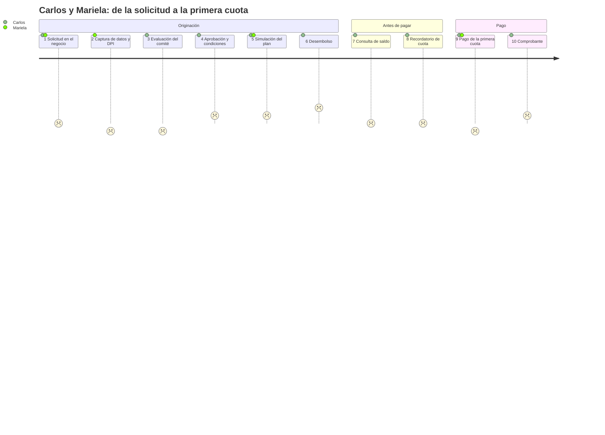

# E1 · Investigación de usuario

Proyecto 2 · Crédito Vecino, S. A. · Análisis de Sistemas II (037)

Este documento responde al entregable E1 del enunciado (sección 9): personas, journey map del flujo principal y momentos críticos donde un error de interfaz produce un error de dinero, incluido el momento en que el cliente descubre que su mora subió de tramo.

## 1. Método y estado de la evidencia

La investigación combina tres fuentes, y cada afirmación de este documento indica de cuál proviene:

| Código | Tipo de fuente | Qué aporta | Estado |
|---|---|---|---|
| **ENU** | Enunciado P2, sección 3 (contexto de los tres perfiles) | Condiciones de trabajo del asesor, necesidades del cliente y de gerencia | Requisito del caso |
| **DOC** | Fuentes documentadas: SIB (ENIF 2024-2027), Banco Mundial (Global Findex 2025, panorama Guatemala), DataReportal *Digital 2024: Guatemala*, IICA/BID sobre conectividad rural | Contexto nacional de inclusión financiera, uso de teléfono e internet y brecha territorial | Documentado |
| **NÚC** | Núcleo de cálculo del repositorio (`src/dominio`) y sus pruebas | Cifras exactas con las que se construyen los escenarios (Q1,004.62, Q18.14, 7.00 %, etc.) | Verificado por `npm test` |
| **HIP** | Hipótesis de diseño derivadas de las anteriores | Conductas concretas que el equipo espera encontrar en campo | **Pendiente de validar** con los instrumentos de `e1-instrumentos-investigacion.md` |

Hallazgos del contexto documentado que sustentan las personas:

- **Hay muchos teléfonos, pero no tanta internet.** En enero de 2024 Guatemala tenía 20.65 millones de conexiones móviles (113.3 % de la población), pero solo el 60.3 % de la población usaba internet (DataReportal, *Digital 2024: Guatemala*). *Implicación:* el cliente casi siempre tiene un teléfono, pero no se puede suponer que tenga datos móviles. Los avisos al cliente no pueden depender solo de una app.
- **La conectividad rural es baja.** El IICA, con apoyo del BID y Microsoft, ubica a Guatemala entre los nueve países de América Latina y el Caribe con menor conectividad rural. También señala que una alta penetración de teléfonos móviles no equivale a conectividad, porque esta se concentra en zonas urbanas (Prensa Libre, 2020). *Implicación:* el asesor que visita negocios fuera de la cabecera trabajará sin señal durante parte de su ruta (ENU lo confirma: "señal intermitente o nula").
- **Digitalizar es una prioridad nacional.** La Estrategia Nacional de Inclusión Financiera 2024-2027 de la SIB prioriza el uso de canales digitales en los servicios financieros. *Implicación:* la digitalización del cobro en campo está alineada con la política pública, pero debe incluir a clientes con poca experiencia digital.

> **Límite declarado.** A la fecha de este documento el equipo **no ha aplicado todavía** las entrevistas ni la observación de campo. Los instrumentos están listos en [e1-instrumentos-investigacion.md](e1-instrumentos-investigacion.md). Las personas son **provisionales**: sus rasgos marcados como HIP deben confirmarse o corregirse antes de cerrar el prototipo de alta fidelidad (E3). No presentamos hipótesis como hallazgos de campo.

## 2. Personas

Las tres personas siguen la plantilla del Anexo A del enunciado. La edad no se usa como indicador de habilidad digital.

### 2.1 Mariela López, asesora de crédito en campo

| Campo | Contenido | Fuente |
|---|---|---|
| Rol y contexto | Asesora de Crédito Vecino. Visita entre 8 y 12 clientes al día en sus negocios o casas, origina solicitudes y cobra cuotas atrasadas. Trabaja de pie, a menudo bajo el sol, y con una mano ocupada (cartapacio, efectivo o documentos del cliente). | ENU |
| Dispositivo | Teléfono Android de gama media proporcionado por la empresa: pantalla de unas 6", poca memoria libre y batería que debe durar toda la jornada. | ENU · HIP (modelo concreto) |
| Conectividad | Intermitente o nula en parte de la ruta. Buena señal solo en la oficina y en la cabecera municipal. | ENU · DOC |
| Iluminación | Luz solar directa: los grises claros y los textos pequeños no se leen. | ENU |
| Manos libres | Opera con el pulgar de una sola mano durante la visita; teclea poco y mal cuando está de pie. | ENU |
| Alfabetización digital | Operativa: usa WhatsApp, cámara y apps bancarias. No conoce el concepto de "sincronización" ni tiene por qué conocerlo. | HIP |
| Objetivos (en sus palabras) | "Terminar la visita sin volver a pedirle nada al cliente." · "Saber que el pago quedó registrado una sola vez." · "Poder explicarle al cliente a dónde se fue su dinero." | ENU · HIP |
| Frustraciones actuales (hojas de cálculo) | Anota el pago en papel y lo transcribe al volver a la oficina, a veces al día siguiente; la fecha que queda registrada es la de la transcripción, no la del pago. Cuando la hoja compartida no abre sin internet, lleva una copia impresa que ya está desactualizada. | HIP |
| Relación con la mora | Debe explicar por qué un cliente debe más este mes. Con la política escalonada tiene que explicar tramos, no una sola tasa. | ENU |
| Cita representativa | *"Si la app me hace escribir el DPI dos veces, el cliente piensa que no sé lo que hago."* | HIP (cita a validar en entrevista) |

**Qué exige a la interfaz:** diseño mobile-first con objetivos táctiles de 48 px o más (por encima del mínimo de 24 px de WCAG 2.5.8), alto contraste y un modo de trabajo sin conexión con estado visible ("Guardado en el teléfono · pendiente de enviar"). Montos siempre con el prefijo **Q** y separador de miles, y el menor tecleo posible.

### 2.2 Carlos Chávez, cliente de microcrédito

| Campo | Contenido | Fuente |
|---|---|---|
| Rol y contexto | Tiene una tienda de barrio. Pidió **Q10,000 a 12 meses** para surtir inventario: es el caso de referencia del P1, con una cuota de **Q1,004.62** y la cuota 12 de **Q1,004.63**. | ENU · NÚC |
| Dispositivo | Teléfono propio con saldo prepago. A veces tiene datos y a veces no; los SMS siempre le llegan. | DOC · HIP |
| Conectividad | Variable; en su zona la señal de datos es débil dentro del local. | DOC |
| Iluminación y entorno | Atiende la tienda mientras habla con la asesora; lo interrumpen clientes. | HIP |
| Alfabetización digital | Baja a media: lee mensajes y usa WhatsApp, pero no navega por menús complejos ni entiende "TNA", "Actual/360" ni "prelación". | ENU · HIP |
| Objetivos (en sus palabras) | "Saber cuánto debo, cuándo pago y cuánto me falta." · "Que me avisen antes, no cuando ya me cobraron más." · "Tener un papel o un mensaje que diga que ya pagué." | ENU |
| Frustraciones actuales | Recibe un solo número ("debe Q1,040.99") sin saber por qué subió. Desconfía de lo que no entiende y lo percibe como una multa arbitraria, exactamente lo que el Acta 09-2026 del comité quiere evitar. | ENU (sección 7.1) · HIP |
| Relación con la mora | Sabe que atrasarse cuesta más, pero no sabe **cuánto por día** ni que al día 31 se agrega un **gasto de gestión de cobro de Q25.00**. | ENU · NÚC |
| Cita representativa | *"Si me explican, pago; si me cae de sorpresa, siento que me están robando."* | HIP |

**Qué exige a la interfaz:** lenguaje llano ("lleva 45 días de atraso", no "Mora 2"), cifras que no se puedan malinterpretar, desglose progresivo (primero el total y, al tocarlo, los tramos) y avisos **antes** de cada cambio de tramo por un canal que no dependa de tener datos (SMS).

### 2.3 Andrea Morales, gerente de cartera y miembro del comité

| Campo | Contenido | Fuente |
|---|---|---|
| Rol y contexto | Gerente de cartera; integra el comité de crédito. Revisa indicadores a diario y presenta el cierre mensual al comité. | ENU |
| Dispositivo | Computadora de escritorio con monitor grande en oficina; consulta rápida desde el teléfono cuando está en reunión o fuera de la oficina. | ENU · HIP (uso móvil) |
| Conectividad | Estable en oficina. | ENU |
| Alfabetización digital | Alta en hojas de cálculo; alta alfabetización financiera. | HIP |
| Objetivos (en sus palabras) | "En 30 segundos saber si la cartera se está deteriorando." · "Pasar del porcentaje a los créditos concretos." · "Confiar en que el cierre no se duplicó." | ENU · HIP |
| Frustraciones actuales | Las hojas de cálculo rotulan como "mora" tanto la cartera con cualquier atraso como la cartera en riesgo. Cuando se da de baja un crédito, el indicador de riesgo baja (7.00 % → 6.06 %) y parece una mejora aunque no se cobró nada. | ENU (sección 7.8) · NÚC |
| Relación con la mora | Decide con cartera en mora (21.75 %), cartera en riesgo (7.00 %), el desglose por tramo e incobrables del período. | ENU · NÚC |
| Cita representativa | *"No me muestre un número sin decirme qué número es."* | HIP |

**Qué exige a la interfaz:** diseño responsivo pensado para escritorio, densidad alta pero con jerarquía clara, **rótulos y definiciones distintos** para cada indicador, lo dado por incobrable junto a la cartera en riesgo, y navegación de lo general al detalle del crédito (drill-down).

## 3. Journey map del flujo principal: de la solicitud a la primera cuota

Escenario: Carlos solicita Q10,000 a 12 meses con Mariela y paga su primera cuota de Q1,004.62. En la variante con atraso (etapas 9b y 9c), la cuota vencida usa el capital de la cuota 2 del caso de referencia (Q725.76), igual que los oráculos M-1 a M-5 del enunciado. Escala emocional: −2 muy negativa … +2 muy positiva.

| # | Etapa | Actor | Acción | Emoción | Punto de dolor concreto | Oportunidad de diseño | Pantalla | Fuente |
|---|---|---|---|---|---|---|---|---|
| 1 | Solicitud | Carlos, Mariela | Carlos dice cuánto necesita y en cuánto tiempo | 0: expectativa y duda | Mariela escribe "10000" en un campo sin formato; un cero de más (Q100,000) o de menos (Q1,000) no se detecta porque el campo no muestra separador de miles ni los límites Q1,000–Q25,000. | Campo con prefijo Q, formato en vivo "Q10,000.00", rango visible y validación inmediata; plazo con botones de 3 a 24 meses, no teclado. | Solicitud de crédito | ENU · HIP |
| 2 | Captura | Mariela | Registra DPI, datos del negocio y foto | −1: prisa | La señal se cae a mitad del formulario; al reintentar, la sesión expiró y Mariela debe **recapturar el DPI y los datos del negocio** frente al cliente. | Borrador guardado en el teléfono campo por campo; la sesión no expira mientras hay un borrador; aviso "Guardado en el teléfono". Cumple WCAG 3.3.7 (no pedir de nuevo un dato ya capturado). | Alta de cliente | ENU · HIP |
| 3 | Evaluación | Comité, Carlos | El comité revisa la solicitud | −1: incertidumbre | Carlos no sabe si su solicitud "está en algún lado". Mariela no puede decirle en qué estado está porque la hoja no guarda el historial. | Estado visible (Solicitado → En evaluación → Aprobado) consultable por la asesora; la bandeja del comité muestra el motivo si se rechaza. | Bandeja del comité | ENU · NÚC (estados) |
| 4 | Aprobación | Carlos | Recibe la noticia | +1: alivio | Le comunican "aprobado" sin la cuota ni el costo total; Carlos acepta sin saber que pagará **Q2,055.45 de interés**. | Resumen con monto, plazo, tasa en lenguaje llano ("3 % al mes"), cuota y total a pagar antes de confirmar. | Solicitud → simulación | NÚC |
| 5 | Simulación del plan | Carlos, Mariela | Revisan las 12 cuotas | +1: control | La cuota 12 dice **Q1,004.63** y Carlos cree que hay un error de un centavo. Si la pantalla la oculta o la iguala a Q1,004.62, el plan mostrado no coincide con el cobrado. | Plan con las 12 filas del núcleo y una nota junto a la cuota 12: "1 centavo más para cerrar el saldo exacto". | Plan de amortización | NÚC |
| 6 | Desembolso | Encargado, Carlos | Se confirma y se entrega el dinero | +2: alegría | Un doble toque en "Desembolsar" con la señal lenta puede generar **dos desembolsos** si la operación no es idempotente. | Pantalla de revisión y confirmación explícita (WCAG 3.3.4), botón deshabilitado tras el primer toque y clave de operación única. | Confirmación de desembolso | ENU · NÚC |
| 7 | Seguimiento | Carlos | Pregunta cuánto debe | 0 | La cifra que ve Mariela sin señal es de ayer y no dice de qué fecha es; Carlos recibe un saldo desactualizado. | Todo saldo muestra su fecha de corte: "Saldo al 23/09/2026". Sin conexión se rotula como "calculado con datos del 22/09". | Detalle del crédito | ENU · HIP |
| 8 | Recordatorio | Carlos | Recibe aviso de su primera cuota | 0 | El aviso llega por una app que Carlos no abre sin datos, o llega **el mismo día** del vencimiento. | SMS 3 días antes y el día del vencimiento con monto y fecha; canal a validar con la encuesta (pregunta 12). | (Notificación) | DOC · HIP |
| 9 | Pago | Mariela, Carlos | Mariela recibe Q1,004.62 y lo registra | −1: tensión | Mariela registra el pago sin señal. La app no dice si se envió; Mariela lo vuelve a intentar y teme **cobrarlo dos veces**. | Estado "Pendiente de enviar · se enviará solo al tener señal", misma clave de idempotencia en cada reintento y comprobante provisional. | Registro de pago en campo | ENU · NÚC |
| 9b | (Variante) Pago con atraso de 45 días | Mariela, Carlos | La cuota vencida suma Q1,047.76 | −2: sorpresa | Carlos esperaba pagar Q1,004.62 y le piden **Q1,047.76** sin explicación: Q25.00 de gasto + Q18.14 de mora + Q278.86 de interés + Q725.76 de capital. | Desglose en el orden de la prelación, con "¿por qué?" en cada concepto. | Detalle de la mora | NÚC (M-5) |
| 9c | (Variante) Cambio de tramo | Carlos | Pasa del día 30 al 31 | −2: enojo | En un día, el total de la cuota pasa de **Q1,015.51 a Q1,040.99** (+Q25.48) y Carlos se entera en la visita de cobro, cuando ya ocurrió. | Momento crítico MC-4 (sección 4). | Detalle de la mora + aviso | NÚC · HIP |
| 10 | Comprobante | Carlos | Recibe comprobante | +1: confianza | Un comprobante que solo dice "Pagado Q1,004.62" no permite comprobar cuánto fue a interés (Q300.00) y cuánto a capital (Q704.62). | Comprobante con la prelación aplicada y el saldo resultante (Q9,295.38), enviado por SMS o impreso. | Registro de pago → comprobante | NÚC |

Cifras de la primera cuota según el núcleo: interés Q300.00 + capital Q704.62 = Q1,004.62; el saldo pasa de Q10,000.00 a Q9,295.38.

## 4. Momentos críticos: error de interfaz → error de dinero

Cada momento indica la causa en la interfaz, la consecuencia monetaria con cifras del núcleo y el control de diseño que la previene.

| ID | Momento | Error de interfaz | Consecuencia en dinero | Prevención (diseño) | Recuperación |
|---|---|---|---|---|---|
| **MC-1** | Captura del monto en la solicitud | Campo numérico sin formato ni límites; se teclea "1000" en lugar de "10000" o se escribe un punto decimal como separador de miles | Un crédito de Q1,000 en vez de Q10,000 cambia **las 12 cuotas** (de Q1,004.62 a unos Q100.46) y el contrato firmado no refleja lo solicitado | Prefijo Q, formato en vivo, rango Q1,000–Q25,000 visible, resumen "Diez mil quetzales" en letras antes de confirmar | Botón "Editar" en la pantalla de revisión; nada se envía sin confirmación (WCAG 3.3.4) |
| **MC-2** | Registro de un pago sin señal | La app no muestra el estado del envío y Mariela toca "Registrar" otra vez o captura el pago de nuevo | **Doble cobro**: Q1,004.62 × 2; el cliente pierde la confianza | Cola local con **la misma Idempotency-Key** en cada reintento; estado visible Pendiente / Enviado / Confirmado; el botón se bloquea tras el primer toque (ver E4) | Si el servidor responde que la clave ya existe, se muestra el pago original y no se crea otro |
| **MC-3** | Lectura del tablero gerencial | Rotular igual "cartera en mora" (21.75 %) y "cartera en riesgo" (7.00 %), o mostrar solo uno sin decir cuál es | El comité decide sobre el número equivocado: provisiona o restringe la colocación por 21.75 % cuando el riesgo real es 7.00 %, o celebra un 6.06 % que solo bajó por la baja de C-005 | Dos tarjetas con nombre, definición y forma distintos; incobrables del período junto al riesgo (ver E2, sección 5) | Enlace "¿Qué incluye?" en cada indicador, que abre el desglose por tramo |
| **MC-4** | **El cliente descubre que su mora subió de tramo** | Sin aviso previo: el cliente se entera después y por la persona que le cobra | +Q25.48 en un día (Q1,015.51 → Q1,040.99), percibidos como multa arbitraria; más probabilidad de disputa y de dejar de pagar | Aviso preventivo por SMS y detalle por tramos (ver 4.1) | La pantalla de detalle de la mora permite verificar tramo por tramo |

### 4.1 MC-4 en detalle: el cambio de tramo

El enunciado pregunta: *¿Se enteró antes o después? ¿Por qué canal?*

**Situación actual (con hojas de cálculo):** Carlos se entera **después** y **en persona**. La política escalonada genera el gasto de gestión de cobro precisamente al entrar en Mora 2 (día 31), que es también cuando "se activa la gestión de cobro en campo" (sección 7.2). Por eso el primer contacto de Carlos con el nuevo tramo es la visita de Mariela, que llega a cobrar un total que ya subió.

| Día de atraso de la cuota 2 (capital Q725.76) | Tramo | Mora acumulada | Gasto de cobro | Total de la cuota (gasto + mora + Q278.86 + Q725.76) |
|---|---|---|---|---|
| 15 | Mora 1 | Q5.44 | Q0.00 | Q1,010.06 |
| 28 | Mora 1 | Q10.16 | Q0.00 | Q1,014.78 |
| 30 | Mora 1 | Q10.89 | Q0.00 | Q1,015.51 |
| **31** | **Mora 2** | **Q11.37** | **Q25.00** | **Q1,040.99** |
| 45 | Mora 2 | Q18.14 | Q25.00 | Q1,047.76 |
| 60 | Mora 2 | Q25.40 | Q25.00 | Q1,055.02 |
| 61 | Mora 3 | Q26.01 | Q25.00 | Q1,055.63 |
| 91 | Vencido | Q44.27 | Q25.00 | Q1,073.89 |

Además, en los días 1 a 30 la mora crece Q0.36 por día y en los días 31 a 60 crece Q0.48 por día. Esto responde a la pregunta del objetivo de aprendizaje: *por qué su mora creció más rápido este mes que el anterior*.

**Situación propuesta: Carlos se entera antes, por dos canales.**

| Cuándo | Canal | Mensaje (lenguaje llano, a validar con clientes) | Por qué ese canal |
|---|---|---|---|
| Día 28 de atraso | **SMS** | "Crédito Vecino: su cuota 2 lleva 28 días de atraso. Si paga en los próximos 2 días debe Q1,015.51. Después se agrega un cargo de visita de cobro de Q25.00." | Llega sin datos móviles; hay más conexiones móviles que usuarios de internet (DOC) |
| Día 31 (al entrar en Mora 2) | **SMS** + visita de la asesora | "Su cuota 2 pasó a más de 30 días de atraso. Ahora debe Q1,040.99. Pida a su asesora el detalle." | Confirma el cambio; el detalle se explica en persona |
| En la visita | **Pantalla "Detalle de la mora"**, en el teléfono de la asesora | Desglose por tramos recorridos: "30 días a 18 % al año → Q10.89 · 1 día a 24 % → Q0.48 · total redondeado una vez → Q11.37" | El cliente puede verificar; la asesora no tiene que improvisar la explicación |

El sistema calcula el plazo con la fecha de vencimiento real de la cuota más 30 días, a partir de la fecha de corte que recibe como parámetro. El núcleo expone el tramo (`clasificarTramoMora`) y el desglose (`detalle.tramos`), así que la interfaz no recalcula nada: solo presenta. El umbral de "3 días antes" y la redacción son hipótesis que se validan con las preguntas 9 y 10 de la guía de cliente y con las preguntas 11 y 12 de la encuesta.

## 5. Oportunidades priorizadas y trazabilidad hacia E2–E4

| ID | Oportunidad | Perfil | Prioridad | Dónde se resuelve |
|---|---|---|---|---|
| OP-1 | Borrador local y cola de pagos idempotente | Asesora | Alta | E4 §4 · pantallas Alta de cliente y Registro de pago |
| OP-2 | Revisión de monto, plazo y cuota antes de confirmar | Asesora, cliente | Alta | E2 · Solicitud, Simulación y Confirmación de desembolso |
| OP-3 | Mora explicada por tramos y avisada antes | Cliente | Alta | E2 · Detalle de la mora; aviso por SMS (MC-4) |
| OP-4 | Indicadores de mora y de riesgo claramente diferenciados | Gerencia | Alta | E2 §5 · Tablero gerencial |
| OP-5 | Objetivos táctiles grandes y alto contraste | Asesora | Media-alta | E4 §3 · sistema responsivo |
| OP-6 | Comprobante con la prelación aplicada | Cliente | Media-alta | E2 · Comprobante |

## 6. Plan de validación pendiente

1. Aplicar al menos una entrevista por perfil (guías en `e1-instrumentos-investigacion.md`) y una observación de una tarea de captura o cobro al aire libre.
2. Actualizar la columna "Fuente" de cada rasgo marcado HIP a **Validado**, **Corregido** o **Descartado**, con el código anónimo del participante.
3. Probar la comprensión de la pantalla "Detalle de la mora" (caso M-3) con al menos tres personas sin formación financiera.

## Referencias

- Banco Mundial (2025). *The Global Findex Database 2025: Connectivity and Financial Inclusion in the Digital Economy*. https://www.worldbank.org/en/publication/globalfindex
- Banco Mundial (2025). *Guatemala 2024 Global Findex Microdata*. https://doi.org/10.48529/ad4w-j084
- Grupo Banco Mundial (2026). *Guatemala: panorama general*. https://www.bancomundial.org/ext/es/country/guatemala
- DataReportal (2024). *Digital 2024: Guatemala*. https://datareportal.com/reports/digital-2024-guatemala
- Prensa Libre (2020). *Guatemala, entre los nueve países con baja conectividad rural*, con datos de IICA, BID y Microsoft. https://www.prensalibre.com/economia/guatemala-entre-los-nueve-paises-con-baja-conectividad-rural-y-las-claves-para-ampliar-la-cobertura/
- Superintendencia de Bancos de Guatemala (2024). *Estrategia Nacional de Inclusión Financiera 2024-2027*. https://www.sib.gob.gt/estrategia-nacional-de-inclusion-financiera-guatemala-2024-2027/
- Universidad Mariano Gálvez de Guatemala (2026). *Enunciado del Proyecto 2*, secciones 3, 7 y 9.
