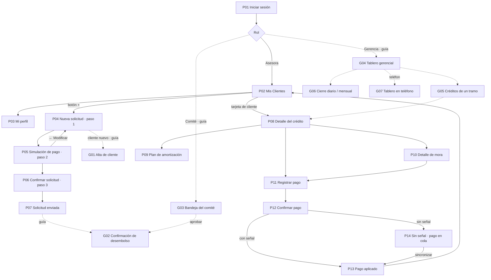

# E2 · Arquitectura de información y wireframes

Proyecto 2 · Crédito Vecino, S. A. · Análisis de Sistemas II (037)

Este documento responde al entregable E2: mapa de navegación, tabla de correspondencia pantalla ↔ caso de uso (sección 6.1 del enunciado), wireframes de baja fidelidad y justificación de la jerarquía del tablero gerencial (sección 7.8).

## 1. Principios que ordenan la información

Cada principio sale de un hallazgo de [E1](e1-investigacion-usuario.md):

1. **Una aplicación, tres puertas de entrada.** Después de *Iniciar sesión* (P01), cada rol ve su propio inicio: la asesora ve **Mis Clientes** (P02), el comité su **Bandeja** (G03) y la gerencia el **Tablero** (G04). No hay una "pantalla para todos" (enunciado, sección 3).
2. **Cada pantalla invoca un puerto primario del P1.** La interfaz no calcula cifras: presenta lo que devuelve el núcleo (sección 6.2). Por eso cada wireframe indica de qué función sale cada número.
3. **El estado de envío siempre está a la vista** en el móvil: la pantalla *Sin señal* (P14) muestra el pago en cola y *Mi perfil* (P03) el estado de sincronización (heurística 1 de Nielsen, OP-1).
4. **Toda cifra muestra su fecha de corte.** El tramo depende de la fecha, y la fecha de corte es un parámetro (puerto `Reloj`), no "hoy".
5. **La ayuda está en el mismo lugar en todas las pantallas** (WCAG 3.2.6). En el prototipo solo aparece en el inicio de sesión; es un hallazgo del E5 (H-11).

### 1.1 Una sola fuente para el diseño: el prototipo de Figma

Para que la documentación y el prototipo **no se desfasen**, todas las pantallas se nombran igual que en el [prototipo de Figma](https://www.figma.com/proto/jozM3QI8ZJ6pywdCoO5OVo/Microcr%C3%A9ditos-App?node-id=0-1&t=PJlTVLC3ASu31ttw-1) y se identifican con un código:

- **P01–P14:** pantallas que **ya existen en Figma**. Sus wireframes reproducen la misma disposición, los mismos componentes y el mismo orden de los bloques.
- **G01–G07:** pantallas que el enunciado exige y que **todavía no existen en Figma**. Sus wireframes son la **guía para construirlas** con el mismo lenguaje visual (encabezado oscuro, tarjetas blancas, botón principal abajo).

Cuando una cifra del prototipo no coincide con el núcleo, el wireframe muestra la cifra correcta y lo marca con **"CORREGIR EN FIGMA"**. La lista completa de correcciones está en el E3 y el E5.

## 2. Mapa de navegación

Las flechas continuas existen en el prototipo; las punteadas son las que faltan construir. Versión en imagen, con carriles por perfil: [wireframes/mapa-navegacion.svg](wireframes/mapa-navegacion.svg).

Los tres flujos navegables que exige el E3 recorren este mapa así:

| Flujo E3 | Recorrido | Estado en Figma |
|---|---|---|
| 1. Originación | P02 (+) → P04 Nueva solicitud → P05 Simulación → P06 Confirmar → P07 Enviada → **G02 Desembolso** | Existe hasta P07; falta G02 |
| 2. Cobro en campo | P02 buscar → P08 saldo y tramo → P10 desglose de la mora → P11 registrar pago → P12 confirmar → P13 comprobante (o P14 sin señal) | Completo |
| 3. Consulta gerencial | **G04 Tablero** → tramo de la cartera en riesgo → **G05 créditos de ese tramo** → P08 | Falta construir G04 y G05 |

## 3. Tabla de correspondencia pantalla ↔ caso de uso

### 3.1 Tabla obligatoria de la sección 6.1

| Puerto primario del enunciado (6.1) | Puerto definido en el P1 (`FASE-06`, sección 8) | Caso de uso P1 | Pantalla P2 | Código |
|---|---|---|---|---|
| RegistrarCliente | `RegistrarCliente` | CU-01 Registrar cliente | Alta de cliente | G01 (guía) |
| SolicitarCredito | `SolicitarCredito` | CU-02 Solicitar crédito | Nueva solicitud → Simulación de pago → Confirmar solicitud → Solicitud enviada | P04, P05, P06, P07 |
| EvaluarSolicitud | `EvaluarCredito` + `DecidirSolicitud` | CU-03 Evaluar, CU-04 Aprobar, CU-05 Rechazar | Bandeja del comité | G03 (guía) |
| DesembolsarCredito | `DesembolsarCredito` | CU-06 Desembolsar crédito | Confirmación de desembolso | G02 (guía) |
| RegistrarPago | `RegistrarPago` | CU-07 Registrar pago | Registrar pago → Confirmar pago → Pago aplicado / Sin señal | P11, P12, P13, P14 |
| ConsultarCarteraEnRiesgo | `ConsultarCarteraEnRiesgo` | CU-14 Consultar cartera en riesgo | Tablero gerencial, créditos de un tramo y tablero en teléfono | G04, G05, G07 (guías) |
| GenerarCierre | `GenerarCierre` | CU-12 Cierre diario, CU-13 Cierre mensual | Cierre diario / mensual | G06 (guía) |

> **Nota de coherencia.** En el P1 el puerto que el enunciado llama `EvaluarSolicitud` quedó dividido en dos puertos: `EvaluarCredito` (el analista registra la evaluación) y `DecidirSolicitud` (el comité aprueba o rechaza). La Bandeja del comité usa ambos. No se cambia el nombre de los puertos del P1, para respetar la regla de incrementalidad.

### 3.2 Pantallas de apoyo: también corresponden a un caso de uso

La penalización de la sección 10 aplica a pantallas **sin** caso de uso. Por eso se trazan también las pantallas que no aparecen en la tabla 6.1:

| Pantalla (Figma) | Código | Puerto P1 | Caso de uso | Función del núcleo que provee las cifras |
|---|---|---|---|---|
| Mis Clientes (con búsqueda) | P02 | `ConsultarCredito` (cartera de la asesora) | CU-15 | `consultarMora` (días y tramo por cuota) |
| Detalle del crédito | P08 | `ConsultarCredito` + `CalcularMora` | CU-15, CU-08 | `consultarMora`, `clasificarTramoMora` |
| Plan de amortización | P09 | `ConsultarCredito` | CU-15 | `plan-amortizacion.ts` |
| Detalle de mora | P10 | `CalcularMora` | CU-08 | `CalculadoraMora.calcular` → `detalle.tramos` |
| Iniciar sesión | P01 | — (autenticación, fuera de alcance del P2) | — | — |
| Mi perfil | P03 | — | — | — |

**Iniciar sesión (P01) y Mi perfil (P03)** no corresponden a un caso de uso del P1: son pantallas de soporte de sesión. P01 es necesaria para entrar a la aplicación; P03 muestra el estado de sincronización que exige la estrategia sin conexión del E4. El equipo debe decidir si se justifican así ante el catedrático o si P03 se retira del prototipo (la sección 10 resta 0.5 puntos por pantalla sin caso de uso).

Ningún caso de uso principal queda sin pantalla. `ReestructurarCredito` (CU-10), `DeclararIncobrable` (CU-11), `AnularCredito` (CU-17) y `AdministrarPolitica` (CU-16) son operaciones administrativas que el enunciado no exige prototipar. En el Proyecto Final se accederán desde el detalle del crédito en la vista de gerencia (G05 → P08). CU-18 Cancelar crédito no tiene pantalla propia porque ocurre como resultado de un pago que deja el saldo en Q0.00 (CP-04.1).

## 4. Wireframes de baja fidelidad

Cada pantalla se dibuja en **dos niveles** a partir de **una sola descripción** (script `wireframes/generar_wireframes_figma.py`), así ambos niveles y el prototipo no pueden quedar distintos:

| Nivel | Qué muestra | Carpeta |
|---|---|---|
| **Skeleton** | Solo bloques grises que indican dónde va cada elemento, sin textos ni cifras | [`wireframes/skeleton/`](wireframes/skeleton/) |
| **Wireframe anotado** | Los mismos bloques con textos, cifras del núcleo y notas numeradas que justifican cada decisión | [`wireframes/anotado/`](wireframes/anotado/) |
| **Alta fidelidad** | Color, tipografía, componentes y navegación | [Prototipo de Figma](https://www.figma.com/proto/jozM3QI8ZJ6pywdCoO5OVo/Microcr%C3%A9ditos-App?node-id=0-1&t=PJlTVLC3ASu31ttw-1) |

### 4.1 Pantallas del prototipo (P01–P14, móvil)

| Código | Pantalla en Figma | Decisión principal | Skeleton | Anotado |
|---|---|---|---|---|
| P01 | Iniciar sesión | Contraseña con opción de mostrarla; ayuda visible ("Llama al soporte técnico") |  |  |
| P02 | Mis Clientes | Búsqueda por nombre o municipio; orden por prioridad; etiqueta de tramo y días; botón + |  |  |
| P03 | Mi perfil | Estado operativo y de sincronización de la asesora |  |  |
| P04 | Nueva solicitud (paso 1) | Cliente de una lista; monto con − / + y montos rápidos; plazo con botones; cuota estimada |  |  |
| P05 | Simulación de pago (paso 2) | Las 12 cuotas del núcleo para Q5,000 a 12 meses |  |  |
| P06 | Confirmar solicitud (paso 3) | Aviso "Revise antes de enviar" y resumen completo (WCAG 3.3.4) |  |  |
| P07 | Solicitud enviada | Número de referencia y próximos pasos |  |  |
| P08 | Detalle del crédito | Estado y tramo en lenguaje llano; lo exigible hoy; accesos a plan y mora |  |  |
| P09 | Plan de amortización | Caso de referencia Q10,000; cuota 12 de Q1,004.63 resaltada **y explicada** |  |  |
| P10 | Detalle de mora | Caso M-3: una tarjeta por tramo recorrido, tasas anuales y nota de redondeo (Q50.80) |  |  |
| P11 | Registrar pago | Monto con separador de miles; prelación visible antes de confirmar |  |  |
| P12 | Confirmar pago | "Confirme antes de aplicar"; fecha fijada al confirmar; salida "Modificar monto" |  |  |
| P13 | Pago aplicado | Comprobante con la distribución y el saldo restante |  |  |
| P14 | Sin señal | Pago en cola con folio fijo (clave de idempotencia) y sincronización |  |  |

### 4.2 Guías para las pantallas que faltan en Figma (G01–G07)

| Código | Pantalla | Formato | Caso de uso | Skeleton | Anotado |
|---|---|---|---|---|---|
| G01 | Alta de cliente | Móvil | CU-01 |  |  |
| G02 | Confirmación de desembolso | Móvil | CU-06 |  |  |
| G03 | Bandeja del comité | Escritorio | CU-03/04/05 |  |  |
| G04 | Tablero gerencial | Escritorio | CU-14 |  |  |
| G05 | Créditos de un tramo | Escritorio | CU-14 |  |  |
| G06 | Cierre diario / mensual | Escritorio | CU-12/13 |  |  |
| G07 | Tablero en teléfono | Móvil | CU-14 |  |  |

### 4.3 La pantalla difícil: Detalle de mora (P10)

El enunciado advierte que mostrar solo "Mora: Q50.80" no permite verificar nada, y que mostrar la fórmula completa no se entiende. El prototipo ya resuelve bien la **forma**: una tarjeta por tramo recorrido, con el rango de días y los días en ese tramo. Lo que falta es que las **cifras** sean las del núcleo:

| Qué muestra el wireframe | Qué oculta | Por qué |
|---|---|---|
| Resumen arriba: 100 días · capital en mora Q725.76 · mora total Q50.80 | El saldo total del crédito | La mora se calcula sobre el capital de la cuota vencida, no sobre el saldo total |
| Una tarjeta por tramo con el rango de días ("Días 31–60 · 30 días en este tramo") | Solo el nombre "Mora 2" | El cliente entiende días, no nombres de tramo (heurística 2 de Nielsen) |
| Tasa **anual** del tramo ("24 % al año") y mora por día (Q0.48) | La tasa diaria 0.000666667 | Una tasa diaria no significa nada para el cliente |
| Importe por tramo a 2 decimales con asterisco | Los importes con 4 decimales | Legibilidad |
| Tarjeta "Cómo se calculó" con los 4 decimales y la **nota de redondeo** | — | Sumar las filas redondeadas da **Q50.81**; el total oficial es **Q50.80** porque se redondea una sola vez (sección 7.3) |

Los importes por tramo salen de `detalle.tramos[].importeSinRedondear` y el total de `interesMoratorio`. La interfaz solo formatea: nunca suma ni redondea por su cuenta.

## 5. Jerarquía del tablero gerencial (G04)

### 5.1 Qué se ve primero y por qué

El tablero se lee en forma de Z, de izquierda a derecha y de arriba abajo. El orden sigue las preguntas que Andrea trae al comité (E1, §2.3):

| Orden | Zona | Contenido (cifras del núcleo) | Pregunta que responde | Por qué en ese lugar |
|---|---|---|---|---|
| 0 | Línea de contexto | Fecha de corte, "cierre congelado ✓" y política por fecha de otorgamiento | ¿De cuándo son estos números? ¿Son definitivos? | Un indicador sin fecha no sirve para decidir; con la mora escalonada, el tramo depende de la fecha |
| 1 | Tarjeta principal, arriba a la izquierda | **Cartera en riesgo 7.00 %** (Q56,000 de Q800,000) | ¿Cuánto de la cartera está en deterioro real? | Es el indicador sobre el que decide el comité (provisiones, restricciones de colocación) |
| 2 | Junto al riesgo | **Dado por incobrable en el período** (C-007) | ¿El riesgo bajó porque cobramos o porque dimos de baja? | El enunciado exige mostrarlo junto al riesgo: declarar incobrable a C-005 bajaría el indicador de 7.00 % a 6.06 % sin cobrar nada |
| 3 | Tercera tarjeta | **Cartera en mora 21.75 %** (Q174,000) | ¿Cuántos clientes tienen algún atraso? | Es una alerta temprana útil, pero no es la base de la decisión de riesgo; por eso va después |
| 4 | Bloque central | Riesgo por tramo: 3.00 + 2.25 + 1.00 + 0.75 = **7.00 %** | ¿Dónde está concentrado el riesgo? | Explica la tarjeta 1 y es la entrada al detalle (flujo 3 de E3) |
| 5 | Parte inferior | Desembolsos y recuperaciones del período | ¿Cómo se movió la cartera en el período? | Contexto de actividad; se consulta después de entender el riesgo |
| — | Panel derecho plegable | Asistente conversacional (Proyecto Final) | "¿Por qué subió la mora de…?" | Ver §5.3 |

### 5.2 Cómo se distinguen la cartera en mora y la cartera en riesgo

Confundir estos dos indicadores es un hallazgo de severidad 4 y una penalización de −0.5 puntos (sección 10). El diseño los separa con **cinco señales independientes**, para que ninguna dependa solo del color (WCAG 1.4.1):

| Señal | Cartera en RIESGO | Cartera en MORA |
|---|---|---|
| Rótulo | "Cartera en **RIESGO**" | "Cartera en **MORA**" (la palabra distinta, en mayúsculas) |
| Definición visible bajo la cifra | "Más de 30 días + reestructurados" | "Cualquier atraso ≥ 1 día" |
| Símbolo | ▲ | ● |
| Borde de la tarjeta | Grueso y continuo (indicador principal) | Discontinuo |
| Posición | Primera, junto a incobrables | Tercera, separada por la tarjeta de incobrables |
| Color en alta fidelidad (E3) | Color de alerta del sistema de diseño | Neutro / informativo |

Además, el bloque de tramos explica expresamente por qué Mora 1 no forma parte del riesgo ("Q124,000 con atraso ≤ 30 días se ven en *Cartera en mora*"). Así, un lector que sume los tramos no busca el 21.75 % en ese bloque.

Origen de las cifras: `calcularCarteraPorTramo` devuelve `carteraActiva`, `tramosEnRiesgo[]`, `totalEnRiesgo`, `carteraEnMora` e `incobrablesDelPeriodo`. Los porcentajes llegan ya conciliados para que sumen exactamente el total (invariante 7 de la sección 7.9). El tablero no recalcula nada (CP-04.3). El enunciado no da el saldo de C-007; el tablero lo toma de `incobrablesDelPeriodo` del cierre, por eso la guía G04 no muestra un monto inventado.

> **Observación para el equipo.** En `tests/cartera-por-tramo.test.ts` los créditos se llaman C-001, C-002… con las cifras de la sección 7.8, pero los identificadores no coinciden con los del enunciado (C-003 con 45 días, C-004 con 75 días, etc.). Los montos y porcentajes sí coinciden. El prototipo usa los identificadores del enunciado; conviene alinear el fixture para que la defensa no se preste a confusión.

### 5.3 El lugar del asistente (sección 6.3)

El chat del Proyecto Final ocupa una **columna derecha plegable** (G04) y, en el teléfono, un acceso desde el tablero móvil (G07). Justificación:

- **No tapa las cifras**: las tarjetas y el desglose quedan a la izquierda, en el recorrido natural de lectura.
- **Convive con el tablero**: la gerencia puede preguntar "¿por qué C-004 está en Mora 3?" mientras ve el tramo. El asistente responde con la misma fuente que el tablero (el núcleo) y cita de dónde sale cada cifra.
- **Plegable**: si no se usa, el tablero recupera ancho sin reorganizarse.

## 6. Qué se validará en E3 y E5

- Prueba de lectura del tablero (cinco segundos): ¿qué porcentaje reporta el participante como "riesgo"?
- Prueba de comprensión de P10 con tres personas sin formación financiera: ¿pueden explicar por qué la mora de los días 91–100 es de Q7.26 si son solo 10 días?
- Tiempo para registrar un pago con una mano, de pie (P11 → P12): objetivo de menos de 30 segundos y 4 toques desde P08.

*Uso de IA declarado (sección 15):* los SVG de baja fidelidad se generaron con apoyo de un asistente de IA a partir de las decisiones del equipo, mediante el script editable `wireframes/generar_wireframes_figma.py`, tomando como referencia las pantallas del prototipo de Figma. Las decisiones de jerarquía y su justificación son del equipo y deben revisarse antes de la entrega.
