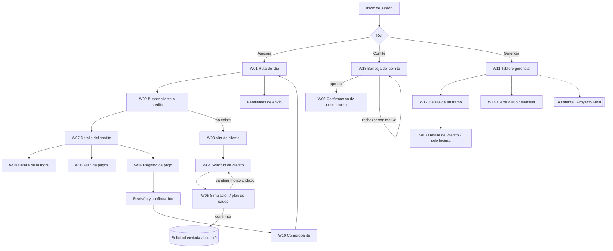

# E2 · Arquitectura de información y wireframes

Proyecto 2 · Crédito Vecino, S. A. · Análisis de Sistemas II (037)

Este documento responde al entregable E2: mapa de navegación, tabla de correspondencia pantalla ↔ caso de uso (sección 6.1 del enunciado), wireframes de baja fidelidad y justificación de la jerarquía del tablero gerencial (sección 7.8).

## 1. Principios que ordenan la información

Cada principio sale de un hallazgo de [E1](e1-investigacion-usuario.md):

1. **Una aplicación, tres puertas de entrada.** Al iniciar sesión, cada rol ve su propio inicio: la asesora ve su **Ruta del día**, la gerencia el **Tablero** y el comité su **Bandeja**. No hay una "pantalla para todos" (enunciado, sección 3).
2. **Cada pantalla invoca un puerto primario del P1.** La interfaz no calcula cifras: presenta lo que devuelve el núcleo (sección 6.2). Por eso cada wireframe indica de qué función sale cada número.
3. **El estado de envío siempre está a la vista** en el móvil: En línea, Sin señal · N pendientes o Enviando (heurística 1 de Nielsen, OP-1).
4. **Toda cifra muestra su fecha de corte.** El tramo depende de la fecha, y la fecha de corte es un parámetro (puerto `Reloj`), no "hoy".
5. **La ayuda (?) está en el mismo lugar en todas las pantallas** (WCAG 3.2.6).

## 2. Mapa de navegación

Versión en imagen, con carriles por perfil: [wireframes/mapa-navegacion.svg](wireframes/mapa-navegacion.svg).

Los tres flujos navegables que exige E3 recorren este mapa así:

| Flujo E3 | Recorrido en el mapa |
|---|---|
| 1. Originación | W04 Solicitud → W05 Simulación → W13 Decisión del comité → W06 Confirmación de desembolso |
| 2. Cobro en campo | W02 Buscar → W07 Saldo y tramo → W08 Desglose de la mora → W09 Registrar pago → W10 Comprobante |
| 3. Consulta gerencial | W11 Tablero → tramo de la cartera en riesgo → W12 Créditos de ese tramo |

## 3. Tabla de correspondencia pantalla ↔ caso de uso

### 3.1 Tabla obligatoria de la sección 6.1

| Puerto primario del enunciado (6.1) | Puerto definido en el P1 (`FASE-06`, sección 8) | Caso de uso P1 | Pantalla P2 | Wireframe |
|---|---|---|---|---|
| RegistrarCliente | `RegistrarCliente` | CU-01 Registrar cliente | Alta de cliente | W03 |
| SolicitarCredito | `SolicitarCredito` | CU-02 Solicitar crédito | Solicitud de crédito (+ simulación del plan) | W04, W05 |
| EvaluarSolicitud | `EvaluarCredito` + `DecidirSolicitud` | CU-03 Evaluar, CU-04 Aprobar, CU-05 Rechazar | Bandeja del comité | W13 |
| DesembolsarCredito | `DesembolsarCredito` | CU-06 Desembolsar crédito | Confirmación de desembolso | W06 |
| RegistrarPago | `RegistrarPago` | CU-07 Registrar pago | Registro de pago en campo (+ comprobante) | W09, W10 |
| ConsultarCarteraEnRiesgo | `ConsultarCarteraEnRiesgo` | CU-14 Consultar cartera en riesgo | Tablero gerencial (+ detalle de tramo) | W11, W12, W15 |
| GenerarCierre | `GenerarCierre` | CU-12 Cierre diario, CU-13 Cierre mensual | Cierre diario / mensual | W14 |

> **Nota de coherencia.** En el P1 el puerto que el enunciado llama `EvaluarSolicitud` quedó dividido en dos puertos: `EvaluarCredito` (el analista registra la evaluación) y `DecidirSolicitud` (el comité aprueba o rechaza). La Bandeja del comité usa ambos. No se cambia el nombre de los puertos del P1, para respetar la regla de incrementalidad.

### 3.2 Pantallas de apoyo: también corresponden a un caso de uso

La penalización de la sección 10 aplica a pantallas **sin** caso de uso. Por eso se trazan también las pantallas que no aparecen en la tabla 6.1:

| Pantalla | Puerto P1 | Caso de uso | Wireframe | Función del núcleo que provee las cifras |
|---|---|---|---|---|
| Ruta del día | `ConsultarCredito` (lista filtrada por asesora) | CU-15 | W01 | `consultarMora` (días y tramo por cuota) |
| Buscar cliente o crédito | `ConsultarCredito` | CU-15 | W02 | — |
| Detalle del crédito | `ConsultarCredito` + `CalcularMora` | CU-15, CU-08 | W07 | `consultarMora`, `clasificarTramoMora` |
| Plan de amortización | `SolicitarCredito` (simulación) / `ConsultarCredito` | CU-02, CU-15 | W05 | `plan-amortizacion.ts` |
| Detalle de la mora | `CalcularMora` | CU-08 | W08 | `CalculadoraMora.calcular` → `detalle.tramos` |
| Comprobante | `RegistrarPago` (resultado) | CU-07 | W10 | `prelacion-pago.ts`, `gasto-gestion-cobro.ts` |
| Tablero en teléfono | `ConsultarCarteraEnRiesgo` | CU-14 | W15 | `calcularCarteraPorTramo` |

Ningún caso de uso principal queda sin pantalla. `ReestructurarCredito` (CU-10), `DeclararIncobrable` (CU-11), `AnularCredito` (CU-17) y `AdministrarPolitica` (CU-16) son operaciones administrativas que el enunciado no exige prototipar. Se accederán desde el detalle del crédito en la vista de gerencia (W12 → W07) en el Proyecto Final. CU-18 Cancelar crédito no tiene pantalla propia porque ocurre como resultado de un pago que deja el saldo en Q0.00 (CP-04.1).

## 4. Wireframes de baja fidelidad

Los wireframes están en [`wireframes/`](wireframes/) en formato SVG, en escala de grises, y cada uno lleva anotaciones numeradas que explican las decisiones. Son evidencia del proceso: preceden al prototipo de alta fidelidad en Figma (E3), donde se aplicarán color, tipografía y componentes. Todas las cifras son las del caso de referencia y las de los oráculos del núcleo.

### 4.1 Asesora y cliente (móvil, 360 × 720)

| # | Pantalla | Decisión principal | Archivo |
|---|---|---|---|
| W01 | Ruta del día | Aviso de conexión fijo arriba; cada tarjeta de cliente completa es el objetivo táctil |  |
| W02 | Buscar | Búsqueda por nombre parcial, DPI o número de crédito; funciona sin señal sobre la cartera de la ruta |  |
| W03 | Alta de cliente | Foto del DPI para autocompletar; borrador guardado en el teléfono por campo |  |
| W04 | Solicitud | Monto con prefijo Q, formato en vivo, rango y monto en letras; plazo con botones |  |
| W05 | Plan de pagos | Las 12 cuotas del núcleo; la cuota 12 de Q1,004.63 resaltada y explicada |  |
| W06 | Confirmación de desembolso | Resumen completo + casilla "el cliente revisó" + salida "Volver y corregir" |  |
| W07 | Detalle del crédito | Lo que debe hoy va primero; tramo en lenguaje llano; aviso del siguiente tramo |  |
| W08 | Detalle de la mora | Caso M-3: una fila por tramo recorrido y un total redondeado una sola vez |  |
| W09 | Registro de pago | Prelación visible **antes** de confirmar; aviso sin conexión |  |
| W10 | Comprobante | Estados Pendiente / Enviado / Confirmado; clave de operación visible |  |

### 4.2 Gerencia y comité (escritorio, 1280 × 760)

| # | Pantalla | Archivo |
|---|---|---|
| W11 | Tablero gerencial |  |
| W12 | Detalle de un tramo |  |
| W13 | Bandeja del comité |  |
| W14 | Cierre diario / mensual |  |
| W15 | Tablero en teléfono (ver E4) |  |

### 4.3 La pantalla difícil: Detalle de la mora (W08)

El enunciado advierte que mostrar solo "Mora: Q50.80" no permite verificar nada, y que mostrar la fórmula completa no se entiende. El punto intermedio elegido:

| Qué muestra | Qué oculta | Por qué |
|---|---|---|
| Rango de días de cada tramo ("Días 31–60") | La palabra "Mora 2" | El cliente entiende días, no nombres de tramo (heurística 2 de Nielsen) |
| Tasa **anual** ("24 % al año") | La tasa diaria 0.000666667 | Una tasa diaria no significa nada para Carlos |
| Días recorridos en cada tramo y una barra proporcional | La fórmula Σ capital × tasa × días / 360 | La barra muestra que el último tramo tiene solo 10 días |
| Importe por tramo a 2 decimales con asterisco | Los importes con 4 decimales (Q10.8864…) | Legibilidad |
| **Nota de redondeo**: "Suma exacta Q50.8032, redondeada una sola vez al final" | — | Si se redondea cada fila por separado, la suma da **Q50.81**, no Q50.80. Sin la nota, el cliente que suma las filas ve un error de un centavo. La nota hace visible la regla 7.3 en lugar de esconderla |
| Contraste con la política retroactiva (Q72.58), "no se cobra así" | — | Da confianza: muestra que la regla favorece al cliente |

Los importes por tramo salen de `detalle.tramos[].importeSinRedondear` y el total de `interesMoratorio`. La interfaz solo formatea: nunca suma ni redondea por su cuenta.

## 5. Jerarquía del tablero gerencial (W11)

### 5.1 Qué se ve primero y por qué

El tablero se lee en forma de Z, de izquierda a derecha y de arriba abajo. El orden sigue las preguntas que Andrea trae al comité (E1, §2.3):

| Orden | Zona | Contenido (cifras del núcleo) | Pregunta que responde | Por qué en ese lugar |
|---|---|---|---|---|
| 0 | Línea de contexto | Fecha de corte, "cierre congelado ✓" y política por fecha de otorgamiento | ¿De cuándo son estos números? ¿Son definitivos? | Un indicador sin fecha no sirve para decidir; con la mora escalonada, el tramo depende de la fecha |
| 1 | Tarjeta principal, arriba a la izquierda | **Cartera en riesgo 7.00 %** (Q56,000 de Q800,000) | ¿Cuánto de la cartera está en deterioro real? | Es el indicador sobre el que decide el comité (provisiones, restricciones de colocación) |
| 2 | Junto al riesgo | **Dado por incobrable en el período** (C-007) | ¿El riesgo bajó porque cobramos o porque dimos de baja? | El enunciado exige mostrarlo junto al riesgo: declarar incobrable a C-005 bajaría el indicador de 7.00 % a 6.06 % sin cobrar nada |
| 3 | Tercera tarjeta | **Cartera en mora 21.75 %** (Q174,000) | ¿Cuántos clientes tienen algún atraso? | Es una alerta temprana útil, pero no es la base de la decisión de riesgo; por eso va después |
| 4 | Bloque central | Riesgo por tramo: 3.00 + 2.25 + 1.00 + 0.75 = **7.00 %** | ¿Dónde está concentrado el riesgo? | Explica la tarjeta 1 y es la entrada al detalle (flujo 3 de E3) |
| 5 | Parte inferior | Desembolsos y recuperaciones del período | ¿Cómo se movió la cartera en el período? | Contexto de actividad; se consulta después de entender el riesgo |
| — | Panel derecho plegable | Asistente conversacional (Proyecto Final) | "¿Por qué subió la mora de…?" | Ver §5.3 |

### 5.2 Cómo se distinguen la cartera en mora y la cartera en riesgo

Confundir estos dos indicadores es un hallazgo de severidad 4 y una penalización de −0.5 puntos (sección 10). El diseño los separa con **cinco señales independientes**, para que ninguna dependa solo del color (WCAG 1.4.1):

| Señal | Cartera en RIESGO | Cartera en MORA |
|---|---|---|
| Rótulo | "Cartera en **RIESGO**" | "Cartera en **MORA**" (la palabra distinta, en mayúsculas) |
| Definición visible bajo la cifra | "Más de 30 días + reestructurados" | "Cualquier atraso ≥ 1 día" |
| Símbolo | ▲ | ● |
| Borde de la tarjeta | Grueso y continuo (indicador principal) | Discontinuo |
| Posición | Primera, junto a incobrables | Tercera, separada por la tarjeta de incobrables |
| Color en alta fidelidad (E3) | Color de alerta del sistema de diseño | Neutro / informativo |

Además, el bloque de tramos explica expresamente por qué Mora 1 no forma parte del riesgo ("Q124,000 con atraso ≤ 30 días se ven en *Cartera en mora*"). Así, un lector que sume los tramos no busca el 21.75 % en ese bloque.

Origen de las cifras: `calcularCarteraPorTramo` devuelve `carteraActiva`, `tramosEnRiesgo[]`, `totalEnRiesgo`, `carteraEnMora` e `incobrablesDelPeriodo`. Los porcentajes llegan ya conciliados para que sumen exactamente el total (invariante 7 de la sección 7.9). El tablero no recalcula nada (CP-04.3). El enunciado no da el saldo de C-007; el tablero lo toma de `incobrablesDelPeriodo` del cierre, por eso el wireframe no muestra un monto inventado.

> **Observación para el equipo.** En `tests/cartera-por-tramo.test.ts` los créditos se llaman C-001, C-002… con las cifras de la sección 7.8, pero los identificadores no coinciden con los del enunciado (C-003 con 45 días, C-004 con 75 días, etc.). Los montos y porcentajes sí coinciden. El prototipo usa los identificadores del enunciado; conviene alinear el fixture para que la defensa no se preste a confusión.

### 5.3 El lugar del asistente (sección 6.3)

El chat del Proyecto Final ocupa una **columna derecha plegable** (W11) y, en el teléfono, un botón flotante que abre el chat a pantalla completa (W15). Justificación:

- **No tapa las cifras**: las tarjetas y el desglose quedan a la izquierda, en el recorrido natural de lectura.
- **Convive con el tablero**: la gerencia puede preguntar "¿por qué C-004 está en Mora 3?" mientras ve el tramo. El asistente responde con la misma fuente que el tablero (el núcleo) y cita de dónde sale cada cifra.
- **Plegable**: si no se usa, el tablero recupera ancho sin reorganizarse.

## 6. Qué se validará en E3 y E5

- Prueba de lectura del tablero (cinco segundos): ¿qué porcentaje reporta el participante como "riesgo"?
- Prueba de comprensión de W08 con tres personas sin formación financiera: ¿pueden explicar por qué la mora de los días 91–100 es de Q7.26 si son solo 10 días?
- Tiempo para registrar un pago con una mano, de pie (W09): objetivo de menos de 30 segundos y 4 toques desde W07.

*Uso de IA declarado (sección 15):* los SVG de baja fidelidad se generaron con apoyo de un asistente de IA a partir de las decisiones del equipo, mediante el script `wireframes/generar_wireframes.py`, que es editable. Las decisiones de jerarquía y su justificación son del equipo y deben revisarse antes de la entrega.
