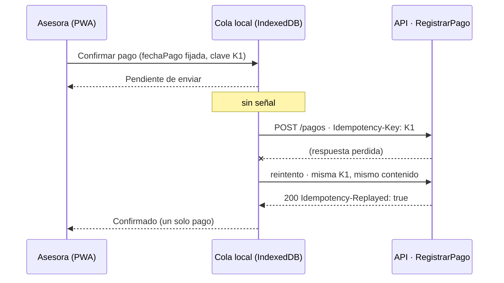

# E4 · Decisión de arquitectura móvil/web y diseño responsivo

Proyecto 2 · Crédito Vecino, S. A. · Análisis de Sistemas II (037)

Este documento responde al entregable E4: elección entre app nativa, híbrida o PWA, estrategia responsiva mobile-first y estrategia ante pérdida de conexión, conectada con la clave de idempotencia y el puerto `Reloj` del Proyecto 1.

**Alcance.** En el P2 no se implementan frontend, service worker, API ni almacenamiento del dispositivo (sección 5 del enunciado). Esta es una decisión de arquitectura que el Proyecto Final implementará con React + Vite + Tailwind (sección 14). Las restricciones de contexto provienen de [E1](e1-investigacion-usuario.md).

## 1. Restricciones que decide la arquitectura

| Restricción | Perfil | Fuente | Qué exige |
|---|---|---|---|
| Señal intermitente o nula durante parte de la ruta | Asesora | Enunciado, sección 3; IICA/BID (conectividad rural) | Trabajar sin conexión: consultar la cartera de la ruta, capturar solicitudes y registrar pagos |
| Teléfono Android de gama media, poca memoria | Asesora | Enunciado, sección 3 | App ligera, sin descargas grandes para actualizar |
| Uso con una mano, de pie y bajo el sol | Asesora | Enunciado, sección 3 | Objetivos táctiles grandes, alto contraste, poco tecleo (depende del diseño, no de la tecnología) |
| Escritorio con pantalla grande y conexión estable | Gerencia | Enunciado, sección 3 | Alta densidad de información; acceso por navegador sin instalar nada |
| Consulta ocasional desde el teléfono | Gerencia | E1 (hipótesis) | El mismo tablero, adaptado |
| El cliente puede no tener datos móviles | Cliente | DataReportal 2024 (60.3 % usa internet) | Los avisos al cliente van por SMS, no por la app (MC-4) |
| El Proyecto Final debe implementarse en 4 semanas con React y Tailwind | Equipo | Enunciado, secciones 2.1 y 14 | Un solo código web |

## 2. Decisión: una PWA única, mobile-first

### 2.1 Alternativas evaluadas

| Criterio | Nativa (Kotlin / Swift) | Híbrida (React + Capacitor) | **PWA (React + service worker)** |
|---|---|---|---|
| Trabajo sin conexión | Completo | Completo (web + plugins nativos) | Suficiente: service worker para la app y los datos en caché; IndexedDB para la cola de pagos y los borradores |
| Cola de envío en segundo plano | Completa | Completa | Background Sync en Chrome para Android; en otros navegadores, reenvío al volver la señal o al abrir la app, más un botón manual |
| Teléfono de gama media | Mejor rendimiento, pero instalador pesado | Contenedor nativo + web | Se instala desde el navegador, ocupa poco, sin tienda de aplicaciones |
| Escritorio para gerencia | No aplica: exige otro producto | Requiere además la versión web | **El mismo código** en el navegador de escritorio |
| Actualizaciones (por ejemplo, un cambio de política) | Publicar en la tienda y esperar a que los asesores actualicen | Publicar en la tienda para cambios nativos | Inmediatas al volver a cargar la app |
| Cámara para la foto del DPI (G01) | Sí | Sí | Sí: `<input type="file" accept="image/*" capture>` o `getUserMedia` |
| Coherencia con el Proyecto Final (React + Vite + Tailwind en 4 semanas) | Rompe el stack: dos lenguajes más | Compatible, pero agrega compilación, firma y pruebas por plataforma | **Idéntico stack** |
| Costo de mantenimiento | 2 o 3 bases de código | 1 base de código + contenedores | **1 base de código** |

### 2.2 Decisión y justificación

**Se adopta una PWA única, instalable, mobile-first, para los tres perfiles.** El rol que inicia sesión determina la pantalla de inicio: Ruta del día, Bandeja del comité o Tablero.

- **Para la asesora:** su necesidad crítica es trabajar sin señal, y eso lo resuelven el service worker (app y datos en caché) y una cola persistente en IndexedDB. La operación clave no es "tener señal", sino **no perder ni duplicar un pago cuando no la hay**, y eso depende del diseño de la cola y de la API (sección 4), no de que la app sea nativa. En un Android de gama media, una PWA se instala desde Chrome sin pasar por la tienda y se actualiza sola.
- **Para la gerencia:** trabaja en escritorio con buena conexión. Una PWA es simplemente la web; no se construye un segundo producto.
- **Para el proyecto:** el Proyecto Final exige React + Vite + Tailwind. Una PWA es ese mismo stack, sin compilar ni firmar por plataforma.

### 2.3 Riesgos aceptados y cómo se mitigan

| Riesgo de la PWA | Mitigación |
|---|---|
| El navegador puede borrar el almacenamiento de un sitio | Solicitar `navigator.storage.persist()` al instalar. La cola se vacía en cuanto hay señal. Aviso visible si quedan pendientes al final del día (P03 Mi perfil y P14). Nunca se borra un comando sin confirmación del servidor |
| Background Sync no existe en todos los navegadores | No se promete sincronización automática universal. Reenvío al recibir el evento `online`, al abrir la app y con el botón "Enviar ahora" en Pendientes. La flota de asesoras usa Android con Chrome (supuesto a confirmar con TI) |
| iOS limita las PWA | La gerencia en iPhone solo consulta: no necesita cola ni sincronización |

**Condición de revisión.** Si la validación de campo muestra que Android borra la cola con frecuencia o que la cámara no alcanza para leer el DPI, se migra la app de la asesora a **Capacitor**. Esto conserva el mismo código React y agrega almacenamiento nativo: la decisión es reversible sin reescribir.

## 3. Estrategia responsiva mobile-first

Se diseña primero para 360 px (el teléfono de la asesora) y se **agrega** información a medida que crece la pantalla. Puntos de quiebre de Tailwind:

| Ancho | Clase | Uso principal |
|---|---|---|
| < 640 px | base | Asesora en campo; gerencia consultando en reunión |
| ≥ 768 px | `md` | Tableta en oficina de agencia |
| ≥ 1024 px | `lg` | Escritorio de gerencia |
| ≥ 1280 px | `xl` | Escritorio con el panel del asistente abierto |

### 3.1 Cómo se transforma el tablero gerencial

| Elemento | Teléfono (G07) | Escritorio (G04) |
|---|---|---|
| Línea de contexto (fecha de corte, cierre congelado) | En el encabezado: "Tablero · corte 30/09" | Línea completa con estado del cierre y política |
| Riesgo → incobrables → mora | Tres tarjetas **apiladas en ese mismo orden**, con los mismos rótulos, símbolos (▲ ✕ ●) y bordes | Tres tarjetas en fila |
| Desglose por tramo | Lista de 4 filas con porcentaje; al tocar una fila se abre el detalle | Tabla con créditos, saldo en Q, barra proporcional y % |
| Detalle de un tramo (G05) | Tarjetas por crédito | Tabla de 8 columnas |
| Desembolsos y recuperaciones | Dos cifras del período, sin gráfico | Series mensuales |
| Asistente (Proyecto Final) | Botón flotante que abre el chat a pantalla completa | Columna derecha plegable |
| Cierre (G06) | Solo consulta | Consulta y ejecución, con confirmación |

**Qué se sacrifica en la pantalla pequeña, y por qué es aceptable:**

1. **Las series temporales y las barras.** Una gráfica de 12 meses en 360 px no se lee. En el teléfono se contesta "¿cómo estamos hoy?"; las tendencias se ven en escritorio.
2. **Los montos en quetzales dentro del desglose por tramo.** Se muestra solo el porcentaje para que cada fila quepa en una línea; el monto aparece al tocar la fila.
3. **La exportación a CSV.** Es una tarea de escritorio.
4. **Ejecutar el cierre.** Es una operación financiera irreversible (WCAG 3.3.4). Se reserva al escritorio para evitar toques accidentales.

**Lo que no se sacrifica nunca:** la distinción entre cartera en mora y cartera en riesgo, la cifra de incobrables junto al riesgo y la fecha de corte. Quitarlas en el teléfono reintroduciría el error MC-3.

### 3.2 Reglas del sistema responsivo

- Los objetivos táctiles miden al menos 48 × 48 px en todos los anchos; WCAG 2.5.8 exige 24 px como mínimo.
- Ninguna acción requiere arrastrar (WCAG 2.5.7). Las listas se desplazan, y el orden se cambia con botones.
- El texto base es de 16 px y se puede ampliar al 200 % sin perder contenido (WCAG 1.4.4). Las tablas pasan a tarjetas antes de necesitar desplazamiento horizontal.
- Contraste mínimo de 4.5:1 (WCAG 1.4.3). La paleta de alta fidelidad (E3) se probará también a plena luz del día.

## 4. Estrategia ante pérdida de conexión

### 4.1 Qué funciona sin señal

| Operación | Sin señal | Cómo |
|---|---|---|
| Ver la ruta y el detalle de los créditos de la ruta | Sí, con la fecha de los datos visible | Copia descargada al iniciar la jornada |
| Ver el detalle de la mora | Sí, rotulado "calculado con datos del 22/09" | Última respuesta de `consultarMora` en caché. **No se recalcula en el teléfono** |
| Capturar alta de cliente y solicitud | Sí | Borrador en IndexedDB, guardado campo por campo |
| Registrar un pago | Sí, **queda pendiente** | Cola de comandos (§4.2) |
| Desembolsar | **No** | Mueve dinero de la institución; requiere confirmación en línea |
| Tablero y cierres | No (gerencia trabaja en línea) | — |

### 4.2 Registrar un pago sin señal: la clave de idempotencia

Cuando Mariela toca "Aplicar pago" en P12 (Confirmar pago) sin señal, ocurre lo siguiente, en este orden:

1. **Se crea el comando** `RegistrarPago` con `creditoId`, `importe` como cadena (`"1047.76"`), `moneda`, `fechaPago` y `usuarioProceso`.
2. **Se genera la `Idempotency-Key` una sola vez** (un UUID) y se guarda junto al comando en IndexedDB **antes** de mostrar "Pendiente". Sin ese registro, un cierre de la app podría perder el pago.
3. La pantalla muestra **Pendiente** en la pantalla Sin señal (P14). Nunca muestra "Pagado" sin una respuesta del sistema.
4. Al volver la señal, la cola envía `POST /creditos/{creditoId}/pagos` con **la misma clave y el mismo contenido**, en orden por crédito.
5. El contrato OpenAPI del P1 responde:
   - **201**: pago nuevo registrado → estado **Confirmado**.
   - **200** con `Idempotency-Replayed: true`: el pago ya había llegado (por ejemplo, el primer envío sí llegó y se perdió la respuesta) → **Confirmado**, sin un segundo efecto.
   - **409**: la clave ya existe con un contenido distinto → estado **Conflicto**, visible para la asesora y para su supervisor. **Nunca se genera una clave nueva automáticamente**, porque eso sí podría duplicar el pago.
6. Un timeout **no borra el comando**: se reintenta con la misma clave.

Así se previene MC-2 (doble cobro de Q1,047.76). El núcleo ya lo sostiene: `pago-idempotente.ts` y sus pruebas del P1 verifican que una repetición no cambia saldos ni movimientos.

**Ajuste necesario al contrato del P1.** El OpenAPI sugiere un tiempo de vida (TTL) de **24 horas** para la clave. Una asesora que pasa más de un día sin señal enviaría su pago cuando la clave ya expiró, y el reintento se procesaría como un pago nuevo. **El TTL debe ser mayor que la ventana máxima de trabajo sin conexión** (se propone 30 días), o la clave debe conservarse junto con el pago de forma permanente. Este cambio se registra para el Proyecto Final; no cambia el núcleo.

### 4.3 ¿Con qué fecha se calcula? El puerto Reloj

Caso: la cuota 2 de Carlos tiene **30 días** de atraso. Mariela recibe el pago hoy sin señal y el teléfono lo sincroniza **mañana**, cuando la cuota ya tendría 31 días.

| Si se calcula con… | Días | Mora | Gasto de cobro | Total de la cuota |
|---|---|---|---|---|
| **`fechaPago` = día en que Carlos pagó** (correcto) | 30 | Q10.89 | Q0.00 | **Q1,015.51** |
| Fecha de sincronización (incorrecto) | 31 | Q11.37 | Q25.00 | Q1,040.99 |

Si se usara la fecha de sincronización, Carlos pagaría **Q25.48 de más** por una demora que no es suya. La respuesta está en el P1: la fecha de corte es un parámetro y no "hoy".

- En el teléfono, el **adaptador del puerto `Reloj`** fija la `fechaPago` **en el momento de confirmar** y la guarda en el comando. Los reintentos envían esa misma fecha.
- En el núcleo, `RegistrarPago` recibe `fechaPago` y `consultarMora` recibe `fechaCorte` como parámetros. **El núcleo nunca lee la fecha del sistema**: la validación final lo comprobó con `rg 'new Date\(\)' src`, que no encuentra coincidencias ([e6-04](e6-04-validacion-final.md)).
- La política aplicable (plana o escalonada) no depende de ninguna de esas fechas, sino de la **fecha de otorgamiento** (`resolverPolitica`).

**Salvaguarda contra un reloj del teléfono mal configurado.** Al recibir el comando, el servidor compara `fechaPago` con la fecha de recepción y con la última sincronización del dispositivo. Una `fechaPago` futura o anterior a la última sincronización exitosa se acepta, pero queda **marcada para revisión** del supervisor en lugar de aplicarse en silencio. Esta regla corresponde a la capa de aplicación del Proyecto Final, no al núcleo.

### 4.4 Lo que se ve en pantalla

| Estado del comando | Texto en P12 / P14 | Estado en Mi perfil (P03) |
|---|---|---|
| Guardado sin señal | "Pendiente de enviar · se enviará solo al tener señal" | "Sin señal · 2 pendientes" |
| Enviando | "Enviando…" | "Enviando…" |
| Confirmado (201 o 200 replay) | "Confirmado · comprobante definitivo" y opción de enviar SMS al cliente | "En línea" |
| Conflicto (409) | "Este pago no coincide con uno ya registrado. No se cobró de nuevo. Revíselo con su supervisor." | "1 pago requiere revisión" |

## 5. Dos decisiones del Proyecto 1 que hacen viable el trabajo sin conexión

| Decisión de experiencia | Decisión de arquitectura del P1 que la sostiene | Qué pasaría sin ella |
|---|---|---|
| Registrar pagos sin señal y reintentar al reconectar | **Clave de idempotencia** en `RegistrarPago` (`Idempotency-Key`, respuestas 201 / 200 replay / 409) | Cada reintento podría ser un pago duplicado |
| Mostrar y cobrar la mora correcta aunque se sincronice otro día | **Puerto `Reloj`**: fecha de corte y `fechaPago` como parámetros, nunca "hoy" | El tramo y el gasto de Q25.00 dependerían del momento en que el teléfono recuperó la señal |

## Referencias

- MDN Web Docs. *Offline and background operation* (PWA). https://developer.mozilla.org/en-US/docs/Web/Progressive_web_apps/Guides/Offline_and_background_operation
- MDN Web Docs. *What is a progressive web app?* https://developer.mozilla.org/en-US/docs/Web/Progressive_web_apps/Guides/What_is_a_progressive_web_app
- MDN Web Docs. *StorageManager.persist()*. https://developer.mozilla.org/en-US/docs/Web/API/StorageManager/persist
- Capacitor. *Documentación oficial*. https://capacitorjs.com/docs
- W3C (2023). *Web Content Accessibility Guidelines (WCAG) 2.2*. https://www.w3.org/TR/WCAG22/
- Repositorio: `docs/api/openapi.yaml` (operación `registrarPago`), `src/dominio/pago-idempotente.ts`, `src/aplicacion/consultar-mora.ts`.
